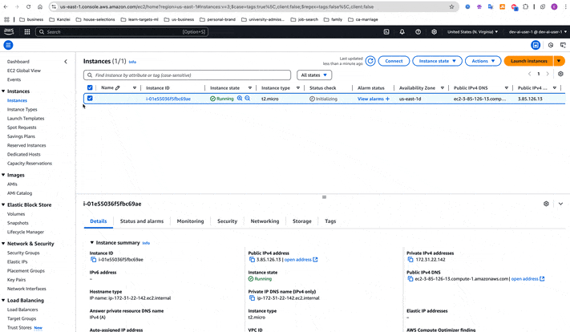
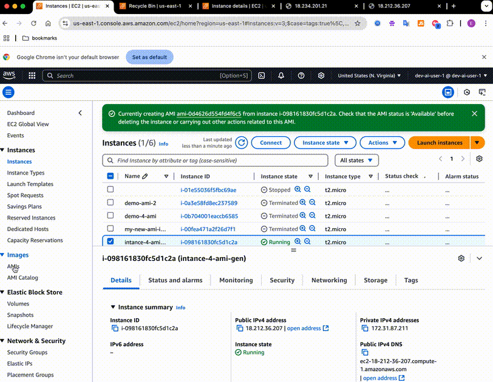

# AWS Certifications
<!-- TOC -->
* [AWS Certifications](#aws-certifications)
* [AWS Solution Architect](#aws-solution-architect)
  * [AWS Introduction - AWS Certified Solutions Architect(SAA-C03)](#aws-introduction---aws-certified-solutions-architectsaa-c03)
  * [How to access AWS:](#how-to-access-aws)
    * [Install aws cli on MacOS:](#install-aws-cli-on-macos)
  * [IAM](#iam)
    * [IAM Permissions](#iam-permissions)
    * [IAM Roles for Services](#iam-roles-for-services)
    * [IAM security tools](#iam-security-tools)
    * [IAM best practices](#iam-best-practices)
  * [EC2 Service (Elastic Compute Cloud) - Infras as a service](#ec2-service-elastic-compute-cloud---infras-as-a-service)
    * [EC2 Capabilities](#ec2-capabilities)
    * [EC2 Purchasing Options](#ec2-purchasing-options-)
    * [*Elastic IP*:](#elastic-ip-)
    * [*EC2 placement groups*:](#ec2-placement-groups-)
    * [Elastic Network Interface (ENI)](#elastic-network-interface-eni)
    * [EC2 instance Hibernate:](#ec2-instance-hibernate)
    * [EC2 Instance Storage - EBS](#ec2-instance-storage---ebs)
      * [EBS Snapshots](#ebs-snapshots)
      * [EBS Encryption](#ebs-encryption)
    * [EC2 AMI](#ec2-ami)
    * [EC2 Instance Store](#ec2-instance-store)
    * [AWS EFS - Elastic File System](#aws-efs---elastic-file-system)
    * [High availability and scalability](#high-availability-and-scalability)
      * [ELB - AWS managed Load Balancer](#elb---aws-managed-load-balancer)
  * [AWS ESK](#aws-esk)
    * [Zoning concepts:](#zoning-concepts)
  * [Crossplane:](#crossplane-)
    * [Examples:](#examples)
  * [GitOps](#gitops)
  * [IaC and Infrastructure](#iac-and-infrastructure)
  * [Documentation](#documentation)
  * [Authentication/Authorization](#authenticationauthorization)
  * [API management](#api-management-)
  * [Insurance Domain](#insurance-domain)
    * [Sales channel](#sales-channel)
    * [Characteristics of Cross-Channel Strategies:](#characteristics-of-cross-channel-strategies)
      * [Examples in Insurance:](#examples-in-insurance)
      * [Benefits:](#benefits)
    * [1. **Motor Commercial Fleet**](#1-motor-commercial-fleet)
    * [2. **Underwriting Platform**](#2-underwriting-platform)
    * [3. **Motor Services Including BiPRO**](#3-motor-services-including-bipro)
    * [Examples of Motor Services:](#examples-of-motor-services)
    * [4. **Motor Retail**](#4-motor-retail)
    * [Integrated Role in Cross-Channel Strategy:](#integrated-role-in-cross-channel-strategy)
    * [5. Property Insurance](#5-property-insurance)
      * [Personas in Insurance](#personas-in-insurance)
    * [User Journeys](#user-journeys)
  * [General cloud adoption principles](#general-cloud-adoption-principles)
    * [Enterprise cloud adoption principles](#enterprise-cloud-adoption-principles)
* [Disaster Recovery](#disaster-recovery)
<!-- TOC -->
# AWS Solution Architect
## AWS Introduction - AWS Certified Solutions Architect(SAA-C03)
- Foundational Level --> Associate Level --> Professional Level --> Specialty
- Application Architect: 


- exam code SAA-C03: 
- AWS: 2002 (internal launch) --> 2003 (ideation to market) --> 2004(launched publicly with SQS) --> 2006(Relaunch with SQS, S3, EC2) --> 2007(launched in Europe) --> Netflix, NASA, AirBnB, Dropbox
- AWS > Azure > Google Cloud
- AWS:
  - enables to build sophisticated, scalable applications
  - applicable to diverse set of industries
  - Enterprise IT, Backup & Storage, Big Data Analytics
  - Website hosting, Backend for mobile and social application
  - Gaming
- AWS global infrastructure: 
  - Aws regions
  - Aws AZ
  - Aws Data Centers
  - Aws Edge locations / Points of Presence
- Choice of region:
  - compliance
  - proximity: reduce latency
  - availability of services
  - pricing: varies based on region
- Availability Zones:
  - per region min 3 and max 6 AZ
  - each zone is one or more discrete data centers with redundant power and networking


  
- AWS Point of Presence (Edge Location):
  - 400+ PS (400+ Edge locations & 10+ Regional Cache) in 90+ cities across 40+ countries
  - Aim: content is delivered to end-user with lower latency
- AWS Services:
  1. Global services:
     - IAM
     - Route 53 (DNS service)
     - CloudFront (Content Delivery Network)
     - WAF (Web Application Firewall)
  2. Region-Scoped
     - EC2 (Infrastructure as a Service)
     - Elastic Beanstalk (Platform as a Service)
     - Lambda (Function as a Service)
     - Rekogniation (Software as a Service)
## How to access AWS:
- There are 3 ways to access aws:
  - AWS management console (Web UI)
  - AWS CLI (`>aws`): protected by access key
  - AWS cloudshell: download and upload files. Files created will remain there even if shell is closed
  - AWS SDK from code: protected by access key. For each programming language, there is a separate sdk
- Access keys are generated through AWS console, managed by each user. They are just like a pwd.
### Install aws cli on MacOS:
- Follow these [steps](https://docs.aws.amazon.com/cli/latest/userguide/getting-started-install.html): 
- Create access keys: it can be created only for a user, not for root. Go to user --> security credentials --> Create Access Key --> CLI key
Recommended alternative: Use the AWS CLI V2 and enable authentication through a user in IAM Identity Center.
```
 ~ % aws configure
AWS Access Key ID [None]: AKIA2XXVXXVDXANC
AWS Secret Access Key [None]: Basfhv/xxxxxx/QxysfdfFGDlkerws
Default region name [None]: eu-central-1
Default output format [None]:
~ % aws iam list-users
```

## IAM
- Root account shouldn't be used or shared
- Users: people that can be grouped
- Group: contains only users and not other groups
  - group `developers` --> [ahmad, alice, kai], group `operations` --> [david, edward], group `audit team` --> [kai, david]
- Users don't have to belong to a group
- A user can belong to multiple groups


### IAM Permissions
- Users and groups can be assigned JSON documents called policies
- Policy: a json document that defines a set of permissions to making requests to aws services that can be used by IAM users, User groups and IAM roles
- Permissions defined in a policy
```
{
  "Version": "2012-10-17",  // The version of the policy language. This is a fixed value.
  "Statement": [
    {
      "Effect": "Allow",  // Defines whether the action on certain API is allowed or denied. In this case, it allows the action. i.e Allow, Denied
      "Action": "s3:ListBucket",  // Specifies the action. In this case, it allows listing the contents of an S3 bucket.
      "Principal": {
        "AWS": ["arn:aws:iam::123456:root"] // which accounts, user or role
      },
      "Resource": "arn:aws:s3:::example-bucket",  // Specifies the resource (an S3 bucket) that the action applies to.
      "Condition": {},
    },
    {
      "Effect": "Allow",  // This block allows the next action
      "Action": [
        "s3:GetObject",    // Allows downloading objects from the S3 bucket.
        "s3:PutObject"     // Allows uploading objects to the S3 bucket.
      ],
      "Resource": [ // Allows the actions on any objects within the example-bucket.
        "arn:aws:s3:::example-bucket/*",
        "arn:aws:s3:::example-bucket-2/*"
       ]  
    }
  ]
}

```
- Apply least privilege principle
- Procedure: create user --> create group and assign to user --> create an account alias to ease of sign in --> share the link with pass to the user
- Another example of policy `IAMReadOnlyAccess` with `iam:Get*` meaning anything that starts with `Get`
```
{
    "Version": "2012-10-17",
    "Statement": [
        {
            "Effect": "Allow",
            "Action": [
                "iam:GenerateCredentialReport",
                "iam:GenerateServiceLastAccessedDetails",
                "iam:Get*",
                "iam:List*",
                "iam:SimulateCustomPolicy",
                "iam:SimulatePrincipalPolicy"
            ],
            "Resource": "*"
        }
    ]
}
```
- You can create your own policies:


- Password Policy: Set min length, char requirements, password expiration


- Root user security policy such as MFA: Go to `My security credentials`

### IAM Roles for Services
- Refer to the main diagram under IAM
- Some aws services needs to perform actions on your behalf
- To do so, we assign permissions to AWS services with IAM roles
- account vs user vs role
- Common roles: 
  - EC2 instance roles
  - Lambda Func Roles
  - Roles for cloud formation
- Create a Role: go to iam roles --> select aws service --> select the service (i.e EC2) --> select the usecase --> attach IAM policies to the role (i.e IAMReadOnly)

### IAM security tools
- IAM audit:
  - IAM `Credential Report`: status of users and their credentials. At `Account-level`
  - IAM `Access Advisor`: permissions granted and when were last used. At `User-level`: Go to user --> go to user's `Last Accessed`

### IAM best practices
- Don't use the root account except when creating aws account
- One physical user = one aws user
- Assign users to groups and assign permissions to groups
- Use strong password policy
- Use MFA
- Give Roles to aws services when giving permissions to aws services
- Use access keys
- Use IAM reports

## EC2 Service (Elastic Compute Cloud) - Infras as a service
- Think of it as a computer in the cloud. It’s where you can run applications, websites, or other tasks, just like you would on your laptop or a physical server.
- You can choose the size, speed, and capacity of this "cloud computer" based on what you need
*Notes about budget alerts*:
1. In root account, activate it: accounts --> IAM user and roll access to billing information
2. Setting up budget to avoid surprisings: account --> budgets --> setup i.e zero spend budget --> add email
### EC2 Capabilities
EC2 or elastic computing 2 is infrastructure as a service
- Renting virtual machines (EC2)
- Storing data on virtual drives (EBS)
- Distributing load across machines (ELB)
- Scaling services using an auto-scaling group (ASG)
- EC2 instance [types](https://aws.amazon.com/ec2/instance-types/?nc1=h_ls)
- A comparison of different instance types [see](https://instances.vantage.sh/).
- For demo purposes, we will use t2.micro
- Fundamental part of cloud
- User Data Example:
```
#!/bin/bash
# Use this for your user data (script from top to bottom)
# install httpd (Linux 2 version)
yum update -y
yum install -y httpd
systemctl start httpd
systemctl enable httpd
echo "<h1>Hello World from $(hostname -f)</h1>" > /var/www/html/index.html
```


### EC2 Purchasing Options 
- On demand instances: short workload, pay by second
- Reserved (1 & 3 years)
  - Reserved
  - Convertible reserved
- Savings plans: commitment to an amount of usage, long workload
- Spot instances: short workload, can lose instances. 
  - Most cost-efficient in aws.
  - Upto 90%  discount
- Dedicated Hosts: book entire physical server. Used for server bound software licenses (per-socket, per-core, pe-VM)
  - strong regulation (compliance)
  - complex licensing
  - the most expensive option
  - allow visibility into physical cores & network socket
- Dedicated Instances: no other customers will share your hardware
- Capacity Reservation: reserve a capacity in specific AZ
- Reference for pricing: lectures 44 to 47
- Spot Fleet: check lecture 46

- IPv4 costs: Configure IPAM for getting usage insights

### *Elastic IP*: 
- Restart of a instance changes its public ip 
- Is a public IP you own as long as you don't delete it.
- Could be mapped rapidly to another instance to mask the failure of an instance
- 5 elastic IPs per account
- Not good practice. Alternatives
  - Try to use random public IP and register a DNS name to it
  - Use load balancer (best option)



### *EC2 placement groups*: 
- Used to cluster instances. Strategies for the group:
  - *Cluster*: clusters instances into a low latency group in a single AZ
  - *Spread*: spread instances across underlying hardware ( max 7 instaces per group per AZ)
  - *Partition*: spread instances across different partitions (which rely on different sets of racks) within AZ. Scales to 100s of EC2 instances per group (Hadoop, Cassandra, Kafka)


### Elastic Network Interface (ENI)
- Logical component in VPC representing virtual network card (Eth0, Eth1):
- ENI attributes:
  - Primary private IPv4, one or more secondary IPv4
  - One elastic IP (IPv4) per private IPv4
  - One public IPv4
  - Security group(s)
  - A MAC address
  - ENI can be created independently and attached on the fly (moved) on EC instances for failover
  - ENI is **bound** to a specific AZ
  - elastic: created, attached on-fly, and while an instance is running
- Use case:
  - instead of creating two instances in two subnets, one creates two ENI in two subnets and attach them to the same instance
  - See more [here](https://aws.amazon.com/blogs/aws/new-elastic-network-interfaces-in-the-virtual-private-cloud/)


### EC2 instance Hibernate:
- Whatever in RAM is preserved
- It boots much faster (OS not stopped/restarted)
- Under the hood: RAM is written to a file in EBS volume
- Conditions
  - EC2 RAM less than 150GB
  - Volume of type EBS
  - EBS volume must be encrypted
- Use cases:
- Upto 60 days hibernate
- Demo: 
  - create instance --> in 'Advanced Details' set *Stop - Hibernate behavior* to 'enabled'
  - Make sure in the 'configure storage', the volume's encryption is set 'encrypted'
  - Connect to the instance and use 'uptime' command, then hibernate and start again and check the uptime. (should be increasing & not from start from 0)

### EC2 Instance Storage - EBS
- EBS (Elastic Block Store)
  - Now, every computer needs storage, right? EBS is the hard drive for your EC2 instance.
  - It's like an external SSD or HDD attached to your cloud computer where you can store your files, databases, or any data your application uses.
  - The best part? Even if your EC2 instance is stopped or deleted, the EBS can keep your data safe unless you choose to delete it
  - It is a network drive (network usb stick to say). Uses network to communicate with instances
  - Plug and play
  - Mounted to one instance at a time
  - bound to an AZ
    - To move to another AZ, create the snapshot
  - It is provisioned capacity, which means determining in advance:
    - size in GBs
    - Throughput
    - IO spead in IOPS (I/0 per second)
  - Provisioned capacity:
    - billed for all provisioned capacity
    - can be increased overtime
- EBS volume types:
  - gp2/gp3: general purpose SSD
    - cost-effective, low latency, boot volume/virtual desktop
    - 1 GB - 16TB
    - gp3: baseline 3000 IOPS (upto 16000), throughput of 125 MiB/s (upto 1000 MiB/s) independently
    - gp2: upto 3000 IOPS, size and IOPS are linked, IOPS upto 16000 MiB/s, 3 IOPS per GB
  - io1/io2: highest performance SSD, Provisioned IOPS (PIOPS) SSD
    - critical business applications with sustained IOPS performance
    - application that needs more than 16000 IOPS
      - i.e Databases (sensitive to storage perf and consistency)
    - io1(4 GiB - 16 TiB):
      - Max PIOPS: 64000 for Nitro EC2 instances & 32000 for other
      - PIOPS increase independent of storage size
    - io3 Block Express (4 GiB - 64 TiB):
      - sub-millisecond latency
      - max PIOPS: 256,000 with an `IOPS:GiB` ratio of `1,000:1`
    - Supports EBS multi-attach
  - st1 (HDD): Low cost HDD, sc1(HDD): Lowest cost HDD
    - Can't be a root volume
    - 125 GiB to 16 TiB
    - st1: throughput optimized HDD
      - Big Data, Data warehouse, Log processing
      - Max throughput of 500 MiB/s, max IOPS 500
    - sc1: Cold HDD
      - archived data (infrequently accessed)
      - where the lowest cost is a factor
      - Max throughput 250 MiB/s - max IOPS 250
- Only `gp2/gp3` and `io1/io2` can be used as `root` volumes


- Multi-Attach (io1/io2 family) - attach the same volume to multiple EC2 instances in the same AZ:
  - both read and write at the same time
  - Use case:
    - higher application availability
  - Upto 16 instances at a time only
  - Use a file system that is cluster aware

#### EBS Snapshots
- Backup of an EBS at anytime
- Recommended to first detach
- Can copy across AZ or Regions
-  AWS typically initializes the volume lazily. This means that the first time you read a block of data from the new volume, the block must be fetched from Amazon S3 (where snapshots are stored)
- Features:
  - EBS snapshot archive: 
    - Move this archive tier. 
    - 75% cheaper
    - takes 24 to 72 hours to restored
  - Recycle Bin for EBS snapshots
    - to recover after deletion
    - retention period of (1 day to 1 year)
  - Fast snapshot restore (FSR)
    - costs a lot more
    - FSR eliminates above lazy latency by pre-warming the volume so that all blocks are immediately available upon creation. This ensures the restored volume performs at full speed right from the start.


- Snapshot Demo:


#### EBS Encryption
- Encrypted EBS volumes, means encryption of:
  - data at rest
  - in flight data between instance and volume
  - snapshots encrypted
  - volumes created from snapshots
- It leverages key from KMS (AES-256)
- Minimal impact on latency
- Copying unencrypted snapshot allows encryption
- **Issue**: encrypt unencrypted EBS volume?
  - Create EBS snapshot of the volume --> encrypt the EBS snapshot while copying --> create new EBS volume from snapshot (it will be encrypted) --> attach it to the original instance
  - Or shortcut: create a volume from unencrypted snapshot and enable encrypted during the process

### EC2 AMI
- Amazon Machine Image (AMI)
  - Public AMIs
  - AWS marketplace AMI
  - Custom (own) AMI
- AMIs are built for specific AWS region only.
- AMIs are customization of an EC2 instance
  - add your own software, config, os, monitoring etc
  - AMI built for only one region but can be copied across regions
- AMI creation process: 


- Demos




### EC2 Instance Store
- In need of high performance hardware disk:
  - EC2 Instance Store
    - Direct connect instead of over the network
    - Better I/O compared to EBS
    - However, they are ephemeral (lost when instance is stopped)
  - IOPS as high as 310,000 or more (high IO database use cases)
  - Use cases:
    - Buffer, cache, scratch data, temporary content
  - Risk of loss:
    - Backup & replication are your responsibilities


### AWS EFS - Elastic File System


- EFS vs EBS vs Instance Store
  - EFS
    - one instance (except io1/io2 - multi-az), locked to one AZ (can be migrated to another AZ using snapshotting technques)
    - gp2: I/O increases if disk size increases
    - gp3 & IO1: can increase IO independent of size
    - Root terminated by default
  - EFS Creation Demo:
  
  
  - EBS:
    - Mounting 100s of instances across AZs
    - Linux system only
  - Instance Store:
    - It is physically attached to EC2 instance. If instance lost, storage is lost

### High availability and scalability
- Scalability 
  - Vertically i.e moving from t2.micro to t2.large
    - i.e common for non-distributed systems i.e databases, RDS, ElasticCache etc
  - Horizontal: increase the number of instances
    - for distributed systems i.e web application, modern applications
- High availability: means having apps running in to data centers (== AZs)
  - goal is to survive a data center loss
  - Enabled with:
    - Auto scaling group multi-AZ
    - Load Balancer multi AZ

#### ELB - AWS managed Load Balancer
- Expose a single point of entry (DNS) to the app
- Seamlessly handle failure of downstream instance
- Does regular health check of the instances
- SSL termination (HTTPS)
- Enforce stickiness to cookies
- High availability across zones
- Separate public traffic from private one
- Well integrated with other AWS services and ease of integration
  - EC2, EC2 Auto Scaling groups, Amazon ECS
  - AWS Certificate Manager (ACM), Route 53, WAF, AWS global accelerator. 


- Security consideration
  - EC2 accepts incoming traffic only from SG that is assigned to LB on port 80
  - While LB accepts HTTP and HTTPS from everyone on port 80
  
- Types:
  - Classic (Old) - 2009
  - Application LB: HTTP, HTTPS, Websocket - 2016: Layer 7 only LB 
    - LB to multiple HTTP apps across machines (target groups)
    - LB to multiple applications on the same machine (i.e containers)
    - supports redirect from HTTP to HTTPS
    - Routing:
      - routing based on path (example.com/user & example.com/post routed to two different target groups)
      - routing based on hostname (one.example.com & other.example.com two routs routed to two different target groups)
      - Routing based on query string, headers
    - ALB are great fit for microservices and container-based application (docker, AWS ECS)
    
  
    - Target groups of ALB
      - EC2 instances (can be managed by auto-scaling group) - HTTP
      - ECS tasks - HTTP
      - Lambda functions - HTTP request is translated into a JSON event
      - IP addresses (private IPs)
    - ALB can route to multiple target groups
    
    
    - Health check are at the target group level
    - It has a fixed hostname (XXX.region.elb.amazonaws.com)
    - Application servers don't see the IP of the client directly (the true IP is inserted into the header `X-Forwarded-For`), as well as the port (`X-Forwarded-Port`) and protocol (`X-Forwarded-Proto`)
    
  
  - **ALB Setup Demo**
  
  - ALB Rule Setup Demo (Continue)
  
    
  - Network LB: TCP, TLS (secure TLS), UDP - 2017. 
    - A layer 4 LB, High Performance (millions of requests per seconds)
    - Forwards TCP & UDP traffic to the instances
    - Ultra-low latency
    - It has one static IP per AZ (can use an elastic IP for this purpose) - whitelisting specific IPs
    - Not included in free tier
    - Use case: app needs to be access through specific IPs, --> then use NLB
    - Target group:
      - EC2 instances
      - Private IPs (own or EC2)
      - Another ALB: NLB --> ALB, getting benefits of both
    - Health check: TCP, HTTP, and HTTPS
    - NLB Setup Demo
    
    
    
  - **Gateway** LB: operates at layer 3 (Network layer) - IP protocol
    - Deploy, scale and manage a fleet if 3rd party network virtual appliances i.e Firewalls, Intrusion detection & Prevention Systems, Deep packet inspection system, payload manipulation
    - Layer 3 LB (IP layer)
    - Functions:
      - transparent network gateway: single entry/exit for all traffic
      - Load balancer: across virtual appliances
    - Target group:
      - EC2 instances
      - Ip addresses (must be private IPs) of both own and aws resources
    - Uses `GENEVE` protocol on port `6081
    
    
- LB can be setup as private or public
- **Sticky Sessions**:
  - stickiness: same client redirected to the same instance behind LB
  - How it works: cookie is sent as part of client request that has expiration date
  - Usecase: make sure the use doesn't lose his session data (such as user's login data)
  - may bring imbalance
  - Types:
    - application-based
      - Custom cookie
        - generated by the target
        - can include any custom attribute
        - Can't have AWSALB, AWSALBAPP or AWSALBTG
      - application cookie
        - generated by load balancer
        - name is AWSALBAPP
    - duration-based:
      - generated by LB
      - name is AWSALB for ALB, AWSELB for CLB
  - Sticky Session Demo on ALB
  
  

## AWS ESK
- using `eksctl` create k8s cluster on [aws](https://docs.aws.amazon.com/eks/latest/userguide/create-cluster.html). 

### Zoning concepts:
- outer, middle, inner zones
- dev, test, preprod in outer zone belong to one k8s cluster
- prod in outer layer has its k8s own cluster
- however zone  outer includes dev, test, preprod, prod. So what is outer zone exactly?
- dev, test, preprod in middle zone belong to its own k8s cluster
- prod in middle zone has its own k8s cluster
- In Azure, a zone is a subnet
## Crossplane: 
- Crossplane is an open-source framework that enables you to manage infrastructure and services using Kubernetes APIs. 
- Key Features of Crossplane
  - Kubernetes-Native: Uses Kubernetes Custom Resource Definitions (CRDs) and Controllers to manage resources. 
  Leverages the Kubernetes API, so you can use kubectl and familiar tools to manage infrastructure. 
  - Provider Support: Supports cloud providers like AWS, Google Cloud Platform (GCP), Azure, and on-premises environments. 
  Providers translate Kubernetes resources into API calls for these platforms. 
  - Infrastructure Compositions:You can create Compositions, which are reusable templates for infrastructure. 
  For example, a PostgreSQLInstance composition might include an RDS instance, a VPC, and security group. 
  - GitOps Friendly: Works seamlessly with GitOps tools like Argo CD and Flux to manage infrastructure declaratively. 
  - Multi-Tenancy and Separation of Concerns: Crossplane enables administrators to create high-level abstractions for developers, allowing developers to consume infrastructure without direct access to sensitive provider credentials.
- Use Cases 
  - Managing cloud resources (e.g., databases, storage, compute). 
  - Abstracting and templating infrastructure for consistency across teams. 
  - Integrating with CI/CD pipelines for automated infrastructure management. 
  - It turns Kubernetes into a universal control plane for provisioning and managing cloud-native resources, such as databases, virtual machines, and networks, as well as custom resources
- Upbound is the commercial company behind Crossplane.
- [Connect](https://docs.crossplane.io/latest/getting-started/provider-aws/) Crossplane to AWS to create and manage cloud resources from Kubernetes with the [Upbound AWS Provider](https://marketplace.upbound.io/providers/upbound/provider-family-aws)
- In the context of Crossplane, the concepts of Composition, Definition, and Claim are part of its Composite Resource (XRC) framework. 
 They enable Crossplane to provide higher-level abstractions for infrastructure, making it easier for application developers to consume infrastructure without dealing with the complexity of raw cloud APIs.
### Examples:
- Create an AWS VPC as native k8s resource with 
  ```
  apiVersion: aws.composite.scc.bank.io/v1alpha1
  kind: DedicatedVPC
  ```
## GitOps
GitOps is a modern operational framework that uses Git as the single source of truth for managing infrastructure and applications. 
It leverages Git repositories to store and version all declarative configurations and relies on automated processes to ensure the actual state of the system matches the desired state defined in Git.
GitOps bridges the gap between development and operations by applying DevOps principles to infrastructure and application delivery, emphasizing automation, collaboration, and traceability.
- Core Principles of GitOps
  - Declarative:
  All infrastructure and application configurations are described declaratively, often in YAML or JSON files. These files define the desired state of the system.

  - Versioned and Immutable:
  Configurations are stored in Git repositories, providing a version-controlled, auditable history. This makes rollbacks easy by reverting to a previous commit.

  - Automatically Applied:
  Changes to the Git repository trigger automated processes (e.g., CI/CD pipelines or tools like Argo CD) to reconcile the actual system state with the desired state.

  - Continuous Reconciliation:
  The system is continuously monitored and reconciled to match the state defined in Git. If there’s drift (unexpected changes), the system reverts to the desired state or alerts the user.
- GitOps Tools
  Several tools help implement GitOps practices, especially for Kubernetes-based environments:

  - Argo CD: A Kubernetes-native GitOps tool for deploying and managing applications.
  - Flux: Another Kubernetes-native GitOps tool focused on continuous delivery.
  - Jenkins X: Integrates GitOps workflows with Jenkins pipelines.
  - Crossplane: Works with GitOps tools to provision and manage infrastructure.
  - Terraform Cloud: Extends GitOps for infrastructure provisioning.

## IaC and Infrastructure
1. Order you cloud profile
2. Order VPC
2. Order K8s cluster
3. Order and configure global registry (images etc) (Harbor on aws)
4. Order and config jenkins
5.

## Documentation
- MkDocs:
  is an excellent choice for creating and managing toolchain documentation due to its simplicity, extensibility, and developer-friendly nature. 
- It is a static site generator specifically designed for creating documentation projects from Markdown files.


## Authentication/Authorization
```
env:
  oauth2: 
    resourceserver:
      jwkSetUri: "https://..../itmp-oidc/v1/.well-known/jwks.json"
      
  virtualService:
    app:
      host: "xxx"
    gateways:
      - adp-istio-system/enabling-gw
```
- Jenkinsfile
```
pipeline {
  post {}
  agent {}
  environment{ }
  options {}
  stages {
    stage("x"){
      steps {
        script {}
      }
    }
    stage("y"){
      steps {
        script {}
      }
    }
  }
}
```
- Disaster Recovery Models:
  - Pilot Light
  - Warm Standby
  - Multi-site

## API management 
- Setup Apigee with complex use cases
  - Secure integration of applications with domain services within organization adn across organization
  - It enables API consumers and app developers to build innovative engaging apps by providing frictionless self-service
    onboarding, easy access to AP keys, and API secrets and rich interactive API documentation

## Insurance Domain
- Property
- Life
- Health
- AI integration for SME, Retail and portfolio (investment management)
### Sales channel
- Insurance companies typically utilize a diverse array of sales channels to reach their customers and distribute their products effectively. These channels can be categorized into the following groups:

1. Direct Sales Channels
   Company Website: Customers can purchase insurance policies directly online.
   Mobile Apps: Users can explore and buy policies through mobile applications.
   Call Centers: Dedicated helplines for policy purchase and support.
   Walk-in Branches: Customers visit physical offices for consultations and purchases.
2. Agency Sales Channels
   Individual Agents: Licensed individuals who sell insurance policies on behalf of the company.
   Corporate Agencies: Firms dedicated to selling insurance policies.
3. Broker Sales Channels
   Independent Brokers: Third-party intermediaries who compare and sell policies from multiple insurers.
   Online Brokers: Platforms or websites offering comparisons and sales of various insurance products.
4. Partnership and Bancassurance Channels
   Banks and Financial Institutions: Partnerships where insurance products are sold through banking networks.
   Retail Partnerships: Collaborations with retail outlets or businesses for policy sales.
   Affinity Groups: Sales through associations or groups, such as professional organizations or unions.
5. Digital and Online Platforms
   Aggregators and Comparison Websites: Platforms like Policybazaar or ComparetheMarket.
   E-Commerce Platforms: Selling insurance as an add-on service on platforms like Amazon.
   Social Media and Digital Advertising: Targeted campaigns on platforms like Facebook, Instagram, or LinkedIn.
6. Corporate and Institutional Sales
   Group Insurance Plans: Policies tailored for businesses to offer their employees.
   Custom Institutional Plans: Insurance for government entities, non-profits, or large corporations.
7. Embedded Insurance Channels
   Through Products or Services: Offering insurance bundled with other products, such as travel insurance included with a flight booking or device insurance with an electronics purchase.
8. Reinsurance Partnerships
   Partnering with smaller or regional insurers to underwrite or co-sell insurance products.
9. Telecommunication Channels
   Collaborating with telecom providers to sell microinsurance or coverage via SMS or subscription plans.
10. Peer-to-Peer and Community-Based Channels
    Platforms enabling groups or communities to pool resources and insure each other.
    This multi-channel strategy allows insurers like Berkshire Hathaway (USA), UnitedHealth Group, Allianz SE to maximize their market reach and provide diverse touchpoints to meet customer preferences and needs.

In the context of sales channels for an insurance company, **cross-channel** refers to the integration and seamless interaction of multiple sales and communication channels to enhance the customer experience. It ensures that customers can interact with the company through various channels while maintaining consistent service, data, and messaging.

### Characteristics of Cross-Channel Strategies:
1. **Customer-Centric Integration**:
  - Information and interactions flow smoothly across all channels.
  - For example, a customer might start a policy quote online, receive advice from a call center, and finalize the purchase at a physical branch.

2. **Channel Flexibility**:
  - Customers can switch between channels without having to repeat information.
  - For instance, policy details discussed with an agent are immediately accessible when the customer transitions to a mobile app.

3. **Unified Data Systems**:
  - Cross-channel strategies depend on centralized data systems, such as CRM tools, to track customer interactions and history across all channels.

4. **Consistent Branding and Messaging**:
  - The company ensures that the tone, offers, and communication remain consistent, whether the interaction happens in-person, online, or via phone.

#### Examples in Insurance:
- A customer could begin researching insurance plans on the company's website, receive tailored recommendations through an AI chatbot, and complete the purchase through a financial advisor.
- Integrated campaigns where advertisements on social media direct customers to personalized landing pages on the website, followed by follow-up calls from agents.

#### Benefits:
- **Improved Customer Experience**: Seamless transitions between channels enhance satisfaction and reduce frustration.
- **Increased Sales Opportunities**: Consistent cross-channel engagement can help convert leads into policyholders.
- **Data-Driven Insights**: Unified data systems allow companies to analyze customer behavior and preferences across channels to optimize offerings.

Insurance companies often use cross-channel strategies to offer tailored customer experiences and maintain strong engagement across digital, physical, and partner platforms.

Here’s a detailed explanation of the terms in the context of insurance sales channels, particularly for an insurance company:

### 1. **Motor Commercial Fleet**
- **Definition**: Refers to insurance solutions specifically designed for companies that operate fleets of vehicles for business purposes. This includes coverage for risks like accidents, liability, and vehicle damage for multiple vehicles under one policy.
- **Context in Sales Channels**:
  - Offered through specialized brokers, direct sales teams, or digital platforms.
  - Tailored pricing and policy options may be discussed via cross-channel approaches, such as an online quote system followed by consultations with underwriting specialists.

### 2. **Underwriting Platform**
- **Definition**: A digital or integrated system used by insurers to evaluate risks and determine the terms, pricing, and approval of insurance policies. These platforms often leverage advanced analytics, AI, and data integration to streamline the underwriting process.
- **Context in Sales Channels**:
  - Ensures real-time decisions on policy issuance across channels like online portals, call centers, or agent-assisted sales.
  - Offers customers quick and accurate policy quotations, improving efficiency and customer satisfaction.

### 3. **Motor Services Including BiPRO**
- **Definition**: Refers to a range of vehicle-related insurance services often aligned with industry standards like **BiPRO (Brancheninitiative Prozessoptimierung)**, a German initiative for process optimization in the insurance industry. BiPRO ensures standardized data exchange between insurers, brokers, and service providers.
- **Context in Sales Channels**:
  - Facilitates smooth communication between various channels, such as brokers and direct sales.
  - Allows brokers to efficiently access and process claims or insurance adjustments using standardized APIs or digital tools.
    **Motor Services** in the context of insurance typically include a range of value-added services provided by insurers to support vehicle owners, enhance their customer experience, and manage vehicle-related risks. Here are some examples:

### Examples of Motor Services:
1. **Roadside Assistance**:
  - 24/7 support for breakdowns, flat tires, battery jump-starts, towing, and fuel delivery.

2. **Claims Management Services**:
  - Streamlined processes for accident reporting and claims filing via online portals or mobile apps.
  - Access to repair shops and vehicle inspection services to facilitate quick settlements.

3. **Fleet Management Services**:
  - For commercial fleet insurance, insurers may offer GPS tracking, fuel efficiency monitoring, and driver behavior analytics to improve fleet performance and safety.

4. **Repair and Replacement Services**:
  - Network of approved garages or repair shops offering discounted rates or cashless services.
  - Replacement vehicle provision during repair periods.

5. **Theft Recovery Assistance**:
  - GPS-enabled theft tracking and coordination with law enforcement for vehicle recovery.

6. **Legal and Third-Party Liability Support**:
  - Assistance with legal matters and compensation claims in the event of an accident involving third parties.

7. **Integration with Industry Standards (e.g., BiPRO)**:
  - Automated and standardized data exchange for brokers and agents to efficiently manage policies and claims.

8. **Driver Training and Risk Management**:
  - Workshops or online training modules for safer driving practices, especially for commercial clients.

9. **Vehicle Health Monitoring**:
  - IoT-based diagnostic tools that monitor the condition of a vehicle and provide alerts for maintenance needs.

10. **Insurance Bundling with Dealer Services**:
- Policies offered in collaboration with car manufacturers or dealers at the point of purchase, covering extended warranties or service plans.

These services not only add convenience but also serve as a competitive differentiator for insurance providers aiming to deliver comprehensive motor insurance solutions.
### 4. **Motor Retail**
- **Definition**: Insurance offerings tailored to individual vehicle owners (as opposed to commercial fleets). This includes personal auto insurance policies covering private vehicles.
- **Context in Sales Channels**:
  - Sold through digital channels, agents, and partnerships with car dealerships.
  - Cross-channel strategies may include dealership tie-ups where insurance is bundled with vehicle purchases, allowing customers to transition smoothly from purchase to coverage.

### Integrated Role in Cross-Channel Strategy:
- These terms represent distinct product and service lines in the motor insurance space.
- Cross-channel capabilities (e.g., underwriting platforms accessible to both agents and online users) ensure seamless interactions and maintain consistency for the customer regardless of the sales point.

### 5. Property Insurance
Property insurance is a type of insurance policy that provides financial protection against damages or losses to physical 
property, such as buildings, homes, businesses, and personal belongings. It covers risks like fire, theft, natural disasters, 
vandalism, and other unexpected events, depending on the policy terms.

#### Personas in Insurance
1. Broker (Makler): Independent broker who works with multiple insurance companies
2. Agent (Vertreter): Employee of an insurance company that sale the product directly to the clients
3. Specialist: Expert in a particular areas of insurance or financial services with focus on specific product line

### User Journeys
- Awareness --> Search --> Quoting --> Bind and pay --> management --> make claims --> Renewal/Retention
- Services
  - Sales Document Services
  - Customer Advisory
  - Sales Integration
  - Campaign management
  - Sales Portal
  - Sales Task mgmt
## General cloud adoption principles
- Dual/Multi cloud vendor strategy: i.e Azure + AWS + SaaS
- Public cloud first
- Simplify cloud management, ensure compliance, accelerate innovation
- The cloud platform should be:
  - innovative
  - secure
  - globally accessible
  - adopting cloud-native solutions
- Community based
- Customer centric
- DevOps driven
- Profile based
- Cloud first: public cloud the default choice
- Radical simplification: cloud-native, open source
- Renew not rehost: re-architect instead of lift-and-shift
- Sustainable impact: concrete and measurable business impacts instead of intangible benefits
- 6R (rehost, retain, retire ...) principle in software architecture modernization


### Enterprise cloud adoption principles
- global roll out of the Global Cloud Platform (GCF)
- global platform with local flexibility
- cross-channel
- Country specific applications
- Intuitive UI
- CI/CD
- smooth transitions and clean data domain

# Disaster Recovery
- Application domain driven
- Infrastructure domain driven
- Disaster recovery models:
  - pilot light
  - warm standby
  - multi-site
