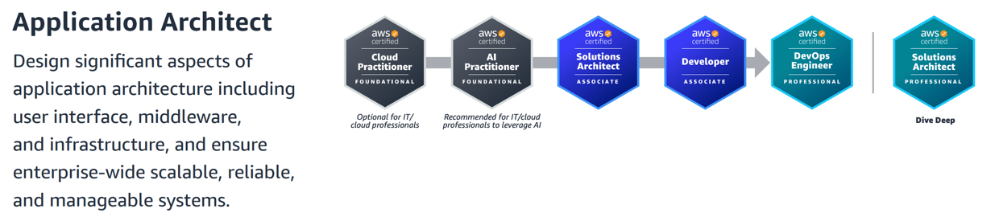
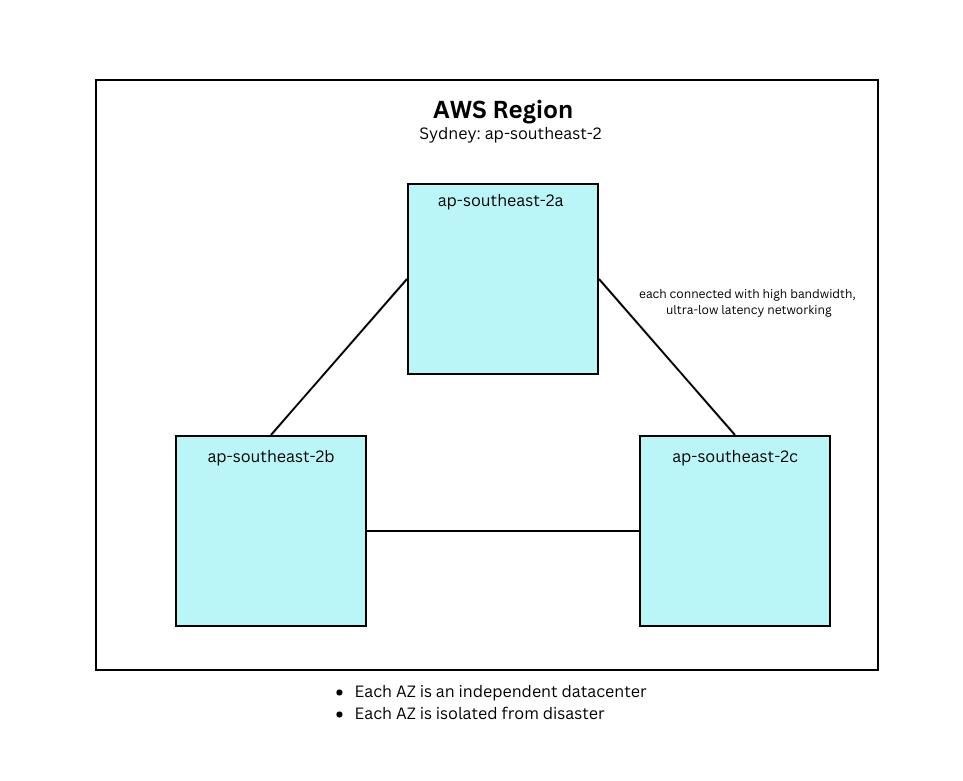
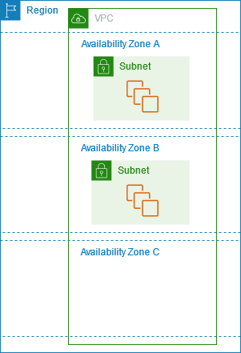
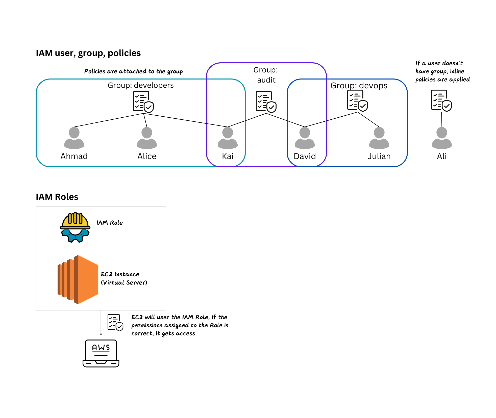
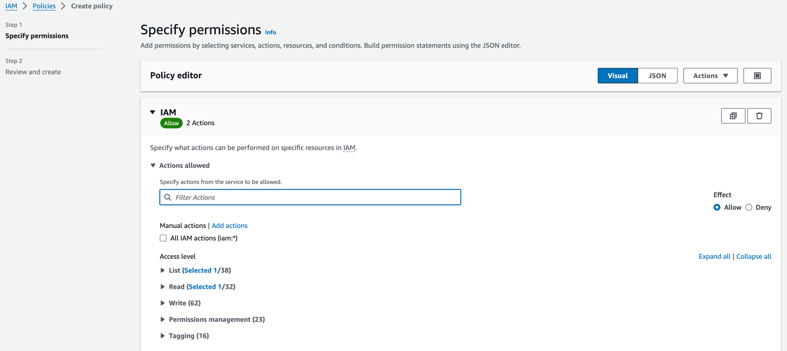
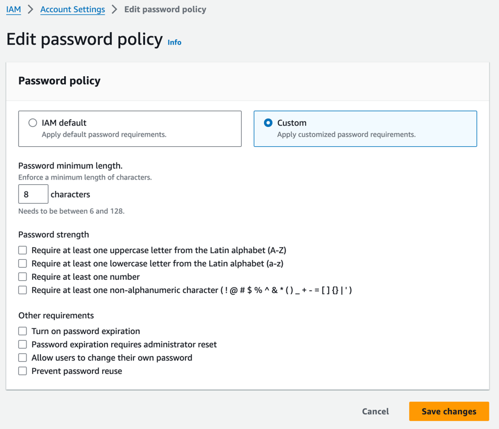

# AWS Certifications
<!-- TOC -->
* [AWS Certifications](#aws-certifications)
* [AWS Solution Architect](#aws-solution-architect)
  * [AWS Introduction - AWS Certified Solutions Architect(SAA-C03)](#aws-introduction---aws-certified-solutions-architectsaa-c03)
  * [How to access AWS:](#how-to-access-aws)
    * [Install aws cli on MacOS:](#install-aws-cli-on-macos)
  * [IAM](#iam)
    * [IAM Permissions](#iam-permissions)
    * [IAM Roles for Services](#iam-roles-for-services)
    * [IAM security tools](#iam-security-tools)
    * [IAM best practices](#iam-best-practices)
  * [EC2 Service](#ec2-service)
<!-- TOC -->
# AWS Solution Architect
## AWS Introduction - AWS Certified Solutions Architect(SAA-C03)
- Foundational Level --> Associate Level --> Professional Level --> Specialty
- Application Architect: 



- exam code SAA-C03: 
- AWS: 2002 (internal launch) --> 2003 (ideation to market) --> 2004(launched publicly with SQS) --> 2006(Relaunch with SQS, S3, EC2) --> 2007(launched in Europe) --> Netflix, NASA, AirBnB, Dropbox
- AWS > Azure > Google Cloud
- AWS:
  - enables to build sophisticated, scalable applications
  - applicable to diverse set of industries
  - Enterprise IT, Backup & Storage, Big Data Analytics
  - Website hosting, Backend for mobile and social application
  - Gaming
- AWS global infrastructure: 
  - Aws regions
  - Aws AZ
  - Aws Data Centers
  - Aws Edge locations / Points of Presence
- Choice of region:
  - compliance
  - proximity: reduce latency
  - availability of services
  - pricing: varies based on region
- Availability Zones:
  - per region min 3 and max 6 AZ
  - each zone is one or more discrete data centers with redundant power and networking




  
- AWS Point of Presence (Edge Location):
  - 400+ PS (400+ Edge locations & 10+ Regional Cache) in 90+ cities across 40+ countries
  - Aim: content is delivered to end-user with lower latency
- AWS Services:
  1. Global services:
     - IAM
     - Route 53 (DNS service)
     - CloudFront (Content Delivery Network)
     - WAF (Web Application Firewall)
  2. Region-Scoped
     - EC2 (Infrastructure as a Service)
     - Elastic Beanstalk (Platform as a Service)
     - Lambda (Function as a Service)
     - Rekogniation (Software as a Service)
## How to access AWS:
- There are 3 ways to access aws:
  - AWS management console (Web UI)
  - AWS CLI (`>aws`): protected by access key
  - AWS cloudshell: download and upload files. Files created will remain there even if shell is closed
  - AWS SDK from code: protected by access key. For each programming language, there is a separate sdk
- Access keys are generated through AWS console, managed by each user. They are just like a pwd.
### Install aws cli on MacOS:
- Follow these [steps](https://docs.aws.amazon.com/cli/latest/userguide/getting-started-install.html): 
- Create access keys: it can be created only for a user, not for root. Go to user --> security credentials --> Create Access Key
```
 ~ % aws configure
AWS Access Key ID [None]: AKIA2XXVXXVDXANC
AWS Secret Access Key [None]: Basfhv/xxxxxx/QxysfdfFGDlkerws
Default region name [None]: eu-central-1
Default output format [None]:
~ % aws iam list-users
```

## IAM
- Root account shouldn't be used or shared
- Users: people that can be grouped
- Group: contains only users and not other groups
  - group `developers` --> [ahmad, alice, kai], group `operations` --> [david, edward], group `audit team` --> [kai, david]
- Users don't have to belong to a group
- A user can belong to multiple groups


### IAM Permissions
- Users and groups can be assigned JSON documents called policies
- Policy: a json document that defines a set of permissions to making requests to aws services that can be used by IAM users, User groups and IAM roles
- Permissions defined in a policy
```
{
  "Version": "2012-10-17",  // The version of the policy language. This is a fixed value.
  "Statement": [
    {
      "Effect": "Allow",  // Defines whether the action on certain API is allowed or denied. In this case, it allows the action. i.e Allow, Denied
      "Action": "s3:ListBucket",  // Specifies the action. In this case, it allows listing the contents of an S3 bucket.
      "Principal": {
        "AWS": ["arn:aws:iam::123456:root"] // which accounts, user or role
      },
      "Resource": "arn:aws:s3:::example-bucket",  // Specifies the resource (an S3 bucket) that the action applies to.
      "Condition": {},
    },
    {
      "Effect": "Allow",  // This block allows the next action
      "Action": [
        "s3:GetObject",    // Allows downloading objects from the S3 bucket.
        "s3:PutObject"     // Allows uploading objects to the S3 bucket.
      ],
      "Resource": [ // Allows the actions on any objects within the example-bucket.
        "arn:aws:s3:::example-bucket/*",
        "arn:aws:s3:::example-bucket-2/*"
       ]  
    }
  ]
}

```
- Apply least privilege principle
- Procedure: create user --> create group and assign to user --> create an account alias to ease of sign in --> share the link with pass to the user
- Another example of policy `IAMReadOnlyAccess` with `iam:Get*` meaning anything that starts with `Get`
```
{
    "Version": "2012-10-17",
    "Statement": [
        {
            "Effect": "Allow",
            "Action": [
                "iam:GenerateCredentialReport",
                "iam:GenerateServiceLastAccessedDetails",
                "iam:Get*",
                "iam:List*",
                "iam:SimulateCustomPolicy",
                "iam:SimulatePrincipalPolicy"
            ],
            "Resource": "*"
        }
    ]
}
```
- You can create your own policies:



- Password Policy: Set min length, char requirements, password expiration



- Root user security policy such as MFA: Go to `My security credentials`

### IAM Roles for Services
- Refer to the main diagram under IAM
- Some aws services needs to perform actions on your behalf
- To do so, we assign permissions to AWS services with IAM roles
- account vs user vs role
- Common roles: 
  - EC2 instance roles
  - Lambda Func Roles
  - Roles for cloud formation
- Create a Role: go to iam roles --> select aws service --> select the service (i.e EC2) --> select the usecase --> attach IAM policies to the role (i.e IAMReadOnly)

### IAM security tools
- IAM audit:
  - IAM `Credential Report`: status of users and their credentials. At `Account-level`
  - IAM `Access Advisor`: permissions granted and when were last used. At `User-level`: Go to user --> go to user's `Last Accessed`

### IAM best practices
- Don't use the root account except when creating aws account
- One physical user = one aws user
- Assign users to groups and assign permissions to groups
- Use strong password policy
- Use MFA
- Give Roles to aws services when giving permissions to aws services
- Use access keys
- Use IAM reports

## EC2 Service (Elastic Compute Cloud) - Infras as a service
*Notes*:
Setting up budget to avoid surprisings: account --> budgets --> setup i.e zero spend budget --> add email
### EC2 Capabilities
- Renting virtual machines (EC2)
- Storing data on virtual drives (EBS)
- Distributing load across machines (ELB)
- Scaling services using an auto-scaling group (ASG)


