# AWS Certifications
<!-- TOC -->
* [AWS Certifications](#aws-certifications)
* [AWS Solution Architect](#aws-solution-architect)
  * [AWS Introduction - AWS Certified Solutions Architect(SAA-C03)](#aws-introduction---aws-certified-solutions-architectsaa-c03)
  * [How to access AWS:](#how-to-access-aws)
    * [Install aws cli on MacOS:](#install-aws-cli-on-macos)
  * [IAM](#iam)
    * [IAM Organization](#iam-organization)
    * [IAM Conditions:](#iam-conditions)
    * [IAM Roles vs Resource Based Policies - Cross account](#iam-roles-vs-resource-based-policies---cross-account)
    * [AWS IAM Identity Center (successor to AWS Single Sign-On)](#aws-iam-identity-center-successor-to-aws-single-sign-on)
    * [AWS Directory Services](#aws-directory-services)
      * [**1. AWS Managed Microsoft AD**](#1-aws-managed-microsoft-ad)
  * [](#)
      * [**2. AD Connector**](#2-ad-connector)
      * [Simple AD](#simple-ad)
      * [Demo:](#demo)
    * [AWS Control Tower - a service on top of the organization](#aws-control-tower---a-service-on-top-of-the-organization)
  * [EC2 Service (Elastic Compute Cloud) - Infras as a service](#ec2-service-elastic-compute-cloud---infras-as-a-service)
    * [EC2 Capabilities](#ec2-capabilities)
    * [EC2 Purchasing Options](#ec2-purchasing-options)
    * [*Elastic IP*](#elastic-ip)
    * [*EC2 placement groups*](#ec2-placement-groups)
    * [Elastic Network Interface (ENI)](#elastic-network-interface-eni)
    * [EC2 instance Hibernate:](#ec2-instance-hibernate)
    * [EC2 Instance Storage - EBS](#ec2-instance-storage---ebs)
    * [EC2 AMI](#ec2-ami)
    * [EC2 Instance Store](#ec2-instance-store)
    * [AWS EFS - Elastic File System](#aws-efs---elastic-file-system)
    * [High availability and scalability](#high-availability-and-scalability)
  * [ELB - AWS managed Load Balancer](#elb---aws-managed-load-balancer)
    * [**Classic:** (Old) - 2009](#classic-old---2009)
    * [**Application LB:** HTTP, HTTPS, Websocket - 2016: Layer 7 only LB](#application-lb-http-https-websocket---2016-layer-7-only-lb-)
    * [**Network LB:** TCP, TLS (secure TLS), UDP - 2017.](#network-lb-tcp-tls-secure-tls-udp---2017-)
    * [**Gateway LB:** operates at layer 3 (Network layer) - IP protocol](#gateway-lb-operates-at-layer-3-network-layer---ip-protocol)
    * [**Sticky Sessions:**](#sticky-sessions)
    * [Cross-Zone LB:](#cross-zone-lb)
    * [SSL/TLS:](#ssltls)
    * [Connection draining:](#connection-draining)
  * [Auto Scaling Group (ASG)](#auto-scaling-group-asg)
  * [AWS RDS, Aurora, ElastiCache](#aws-rds-aurora-elasticache)
  * [AWS Route 53](#aws-route-53)
    * [**Understanding DNS Hierarchical Naming Structure**](#understanding-dns-hierarchical-naming-structure)
    * [**Summary: Hierarchical Breakdown**](#summary-hierarchical-breakdown)
    * [**DNS Records Explained (A, AAAA, CNAME & More)**](#dns-records-explained-a-aaaa-cname--more)
    * [**Key Features of AWS Route 53**](#key-features-of-aws-route-53)
    * [Route 53 Demos](#route-53-demos)
    * [Routing Policies (Control How Traffic is Directed)](#routing-policies-control-how-traffic-is-directed)
    * [**Why Use Route 53?**](#why-use-route-53)
    * [Buckets & Objects (Folders & Files)](#buckets--objects-folders--files)
    * [Scalability & Durability](#scalability--durability)
    * [Security & Access Control](#security--access-control)
    * [Data Versioning & Backup](#data-versioning--backup)
    * [Static Website Hosting](#static-website-hosting)
    * [Event Notifications & Integrations](#event-notifications--integrations)
    * [Storage Classes (Cost Optimization)](#storage-classes-cost-optimization)
    * [Requester Pays](#requester-pays)
    * [S3 - Baseline Performance](#s3---baseline-performance)
    * [S3 batch operations](#s3-batch-operations)
    * [S3 Storage Lens:](#s3-storage-lens)
    * [S3 Object Encryption:](#s3-object-encryption)
    * [S3 CORS (Cross Origin Resource Sharing (CORS):](#s3-cors-cross-origin-resource-sharing-cors)
    * [MFA Delete:](#mfa-delete)
    * [S3 Access Logs, Object Retention, S3 pre-signed urls](#s3-access-logs-object-retention-s3-pre-signed-urls)
    * [S3 Lock](#s3-lock)
    * [S3 - Access Point](#s3---access-point)
    * [**Why Use S3?**](#why-use-s3)
  * [AWS CloudFront](#aws-cloudfront)
    * [**CloudFront Origins:**](#cloudfront-origins)
    * [CF vs S3 Cross Region Replication:](#cf-vs-s3-cross-region-replication)
    * [CF Geo restriction:](#cf-geo-restriction)
    * [CF pricing:](#cf-pricing)
    * [CF cache invalidation](#cf-cache-invalidation)
  * [AWS global accelerator](#aws-global-accelerator)
  * [AWS advanced storage](#aws-advanced-storage)
    * [AWS snow family](#aws-snow-family)
    * [🔹 **AWS Snowcone**](#-aws-snowcone)
    * [🔹 **AWS Snowball**](#-aws-snowball)
    * [🔹 **AWS Snowmobile**](#-aws-snowmobile)
    * [TL;DR – Quick Comparison](#tldr--quick-comparison)
    * [AWS FSx](#aws-fsx)
    * [AWS Storage Gateway](#aws-storage-gateway)
    * [Demos](#demos)
    * [AWS Transfer Family](#aws-transfer-family)
    * [AWS DataSync](#aws-datasync)
    * [Storage comparison](#storage-comparison)
  * [AWS Integration and Messaging - decoupling applications: SQS, SNS, Kinesis, Active MQ](#aws-integration-and-messaging---decoupling-applications-sqs-sns-kinesis-active-mq)
    * [AWS SQS – Standard Queue](#aws-sqs--standard-queue)
    * [AWS SNS](#aws-sns)
    * [AWS EventBridge](#aws-eventbridge)
    * [EventBridge Scheduler](#eventbridge-scheduler)
    * [AWS Kinesis](#aws-kinesis)
    * [Amazon MQ](#amazon-mq)
  * [AWS containers: ECS, Fargate, ECR](#aws-containers-ecs-fargate-ecr)
    * [AWS Elastic Container Service (ECS)](#aws-elastic-container-service-ecs)
    * [AWS Fargate](#aws-fargate)
    * [AWS ECR (Elastic Container Registry)](#aws-ecr-elastic-container-registry)
    * [AWS APP Runner](#aws-app-runner)
    * [AWS App2Container (A2C)](#aws-app2container-a2c)
  * [AWS EKS (Elastic Kubernetes Service)](#aws-eks-elastic-kubernetes-service)
    * [**AWS EKS Node Types**](#aws-eks-node-types)
      * [1. **Managed Node Groups**](#1-managed-node-groups)
      * [2. **Self-Managed Nodes**](#2-self-managed-nodes)
      * [3. **AWS Fargate**](#3-aws-fargate)
      * [Summary Table](#summary-table)
    * [Amazon EKS – Data Volumes](#amazon-eks--data-volumes)
    * [EKS and IAM Integration](#eks-and-iam-integration)
    * [Zoning concepts:](#zoning-concepts)
  * [Crossplane](#crossplane)
    * [Examples:](#examples)
  * [AWS Serverless overview](#aws-serverless-overview)
    * [AWS Lambda](#aws-lambda)
  * [AWS No SQL - DynamoDB](#aws-no-sql---dynamodb)
    * [DAX caching](#dax-caching)
    * [DynamoDB Streams Processing](#dynamodb-streams-processing)
    * [DynamoDB Global Tables](#dynamodb-global-tables)
    * [DynamoDB TTL](#dynamodb-ttl)
    * [DynamoDB - backups for DR](#dynamodb---backups-for-dr)
    * [DynamoDB - Integration with S3](#dynamodb---integration-with-s3)
  * [AWS API Management](#aws-api-management)
  * [AWS Step Functions](#aws-step-functions)
  * [AWS Cognito:](#aws-cognito)
  * [Serverless Solution Architecture:](#serverless-solution-architecture)
  * [Database Choices in AWS](#database-choices-in-aws)
  * [AWS data analytics](#aws-data-analytics)
    * [AWS Athena](#aws-athena)
    * [AWS Redshift](#aws-redshift)
    * [**Amazon OpenSearch Service Summary**](#amazon-opensearch-service-summary)
    * [**Amazon EMR**](#amazon-emr)
      * [✅ How it helps in a multi-department setup:](#-how-it-helps-in-a-multi-department-setup)
      * [🛠️ How it's implemented:](#-how-its-implemented)
      * [🧠 Bonus:](#-bonus)
    * [**Amazon QuickSight**](#amazon-quicksight)
    * [**Amazon Glue**](#amazon-glue)
    * [**Amazon Lake Formation**](#amazon-lake-formation)
    * [**Amazon Managed Service for Apache Flink**](#amazon-managed-service-for-apache-flink)
    * [**Amazon MSK (Managed Streaming for Apache Kafka)**](#amazon-msk-managed-streaming-for-apache-kafka)
    * [Big Data Ingestion Pipeline](#big-data-ingestion-pipeline)
  * [AWS ML:](#aws-ml)
    * [**Amazon Rekognition**](#amazon-rekognition)
    * [**Amazon Transcribe**](#amazon-transcribe)
    * [**Amazon Polly**](#amazon-polly)
    * [**Amazon Lex & Connect**](#amazon-lex--connect)
    * [**Amazon Comprehend**](#amazon-comprehend)
    * [**Amazon Comprehend Medical**](#amazon-comprehend-medical)
    * [**Amazon SageMaker**](#amazon-sagemaker)
    * [**Amazon Kendra**](#amazon-kendra)
    * [**Amazon Personalize**](#amazon-personalize)
    * [**Amazon Textract**](#amazon-textract)
    * [**AWS Machine Learning**](#aws-machine-learning)
  * [AWS Monitoring & Audit: CloudWatch, CloudTrail & Config](#aws-monitoring--audit-cloudwatch-cloudtrail--config)
    * [AWS Cloud Watch](#aws-cloud-watch)
      * [AWS Event Bridge (formerly CloudWatch Events)](#aws-event-bridge-formerly-cloudwatch-events)
    * [**AWS CloudTrail**](#aws-cloudtrail)
    * [**AWS Config**](#aws-config)
  * [AWS Security & Encryption - KMS, SSM parameter store, Shield, WAF](#aws-security--encryption---kms-ssm-parameter-store-shield-waf)
    * [KMS](#kms)
    * [SSM Parameter Store](#ssm-parameter-store)
    * [AWS Secrets Manager](#aws-secrets-manager)
    * [AWS Certificate Manager (ACM)](#aws-certificate-manager-acm)
    * [AWS WAF – Web Application Firewall](#aws-waf--web-application-firewall)
    * [**AWS Shield – DDoS Protection**](#aws-shield--ddos-protection)
    * [**AWS Firewall Manager**](#aws-firewall-manager)
    * [**AWS WAF vs. Firewall Manager vs. Shield**](#aws-waf-vs-firewall-manager-vs-shield)
    * [AWS Best Practices for DDoS Resiliency](#aws-best-practices-for-ddos-resiliency)
    * [AWS Guardrail](#aws-guardrail)
    * [**Amazon GuardDuty**](#amazon-guardduty)
    * [**Amazon Inspector**](#amazon-inspector)
    * [**AWS Macie**](#aws-macie)
  * [Amazon VPC](#amazon-vpc)
    * [Public vs. Private IP (IPv4)](#public-vs-private-ip-ipv4)
    * [**VPC in AWS – IPv4 Overview**](#vpc-in-aws--ipv4-overview)
    * [**Internet Gateway (IGW)**](#internet-gateway-igw)
    * [**Bastion Hosts**](#bastion-hosts)
    * [**NAT Instance (Legacy but Exam-Relevant)**](#nat-instance-legacy-but-exam-relevant)
    * [**NAT Gateway**](#nat-gateway)
    * [Security Groups & NACLs](#security-groups--nacls)
    * [**VPC Peering**](#vpc-peering)
    * [VPC sharing](#vpc-sharing-)
    * [VPC Endpoints](#vpc-endpoints)
    * [VPC Flow Logs](#vpc-flow-logs)
    * [Summary - VPC Setup Journey](#summary---vpc-setup-journey)
    * [AWS Site-to-Site VPN](#aws-site-to-site-vpn)
    * [AWS Direct Connect (DX)](#aws-direct-connect-dx)
    * [AWS Transit Gateway](#aws-transit-gateway)
    * [Transit Gateway: Site-to-Site VPN ECMP](#transit-gateway-site-to-site-vpn-ecmp)
    * [Resource Access Manager (RAM)](#resource-access-manager-ram)
    * [Shared Services VPC](#shared-services-vpc)
    * [Transit VPC](#transit-vpc)
    * [VPC - Traffic Mirroring](#vpc---traffic-mirroring)
    * [**IPv6 in AWS**](#ipv6-in-aws)
    * [**IPv6 in VPC**](#ipv6-in-vpc)
    * [**IPv6 Troubleshooting**](#ipv6-troubleshooting)
    * [Egress-only Internet Gateway](#egress-only-internet-gateway)
    * [VPC demo cleanup](#vpc-demo-cleanup)
    * [**AWS VPC Summary**](#aws-vpc-summary)
  * [Amazon Cost Optimization](#amazon-cost-optimization)
    * [Networking Costs in AWS per GB - Simplified](#networking-costs-in-aws-per-gb---simplified)
    * [Minimizing egress traffic network cost](#minimizing-egress-traffic-network-cost)
    * [S3 Data Transfer Pricing – Analysis for USA](#s3-data-transfer-pricing--analysis-for-usa)
    * [NAT Gateway costlier than Gateway VPC Endpoint](#nat-gateway-costlier-than-gateway-vpc-endpoint)
  * [Network Protection](#network-protection)
    * [**Network Protection on AWS**](#network-protection-on-aws)
    * [**AWS Network Firewall**](#aws-network-firewall)
    * [**Fine-Grained Controls**](#fine-grained-controls)
  * [Disaster Recovery & Migration](#disaster-recovery--migration)
    * [Disaster Recovery Strategies](#disaster-recovery-strategies)
    * [**AWS DMS – Database Migration Service**](#aws-dms--database-migration-service)
    * [**AWS Backup**](#aws-backup)
    * [**AWS Application Discovery Service**](#aws-application-discovery-service)
    * [**AWS Application Migration Service (MGN)**](#aws-application-migration-service-mgn)
    * [**Transferring Large Amounts of Data to AWS**](#transferring-large-amounts-of-data-to-aws)
    * [**VMware Cloud on AWS**](#vmware-cloud-on-aws)
  * [CloudFormation](#cloudformation)
    * [Benefits of CloudFormation](#benefits-of-cloudformation)
    * [CloudFormation + Application Composer](#cloudformation--application-composer)
    * [CloudFormation Service Role](#cloudformation-service-role)
    * [Demo](#demo-1)
  * [Amazon Simple Email Service (SES)](#amazon-simple-email-service-ses)
    * [**Key Features:**](#key-features)
  * [Amazon Pinpoint](#amazon-pinpoint)
    * [**Key Features:**](#key-features-1)
  * [Systems Manager](#systems-manager)
    * [SSM Session Manager](#ssm-session-manager)
    * [Run Command](#run-command)
    * [AWS Systems Manager - Patch Manager](#aws-systems-manager---patch-manager)
    * [AWS Systems Manager – Automation](#aws-systems-manager--automation)
    * [AWS Cost Explorer](#aws-cost-explorer)
    * [AWS Compute Optimizer](#aws-compute-optimizer)
    * [AWS Cost Anomaly Detection](#aws-cost-anomaly-detection)
    * [AWS Outpost](#aws-outpost)
    * [AWS Batch](#aws-batch)
    * [Amazon AppFlow](#amazon-appflow)
    * [AWS Amplify – Web & Mobile Apps](#aws-amplify--web--mobile-apps)
    * [AWS Instance Scheduler](#aws-instance-scheduler)
  * [GitOps](#gitops)
  * [IaC and Infrastructure](#iac-and-infrastructure)
  * [Documentation](#documentation)
  * [Authentication/Authorization](#authenticationauthorization)
  * [API management](#api-management)
  * [Insurance Domain](#insurance-domain)
    * [Sales channel](#sales-channel)
    * [Characteristics of Cross-Channel Strategies:](#characteristics-of-cross-channel-strategies)
    * [1. **Motor Commercial Fleet**](#1-motor-commercial-fleet)
    * [2. **Underwriting Platform**](#2-underwriting-platform)
    * [3. **Motor Services Including BiPRO**](#3-motor-services-including-bipro)
    * [Examples of Motor Services:](#examples-of-motor-services)
    * [4. **Motor Retail**](#4-motor-retail)
    * [Integrated Role in Cross-Channel Strategy:](#integrated-role-in-cross-channel-strategy)
    * [5. Property Insurance](#5-property-insurance)
    * [User Journeys](#user-journeys)
  * [General cloud adoption principles](#general-cloud-adoption-principles)
    * [Enterprise cloud adoption principles](#enterprise-cloud-adoption-principles)
* [Disaster Recovery](#disaster-recovery)
* [Software Solution Architect - General Approach](#software-solution-architect---general-approach)
* [Solution Architect 2](#solution-architect-2)
  * [Lambda, SNS & SQS](#lambda-sns--sqs)
  * [**S3 Event Notifications**](#s3-event-notifications)
    * [**S3 Event Notifications with Amazon EventBridge**](#s3-event-notifications-with-amazon-eventbridge)
  * [Amazon EventBridge – Intercept API Calls](#amazon-eventbridge--intercept-api-calls)
  * [Client Events through API Gateway – AWS Service Integration Kinesis Data Streams example](#client-events-through-api-gateway--aws-service-integration-kinesis-data-streams-example)
  * [Caching Strategies:](#caching-strategies)
  * [Blocking an IP address - Methods](#blocking-an-ip-address---methods)
  * [High Performance Computing (HPC)](#high-performance-computing-hpc)
    * [**1. Data Management & Transfer**](#1-data-management--transfer)
    * [**2. Compute & Networking**](#2-compute--networking)
    * [**3. Storage**](#3-storage)
    * [**4. Automation & Orchestration**](#4-automation--orchestration)
    * [**Conclusion**](#conclusion)
  * [Creating a highly available EC2 instance](#creating-a-highly-available-ec2-instance)
* [AWS White papers](#aws-white-papers)
  * [AWS Well-Architected Tool](#aws-well-architected-tool)
  * [AWS Trusted Advisor](#aws-trusted-advisor)
    * [**Key Categories:**](#key-categories)
  * [More AWS Architecture Examples](#more-aws-architecture-examples)
  * [Exams materials](#exams-materials)
  * [AWS Pricing model](#aws-pricing-model)
    * [**S3 (Simple Storage Service)**](#s3-simple-storage-service)
    * [**EFS (Elastic File System)**](#efs-elastic-file-system)
    * [**EBS (Elastic Block Store)**](#ebs-elastic-block-store)
    * [**Other Storage Services**](#other-storage-services)
    * [**Data Transfer**](#data-transfer)
  * [Mind Teasers (AWS)](#mind-teasers-aws)
  * [Prompt Engineering Certifications](#prompt-engineering-certifications)
* [AWS AI/ML Path](#aws-aiml-path)
<!-- TOC -->
# AWS Solution Architect
## AWS Introduction - AWS Certified Solutions Architect(SAA-C03)
- Foundational Level --> Associate Level --> Professional Level --> Specialty
- Application Architect [Path](https://d1.awsstatic.com/training-and-certification/docs/AWS_certification_paths.pdf): 

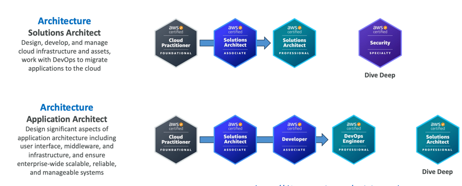
- exam code SAA-C03: 
- AWS: 2002 (internal launch) --> 2003 (ideation to market) --> 2004(launched publicly with SQS) --> 2006(Relaunch with SQS, S3, EC2) --> 2007(launched in Europe) --> Netflix, NASA, AirBnB, Dropbox
- AWS > Azure > Google Cloud
- AWS:
  - enables to build sophisticated, scalable applications
  - applicable to diverse set of industries
  - Enterprise IT, Backup & Storage, Big Data Analytics
  - Website hosting, Backend for mobile and social application
  - Gaming
- AWS global infrastructure: 
  - Aws regions
  - Aws AZ
  - Aws Data Centers
  - Aws Edge locations / Points of Presence
- Choice of region:
  - compliance
  - proximity: reduce latency
  - availability of services
  - pricing: varies based on region
- Availability Zones:
  - per region min 3 and max 6 AZ
  - each zone is one or more discrete data centers with redundant power and networking

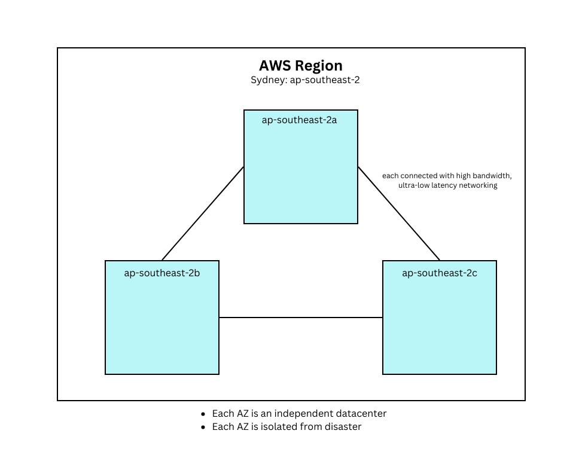


  
- AWS Point of Presence (Edge Location):
  - 400+ PS (400+ Edge locations & 10+ Regional Cache) in 90+ cities across 40+ countries
  - Aim: content is delivered to end-user with lower latency
- AWS Services:
  1. Global services:
     - IAM
     - Route 53 (DNS service)
     - CloudFront (Content Delivery Network)
     - WAF (Web Application Firewall)
  2. Region-Scoped
     - EC2 (Infrastructure as a Service)
     - Elastic Beanstalk (Platform as a Service)
     - Lambda (Function as a Service)
     - Rekogniation (Software as a Service)
## How to access AWS:
- There are 3 ways to access aws:
  - AWS management console (Web UI)
  - AWS CLI (`>aws`): protected by access key
  - AWS cloudshell: download and upload files. Files created will remain there even if shell is closed
  - AWS SDK from code: protected by access key. For each programming language, there is a separate sdk
- Access keys are generated through AWS console, managed by each user. They are just like a pwd.
### Install aws cli on MacOS:
- Follow these [steps](https://docs.aws.amazon.com/cli/latest/userguide/getting-started-install.html): 
- Create access keys: it can be created only for a user, not for root. Go to user --> security credentials --> Create Access Key --> CLI key
Recommended alternative: Use the AWS CLI V2 and enable authentication through a user in IAM Identity Center.
```
 ~ % aws configure
AWS Access Key ID [None]: AKIA2XXVXXVDXANC
AWS Secret Access Key [None]: Basfhv/xxxxxx/QxysfdfFGDlkerws
Default region name [None]: eu-central-1
Default output format [None]:
~ % aws iam list-users
```

## IAM
- You manage access to AWS by creating policies and attaching them to **IAM identities** (users, groups, roles) or aws resources
- Simply put: certain actions can be performed on aws services i.e S3 --> we allow a set of those actions by creating a policy and selecting those actions
  - we then assign this policy to IAM identities or resources.
- **Terms definitions**:
  - Policy: a policy is an object in AWS, that when associated with an identity or resource, defines their permissions
  - Resource-based policy: it is a json policy document that one attaches to a resource such as S3 bucket 
    - It gives specific principal permission to perform certain actions on that resource given a set of conditions
    - the principal can be in the same account as the resource or in another account (cross-account access)
    - cross-account access is possible only with `Resource-based policy`
  - Trust policy: defines which principal entities (accounts, users, roles, and federated users) can assume a role. An IAM role is both an identity and a resource
    - we attach both a trust policy and indentity-based policy to an IAM role.
  ```
  {
      "Version": "2012-10-17",
      "Statement": [
          {
              "Effect": "Allow",
              "Principal": {
                  "Service": "lambda.amazonaws.com"
              },
              "Action": "sts:AssumeRole"
          }
      ]
  }
  ```
- Root account shouldn't be used or shared
- Users: people that can be grouped
- Group: contains only users and not other groups
  - group `developers` --> [ahmad, alice, kai], group `operations` --> [david, edward], group `audit team` --> [kai, david]
- Users don't have to belong to a group
- A user can belong to multiple groups


- **IAM Permissions**:
  - Users and groups can be assigned JSON documents called policies
  - Policy: a json document that defines a set of permissions to making requests to aws services that can be used by IAM users, User groups and IAM roles
  - Permissions defined in a policy

```
{
  "Version": "2012-10-17",  // The version of the policy language. This is a fixed value.
  "Statement": [
    {
      "Effect": "Allow",  // Defines whether the action on certain API is allowed or denied. In this case, it allows the action. i.e Allow, Denied
      "Action": "s3:ListBucket",  // Specifies the action. In this case, it allows listing the contents of an S3 bucket.
      "Principal": {
        "AWS": ["arn:aws:iam::123456:root"] // which accounts, user or role
      },
      "Resource": "arn:aws:s3:::example-bucket",  // Specifies the resource (an S3 bucket) that the action applies to.
      "Condition": {},
    },
    {
      "Effect": "Allow",  // This block allows the next action
      "Action": [
        "s3:GetObject",    // Allows downloading objects from the S3 bucket.
        "s3:PutObject"     // Allows uploading objects to the S3 bucket.
      ],
      "Resource": [ // Allows the actions on any objects within the example-bucket.
        "arn:aws:s3:::example-bucket/*",
        "arn:aws:s3:::example-bucket-2/*"
       ]  
    }
  ]
}

```
  - Apply least privilege principle
  - Procedure: create user --> create group and assign to user --> create an account alias to ease of sign in --> share the link with pass to the user
  - Another example of policy `IAMReadOnlyAccess` with `iam:Get*` meaning anything that starts with `Get`
```
{
    "Version": "2012-10-17",
    "Statement": [
        {
            "Effect": "Allow",
            "Action": [
                "iam:GenerateCredentialReport",
                "iam:GenerateServiceLastAccessedDetails",
                "iam:Get*",
                "iam:List*",
                "iam:SimulateCustomPolicy",
                "iam:SimulatePrincipalPolicy"
            ],
            "Resource": "*"
        }
    ]
}
```
  - You can create your own policies:

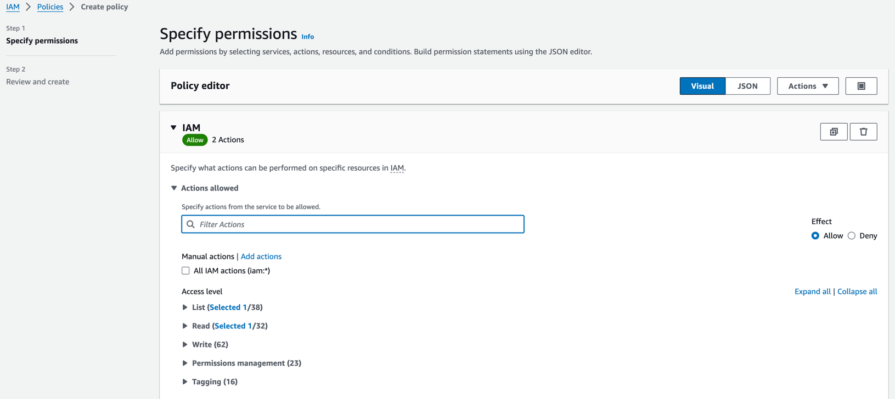

  - Password Policy: Set min length, char requirements, password expiration
    - A password policy for the entire aws users:
      - set a password policy for the entire aws account


  - Root user security policy such as MFA: Go to `My security credentials`

- **IAM Roles for Services**
  - Refer to the main diagram under IAM
  - Some aws services needs to perform actions on your behalf
  - To do so, we assign permissions to AWS services with IAM roles
  - account vs user vs role
  - Common roles: 
    - EC2 instance roles
    - Lambda Func Roles
    - Roles for cloud formation
  - Create a Role: go to iam roles --> select aws service --> select the service (i.e EC2) --> select the usecase --> attach IAM policies to the role (i.e IAMReadOnly)

- **IAM security tools**
  - IAM audit:
    - IAM `Credential Report`: status of users and their credentials. At `Account-level`
    - IAM `Access Advisor`: permissions granted and when were last used. At `User-level`: Go to user --> go to user's `Last Accessed`

- **IAM best practices**
  - Don't use the root account except when creating aws account
  - One physical user = one aws user
  - Assign users to groups and assign permissions to groups
  - Use strong password policy
  - Use MFA
  - Give Roles to aws services when giving permissions to aws services
  - Use access keys
  - Use IAM reports

### IAM Organization
- **Global service** for managing multiple AWS accounts.
- **Management account** oversees the organization; others are **member accounts**.
- **Member accounts** can belong to only one organization.
- **Consolidated Billing**: Single payment method for all accounts.
- **Cost savings**: Aggregated usage leads to volume discounts (EC2, S3, etc.).
- **Shared discounts**: Reserved Instances & Savings Plans apply across accounts.
- **Automation**: API available for AWS account creation.
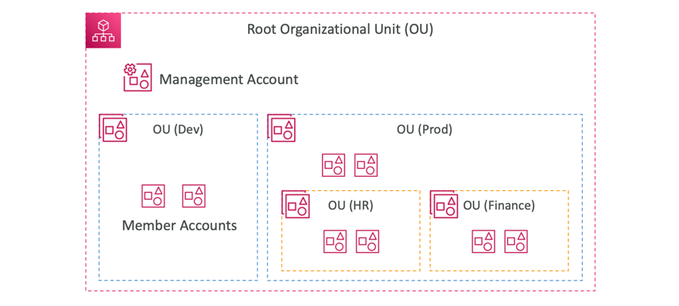
- **Advantages**
  - **Multi-Account vs. One Account Multi-VPC**: Better isolation and management.
  - **Tagging Standards**: Simplifies billing and cost tracking.
  - **Centralized Logging**:
    - Enable **CloudTrail** on all accounts, store logs in a central **S3** account.
    - Send **CloudWatch Logs** to a central logging account.
  - **Cross-Account Roles**: Simplifies admin access management.
- **Security – Service Control Policies (SCPs)**
  - Apply **IAM-like policies** at **OU** or **account** level to restrict users and roles.
  - **Management account is not affected** (has full admin rights).
  - **Explicit allow required** from root → OU → target account (default deny, like IAM).
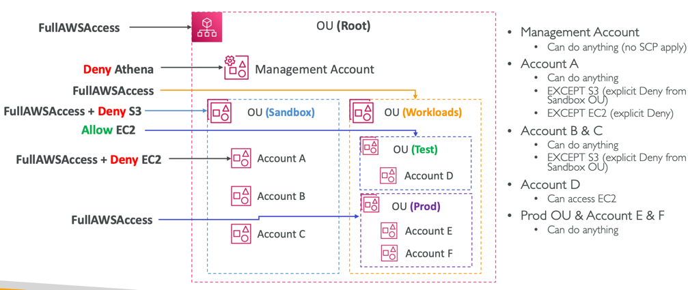
- Organizational Units (OU)
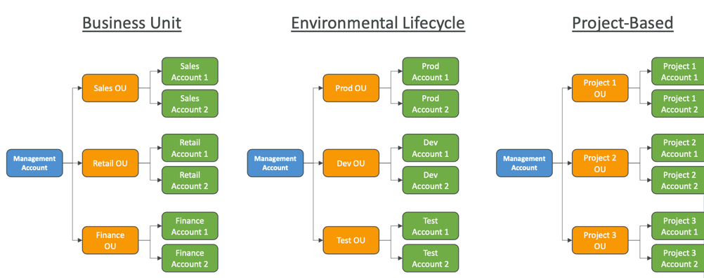
- SCP Examples - Blocklist and Allowlist strategies
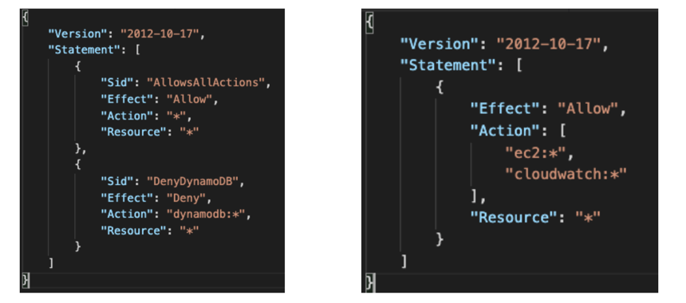
- Demo

[iam-organization-demo.gif](media/iam/iam-organization-demo.gif)

### IAM Conditions:
- `aws:SourceIp` restrict the client IP from which the API calls are being made
  ```
  {
      "Version": "2012-10-17",
      "Statement": [
          {
              "Effect": "Deny",
              "Action": "*",
              "Resource": "*",
              "Condition": {
                  "NotIpAddress": {
                      "aws:SourceIp": "203.0.113.25/32"
                  }
              }
          }
      ]
  }
  ```
- aws:RequestedRegion restrict the region the API calls are made to. i.e a user can do something only in the `requestedRegion`

  ```
  {
      "Version": "2012-10-17",
      "Statement": [
          {
              "Effect": "Deny",
              "Action": "*",
              "Resource": "*",
              "Condition": {
                  "StringNotEquals": {
                      "aws:RequestedRegion": "us-east-1"
                  }
              }
          }
      ]
  }
  ```
- ec2:ResourceTag restrict based on tags
  ```
  {
      "Version": "2012-10-17",
      "Statement": [
          {
              "Effect": "Deny",
              "Action": "ec2:TerminateInstances",
              "Resource": "arn:aws:ec2:*:*:instance/*",
              "Condition": {
                  "StringNotEquals": {
                      "ec2:ResourceTag/Environment": "Production"
                  }
              }
          }
      ]
  }
  -----
  {
      "Version": "2012-10-17",
      "Statement": [
          {
              "Effect": "Allow",
              "Action": [
                  "ec2:StartInstances",
                  "ec2:StopInstances"
              ],
              "Resource": "arn:aws:ec2:*:*:instance/*",
              "Condition": {
                  "StringEquals": {
                      "ec2:ResourceTag/Environment": "Development"
                  }
              }
          }
      ]
  }
  ```
- aws:MultiFactorAuthPresent to force MFA
  ```
  {
      "Version": "2012-10-17",
      "Statement": [
          {
              "Effect": "Allow",
              "Action": "ec2:*",
              "Resource": "*"
          },
          {
              "Effect": "Deny",
              "Action": ["ec2:StopInstances", "ec2:TerminateInstances"],
              "Resource": "*",
              "Condition": {
                  "BoolIfExists": {
                      "aws:MultiFactorAuthPresent": "false"
                  }
              }
          }
      ]
  }
  ```

**IAM for S3:**
- `s3:ListBucket` permission applies to `arn:aws:s3:::test`
  - => bucket level permission
- `s3:GetObject`, `s3:PutObject`, `s3:DeleteObject` applies to `arn:awn:s3:::test/*`
  - => object level permission (`/*)
  ```
  {
      "Version": "2012-10-17",
      "Statement": [
          {
              "Effect": "Allow",
              "Action": "s3:ListBucket",
              "Resource": "arn:aws:s3:::test"
          },
          {
              "Effect": "Allow",
              "Action": [
                  "s3:GetObject",
                  "s3:PutObject",
                  "s3:DeleteObject"
              ],
              "Resource": "arn:aws:s3:::test/*"
          }
      ]
  }
  ```
- `aws:PrincipalOrgID` can be used in any resource policies to restrict access to accounts that are member of an AWS Organization
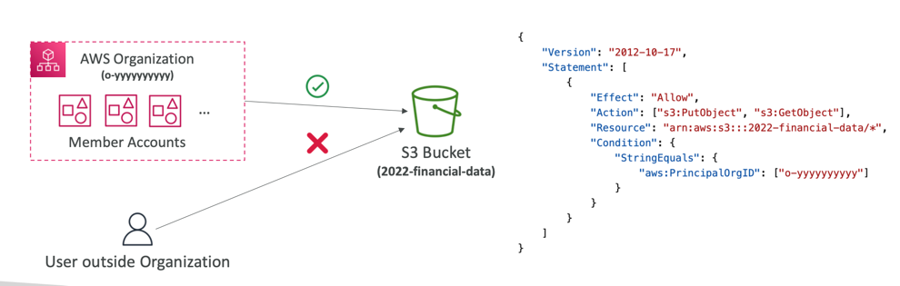

### IAM Roles vs Resource Based Policies - Cross account
- attaching a resource-based policy to a resource (example: S3 bucket policy) 
- OR using a role as a proxy
- When you assume a role (user, application or service), you give up your original permissions and take the permissions assigned to the role 
- When using a resource-based policy, the principal doesn’t have to give up his permissions 
  - Example: User in account A needs to scan a DynamoDB table in Account A and dump it in an S3 bucket in Account B. 
  - Supported by: Amazon S3 buckets, SNS topics, SQS queues, etc...

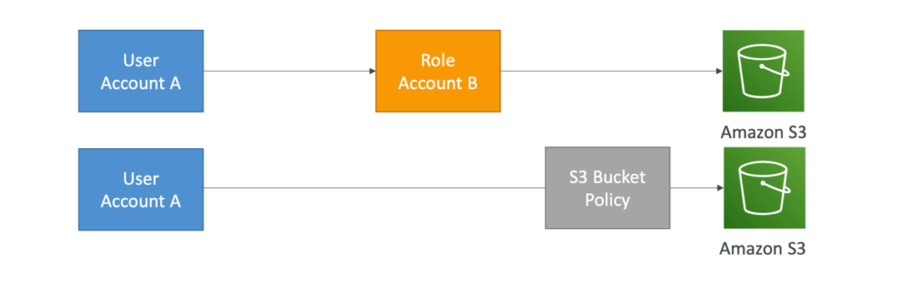

**Amazon EventBridge - Security:**
- When a rule runs, it needs permissions on the target 
  - Resource-based policy: Lambda, SNS, SQS, S3 buckets, API Rule Gateway... 
  - IAM role: Kinesis stream, Systems Manager Run Command, ECS task...

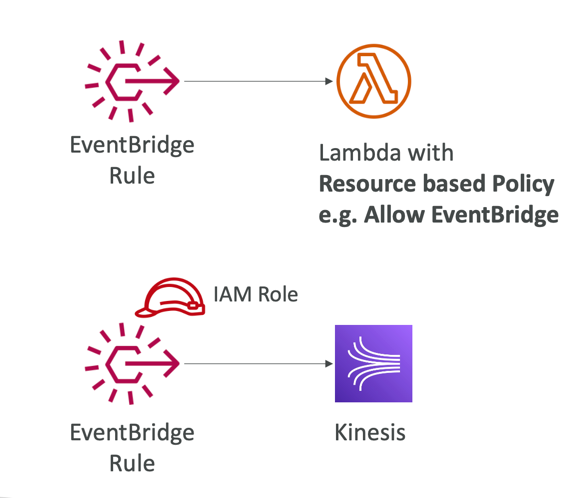

**IAM Permission Boundary & Policy Evaluation:**
- IAM Permission Boundaries are supported for users and roles (`not groups)
- Advanced feature to use a managed policy to set the maximum permissions an IAM entity can get.
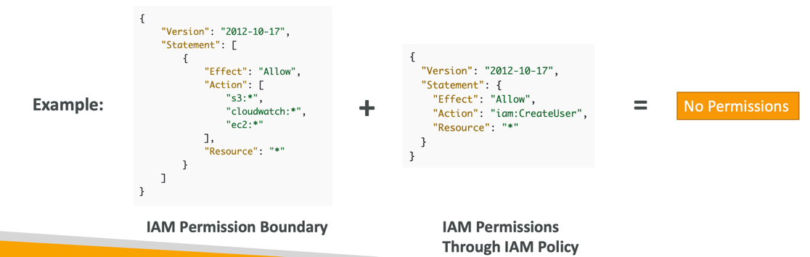
- Can be used in combinations of AWS Organizations SCP
- Use cases:
  - Delegate responsibilities to non administrators within their permission boundaries, for example create new IAM users
  - Allow developers to self-assign policies and manage their own permissions, while making sure they can’t “escalate” their privileges (= make themselves admin)
  - Useful to restrict one specific user (instead of a whole account using Organizations & SCP)
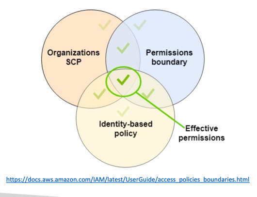

- IAM Policy Evaluation Logic

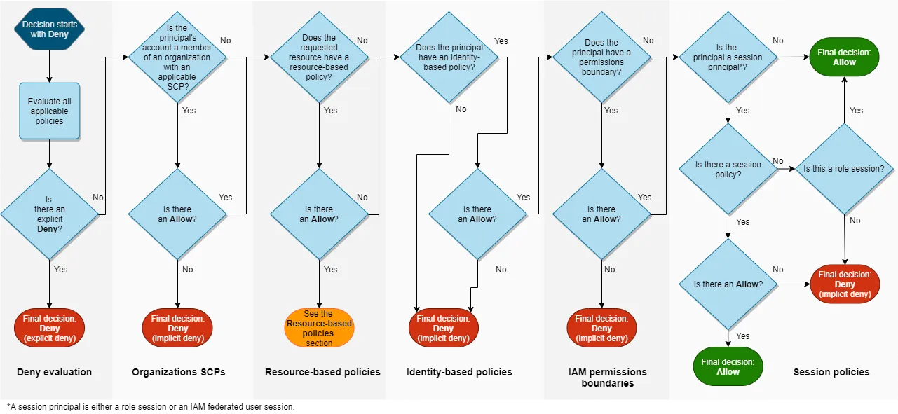
- Example:
  - Answer:
    - Can you perform `sqs:CreateQueue`?
    - Can you perform `sqs:DeleteQueue`?
    - Can you perform `ec2:DescribeInstances`? No, because there is no explicit deny or allow

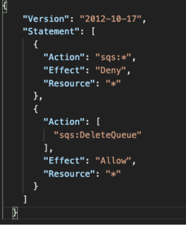


### AWS IAM Identity Center (successor to AWS Single Sign-On)
- Provides a single sign-on (SSO) solution for accessing:
  - All AWS accounts within AWS Organizations
  - Business cloud applications (e.g., Salesforce, Box, Microsoft 365)
  - SAML 2.0-enabled applications
  - EC2 Windows instances
  - Identity providers:
    - Built-in identity store within IAM Identity Center
    - Third-party providers such as Active Directory (AD), OneLogin, and Okta

Login Flow:

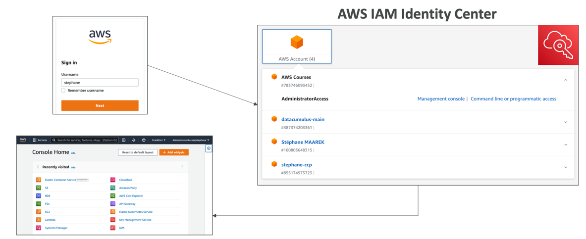

AWS IAM Identity Center:

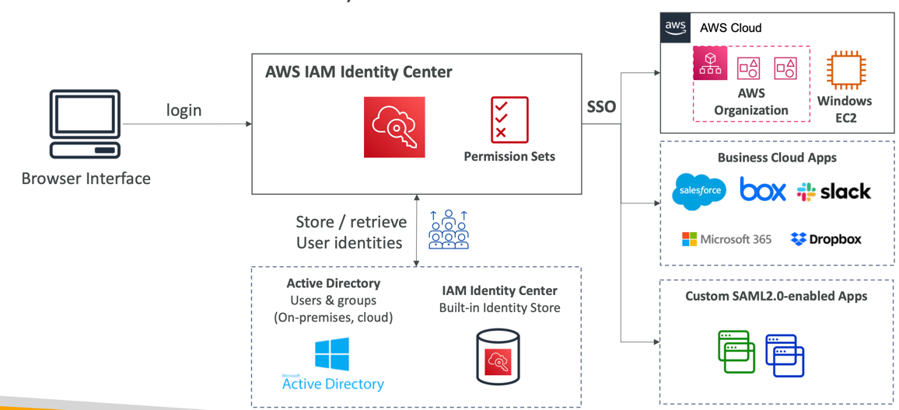

Permission sets assigned to a set of users
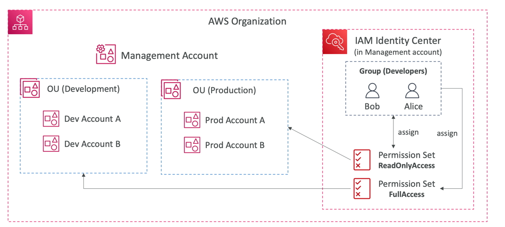

AWS IAM Identity Center Fine-grained Permissions and Assignments:
- Multi-Account Permissions
  - Manage access across AWS accounts in your AWS Organization
  - Permission Sets – a collection of one or more IAM Policies assigned to users and groups to define AWS access
- Application Assignments
  - SSO access to many SAML 2.0 business applications (Salesforce, Box, Microsoft 365)
  - Provide required URLs, certificates, and metadata
  - Attribute-Based Access Control (ABAC)
    - Fine-grained permissions based on users’ attributes stored in IAM Identity Center Identity Store
    - Example:cost center,title,locale,...
    - Use case:Define permissions once,then modify AWS access by changing the attributes

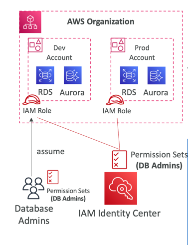

**IAM Roles Anywhere** is a feature in AWS that enables you to securely grant access to AWS resources from **outside** AWS (e.g., on-premises servers, or other cloud environments) using **IAM roles**. It works with **IAM Identity Center** to allow users and applications to assume IAM roles by leveraging **X.509 certificates** for authentication, instead of relying solely on traditional AWS credentials.

In the context of **IAM Identity Center**, it helps extend centralized identity and access management to external environments, offering seamless, secure access to AWS resources regardless of the user's or application's location.

### AWS Directory Services

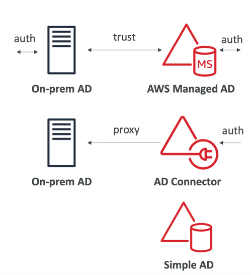

#### **1. AWS Managed Microsoft AD**
- **Effort**: Higher upfront setup, but offers deep integration and long-term flexibility.
- **Use case**: Ideal if you want a fully managed AD in AWS with support for trust relationships.
- **Setup steps**:
  - Deploy AWS Managed Microsoft AD in your VPC.
  - Configure a two-way trust with your on-premises AD.
  - IAM Identity Center can natively integrate with the managed AD—no extra proxy or directory required.
- **User management**: You can either manage users in AWS AD or use on-prem users via trust.
- Supports MFA, group sync, and attribute mappings.
- More effort initially (trusts, networking, DNS, etc.), but better for scalability and centralized control.


---

#### **2. AD Connector**
- Directory Gateway (proxy) to redirect to on-premises AD
- Users are managed on the on-premises AD
- **Effort**: Lower effort and faster setup, but with fewer features.
- **Use case**: Best for scenarios where you want to reuse your on-prem AD users directly without replicating or extending AD into AWS.
- **Setup steps**:
  - Deploy an AD Connector in your VPC.
  - Point it to your on-premises AD (requires VPN or Direct Connect).
  - IAM Identity Center connects through the AD Connector as a proxy to authenticate users.
- All user management stays on-prem, with no user duplication.
- Supports MFA, but limited to authentication use cases—no group sync or advanced policies from AWS side.
- Easiest to set up, but less flexibility in advanced identity features.

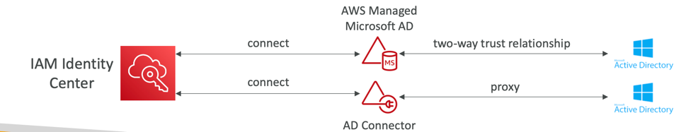

---
#### Simple AD
  - AD-compatible managed directory on AWS
  - Cannot be joined with on-premises AD

#### Demo:

[aws-ad-demo.gif](media/iam/aws-ad-demo.gif)

### AWS Control Tower - a service on top of the organization
- Easy way to set up and govern a secure and compliant multi-account- AWS environment based on best practices
- AWS Control Tower uses AWS Organizations to create accounts
- Benefits:
  - Automate the setup of your environment in a few clicks 
  - Automate ongoing policy management using guardrails
  - Detect policy violations and remediate them
  - Monitor compliance through an interactive dashboard

AWS Control Tower – Guardrails
  - Provides ongoing governance for your Control Tower environment (AWS Accounts)
    - Preventive Guardrail – using SCPs (e.g., Restrict Regions across all your accounts)
    - Detective Guardrail – using AWS Config (e.g., identify untagged resources)

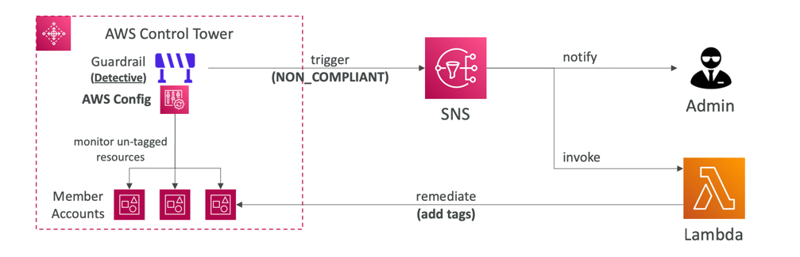

## EC2 Service (Elastic Compute Cloud) - Infras as a service
- Think of it as a computer in the cloud. It’s where you can run applications, websites, or other tasks, just like you would on your laptop or a physical server.
- You can choose the size, speed, and capacity of this "cloud computer" based on what you need
*Notes about budget alerts*:
1. In root account, activate it: accounts --> IAM user and roll access to billing information
2. Setting up budget to avoid surprisings: account --> budgets --> setup i.e zero spend budget --> add email
### EC2 Capabilities
EC2 or elastic computing 2 is infrastructure as a service
- Renting virtual machines (EC2)
- Storing data on virtual drives (EBS)
- Distributing load across machines (ELB)
- Scaling services using an auto-scaling group (ASG)
- EC2 instance [types](https://aws.amazon.com/ec2/instance-types/?nc1=h_ls)
- A comparison of different instance types [see](https://instances.vantage.sh/).
- For demo purposes, we will use t2.micro
- Fundamental part of cloud
- `Detailed monitoring`:
  - When launching, enable this under monitoring to get 1-minute metrics instead of 5-minutes metrics in basic monitoring.
- User Data:
  - executed with root privilege 
  - executed during the boot cycle when you first launch an instance
- User Data Example:
```
#!/bin/bash
# Use this for your user data (script from top to bottom)
# install httpd (Linux 2 version)
yum update -y
yum install -y httpd
systemctl start httpd
systemctl enable httpd
echo "<h1>Hello World from $(hostname -f)</h1>" > /var/www/html/index.html
```

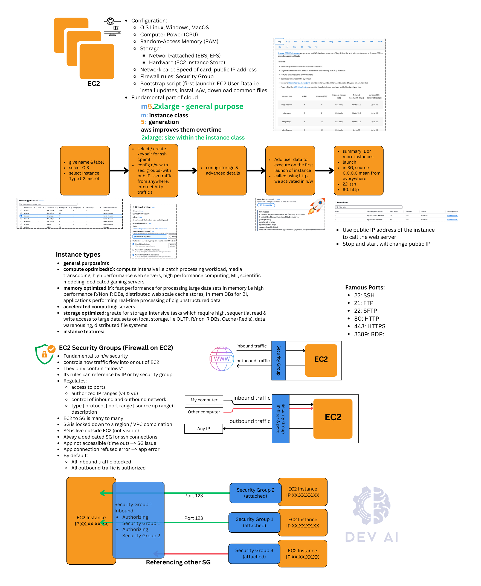

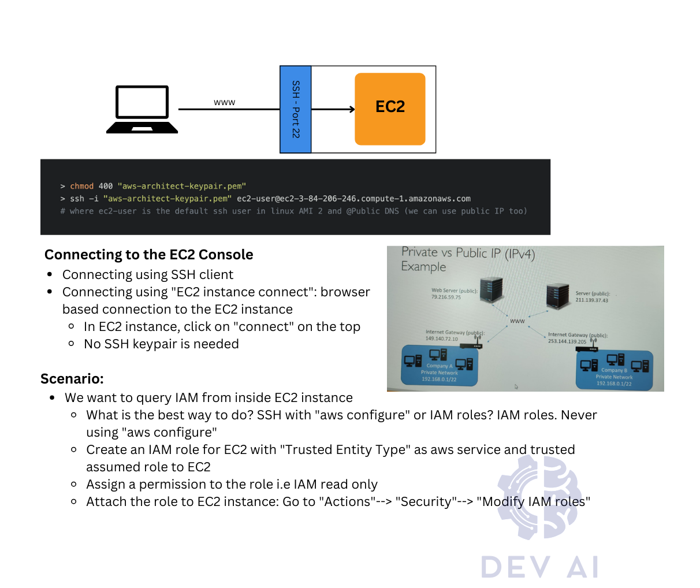
- Patch test:
  - put `ReplaceUnhealthy` in standby or 
  - put instance into standby state
### EC2 Purchasing Options

1. **On-Demand Instances**:
  - **Description**: These are the most flexible EC2 instances. You pay for compute capacity by the second or hour, with no long-term commitment or upfront payments.
  - **Use Case**: Ideal for short-term, unpredictable workloads or applications that cannot be interrupted.

2. **Reserved Instances**:
  - **Description**: Reserved Instances provide a significant discount (up to 75%) compared to On-Demand pricing in exchange for committing to a specific instance type and region for a one or three-year term.
  - **Types**:
    - **Standard Reserved Instances**: Fixed instance type and region.
    - **Convertible Reserved Instances**: Can be exchanged for other instance types, but still within a specific region.
    - **Scheduled Reserved Instances**: Reserved for specific time windows.
  - **Use Case**: Best for predictable, steady-state usage.

3. **Spot Instances**:
  - **Description**: These are unused EC2 capacity available at a reduced price. Spot Instances can be interrupted by AWS with little notice, typically when the demand for EC2 capacity increases.
  - **Use Case**: Suitable for flexible, fault-tolerant applications, like big data processing or batch jobs, that can handle interruptions.

4. **Spot Fleet**:
  - **Description**: Spot Fleet is a collection of Spot Instances (and optionally On-Demand Instances) that is managed as a single entity. You can use Spot Fleet to automatically request, manage, and scale Spot Instances across multiple instance types and Availability Zones, based on your target capacity.
  - **Use Case**: Ideal for large-scale, stateless, distributed workloads (like batch processing or simulations) that can tolerate interruptions and require flexible scaling across multiple instance types and zones.

5. **Savings Plans**:
  - **Description**: A flexible pricing model offering lower prices in exchange for committing to a consistent amount of usage (measured in $/hr) over a one- or three-year term.
  - **Types**:
    - **Compute Savings Plans**: Flexibility to switch between instance types, operating systems, and regions.
    - **EC2 Instance Savings Plans**: Commitment to specific EC2 instance families and regions.
  - **Use Case**: Ideal for businesses with predictable compute needs that want the flexibility to change instance types, regions, and OS over time.

6. **Dedicated Hosts**:
  - **Description**: Physical servers dedicated to your use. You can launch EC2 instances on these hosts and have full control over how instances are placed on the server.
  - **Use Case**: Ideal for workloads that require compliance, licensing, or need a specific physical server.

7. **Dedicated Instances**:
  - **Description**: EC2 instances that run on hardware dedicated to a single customer. Unlike Dedicated Hosts, they don’t give you control over instance placement.
  - **Use Case**: Suitable for workloads that require isolation but do not need the full control of Dedicated Hosts.

8. **Elastic GPUs**:
  - **Description**: These are graphics processing units that you can attach to your EC2 instances to support graphic-intensive applications such as machine learning, video rendering, etc.
  - **Use Case**: Ideal for applications needing additional GPU capacity for graphics or compute-intensive workloads.

9. **Elastic Inference**:
  - **Description**: Allows you to attach low-cost GPU-powered inference acceleration to your EC2 instances, saving on overall costs while running machine learning inference workloads.
  - **Use Case**: Cost-effective for running ML models in production environments.

10. **Capacity Reservation**:
  - **Description**: Capacity Reservations allow you to reserve capacity for EC2 instances in a specific Availability Zone. Unlike Reserved Instances, which offer a discount in exchange for a commitment, Capacity Reservations ensure that you have the necessary compute capacity available when you need it. The instances are billed at On-Demand rates.
  - **Use Case**: Ideal for workloads that require guaranteed compute capacity in a specific region or Availability Zone, especially for applications that cannot be interrupted, such as critical applications or large-scale migrations.

---

**Spot Fleet**
- **Description**: Spot Fleet is a service that allows you to manage and request a fleet of Spot Instances (and optionally On-Demand Instances) to meet your compute requirements. Spot Fleet provides automated scaling, instance diversification, and fault tolerance to handle instance interruptions.
- **Use Case**: Perfect for large-scale, stateless, batch-processing workloads or any distributed application that can handle interruptions. It allows you to optimize cost and reliability by distributing the fleet across multiple instance types and regions.

- IPv4 costs: Configure IPAM for getting usage insights

### *Elastic IP*
- Restart of a instance changes its public ip 
- Is a public IP you own as long as you don't delete it.
- Could be mapped rapidly to another instance to mask the failure of an instance
- 5 elastic IPs per account
- Not good practice. Alternatives
  - Try to use random public IP and register a DNS name to it
  - Use load balancer (best option)

[elastic-ip-allocation.gif](media/elastic-ip-allocation.gif)

### *EC2 placement groups*
When you launch your EC2 instances, EC2 service attempts to place the instance in such a way that all the instances are spread out across the underlying hardware to minimize correlated failures.
To influence this, use placement group
- It is free of cost
- Used to cluster instances. Strategies for the group:
  - *Cluster*: clusters instances into a low latency group in a single AZ, thus high network performance for use cases like HPC (tightly coupled node-to-node communication). 
  - *Spread*: spread instances across underlying hardware ( max 7 instances per group per AZ)
  - *Partition*: spread instances across different partitions (which rely on different sets of racks) within AZ. Scales to 100s of EC2 instances per group (Hadoop, Cassandra, Kafka)

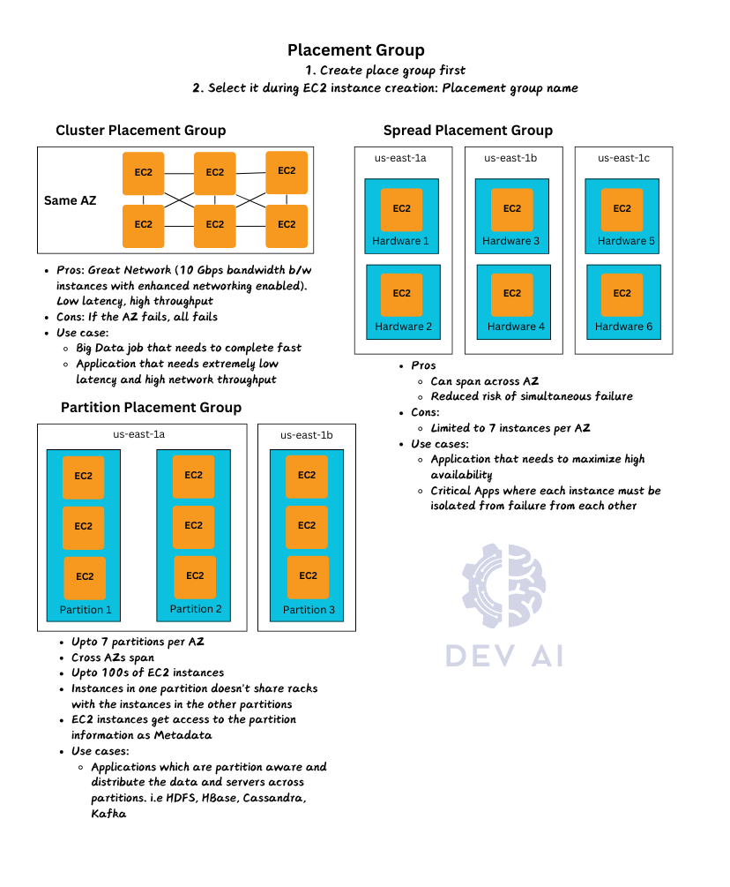

### Elastic Network Interface (ENI)
- Logical component in VPC representing virtual network card (Eth0, Eth1):
- ENI attributes:
  - Primary private IPv4, one or more secondary IPv4
  - One elastic IP (IPv4) per private IPv4
  - One public IPv4
  - Security group(s)
  - A MAC address
  - ENI can be created independently and attached on the fly (moved) on EC instances for failover
  - ENI is **bound** to a specific AZ
  - elastic: created, attached on-fly, and while an instance is running
- Use case:
  - instead of creating two instances in two subnets, one creates two ENI in two subnets and attach them to the same instance
  - See more [here](https://aws.amazon.com/blogs/aws/new-elastic-network-interfaces-in-the-virtual-private-cloud/)

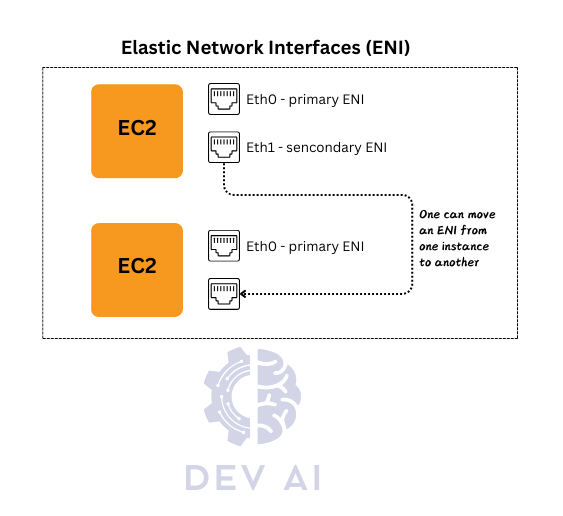

[eni-demo.gif](media/eni-demo.gif)

### EC2 instance Hibernate:
- Whatever in RAM is preserved
- It boots much faster (OS not stopped/restarted)
- Under the hood: RAM is written to a file in EBS volume
- Conditions
  - EC2 RAM less than 150GB
  - Volume of type EBS
  - EBS volume must be encrypted
- Use cases:
- Upto 60 days hibernate
- Demo: 
  - create instance --> in 'Advanced Details' set *Stop - Hibernate behavior* to 'enabled'
  - Make sure in the 'configure storage', the volume's encryption is set 'encrypted'
  - Connect to the instance and use 'uptime' command, then hibernate and start again and check the uptime. (should be increasing & not from start from 0)

### EC2 Instance Storage - EBS
- EBS (Elastic Block Store)
  - Now, every computer needs storage, right? EBS is the hard drive for your EC2 instance.
  - It's like an external SSD or HDD attached to your cloud computer where you can store your files, databases, or any data your application uses.
  - The best part? Even if your EC2 instance is stopped or deleted, the EBS can keep your data safe unless you choose to delete it
  - It is a network drive (network usb stick to say). Uses network to communicate with instances
  - Plug and play
  - Mounted to one instance at a time
  - bound to an AZ
    - To move to another AZ, create the snapshot
  - It is provisioned capacity, which means determining in advance:
    - size in GBs
    - Throughput
    - IO spead in IOPS (I/0 per second)
  - Provisioned capacity:
    - billed for all provisioned capacity
    - can be increased overtime
---

 🚀 **SSD-backed Volumes** (Performance + Boot Volumes)

| Type     | Purpose                     | Key Features / Use Cases                                        |
|----------|-----------------------------|------------------------------------------------------------------|
| **gp2**  | General Purpose SSD (legacy) | - 3 IOPS/GB, burst up to 3,000 IOPS<br>- IOPS tied to volume size |
| **gp3**  | General Purpose SSD (newer)  | - Baseline 3,000 IOPS (up to 16,000)<br>- 125–1,000 MiB/s throughput, IOPS and size decoupled |
| **Use case** | Boot volumes, virtual desktops, cost-effective general workloads |

---

⚡ **PIOPS SSD (High-Performance)**

| Type     | Purpose                         | Key Features                                                    |
|----------|----------------------------------|------------------------------------------------------------------|
| **io1**  | Provisioned IOPS SSD             | - Max 64,000 IOPS (Nitro), 32,000 (others)<br>- 4 GiB – 16 TiB |
| **io2**  | More durable PIOPS SSD           | - Same IOPS as io1 but better durability & SLA |
| **io2 Block Express** | Ultra-high perf io2 variant  | - Up to 256,000 IOPS<br>- 1,000:1 IOPS:GiB ratio<br>- Sub-ms latency<br>- Up to 64 TiB |
| **Multi-Attach Support** | io1/io2 (same AZ) | - Attach to up to 16 EC2s for HA<br>- Requires **cluster-aware** file system |
| **Use case** | Databases, enterprise apps, I/O intensive workloads needing >16K IOPS |

---

🧊 **HDD-backed Volumes** (Throughput + Cost Savings)

| Type     | Purpose                  | Key Features / Use Cases                                           |
|----------|---------------------------|---------------------------------------------------------------------|
| **st1**  | Throughput Optimized HDD | - Up to 500 MiB/s throughput<br>- Max IOPS ~500<br>- Use for Big Data, log processing |
| **sc1**  | Cold HDD                 | - Up to 250 MiB/s<br>- Max IOPS ~250<br>- Cheapest; for archival, infrequent access |
| **Limitations** | Both can't be boot volumes |

---

🧩 **Root Volume Support**
- Only **gp2**, **gp3**, **io1**, **io2**, and **Instance Store** can be used as **root/boot volumes**.

---

🧠 **Easy Mnemonics**

  - **G**eneral = **gp2/gp3**
  - **I/O intense = io1/io2**
  - **T**hroughput = **st1**
  - **C**heap = **sc1**
  - **Bootable = SSDs only** (plus instance store)

---

[ebs-volume-demo.gif](media/ebs-volume-demo.gif)

**EBS Snapshots**
- Backup of an EBS at anytime
- Recommended to first detach
- Can copy across AZ or Regions
-  AWS typically initializes the volume lazily. This means that the first time you read a block of data from the new volume, the block must be fetched from Amazon S3 (where snapshots are stored)
- Features:
  - EBS snapshot archive: 
    - Move this archive tier. 
    - 75% cheaper
    - takes 24 to 72 hours to restored
  - Recycle Bin for EBS snapshots
    - to recover after deletion
    - retention period of (1 day to 1 year)
  - Fast snapshot restore (FSR)
    - costs a lot more
    - FSR eliminates above lazy latency by pre-warming the volume so that all blocks are immediately available upon creation. This ensures the restored volume performs at full speed right from the start.

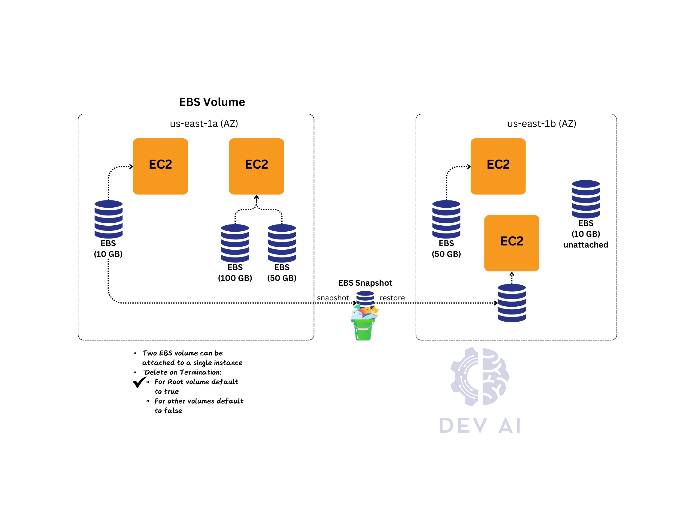
- Snapshot Demo:

[snapshot-demo.gif](media/snapshot-demo.gif)

**EBS Encryption**
- Encrypted EBS volumes, means encryption of:
  - data at rest
  - in flight data between instance and volume
  - snapshots encrypted
  - volumes created from snapshots
- It leverages key from KMS (AES-256)
- Minimal impact on latency
- Copying unencrypted snapshot allows encryption
- **Issue**: encrypt unencrypted EBS volume?
  - Create EBS snapshot of the volume --> encrypt the EBS snapshot while copying --> create new EBS volume from snapshot (it will be encrypted) --> attach it to the original instance
  - Or shortcut: create a volume from unencrypted snapshot and enable encrypted during the process

### EC2 AMI
- Amazon Machine Image (AMI)
  - Public AMIs
  - AWS marketplace AMI
  - Custom (own) AMI
- AMIs are built for specific AWS region only.
- AMIs are customization of an EC2 instance
  - add your own software, config, os, monitoring etc
  - AMI built for only one region but can be copied across regions
- AMI creation process: 

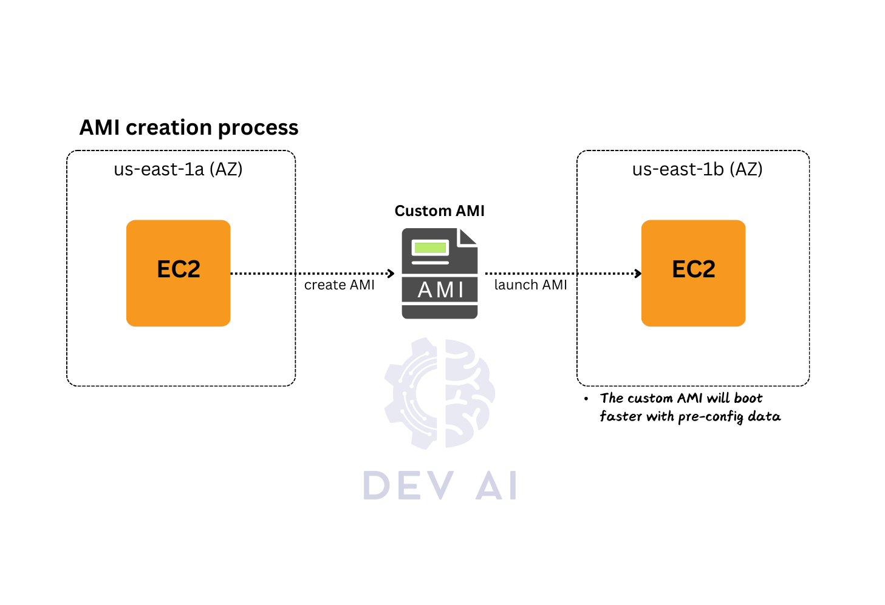
- Demos
  - [ami-demo-1.gif](media/ami-demo-1.gif)
  - [ami-demo-2.gif](media/ami-demo-2.gif)

### EC2 Instance Store
- In need of high performance hardware disk:
  - EC2 Instance Store
    - Direct connect instead of over the network
    - Better I/O compared to EBS
    - However, they are ephemeral (lost when instance is stopped)
  - IOPS as high as 310,000 or more (high IO database use cases)
  - Use cases:
    - Buffer, cache, scratch data, temporary content
  - Risk of loss:
    - Backup & replication are your responsibilities

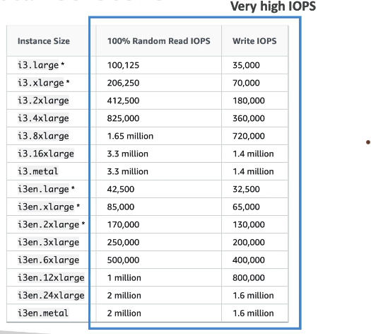

### AWS EFS - Elastic File System
**EFS (Elastic File System)** is a scalable, cloud-based file storage service provided by **Amazon Web Services (AWS)**. It allows multiple **EC2 instances** to access a **shared file system** over the **NFS (Network File System)** protocol, making it ideal for use cases that require shared data access, like web servers or big data applications.

**Key features:**
- **Fully managed and scalable** (automatically grows/shrinks as needed)
- **Accessible from multiple instances** across Availability Zones
- **Pay-as-you-go** pricing
- **Supports encryption** and lifecycle management

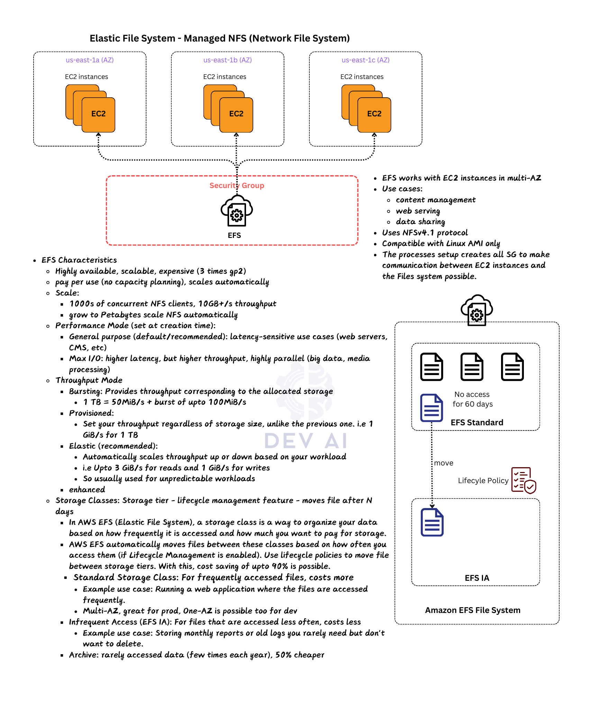

- EFS vs EBS vs Instance Store
  - EFS
    - one instance (except io1/io2 - multi-az), locked to one AZ (can be migrated to another AZ using snapshotting technques)
    - gp2: I/O increases if disk size increases
    - gp3 & IO1: can increase IO independent of size
    - Root terminated by default
  - EFS Creation Demo:
  
[efs-creation-demo.gif](media/efs-creation-demo.gif)
  - EBS:
    - Mounting 100s of instances across AZs
    - Linux system only
  - Instance Store:
    - It is physically attached to EC2 instance. If instance lost, storage is lost

### High availability and scalability
- Scalability 
  - Vertically i.e moving from t2.micro to t2.large
    - i.e common for non-distributed systems i.e databases, RDS, ElasticCache etc
  - Horizontal: increase the number of instances
    - for distributed systems i.e web application, modern applications
- High availability: means having apps running in to data centers (== AZs)
  - goal is to survive a data center loss
  - Enabled with:
    - Auto scaling group multi-AZ
    - Load Balancer multi AZ

## ELB - AWS managed Load Balancer
- Expose a single point of entry (DNS) to the app
- Seamlessly handle failure of downstream instance
- Does regular health check of the instances
- SSL termination (HTTPS)
- ELB is Multi-AZ and doesn't work across regions
- Enforce stickiness to cookies
- High availability across zones
- Separate public traffic from private one
- Well integrated with other AWS services and ease of integration
  - EC2, EC2 Auto Scaling groups, Amazon ECS
  - AWS Certificate Manager (ACM), Route 53, WAF, AWS global accelerator. 

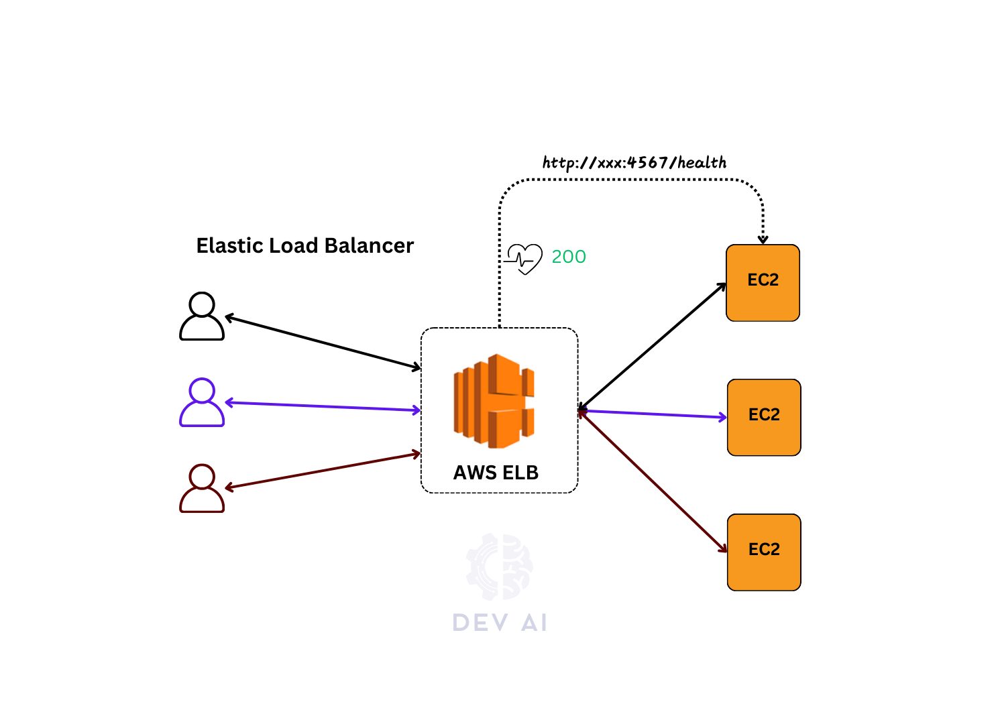

- Security consideration
  - EC2 accepts incoming traffic only from SG that is assigned to LB on port 80
  - While LB accepts HTTP and HTTPS from everyone on port 80
- ELB Types: Classic, Application LB, Network LB, Gateway LB
### **Classic:** (Old) - 2009
### **Application LB:** HTTP, HTTPS, Websocket - 2016: Layer 7 only LB 
- LB to multiple HTTP apps across machines (target groups)
- LB to multiple applications on the same machine (i.e containers)
- It has only static DNS name and not static IP. Only NLB has static IP
- supports redirect from HTTP to HTTPS
- Routing:
  - routing based on path (content-based routing) (example.com/user & example.com/post routed to two different target groups)
  - routing based on hostname (one.example.com & other.example.com two routs routed to two different target groups)
  - Routing based on query string, headers
- ALB are great fit for microservices and container-based application (docker, AWS ECS)
    
  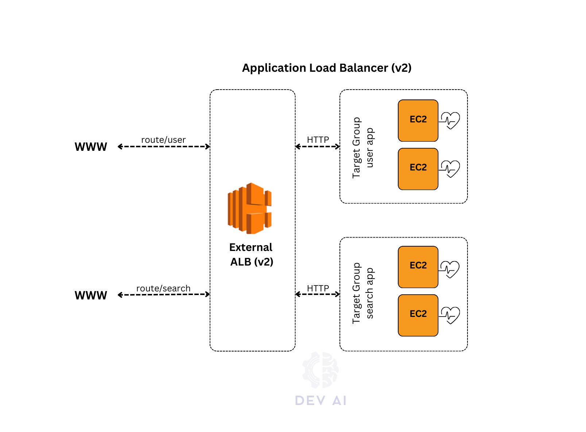
- ALB and Subnets
  - EC2 instances (target group) are in private subnet (?)
  - add public subnets on the same AZ as the private ones to ALB

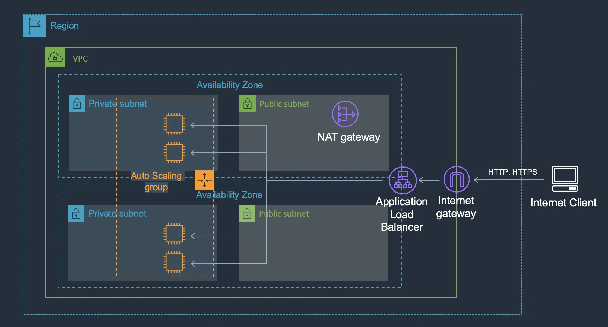
- Target groups of ALB
  - EC2 instances (can be managed by auto-scaling group) - HTTP
  - ECS tasks - HTTP
  - Lambda functions - HTTP request is translated into a JSON event
  - IP addresses (private IPs)
  - ALB can route to multiple target groups
    
  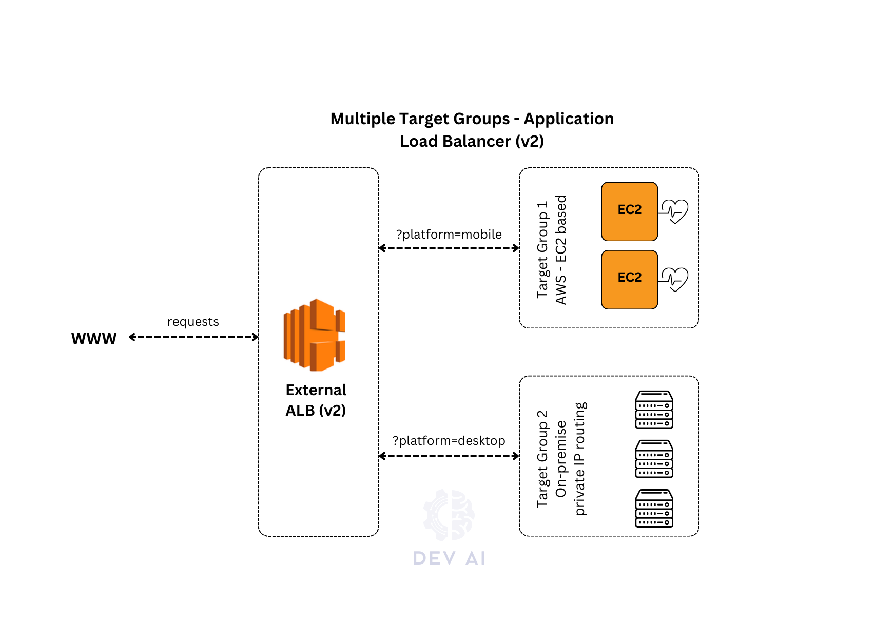
- Health check are at the target group level
- It has a fixed hostname (XXX.region.elb.amazonaws.com)
- Application servers don't see the IP of the client directly (the true IP is inserted into the header `X-Forwarded-For`), as well as the port (`X-Forwarded-Port`) and protocol (`X-Forwarded-Proto`)
    
  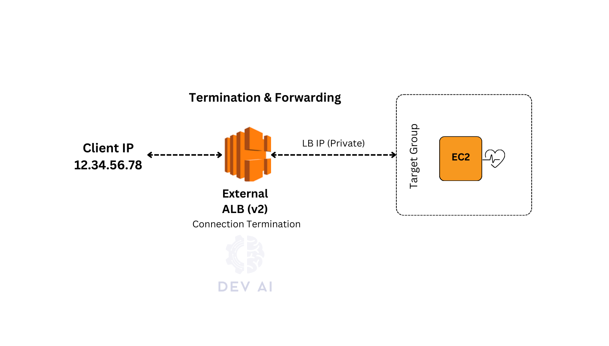
- **ALB Setup Demo**
  - [alb-setup-demo.gif](media/alb-setup-demo.gif)
- ALB Rule Setup Demo (Continue)
  - [alb-rule-setup-demo.gif](media/alb-rule-setup-demo.gif)
    
### **Network LB:** TCP, TLS (secure TLS), UDP - 2017. 
- A layer 4 LB, High Performance (millions of requests per seconds)
- Forwards TCP & UDP traffic to the instances
- Ultra-low latency
- It has one static IP per AZ (can use an elastic IP for this purpose) - whitelisting specific IPs
- Not included in free tier
- Use case: app needs to be access through specific IPs, --> then use NLB
- Target group:
  - EC2 instances
  - Private IPs (own or EC2)
  - Another ALB: NLB --> ALB, getting benefits of both
- `Health check`: TCP, HTTP, and HTTPS
- NLB Setup Demo
  - [nlb-demo.gif](media/nlb-demo.gif)
    
### **Gateway LB:** operates at layer 3 (Network layer) - IP protocol
- Deploy, scale and manage a fleet if 3rd party network virtual appliances i.e Firewalls, Intrusion detection & Prevention Systems, Deep packet inspection system, payload manipulation
- Layer 3 LB (IP layer)
- Functions:
  - transparent network gateway: single entry/exit for all traffic
  - Load balancer: across virtual appliances
- Target group:
  - EC2 instances
  - Ip addresses (must be private IPs) of both own and aws resources
- Uses `GENEVE` protocol on port `6081
    
  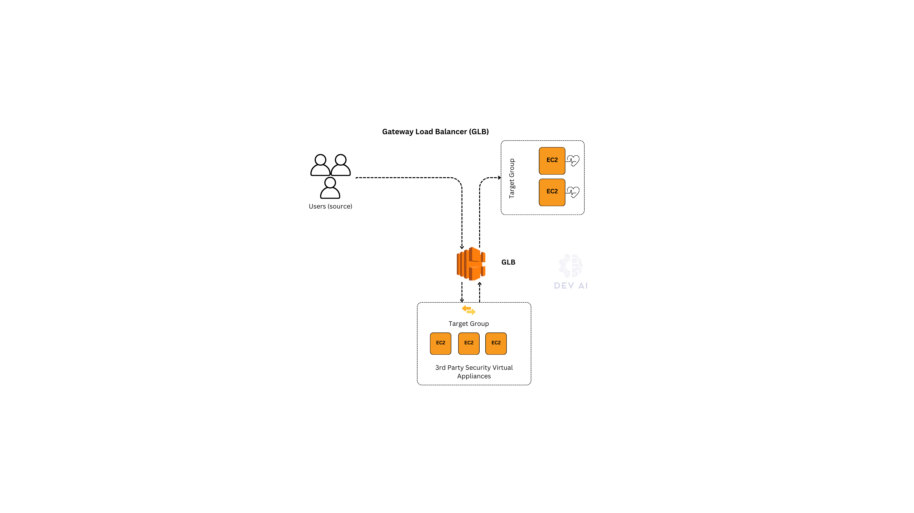
- LB can be setup as private or public
### **Sticky Sessions:**
- stickiness: same client redirected to the same instance behind LB
- How it works: cookie is sent as part of client request that has expiration date
- Usecase: make sure the use doesn't lose his session data (such as user's login data)
- may bring imbalance
- Types:
  - application-based
    - Custom cookie
      - generated by the target
      - can include any custom attribute
      - Can't have AWSALB, AWSALBAPP or AWSALBTG
    - application cookie
      - generated by load balancer
      - name is AWSALBAPP
  - duration-based:
    - generated by LB
    - name is AWSALB for ALB, AWSELB for CLB
- Sticky Session Demo on ALB
  - [sticky-session-demo-alb.gif](media/sticky-session-demo-alb.gif)
### Cross-Zone LB:
  - In ALB, it is enabled by default. It can be disabled at `target group` level. No charges for inter AZs traffic (which costs normally)
  - Change it in `target group` under `attributes` section.
  - In NLB, GLB, it is disabled by default. If activated, it costs for inter AZs traffic. Can be changed in LB attributes section directly

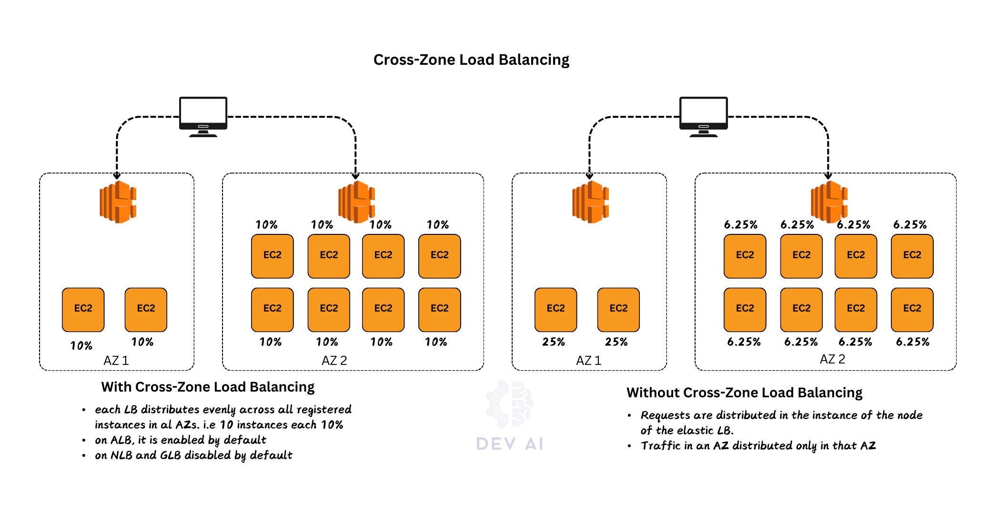
### SSL/TLS:
- SSL certificate allows traffic between your client and LB to be encrypted in transit (in-flight encryption)
- SSL refers to Secure Sockets Layer, used to encrypt connections
- TLS refers to Transport Layer Security, the newer version of SSL
- TLS certificates are mainly used, though people still refers to  it as SSL
- SSL certs are issued by Certificate Authority (CA) i.e Comodo, GoDaddy etc
- Has expiration date

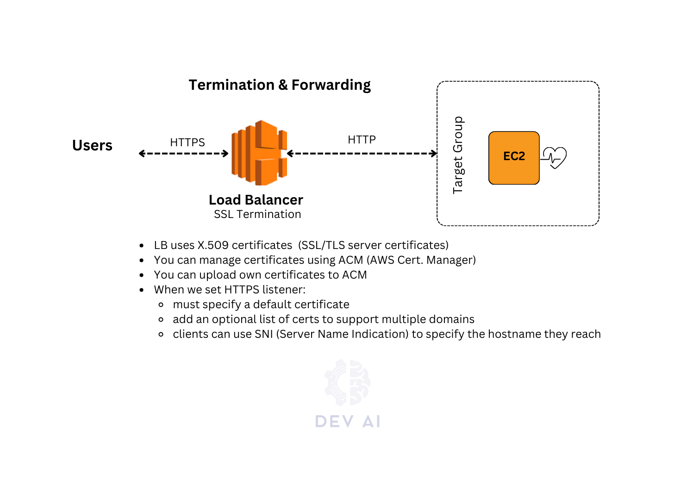
- SSL SNI:
  - Problem: Loading multiple SSL certs onto one server (to serve multiple websites)
  - Server will find the correct cert or return the default
  - Only works with ALB & NLB, CloudFront
  
  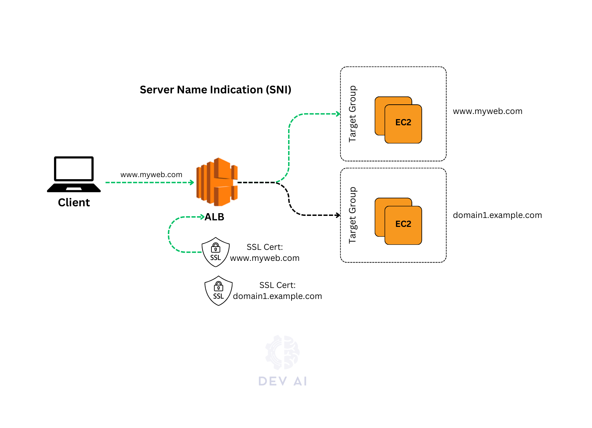
    
- SSL Setup Demo:
  - [ssl-alb-nlb-setup.gif](media/ssl-alb-nlb-setup.gif)

### Connection draining:
  - in CLB, called Connection draining
  - in ALB, NLB called De-registering Delay
  - it is time to complete "in-flight requests' while the instance is de-registering or is unhealthy
  - it is between 1 and 3600 (default 300)

## Auto Scaling Group (ASG)
- horizontally scaling the number of instances up and down
- scale up vs scale out??
- ensures max and min number of instances at any time
- terminate unhealthy and bring up new ones
- automatically register the new one to LB
- Launch Template:
  - AMI + instance type
  - EC2 User Data
  - EBS Volumes
  - Security Groups
  - SSH Key Pair
  - IAM Role for EC2 instances
  - Network + Subnet Information
  - LB Info
  - Demo:
    - [auto-scaling-demo.gif](media/auto-scaling-demo.gif)
  - Auto Scaling Group Adjustment Demo
    - [auto-scaling-group-adjustment-demo.gif](media/auto-scaling-group-adjustment-demo.gif)
- Scaling Policies
  - Dynamic Scaling
    - Target tracking scaling
      - easy to setup i.e I want the average CPU usage in ASG to stay at 40%
    - Simple / Step Scaling
      - when a CloudWatch alarm is triggered (i.e CPU > 70%), then add 2 units
  - Scheduled Scaling
    - i.e increase the min capacity to 10 at 5pm on Fridays
  - Predictive Scaling: continuously forecast load and schedule scaling ahead. ML driven
    - Analyze historical data --> generate forecast --> schedule scaling actions
- Good Metrics:
  - CPUUtilization: Average CPU usage across all EC2 instances
  - RequestCountPerTarget
  - Average Network IN/OUT
  - Custom metrics
- Scaling Cooldowns
  - after scaling activities happens, it goes into cooldown period (default 300 seconds)
  - during this period no terminate or launch happens
---

🔹 **Default Termination Policy (How instances are chosen for termination):**

When Auto Scaling needs to terminate an instance (e.g., during scale-in), it follows this **order**:

1. **AZ Balance**:  
   Tries to **keep Availability Zones balanced** by choosing the AZ with the **most instances**.

2. **Oldest Launch Template**:  
   Within that AZ, it picks instances **launched with the oldest template** unless there is an instance that uses launch configuration.

3. **Oldest Instance**:  
   If multiple instances use the same config, it terminates the **oldest EC2 instance**.
4. The one closest to the next billing hour

5. **Random Choice**:  
   If there's still a tie, it **randomly picks** one.

---

 ✅ **Why this matters**
- Helps maintain **AZ balance** (for high availability).
- Encourages rotation of **older instances**.
- Ensures **consistent configuration** by phasing out outdated launch setups.

## AWS RDS, Aurora, ElastiCache
- see the documentation in bank-docs under section Databases

## AWS Route 53
Route 53 is a **highly available (100% SLA), scalable, and reliable** ** authoritative DNS (Domain Name System) service** by AWS.
Authoritative means the use can update the DNS records.
Think of **AWS Route 53** as a **phonebook for the internet** 📖📞. It helps users connect domain names (like `example.com`) to actual web servers (like `192.168.1.1`). 
Basically it translates human-friendly hostnames into the machine IP addresses (this is DNS - domain name service). DNS uses hierarchical naming structure:


### **Understanding DNS Hierarchical Naming Structure**
DNS (**Domain Name System**) is like the **internet’s phonebook**, translating human-friendly names (like `www.example.com`) into machine-friendly IP addresses (`192.168.1.1`).

DNS follows a **hierarchical naming structure**, where each part of a domain name represents a different level in the hierarchy. Let’s break it down:

---

**1️⃣ Root Domain (`.`)**
- The top-most level in DNS, though it is usually **invisible** in URLs.
- Represented by a single `.` (dot) at the end (`example.com.`).
- Managed by **Root Name Servers** (operated by ICANN & others).
- Root servers direct queries to **Top-Level Domains (TLDs)** like `.com`, `.org`, `.net`.

✅ **Example**: A request for `www.example.com` first checks the **root DNS servers** to find `.com` servers.

---

**2️⃣ Top-Level Domain (TLD) (`.com`, `.org`, `.net`, `.edu`)**
- The next level below the root.
- Common types of TLDs:
  - **Generic TLDs (gTLDs)** → `.com`, `.org`, `.net`, `.info`
  - **Country Code TLDs (ccTLDs)** → `.us`, `.uk`, `.in`, `.de`
  - **Sponsored TLDs (sTLDs)** → `.edu`, `.gov`, `.mil`

✅ **Example**: The `.com` registry manages all `.com` domains and directs requests for `example.com` to the next level.

---

**3️⃣ Second-Level Domain (SLD) (`example.com`)**
- The main part of a domain name.
- Registered with a domain registrar (e.g., AWS Route 53, GoDaddy, Namecheap).
- Can have multiple **subdomains**.

✅ **Example**: `example.com` is the **SLD**, owned by a business or person.

---

**4️⃣ Subdomains (`www.example.com`, `api.example.com`)**
Subdomains are **prefixes added to the main domain** to organize different sections of a website.

| **Subdomain** | **Purpose** |
|--------------|------------|
| **www.example.com** | Standard web traffic (main website) |
| **api.example.com** | API services (backend services) |
| **blog.example.com** | Blog or separate content section |
| **mail.example.com** | Email servers (e.g., Gmail, Outlook) |

✅ **Example**:
- `www.example.com` → Main website
- `api.example.com` → API server for developers
- This means that `api.www.example.com` is a subdomain of `www.example.com`, which is itself a subdomain of example.com.
---

### **Summary: Hierarchical Breakdown**
```
www.example.com.
│   │   └── Subdomain (www)
│   └── Second-Level Domain (example)
└── Top-Level Domain (TLD - .com)
```
- Queries start at the **root (`.`)**.
- The **TLD (`.com`)** directs to the right domain registrar.
- The **SLD (`example.com`)** directs to the specific domain owner’s DNS.
- The **Subdomain (`www, api`)** directs to different services or servers.
---

### **DNS Records Explained (A, AAAA, CNAME & More)**
DNS (**Domain Name System**) records are **instructions stored in a DNS server** that help map domain names to IP addresses or other services.

Each record type serves a different purpose. Let’s break them down:


**Summary Table**

| **Record Type** | **Purpose** | **Example** |
|---------------|-----------|------------|
| **A** | Maps a domain to an IPv4 address | `example.com → 192.168.1.1` |
| **AAAA** | Maps a domain to an IPv6 address | `example.com → 2001:db8::1` |
| **CNAME** | Creates an alias to another domain | `www.example.com → example.com` |
| **MX** | Routes email traffic to mail servers | `example.com → mail.google.com` |
| **TXT** | Stores text info for verification/security | `example.com → SPF/DKIM record` |
| **NS** | Points to authoritative name servers | `example.com → ns1.awsdns.com` |
| **PTR** | Reverse lookup (IP → domain) | `192.168.1.1 → example.com` |
| **SRV** | Defines service endpoints | `_sip._tcp.example.com → sip.example.com` |

---

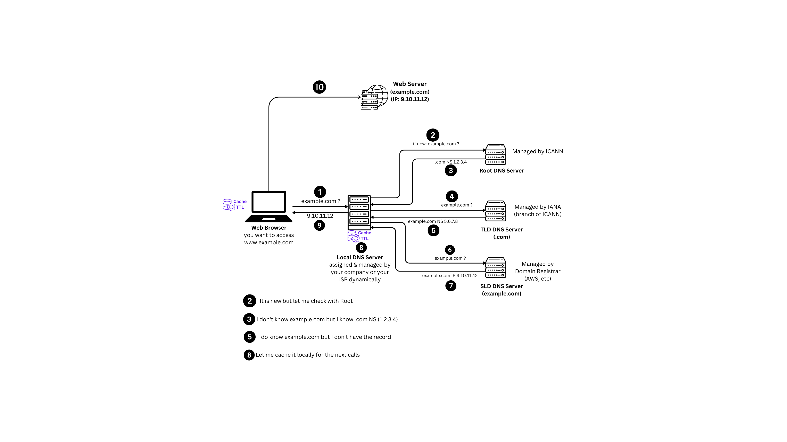

### **Key Features of AWS Route 53**
- Domain Registration (Buy a Domain)
  - You can buy and manage domain names (`example.com`) directly from AWS.
  - Supports common domains like `.com`, `.net`, `.org`, and country-specific domains.
  
- Route 53 helps route internet traffic by mapping domain names to:
  - AWS services (EC2, S3, CloudFront, etc.)
  - External servers
  - Load balancers (for handling traffic smoothly)
- Route 53 Records contains:
  - domain, subdomain
  - record type i.e A, AAAA
  - value i.e 112.34.44.54
  - routing policy: how route 53 responds to queries
  - TTL
- How Does Route 53 Use These Records?
  - **A (IPv4)/AAAA(IPv6)** records → Point domains to AWS EC2, ALB, CloudFront, or S3.
  - **CNAME** → Used for **CloudFront** or subdomain redirection. i.e `demo-route-53-1859546283.eu-central-1.elb.amazonaws.com` to `myapp.mydomain.com`
  - **NS** → Used when delegating domain management to Route 53.
  - **MX/TXT** → Configured for AWS SES (email services).
- CNAME can't be created for the top node (i.e example.com)
- Route 53 Alias:
  - `app.mydomain.com` --> `blbbla.amazonaws.com`
  - unlike CNAME, it works for root domain (Zone Apex) as well (`mydomain.com` --> `demo-route-53-1859546283.eu-central-1.elb.amazonaws.com`)
  - free
  - health check 
  - maps only to AWS resources
  - its record type is always A/AAAA
  - No TTL
  - It automatically recognizes changes in aws resource's IP address
  - Targets:
    - ELB
    - CloudFront
    - API Gateway
    - Elastic Beanstalk
    - S3 Websites
    - VPC endpoints
    - global accelerator accelerator 
    - Route 53 record in the same hosted zone
    - Alias target can't be an EC2 DNS name
  - 

- Route 53 Hosted Zones
  - We pay $0.50 per month per hosted zone
  - public hosted zones:
    - records for how to route the traffic on the internet i.e app1.myapp.com
  - private hosted zones:
    - records for how to route the traffic within one or more VPCs i.e app1.company.internal
   
   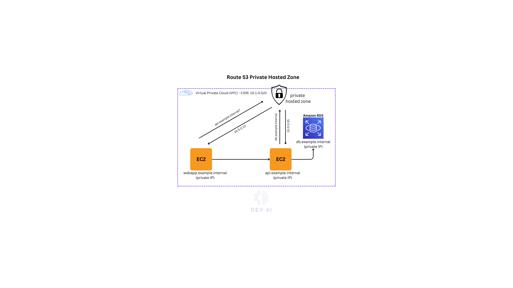

- Health Checks (Monitor Website Status)
  - **Route 53 can check if your website/server is up**.
  - If a server is **down**, it can **automatically redirect traffic** to another healthy server.
- Integration with AWS Services
  - Works seamlessly with **EC2, S3, CloudFront, and Elastic Load Balancer (ELB)**.
  - Can route traffic to **multi-region and multi-cloud architectures**.
- Route 53 TTL
  - Under the record we have TTL
  - high TTL `24 hours`
    - less traffic of route 53 (less costs)
    - possibly outdated records
  - low TTL `60 seconds`
    - more traffic on route 53 ($$)
    - easy to change records (updated records)
  - Except for Alias records (CNAME), TTL is mandatory for each DNS record
---

### Route 53 Demos
- For demos, see folder `not-public-demos`
  - Register a domain example.com. see `route-53-domain-register.gif`
  - A hosted zone will be created correspondingly. In it, we create DNS records. see `hosted-zone-record-demo.gif`
  - create three EC2 instances in three regions (i.e frankfurt, N. Virginia, Singapore) having a web server added in UserData section (see `route-53-user-data.sh`)
    - select ssh and http under new security group
  - create an ALB in one region (frankfurt), internet facing

[route-53-ec2-setup.gif](media/route-53-ec2-setup.gif)

[route-53-ec2-demo-ttl.gif](media/route-53-ec2-demo-ttl.gif)

[cname-alias-apex-demo.gif](media/cname-alias-apex-demo.gif)

### Routing Policies (Control How Traffic is Directed)
AWS Route 53 has several routing policies to **control how users reach your website**:

| **Routing Policy** | **How It Works**                                                                | **Use Case** |
|-------------------|---------------------------------------------------------------------------------|-------------|
| **Simple Routing** | Maps a domain to a single IP                                                    | Basic websites |
| **Weighted Routing** | Distributes traffic based on weights (e.g., 70% to one server, 30% to another)  | A/B testing, traffic distribution |
| **Latency-Based Routing** | Directs users to the closest, fastest AWS region (to lowest latency location)   | Global apps needing fast response time |
| **Failover Routing** | Automatically switches to a backup server if the primary one fails              | High availability, disaster recovery |
| **Geolocation Routing** | Sends users to servers based on their location (e.g., U.S. users → U.S. server) | Region-specific content, compliance |
| **Geoproximity Routing** | Similar to Geolocation but allows adjusting traffic bias                        | Fine-tuned location-based routing |
| **Multi-Value Answer Routing** | Returns multiple healthy IP addresses, similar to load balancing                | Distributes traffic across multiple instances |

---
- Weighted Routing policy demo:

[route-53-weighted-policy.gif](media/route-53-weighted-policy.gif)

- Latency Routing Policy Demo:

[route-53-latency-r-policy.gif](media/route-53-latency-r-policy.gif)

---

**Route 53 Health Checks**

Used to enable **automated DNS failover** — but **only for public resources** (except when using CloudWatch alarms). There are **three types**:

**1. Endpoint Health Checks**
- Route 53 uses ~15 global health checkers to monitor a **public endpoint** (e.g., ALB, which checks EC2).
- **Default settings:**
  - Interval: 30 seconds
  - Healthy/Unhealthy threshold: 3
  - Protocols: HTTP, HTTPS, TCP
  - Healthy if: status code is **2xx or 3xx**
  - Considered healthy if >18% of checkers report healthy
- Make sure your **firewalls/routers allow incoming checks** from [Route 53 health checker IPs](https://ip-ranges.amazonaws.com/ip-ranges.json) (`ROUTE53_HEALTHCHECKS`)
- **Important:** Health checkers are **outside the VPC**.

---

**2. Calculated Health Checks**
- Combines results of **multiple health checks** (up to 256).
- Use logical rules like **AND, OR, NOT**.
- Useful for creating complex failover logic.

---

**3. Health Checks Using CloudWatch Alarms**
- For **private resources** (inside a VPC).
- Since Route 53 checkers **can’t access private endpoints**, use a **CloudWatch alarm** as a proxy.
- Steps:
  - Create a CloudWatch **metric & alarm**
  - Create a Route 53 health check that monitors the **alarm state**

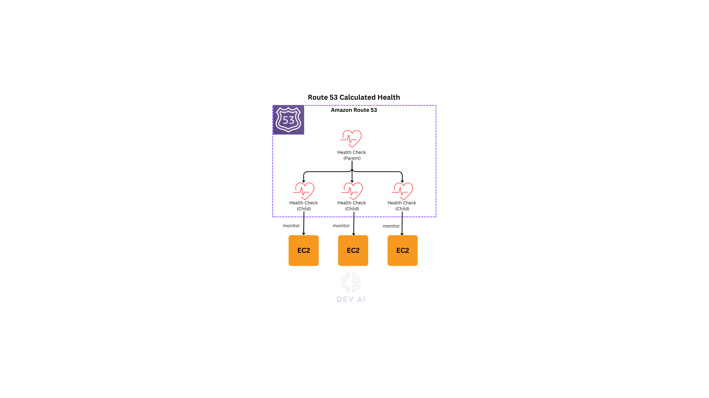

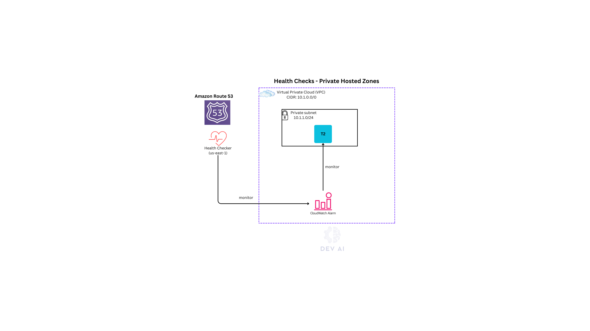

---
- Demos:
  - [create-health-check.gif](media/create-health-check.gif)
  - [calculated-health-check-demo.gif](media/calculated-health-check-demo.gif)
  - [health-check-unhealthy-result-dem.gif](media/health-check-unhealthy-result-dem.gif)

**Failover Routing Policy**

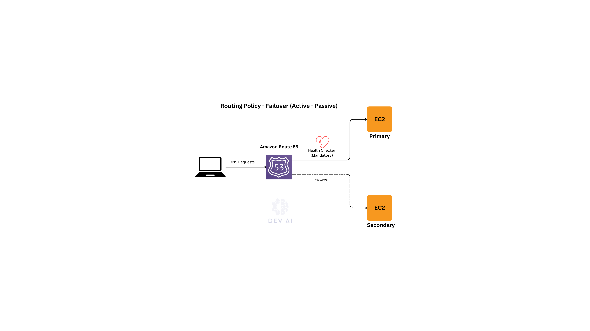
  - Demo:
  
[r53-routing-polic-failover-demo.gif](media/r53-routing-polic-failover-demo.gif)

**Geolocation Routing Policy:**
  - Routing is basd on user's location i.e eu user routed to eu region
  - Use case: website localization, restrictive content distribution, load balancing
  - should have a default record for a location that is not specified
  - Demo:

[r53-routing-polic-geolocation-demo.gif](media/r53-routing-polic-geolocation-demo.gif)

**Geoproximity Routing Policy:**
  - routing based on location `and` resources
  - using `bias` values we shift the traffic accordingly
    - to expand the size of geographic region from which Route53 route traffic to a resource, specify a bias value of int 1 - 99
    - to shrink the size set a value -1 to -99
  - resources can be:
    - AWS resources (specify using AWS region)
    - non-AWS resources (specify latitude & longitude)
  - use route 53 Traffic flow
  - example: 
    1. us-west-1 (Bias = 0) <--  & us-east-1 (Bias = 0) `vs` 
    2. us-west-1 (Bias = 0) & us-east-1 (Bias = 50)
    - in `2` more users will go through us-east-1 because of the weightage.

**IP-based Routing Policy:**
  - Based on users' IP
  - using CIDRs i.e users who have specific CIDR (specific ISP) routed to specific instance
  - use cases: optimize performance, reduce network costs

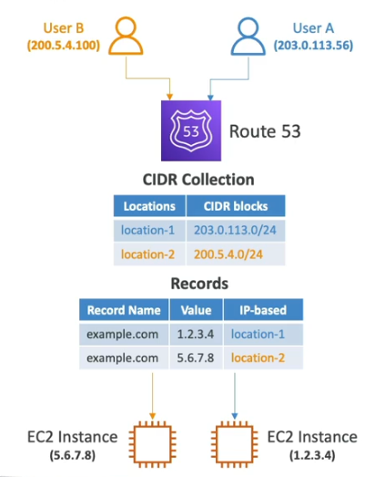

**Multi-value Routing Policy:**
  - When routing traffic to multiple resources
  - Upto max 8 `healthy records are returned for each MV query
  - It can be associated with Health check (Simple routing multiple value is different as it can not be associated with health check)
  - Route 53 returns multiple values/resources
  - Multi-value is not a substitute for having an ELB. It is indeed a client side load balancing
  - Demo:


**Domain Registrar vs DNS service:**
  - Domain Registrar != DNS Service
  - But most Registrars usually comes with some DNS features
  - Route 53 is a registrar which provides DNS services along side. 
  - We can use third party registrar like GoDaddy with AWS route 53.
  - Steps: 
    - we create a public hosted zone using our domain from GoDaddy 
    - in details find `Name Servers`
    - Go to `GoDaddy` and put those `Name Servers` into the GoDaddy 
- 
### **Why Use Route 53?**
- **Fast & Reliable** – AWS infrastructure ensures high uptime.  
- **Scalable** – Handles any amount of traffic.  
- **Cost-Effective** – Pay only for what you use.  
- **Easy to Use** – Simple console interface.  
- **Global DNS Management** – Perfect for businesses serving users worldwide.

##AWS S3 (Simple Storage Service)
Think of **AWS S3** like an **infinite online hard drive** where you can store and retrieve any kind of file (documents, images, videos, backups, etc.) anytime from anywhere in the world.

- Use cases:
  - Backup and storage
  - Disaster recovery (if a region goes down)
  - Archive:
  - Hybrid Cloud storage
  - Host application
  - host medias
  - Data lake & big data analytics
  - software delivery
  - static website

### Buckets & Objects (Folders & Files)
- Bucket → Like a folder that holds files (objects). Each S3 account can have multiple buckets.
  - must have a globally unique name (across all regions all accounts)
  - It is defined at the region level only
  - name:
    - no uppercase, no underscore
    - 3 - 63 characters log
    - not an IP
- Object → The actual file (data) stored in a bucket, along with metadata.
  - objects have a key - `prefix + object name`
  - the key is the full path i.e _s3://my-bucket/`my_file.txt`_
  - max object size is 5TB. if greater then use `multi-part upload`a
  - Metadata
    - text key/value paris
  - Tags
  - version ID
- It offers strong read-after-write consistency automatically without changes to performance or availabilities

- Demo:

[s3-creation-demo.gif](media/s3/s3-creation-demo.gif)
### Scalability & Durability
- Scalable → No storage limits. You can store **terabytes or even petabytes** of data.
- Durable → Data is stored **across multiple locations** (99.999999999% durability).

### Security & Access Control
- **Encryption** → Data is protected using encryption (both at rest & in transit).
- **Access Control** → You can set permissions using:
  - **IAM Policies** → Who can access your S3 data. User-based control.
  - **Bucket Policies** → Rules for the entire bucket. Resource based control. the most common one.
    - IAM principal access an s3 object if the user's IAM permissions ALLOW it OR the resource policy ALLOWS it AND there is no explicit DENY
    ```
    {
        "Version": "2012-10-17",
        "Statement": [
          {
            "Sid": "PublicReadGetObject",
            "Effect": "Allow",
            "Principal": "*", // the account or user to apply policy to
            "Action": ["s3:GetObject"],
            "Resource": ["arn:aws:s3:::my-bucket-name/*"]
          }
        ]
    }
    ```
    
  - **Access Control Lists (ACLs)** → Control specific users' access. Resource based control.

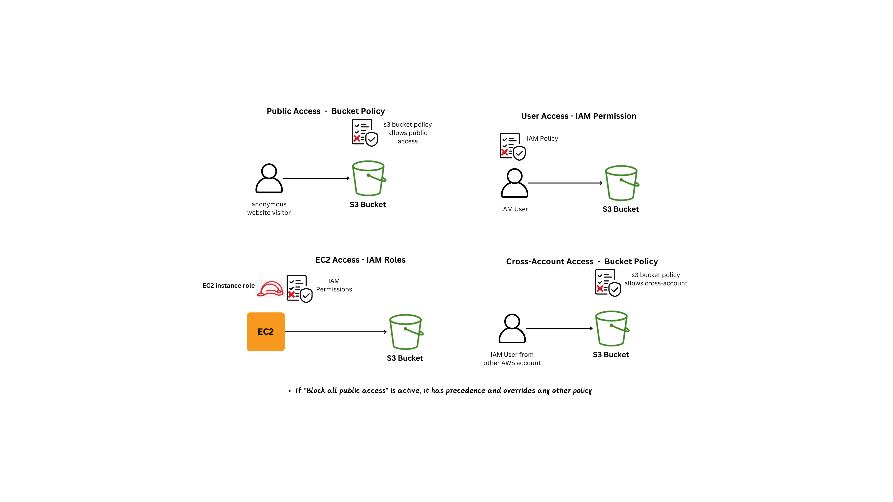
  - Demo:

[s3-grant-pub-access-demo.gif](media/s3/s3-grant-pub-access-demo.gif)

### Data Versioning & Backup
- **Versioning** → Keeps old versions of files. If you overwrite or delete a file, you can restore previous versions.
- Demo: activating versioning

[s3-versioning-demo.gif](media/s3/s3-versioning-demo.gif)
- Demo: restore previous version or delete one
  - [s3-restore-previous-version-demo.gif](media/s3/s3-restore-previous-version-demo.gif)
  - [s3-restore-deleted-obj-demo.gif](media/s3/s3-restore-deleted-obj-demo.gif)

- **Replication** → Copies data to another AWS region for disaster recovery.
  - CRR (cross region replication)
  - SRR (same region replication)
- Or use sync command to copy between S3 source and S3 destination
  - `aws s3 sync s3://source-bucket-name s3://destination-bucket-name`

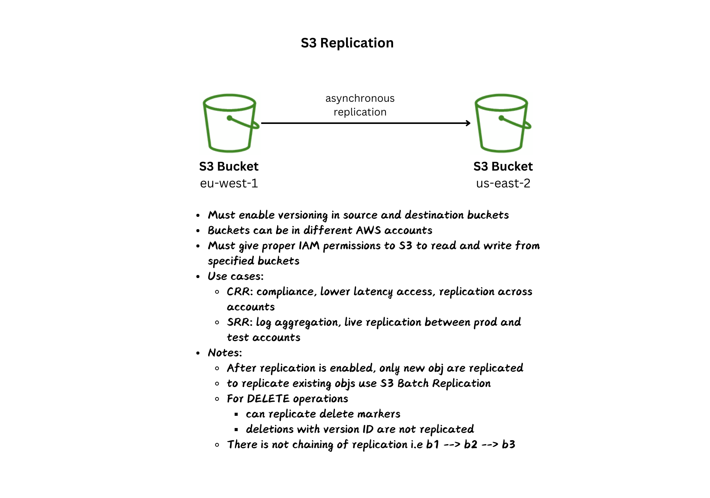
    - Demo:

[s3-replication-crr.gif](media/s3/s3-replication-crr.gif)


### Static Website Hosting
- You can host **a simple website** directly from S3 without a web server.
- html and images
- **NOTE**: in order for the setup to work, public access bucket policy should be activated (see `Security & Access Control)

[s3-static-website-demo.gif](media/s3/s3-static-website-demo.gif)

### Event Notifications & Integrations
- Triggers AWS services like **Lambda**, **SNS**, or **SQS** (only standard queue and not FIFO) when files are added or changed.

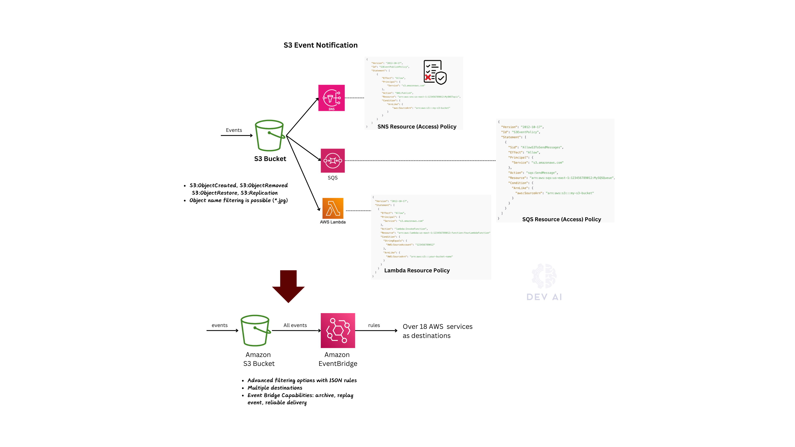
  - Demo

[s3-sqs-event-notif-demo.gif](media/s3/s3-sqs-event-notif-demo.gif)

### Storage [Classes](https://aws.amazon.com/s3/storage-classes/) (Cost Optimization)
- Durability: 99.9999999999 (11 9's), same for all storage classes
- Availability: 99.99% (means 53 minutes in a year not available)
- AWS offers different **storage classes** based on access frequency and cost:
  - **S3 Standard** → 
    - For frequent access, higher cost.
    - low latency & high throughput
    - use cases: Big data analytics, mobile and gaming apps, content distribution
    - 99.99% availability
  - **S3 Standard Infrequent Access (IA)** → For data you don’t use often, lower cost.
    - for data accessed less frequently but requires rapid access (in milliseconds latency)
    - 99.9% availability
    - use cases: DR, backups
  - **S3 Intelligent-Tiering** → Automatically moves files between Standard and IA to optimize cost.
  - **S3 One-Zone Infrequent Access (IA)** →
    - 11 9's durability in a single AZ
    - 99.5% availability
    - use cases: storing secondary backup copies of on-premise data
    - with expiration deletion option
    - The minimum storage duration is 30 days before you transition objects from S3 standard to S3 One Zone-IA
    - it costs 20% less than S3 Standard-IA
  - **S3 Glacier** → For long-term archiving, very cheap but slow retrieval.
    - Glacier Instant retrieval: milliseconds retrieval, min 90 days
    - Glacier flexible retrieval: expedited (1 to 5 minutes), standard (3 to 5 hours), bulk (5 to 12 hours). Min storage 90 days
    - Glacier deep archive: long term storage. standard (12 hours), bulk (48 hours). Min storage 180 days
      - 75% less expensive than S3 glacier
   - For archive objects move them to Glacier or Glacier Deep Archive
   - Move b/w classes automated using life cycle rules
     - we can set expiration actions (to delete files at a specific time later)
     - automate clean up of old/unfinished parts
     - rules can be applied to a certain prefix  or entire bucket or a specific tags
     - Storage class analysis done by s3 bucket. Analysis is available between 24 to 48 hours. It can be used for optimization of object moves b/w tiers

Waterfall model for transitioning between storage classes:
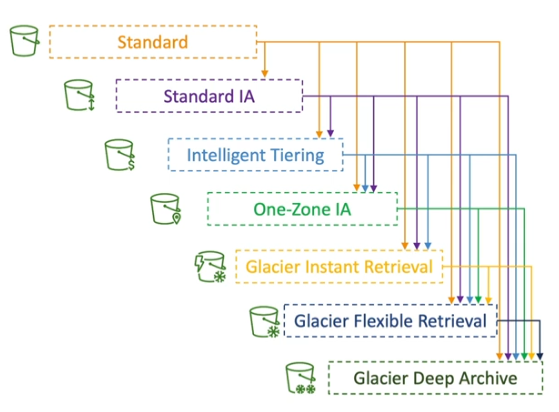

[s3-storage-classes-demo.gif](media/s3/s3-storage-classes-demo.gif)

### Requester Pays
- Storage cost + Network cost --> Paid by the owner
- Storage cost paid by the owner & Network cost paid by requester (downloader)
  - The requester must be authenticated in AWS

### S3 - Baseline Performance
- auto scale to high requests rates, latency 100-200ms
- 3500 PUT/COPY/POST/DELETE & 5500 GET/HEAD requests per second per prefix (path at the tail of object)
- Optimization
  - multi-part uploads recommended for file > 100 MB (from 500MB it is must). it helps parallelize uploads
  - S3 transfer acceleration:
    - increase transfer speed by transferring the file to and AWS edge location which will forward the data to the target region
    - edge location is compatible with multi-part upload

  - S3 Byte-Range Fetches
    - parallelize GETs by requesting specific byte ranges
    - better resilience in case of failure
    - speeds up the download (parts downloaded in parallel)
    - can be useful for partial data request such as file header for some info

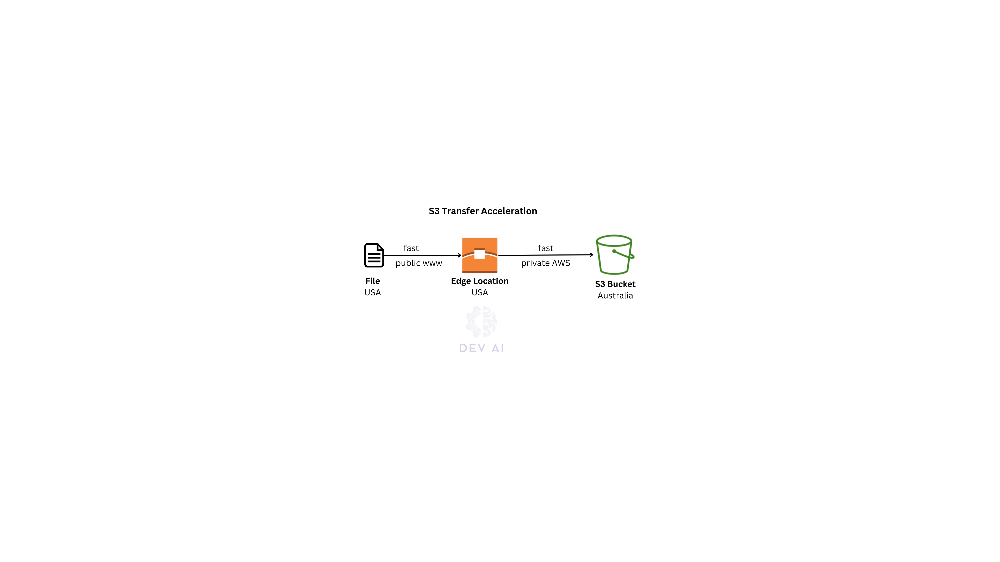

### S3 batch operations
- bulk operation on s3 objects in a single request
- batch modification batch transfer, batch encryption, invoke lambda function to perform custom action on each object
- use S3 inventory to get object list and use athena to query and filter objects

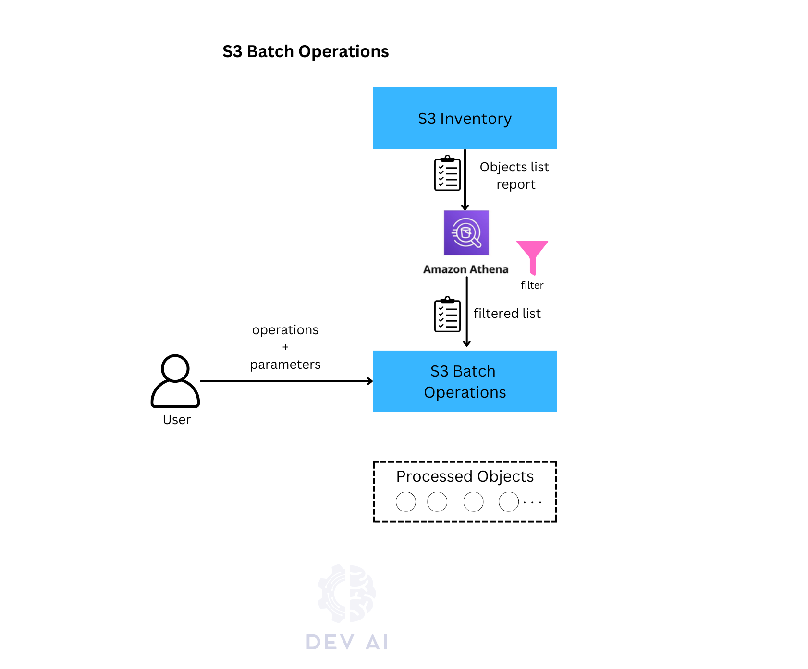

### S3 Storage Lens:
- analyze, optimize storage across all AWS orgs
- discover anomalies, identify cost efficiency, apply data protection best practices
- Metrics
  - summary metrics such as size of buckets
  - cost optimization metrics i.e incomplete parts etc
  - data protection metrics: versioning etc to follow data protection practices
  - access management metrics: ownership etc
  - event metrics
  - performance metrics
  - activity metrics
  - http status code metrics i.e 200, 404 etc
- free metrics vs paid metrics

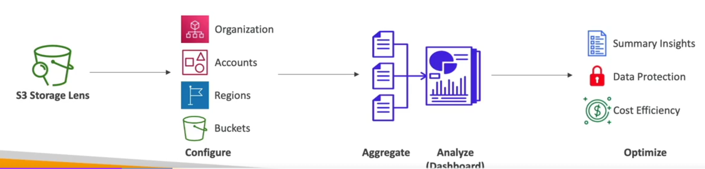
### S3 Object Encryption:
- Amazon S3 object encryption is a security feature that protects data stored in Amazon Simple Storage Service (S3) by encrypting objects at rest. It ensures data confidentiality and compliance with security standards. S3 supports multiple encryption methods:
- **Server-Side Encryption (SSE)**
  - **SSE-S3**: AWS manages encryption keys automatically. Active by default
    - AES-256, must set header to `"x-amz-server-side-encryption":"AES256`
  - **SSE-KMS**: Uses AWS Key Management Service (KMS) for key management and access control.
    - advantage: user control + audit key usage in CloudTrail
    - must set header to `"x-amz-servier-side-encryption":"aws:kms"`
    - to access one should have access to object as well to the KMS key used to encrypt
    - another variant is DSSE-KMS
    - limitation:
      - when you upload it calls GenerateDataKey KMS API & when downloading it calls decrypt
      - KMS quota limit per second (5500, 10000, 30000 req/s based on region)
  - **SSE-C**: Customers provide and manage their own encryption keys.
    - keys managed outside the AWS
    - done from CLI only and not on the console
    - HTTPS must be used and must have key in the header of client's request
- **Client-Side Encryption**
  - Encrypted before sending it to S3
  - two options for key used for encryption
    - customer master key (CMK) stored in aws key management
    - master key stored within the client application
  - Data is encrypted before being uploaded, with key management handled by the client.
- Encryption helps protect sensitive data, meet regulatory requirements, and enhance security in cloud storage.

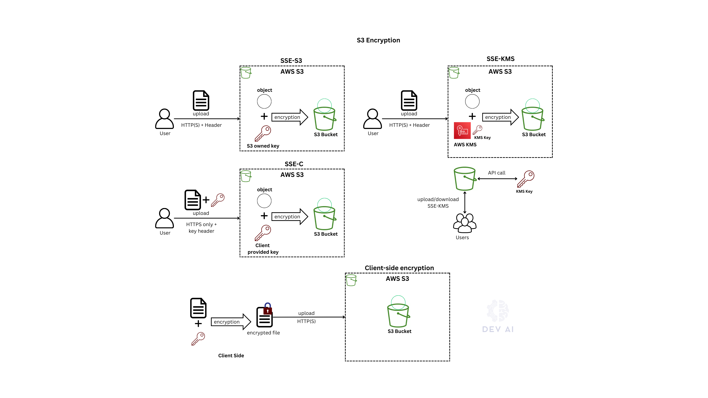

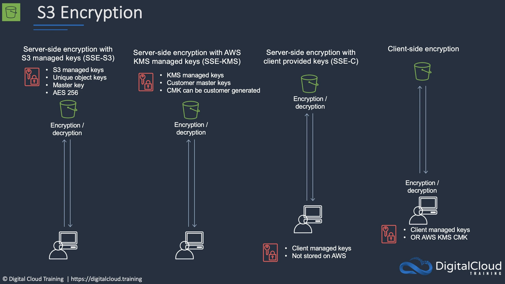
  - Force encryption in transit: `aws:SecureTransport`

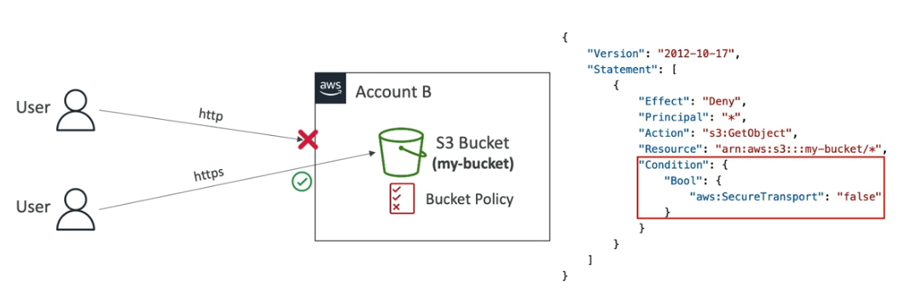

  - Demos:

[s3-encryption-demo.gif](media/s3/s3-encryption-demo.gif)
  
  - refuse any call to S3 without encryption headers using bucket policy
    - bucket policies are evaluated before "Default Encryption"
```
{
    "Version": "2012-10-17",
    "Statement": [
        {
            "Sid": "DenyUnencryptedRequests",
            "Effect": "Deny",
            "Principal": "*",
            "Action": "s3:PutObject",
            "Resource": "arn:aws:s3:::your-bucket-name/*",
            "Condition": {
                "StringNotEquals": {
                    "s3:x-amz-server-side-encryption": "AES256"
                }
            }
        },
        {
            "Sid": "DenyUnencryptedRequestsKMS",
            "Effect": "Deny",
            "Principal": "*",
            "Action": "s3:PutObject",
            "Resource": "arn:aws:s3:::your-bucket-name/*",
            "Condition": {
                "StringNotEquals": {
                    "s3:x-amz-server-side-encryption": "aws:kms"
                }
            }
        }
    ]
}

```

### S3 CORS (Cross Origin Resource Sharing (CORS):
  - origin: http(s)://www.example.com (implied port 443 for https or 80 to http)
  - browser based mechanism to allow requests to other origins while visiting the main origin
  - same origin requests: http://example.com/path1 & http://example.com/path2
  - cross origin request: http://www.example.com & http://other.example.com.
    - be default it is not allowed to be fulfilled unless the other origin allows it using the CORS header (Access-Control-Allow-Origin)

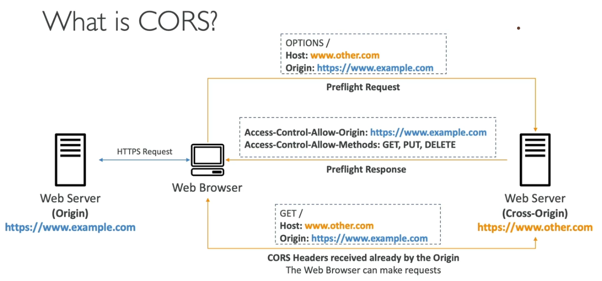
  
  - client makes a cross-origin request on S3
  - allowed for specific origin or * (for all)

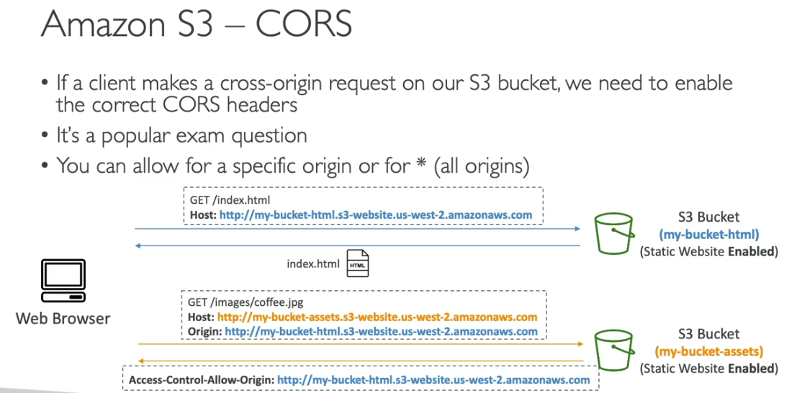

  - Demos:

[s3-cors-demo-1.gif](media/s3/s3-cors-demo-1.gif)

[s3-cors-demo-2.gif](media/s3/s3-cors-demo-2.gif)

### MFA Delete:
- versioning must be active 
- permanently delete an object
- suspend versioning. Versioning can't be disabled once enabled, it can only be suspended
- MFA can be activated only through CLI by using root credentials
- how?
  - to use MFA, root must set up MFA device already
  - create access key for the root (used for creating aws CLI profile)
  - use root CLI profile and activate the MFA
  
  ```
  # generate root access keys
  aws configure --profile root-mfa-bucket-delete-demo
  aws s3 ls --profile root-mfa-bucket-delete-demo
    
  # enable mfa delete
  aws s3api put-bucket-versioning --bucket mfa-demo-bucket-2025 --versioning-configuration Status=Enabled,MFADelete=Enabled --mfa "arn:aws:iam::727646513157:mfa/Authapp 280449" --profile root-mfa-bucket-delete-demo
    
  # disable mfa delete
  aws s3api put-bucket-versioning --bucket mfa-demo-bucket-2025 --versioning-configuration Status=Enabled,MFADelete=Disabled --mfa "arn:aws:iam::727646513157:mfa/Authapp 279226" --profile root-mfa-bucket-delete-demo
    
  # delete the root credentials in the IAM console!!!
  ```
  - Demos:

[s3-mfa-activation-cli.gif](media/s3/s3-mfa-activation-cli.gif)

### S3 Access Logs, Object Retention, S3 pre-signed urls
- S3 Access Logs:
  - log all accesses to the S3 by any user
  - logs put into logging bucket (both must be in the same region)
  - never make the app bucket and the log bucket --> it creates a loop (grows exponentially)
  - Demo:
    - [s3-logging-demo.gif](media/s3/s3-logging-demo.gif)
    - [s3-logging-demo-2.gif](media/s3/s3-logging-demo-2.gif)

- S3 Object retention
  - one can set retention period on the object version only (implicitly through bucket default setting or explicitly through `retain until date` parameter)

- S3 pre-signed URLs
  - generate using S3 console, aws cli, sdk
  - has expiration
    - s3 console (up 12 hours)
    - aws cli (default: 3600sec max 168 hours)
  - users given pre-signed URL, will inherit the permission of user who generated it.
  - use case: give access to a private bucket's object temporarily, generate dynamic url, allow a user to upload

[s3-pre-signed-url-demo.gif](media/s3/s3-pre-signed-url-demo.gif)

### S3 Lock
- S3 Glacier Vault Lock:
  - Adopt a WORM (write once, read many) model
  - need a Vault Lock Policy
  - no one can delete, even the admin
  - at bucket level
- S3 Object Lock:
  - blocks an object deletion for a specific amount of time
  - for WORM for a retention period of time
  - versioning must be enabled
  - lock at object level and not at bucket level 
  - Retention mode - Compliance: no one can delete including the admin
  - Retention Mode - Governance: most users can't delete except a few admin user with permission (IAM). retention period can be changed
- Legal Hold: protect the object indefinitely, independent of retention period
  - can be place using IAM permission `s3:PutObjectLegalHold`
  - for legal investigation period

### S3 - Access Point
- to delegate access security management from S3 bucket level to access points maintained outside.
- subsequently we will have simple bucket policy
- access point has:
  - own DNS name (internet origin or VPC origin)
  - access point policy (similar to bucket policy) - manage security at scale

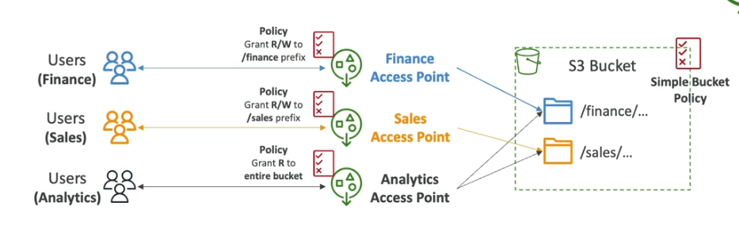

- S3 access point VPC origin
  - there would be 3 policies as shown
  - VPC Endpoint must allow access to S3 access point as well as the corresponding S3 bucket.

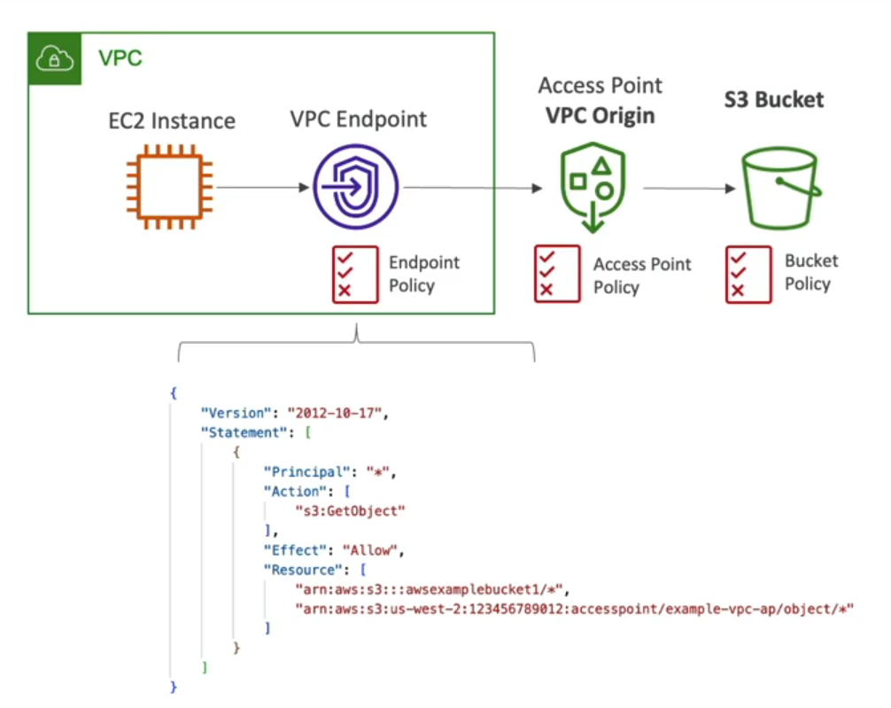

- S3 lambda Objects
  - AWS functions to change the object before it is retrieved by the caller
  - this avoids duplicating objects. we keep on bucket and adjust objects on-fly
  - we create s3 access point, s3 lambda object access point as shown

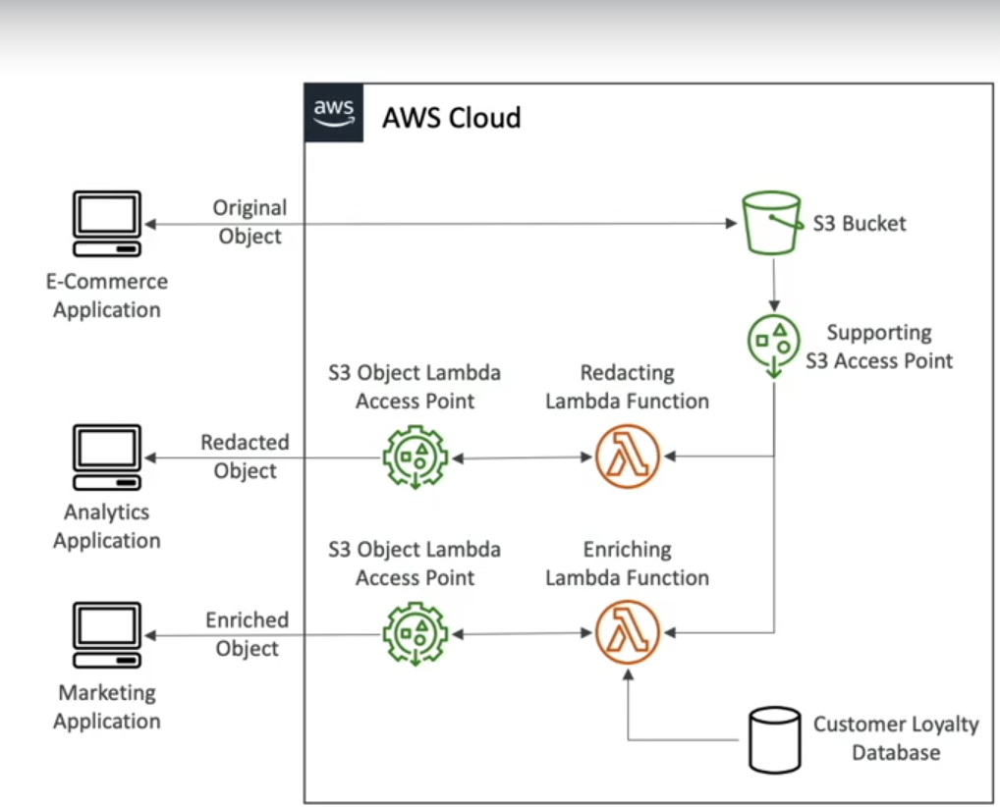
### **Why Use S3?**
- No hardware management  
- Secure & reliable storage  
- Cost-efficient with flexible pricing  
- Works well with other AWS services

## AWS CloudFront
- A fast CDN (Content Delivery Network) that securely delivers data, videos, apps and APIs to customers globally with low latency, high transfer speeds
  - AWS Point of Presence (POP or Edge Location):
    - 400+ PS (400+ Edge locations & 10+ Regional Cache) in 90+ cities across 40+ countries
  - improves read performance by caching content at the edge (all around the year) to deliver popular contents quickly
  - aws has [216 point](https://aws.amazon.com/cloudfront/features/?nc=sn&loc=2&whats-new-cloudfront.sort-by=item.additionalFields.postDateTime&whats-new-cloudfront.sort-order=desc) of presence ( edge locations)
  - CloudFront also has regional edge caches that bring more of your content closer to your viewers even when the content is not popular enough to stay at POP
- DDoS protection (worldwide shutdown) by Shield and AWS app firewall
- Integration with Cognito User Pool:
  - Can't directly integration with cognito
  - would need an additional Lambda@Edge function to accomplish authentication via Cognito User Pools
### **CloudFront Origins:**
1. S3 bucket
  - to allow only CF to access the bucket:
    - configure a origin access identity (OAI) or Origin Access Control (OAC)
    - setup the permission in AWS S3 bucket policy so that only the OAI can read the objects
  - can use CF as an ingress (to upload to S3)
  - from the demo, pay attention how fast is the second access of the object because of cloudfront caching
  - the file size should be under 1GB. above that use `s3 transfer accelerator` instead

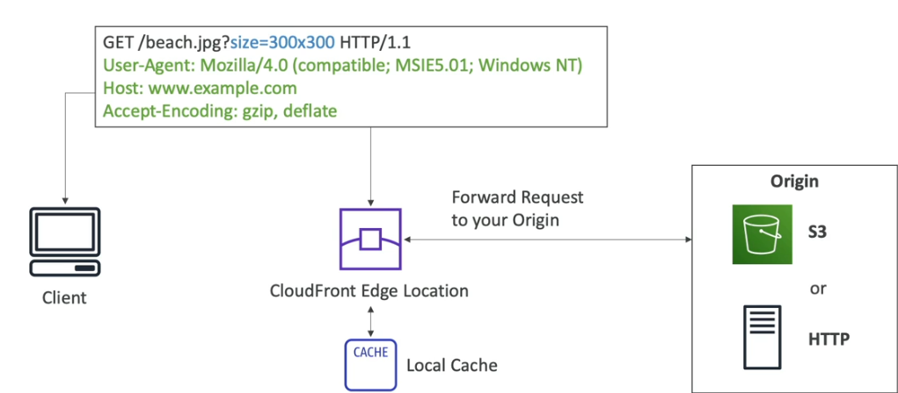

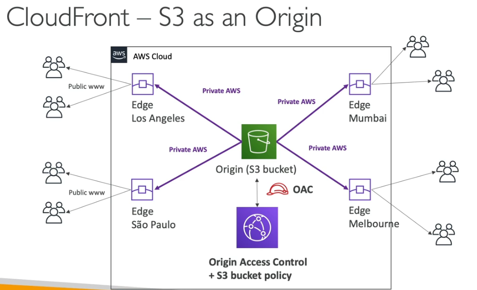

  - Demo with S3 bucket as origin
    - [cloudfront-setup-demo-1.gif](media/cloudfront/cloudfront-setup-demo-1.gif)
    - [cloudfront-setup-demo-2.gif](media/cloudfront/cloudfront-setup-demo-2.gif)

2. Custom Origin (HTTP)
    - ALB
    - EC2 instance
    - S3 website (static website)
    - any http backend

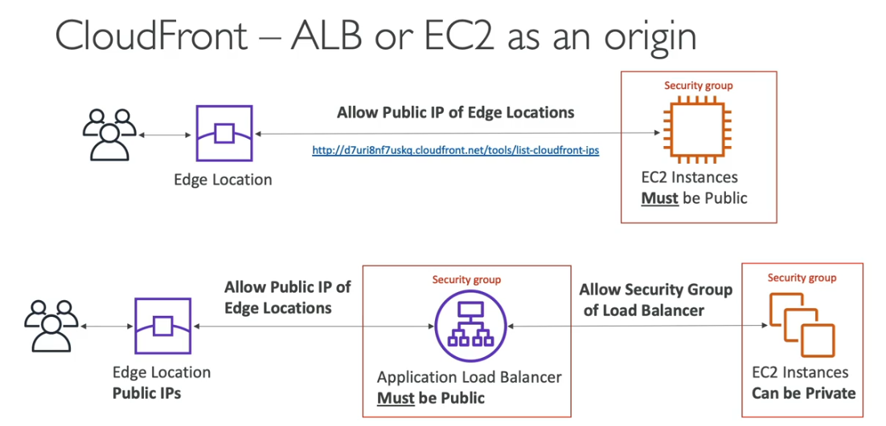
  - Public IPs of [Edge locations](http://d7uri8nf7uskq.cloudfront.net/tools/list-cloudfront-ips)

- A single CF can serve different types of requests from `multiple origins` i.e serve static content from S3 and dynamic from LB
- Create origins in CF first. Then use these origins to create **origin group**. Set primary and secondary origin for `ha` and `failover`


- **Field-level encryption** allows users to securely upload sensitive information.
  - the sensitive info encrypted at the edge
  - to setup, specify the set of fields in POST requests that should be encrypted and the public key to encrypt
  - can encrypt upto 10 data fields in a request

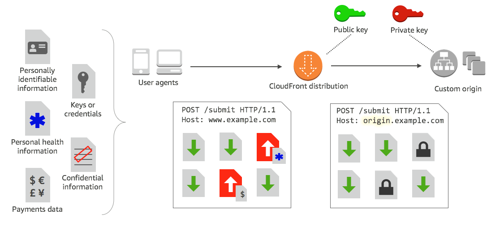
### CF vs S3 Cross Region Replication:
- CloudFront
  - global edge n/w
  - is a CDN
  - files cached for a TTL 
  - great for static content that must be available everywhere
- S3 CRR
  - must be setup explicitly for each region
  - read only
  - great for dynamic content that needs to be available at low latency in few regions

### CF Geo restriction:
- can restrict who can access your distribution
  - Allowlist: countries allowed
  - Blocklist: countries not allowed

[cloudfront-geo-restrictions.gif](media/cloudfront/cloudfront-geo-restrictions.gif)

### CF pricing:
  - based on geographical location the price of data out per edge differs
  - to do cost reduction, reduce the number of edge locations
  - 3 price classes
    - Price class all
    - price class 200
    - price class 100: USA, Canada, Europe, & Israel

### CF cache invalidation
  - if TTL not expired and backend changes, it still show old version
  - invalidation of cache bypasses the TTL
  - invalidate all (*) or part (/images/*)

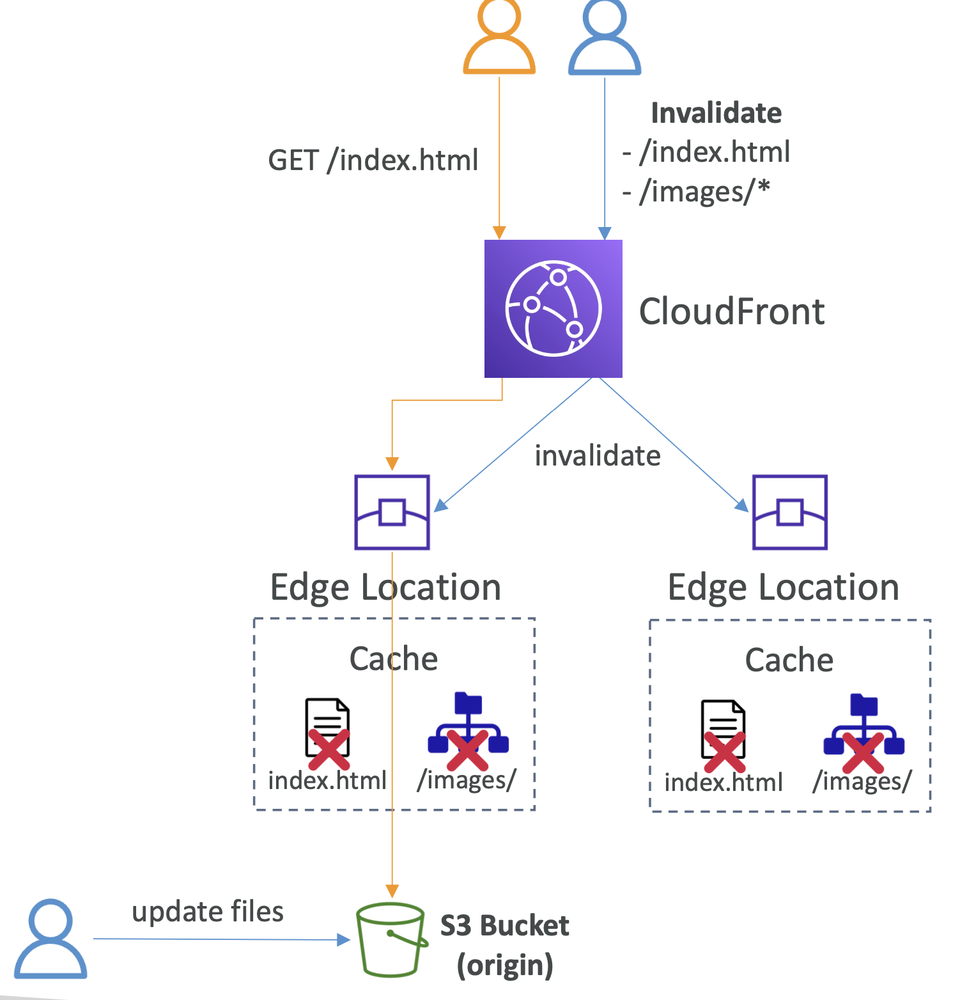

## AWS global accelerator
- It is networking service that sends user's traffic through aws global network infrastructure


- a lot of latency for global users due to many hops
- Unicast IP vs Anycast IP (all server hold the same IP). A client will be sent to the closest one
- AWS global accelerator
  - leverages AWS internal n/w to route to your application
  - 2 Anycast IPs are created for your application. They are global. They will send the traffic to the closest edge location 
  - work with elastic IPs, EC2, ALB, NLB, public or private

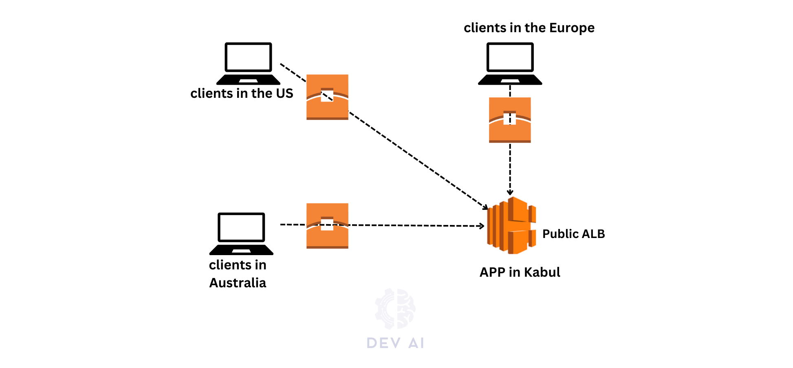

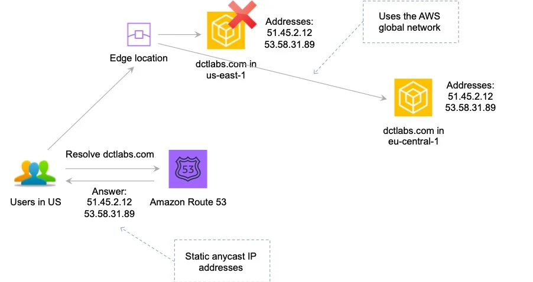
- consistent performance:
  - intelligent routing to lowest latency and fast regional failover
  - no issue with client cache
  - internal aws n/w
- health check:
  - GA performs a health check of your application
- security:
  - only two IPs needed to be whitelisted
  - DDoS protection

- GA vs CloudFront:
  - They both make use of AWS global n/w and edge locations around the world
  - both integrates with AWS shield for DDoS protection
  - CloudFront:
    - improve performance for both cacheable content
    - dynamic content (such as API acceleration & dynamic site delivery)
    - content served at edge
  - GA 
    - improve performance for a wide range of apps over TCP and UDP
    - no cache
      - proxying packets at the edge to applications running in one or more AWS regions
      - real-time API such as shipping tracking systems which shouldn't have caching and be real-time
    - It uses endpoint weights to determine proportion of traffic that is directed to the endpoint
    - Blue-green deployment
    - good fit for non-HTTP use cases, such as gaming (UDP), IoT (MQTT), or Voice over IP
    - good for HTTP use cases that requires static IP addresses
- pricing:
  - fix price and 
  - data transfer fees

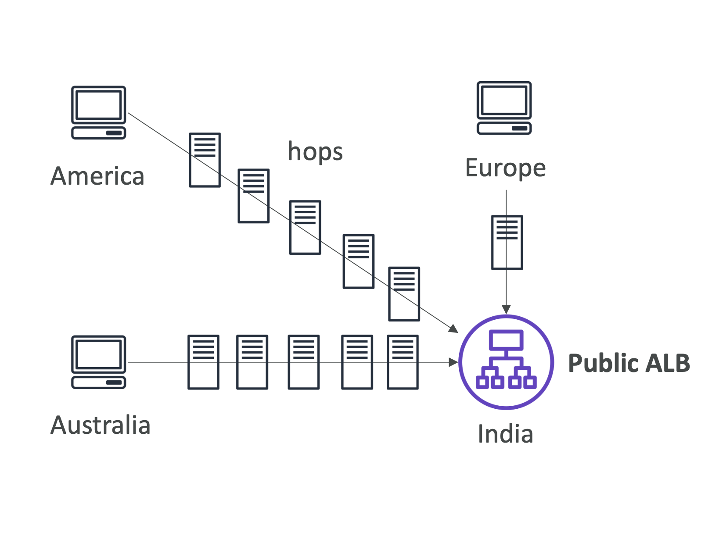

  - Demos: part 1 (creation of instances) part 2 (creation of GA) part 3 (interacting)
    - [global-accelerator-demo-p1.gif](media/cloudfront/global-accelerator-demo-p1.gif)
    - [global-accelerator-demo-p2.gif](media/global-accelerator/global-accelerator-demo-p2.gif)
    - [global-accelerator-demo-p3.gif](media/global-accelerator/global-accelerator-demo-p3.gif)
    - [global-accelerator-demo-p4.gif](media/global-accelerator/global-accelerator-demo-p4.gif)

## AWS advanced storage
### AWS snow family

AWS **Snowball**, **Snowcone**, and **Snowmobile** are all part of AWS's **Snow Family**, designed for edge computing and transferring large amounts of data into or out of AWS, especially when network bandwidth is limited or unreliable. Here's a quick breakdown of how they differ:

- data transfer challenges
  - i.e 10 TB with 100 Mbps speed, takes 12 days to transfer
  - loss connection
  - high network costs
- solution to this is snowball solution

---

### 🔹 **AWS Snowcone**
- **Smallest** and most portable of the three.
- **Size:** About the size of a tissue box (4.5 lbs).
- **Storage:** 8 TB of usable storage (HDD or SSD).
- **Use Cases:**
  - Small edge locations
  - IoT data collection
  - Remote or rugged environments
- **Power:** Can run on AC power or battery.
- **Network:** USB-C and Ethernet
- See [AWS DataSync](#aws-datasync) for special use of snowcone
**Best for:** Lightweight edge computing and data transfer from tight or mobile locations.

---

### 🔹 **AWS Snowball**
- AWS snowball is highly-secured, portable devices to collect and process data at edge & migrate data into and out of AWS
- **Mid-sized** option — comes in two types:
  1. **Snowball Edge Storage Optimized**
    - 40 vCPU, 80 TB usable storage (HDD)
    - Good for large-scale data migrations.
  2. **Snowball Edge Compute Optimized**
    - 42 TB usable storage + 52 vCPUs & GPU option
    - Useful for local compute + transfer (e.g. video analysis, ML inference)

- **Use Cases:**
  - Data transfer at scale
  - Edge computing with AWS services
  - Disaster recovery

**Best for:** Larger on-site data processing and scalable data transfer.

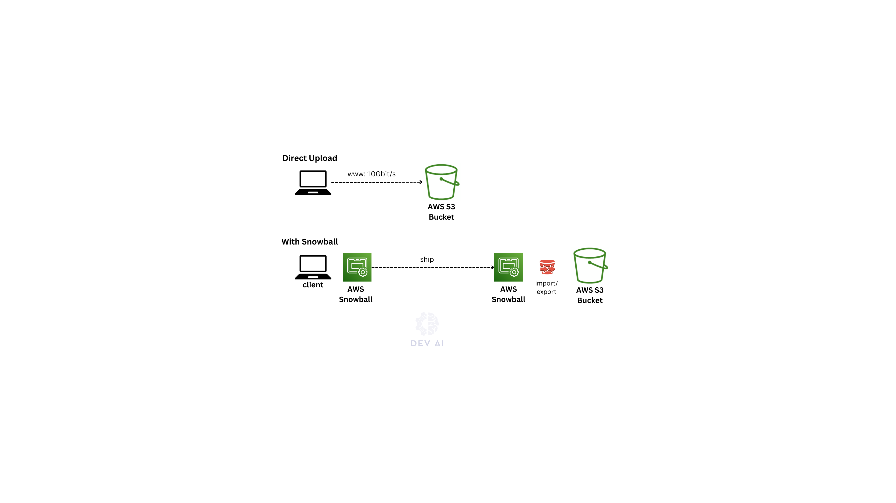

- Both can be rack mounted and clustered together to build larger installation (`storage clustering`). Other snow family doesn't support storage clustering.
- Edge computing/storage use case
  - process data while being generated on the edge location i.e underground without internet, ships, truck etc
  - limited access to internet or power
  - with snowball edge we can compute, run EC2 instances or Lambda at the edge
  - use case:
    - preprocessing data, ML, transcode media
- Snowball into Glacier:
  - we can't import directly to S3 glacier storage, instead:

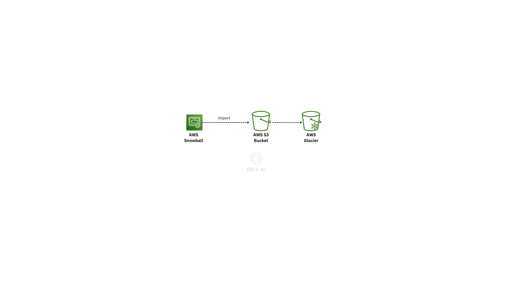
- Snowball Demos:

[aws-snowball-demo.gif](media/advanced-storage/aws-snowball-demo.gif)

### 🔹 **AWS Snowmobile**
- **Massive scale** data transfer — literally a **shipping container on a truck**.
- **Size:** 45-foot ruggedized container.
- **Storage:** Up to **100 PB**.
- **Use Cases:**
  - Huge data center migrations
  - Genomics, video libraries, or large-scale backups

**Best for:** Petabyte-scale data transfer (think exabytes over time), where network is infeasible.

---

### TL;DR – Quick Comparison

| Feature               | Snowcone         | Snowball Edge        | Snowmobile        |
|-----------------------|------------------|-----------------------|-------------------|
| **Storage Capacity**  | 8 TB             | 42–80 TB              | Up to 100 PB      |
| **Compute Power**     | Light            | Medium–High (GPU opt) | N/A               |
| **Portability**       | Hand-carry       | Two-person carry      | Semi-truck        |
| **Use Case Size**     | Small (Edge/IoT) | Medium–Large (Edge + Transfer) | Massive (Data Center) |

---
### AWS FSx
- launch 3rd party high-performance files system on AWS
- fully managed service

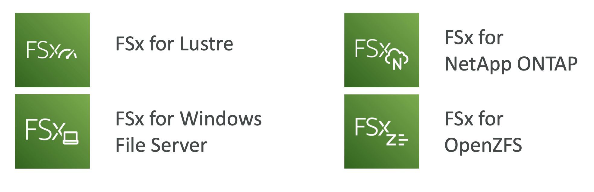

- FSx for Windows File Server
  - supports SMB protocol and NTFS
  - can be mounted on linux EC2 instances
  - Microsoft Distributed File System (DFS) support
  - scale up 10s GB/s
  - storage options: SSD(latency sensitive apps), HDD (cheap)
- FSx for Lustre
  - parallel distributed file system for large scale computing
  - word Lustre derived from linux and cluster
  - used for ML, HPC (high performance computing)
  - use cases: video processing, financial modeling, electronic design automation
  - scale up 100s GB/s, millions of IOPS, sub-ms latencies
  - Storage options
    - SSD: low latency
    - HDD: large and sequential file operations
  - seamless integration with S3
    - can read S3 as a file system (through FSx)
    - can write the output of computation back to S3 (through FSx)

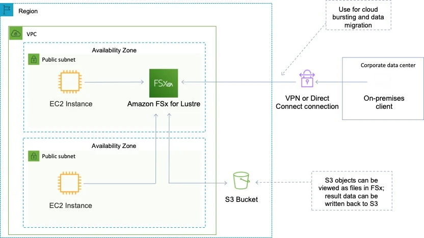
- FSx File System Deployment Options
  - Scratch File System
    - temporary storage
    - data is not replicated
    - high burst (6x faster, 200MBps per TiB)
    - usage: short term processing, optimize costs
  - Persistent File System
    - long term storage
    - data replicated within same AZ
    - replace files within minutes
    - usage: long-term processing, sensitive data

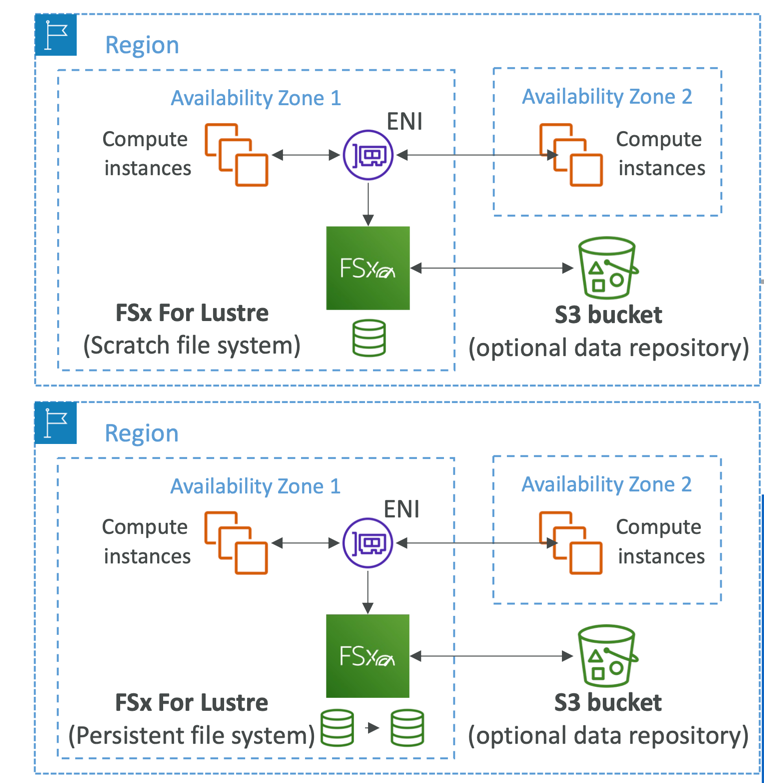

- FSx for NetApp ONTAP
  - move workloads running on ONTAP or NAS to AWS
  - storage shrinks or grows automatically
  - has features like snapshots, replication, low cost, compression 
  - point-in-time instantaneous cloning for testing new workloads

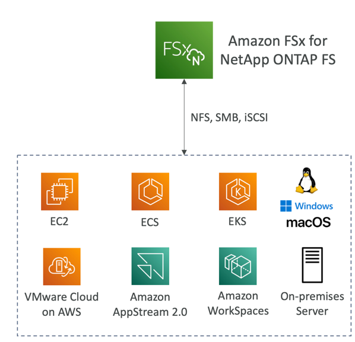
- FSx for for OpenZFS
  - move workload running already on ZFS to AWS
  - scale up to 1 million IOPS with < 0.5ms latency
  - supports snapshots, low-cost, compression
  - support for point-in-time instantaneous closing

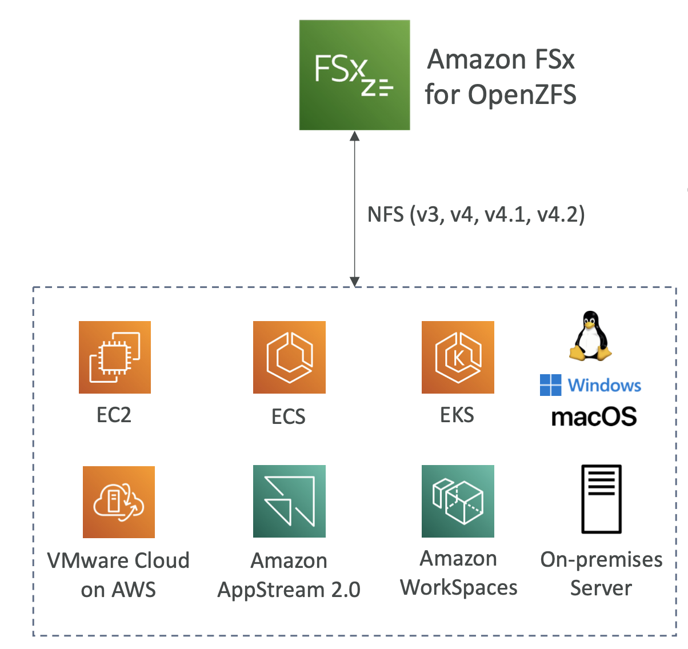
- Demos

[aws-fsx-demo.gif](media/advanced-storage/aws-fsx-demo.gif)

### AWS Storage Gateway
- S3 is a proprietary storage technology (unlike EFS / NFS), so how to expose the S3 data on-premises?
  - AWS Storage Gateway!
- AWS storage cloud native options

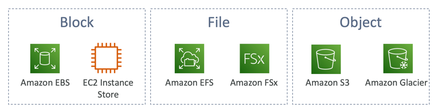
- AWS Storage Gateway is a bridge between on-premise data and cloud data
- usages:
  - DR of on-premise data
  - backup and restore of on-premise data for cloud migration
  - tiered storage (extend storage from on-premise to the cloud)
  - or have aws as main storage and use storage gateway for on-premise cache for low latency file access
- AWS storage gateway provides 3 types of storage interfaces for on-premise apps:
  - File Gateway
    - S3 File GW
    - FSx File GW
  - Volume GW
  - Tape GW
- AWS File GW
  - most recently used data is cached in the GW
  - bucket access using IAM roles for each file GW
  - SMB protocol has integration with active directory (AD) for use auth

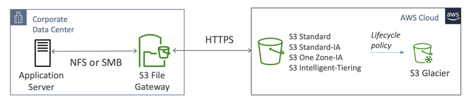

- FSx File GW
  - deprecated
- Volume GW
  - block storage using iSCSI protocol backed by S3
  - backed by EBS snapshots which can help restore on-premise volumes
  - cached volumes at GW
  - stored volumes: dataset is on-premise, while scheduled backups to S3
  - goal of volume GW is to back up your on-premise servers volumes

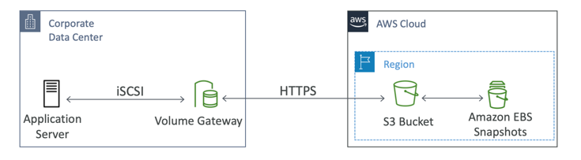

- Tape GW
  - Allows replacing physical tapes on-premise with virtual tapes in AWS without changing existing backup workflows
  - Tape gateway encrypt data between the gateway and the AWS for secure data transfer and compresses data while transitioning tapes between S3 and S3 glacier or S3 glacier deep archive

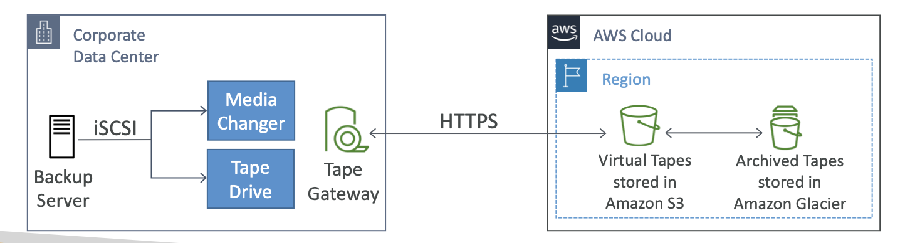
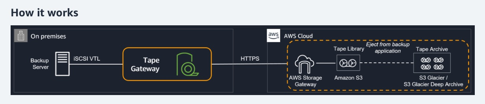

- Storage Gateway - Hardware Appliance
  - in all the above scenarios, one has to install the GW on-premise
  - if virtual servers are not available on-premise, or from AWS `Storage Gateway Hardware Appliance`
- Summary

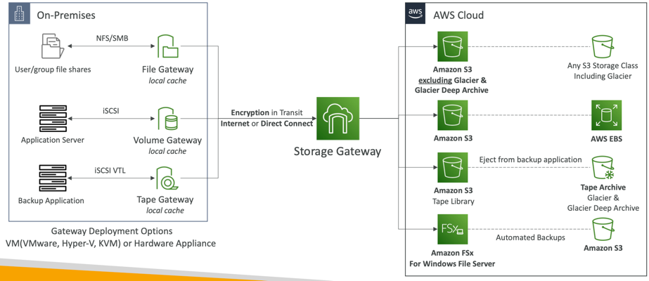

### Demos
[aws-storage-gw-demo.gif](media/advanced-storage/aws-storage-gw-demo.gif)

### AWS Transfer Family
- service for file transfers into and out of Amazon S3 or Amazon EFS using FTP protocol
- supported protocols
  - AWS Transfer for FTP
  - AWS Transfer for FTPS (over SSL - encrypted)
  - AWS Transfer for SFTP (secure file transfer)
- managed infras, scalable, reliable, HA (multi-AZ)
- pay per provisioned endpoint per hour + data transfers in GB
- store and manage use credentials within the service
- integration with auth systems like Microsoft AD, LDAP, Okta, AWS Cognito, custom
- usage: share files, public datasets, CRM, ERP

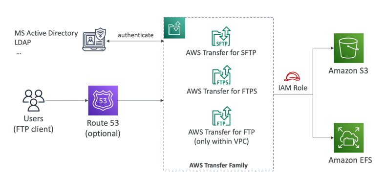

### AWS DataSync
- Move large amount of data to and from
  - On-premises / other cloud to AWS (NFS, SMB, HDFS, S3 API...) – it needs agent 
  - AWS to AWS (different storage services) – it doesn't need agent
- Can synchronize to:
  - Amazon S3 (any storage classes – including Glacier)
  - Amazon EFS
  - Amazon FSx (Windows, Lustre, NetApp, OpenZFS...)
- Replication tasks can be scheduled hourly, daily, weekly. It is not continuous
- File permissions and metadata are preserved (NFS POSIX, SMB...)
- One agent task can use 10 Gbps, can setup a bandwidth limit
- Agent should be installed on the on-premise. If we don't have n/w capacity --> `AWS snowcone`

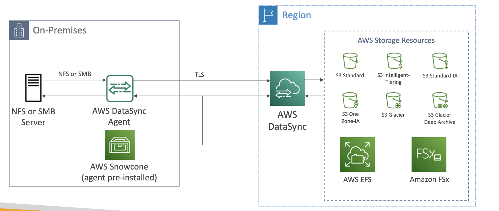
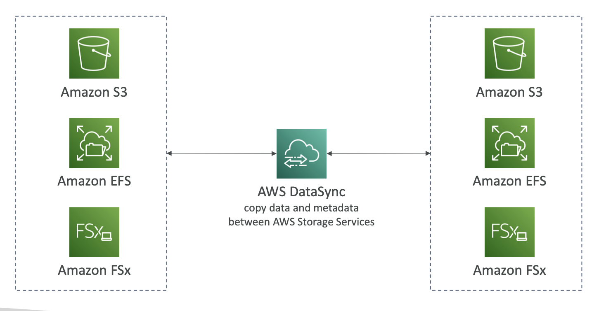

### Storage comparison
- S3: Object Storage
- S3 Glacier:Object Archival
- EBS volumes: attached Network storage for one EC2 instance at a time
- Instance Storage: super high performance, Physical storage for your EC2 instance (high IOPS)
- EFS: Network File System for Linux instances, POSIX filesystem
- FSx for Windows: Network File System for Windows servers
- FSx for Lustre: High Performance Computing Linux file system
- FSx for NetApp ONTAP: High OS Compatibility
- FSx for OpenZFS: Managed ZFS file system
- Storage Gateway: S3 & FSx File Gateway,Volume Gateway (cache & stored),Tape Gateway 
- Transfer Family: FTP, FTPS, SFTP interface on top of Amazon S3 or Amazon EFS
- DataSync:Schedule datasync from on-premises to AWS,or AWS to AWS
- Snowcone / Snowball / Snowmobile: to move large amount of data to the cloud, physically 
- Database: for specific workloads, usually with indexing and querying

## AWS Integration and Messaging - decoupling applications: SQS, SNS, Kinesis, Active MQ
- communication patterns:

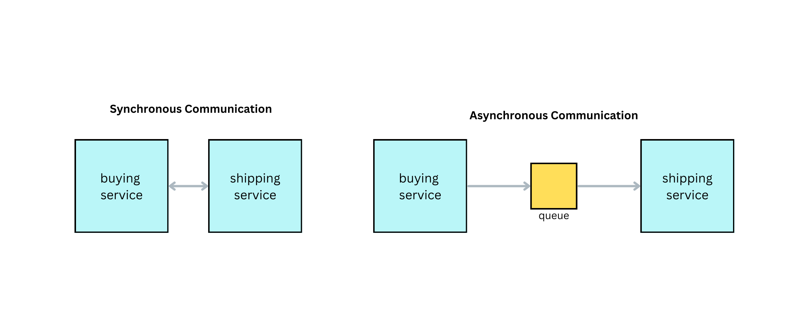
- to avoid overwhelming the other service, decoupling can be done:
  - SQS: queue model
  - SNS: pub/sub model 
  - Kinesis: real-time streaming model i.e big data
- scaling of services are then independent

### AWS SQS – Standard Queue

- Fully Managed & Reliable:
  - Over 10 years in service
- Decouples Applications:
  - Enables scalable, asynchronous processing
- High Throughput:
  - Unlimited messages 
  - low latency (<10ms)
- Message Retention:
  - 4 days (default), up to 14 days max
- Message Size Limit:
  - 256KB per message
- At-Least-Once Delivery
  - Possible **duplicate messages**. That should be taken into account when developing the app.
- Best-Effort Ordering:
  - Messages **may arrive out of order**
- Offers buffer capabilities to smooth out temporary volume spikes without losing messages or increasing latency
 **Ideal for** scalable, fault-tolerant messaging where occasional duplicates & out-of-order delivery are acceptable.
- Multiple consumers:
  - each consumer will receive a different set of messages
- Producing message:
  - Messages sent via SDK (SendMessage API)
  - Persisted until consumed & deleted by consumer
- Delay queues let you postpone the delivery of the new messages to a queue for several seconds
  - this gives the consumer time 
  - default(minimum) delay for a queue is 0 seconds and max is 15 minutes
    


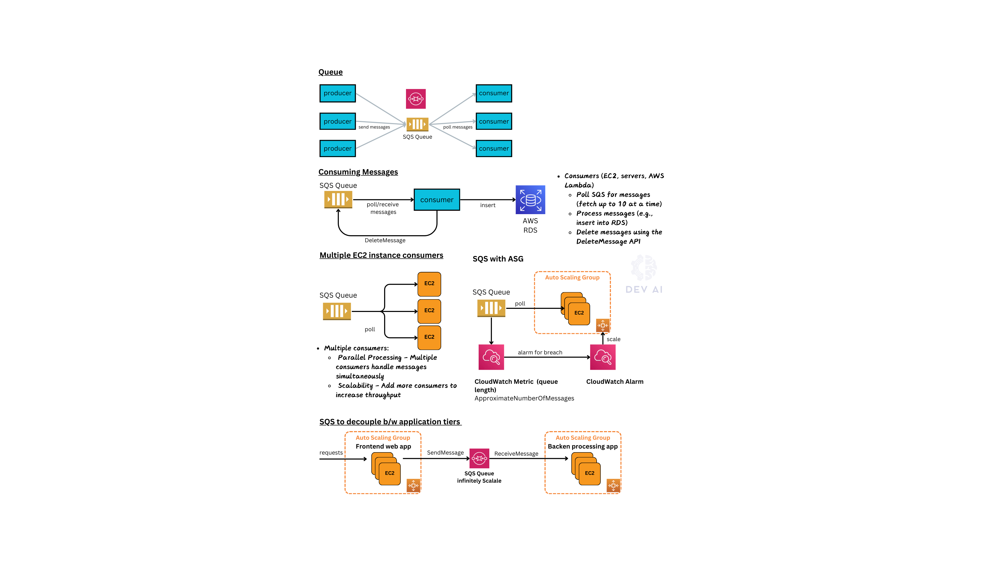

- Amazon SQS – Security Overview
  - **Encryption:**
    - **In-Flight:** HTTPS API
    - **At-Rest:** KMS encryption
    - **Client-Side:** Custom encryption option

  - **Access Control:**
    - IAM policies for API access
    - SQS access policies for **cross-account & service integration** (e.g., SNS, S3)
- SQS Message Visibility Timeout
  - Polled messages become invisible to other consumers.
  - Default **visibility timeout**: **30 seconds**.
  - If not processed in time, it becomes visible again and may be **reprocessed**.
  - **ChangeMessageVisibility API** extends timeout if needed.
  - **High timeout** delays retries if a consumer crashes.
  - **Low timeout** increases duplicate processing.

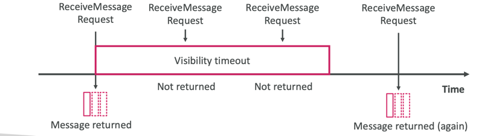

- SQS Long Polling
  - By default the queue has short polling
    - with short polling, SQS sends the response right away even if the query found no message.
  - With long-polling, sqs send the response only after it collects at least one message, upto a max message specified in the request
    - reduces API calls, and thus costs
  - **Long Polling** allows consumers to **wait** for messages if none are in the queue.
  - **Reduces API calls**, improves efficiency, and lowers latency.
  - Wait time: **1 to 20 seconds** (**20 sec recommended**).
  - **Preferred over Short Polling** for better performance.
  - Can be enabled at the **queue level** or via API using **WaitTimeSeconds**.

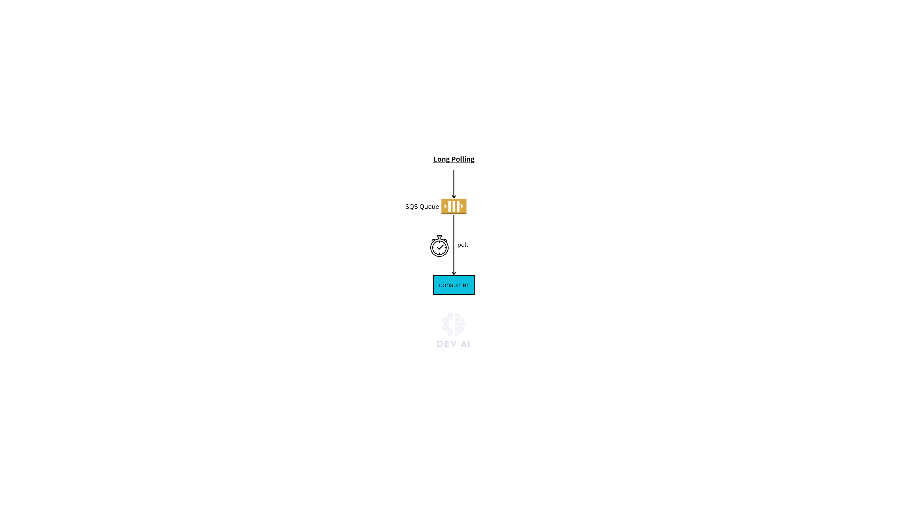
- FIFO Queue
  - it has limited throughput because of ordering
  - Ordering by message group ID (all message in the same group are ordered) - mandatory parameter
  - Group Id is comparable to a partition ID
  - to allow multiple consumers, we use group ID
  - Each group could be related to a single producer
  - in KDS, a shard will process one producer
  - Name must end with `.fifo`
  - Because of ordering it supports `300msg/s`
  - with batching (max. batching 10 message per operation), it can reach max of `3000msg/s

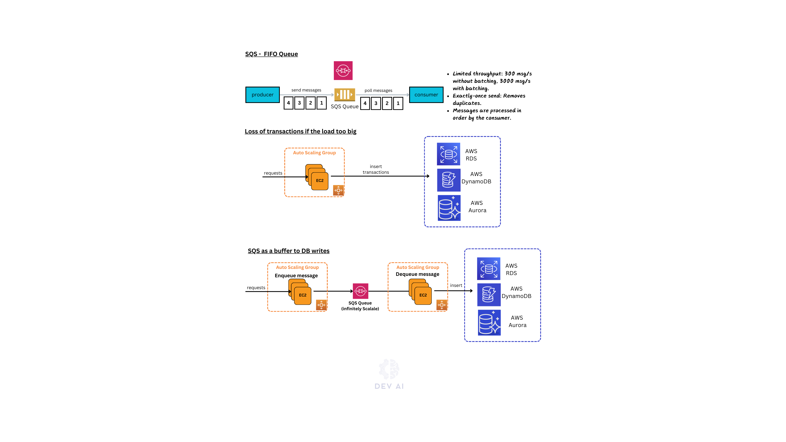

- Demos:
  - creating SQS

[aws-sqs-demo.gif](media/messaging/aws-sqs-demo.gif)
  - visibility timeout

[aws-sqs-visibility-t-demo.gif](media/messaging/aws-sqs-visibility-t-demo.gif)
  - FIFO demo

[aws-sqs-fifo-demo.gif](media/messaging/aws-sqs-fifo-demo.gif)
- Queue types in SQS:
  - Standard
  - FIFO
  - dead-letter-queue
  - delay queues
  - Temporary queues:
    - concept of a temporary queue usually refers to a short-lived, on-demand queue that is:
      - Created dynamically 
      - Used for a short period 
      - Deleted after use
    - This pattern is often used in request-reply architectures or asynchronous RPC-style communication, especially when clients need a unique queue for responses.


### AWS SNS
- What if we want to send one message to many receivers? 
  - AWS SNS

- **Amazon SNS – How to Publish**
  - **Topic Publish (SDK):**
    1. **Create a topic**
    2. **Create subscriptions** (one or more)
    3. **Publish to the topic**

  - **Direct Publish (for mobile apps):**
    - **Create a platform application**
    - **Create a platform endpoint**
    - **Publish to the endpoint**
    - Supports **Google GCM, Apple APNS, Amazon ADM**, etc.

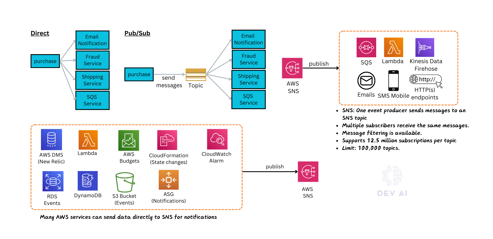
- **Amazon SNS – Security**
  - **Encryption:**
    - **In-flight:** Uses **HTTPS API**.
    - **At-rest:** Uses **KMS keys**.
    - **Client-side:** Users handle their own encryption/decryption.

  - **Access Control:**
    - **IAM policies** control SNS API access.
    - **SNS Access Policies** (like S3 policies) allow:
      - **Cross-account access** to SNS topics.
      - Other services (e.g., **S3**) to publish to SNS.

- SNS + xSQS: Fan Out:
  - **Push once in SNS**, all subscribed SQS queues receive the message.
  - **Fully decoupled** system with **no data loss**.
  - SQS allows message persistence, delayed processing, and retries.
  - **Scalable:** Add more SQS subscribers anytime.
  - **Access Control:** Ensure SQS policy allows SNS to write.
  - **Cross-Region Support:** Works with SQS queues in different regions (SNS can send to SQS in a different region).

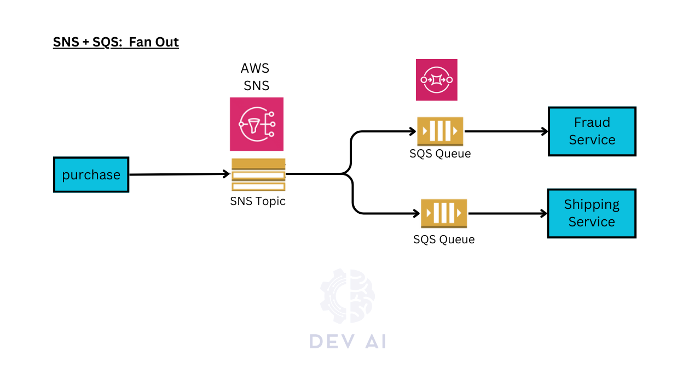

- S3 events to multiple queues:
  - For the same combination of: event type (e.g. object create) and prefix
    (e.g. images/) you can only have one S3 Event rule
  - If you want to send the same S3 event to many SQS queues, use fan-out

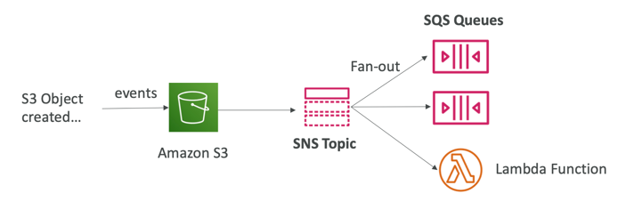

- Usage: SNS to AWS S3 through Kinesis Data Firehose

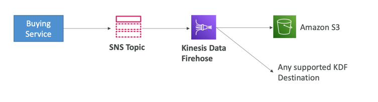

- SNS - FIFO Topic
  - ordering of the messages in the topic

- SNS FIFO _ SQS FIFO: fan out
  - usage: fan out + ordering + deduplication

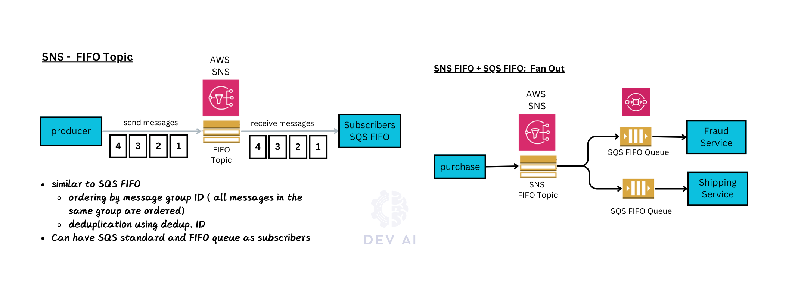
- SNS - Message Filtering
  - JSON policy used to filter messages sent to SNS topic's subscription
  - if a subscription doesn't have filter, it receives all messages

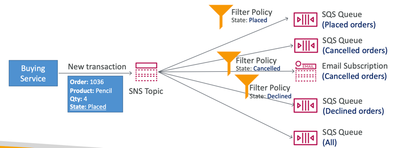

- SNS demos:

[sns-demo.gif](media/messaging/sns-demo.gif)

### AWS EventBridge
Amazon EventBridge is a serverless event bus service that makes it easy to connect applications using events.
- Receives events from AWS services, custom apps, or SaaS providers. 
- Routes events to targets like Lambda, Step Functions, SQS, SNS, and more. 
- Decouples services, enabling scalable and loosely-coupled architectures.
- Key features:
  - Schema discovery: Automatically detects the structure of incoming events. 
  - Event filtering: Only forward events that match specific patterns. 
  - Integrates with 200+ AWS services. 
  - Supports custom event buses for app-specific workflows.
- common use cases:
  - Automate workflows (e.g., run a Lambda when an EC2 instance starts). 
  - Connect microservices with real-time event-driven communication. 
  - React to SaaS events (e.g., Zendesk ticket created
- For comparison, SNS doesn't support third party destinations

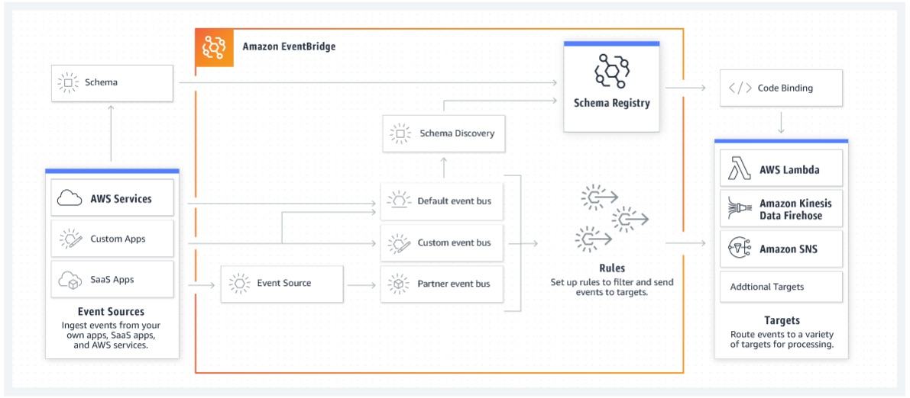

### EventBridge Scheduler
**Amazon EventBridge Scheduler** is a fully managed service that lets you **schedule tasks or events** to run at specific times or intervals, without managing any infrastructure.

**Key features:**
- **One-time or recurring schedules**
- **Triggers AWS services** (like Lambda, Step Functions, or ECS)
- **Granular time control** (down to the minute)
- **Supports time zones and daylight saving adjustments**
- **Reliability and retry mechanisms** built-in

It's ideal for automating periodic workflows or timed operations in AWS.

### AWS Kinesis
- collect and store streaming data in **real-time**

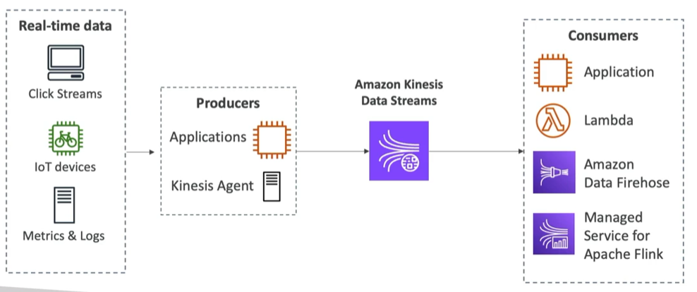

**Kinesis Data Stream:**
- It is a massively scalable and durable real-time data streaming
- KDS make sure the streaming data is available to multiple real-time analytics applications, to S3, Lambda within 70 milliseconds of the data being collected.
- Its streams scale from MBs to TBs per hour & scale from thousands to millions of PUTs per second
- Adjust the throughput anytime
- Retention between 1 day to 365 days
- Ability to reprocess (replay) data or retry mechanism
- Once data is inserted in Kinesis, it can’t be deleted (immutability)
- Data that shares the same partition goes to the same shard (ordering) • Producers: AWS SDK, Kinesis Producer Library (KPL), Kinesis Agent
- Consumers:
  - Write your own: Kinesis Client Library (KCL), AWS SDK
  - Managed: AWS Lambda, Kinesis Data Firehose, Kinesis Data Analytics
  - You have multiple consumers receiving data in parallel, the use enhanced fanout. See [here](https://aws.amazon.com/blogs/aws/kds-enhanced-fanout/).
  - Capacity Modes
    1. Provisioned
       - You choose the number of shards provisioned, scale manually or using API
       - Each shard gets 1MB/s in (or 1000 records per second)
       - Each shard gets 2MB/s out (classic or enhanced fan-out consumer) • You pay per shard provisioned per hour
    2. On-demand
       - No need to provision or manage the capacity
       - Default capacity provisioned (4 MB/s in or 4000 records per second)
       - Scales automatically based on observed throughput peak during the last 30 days
       - Pay per stream per hour & data in/out per GB
  - Demos

[kinesis-data-stream-demo.gif](media/messaging/kinesis-data-stream-demo.gif)

**Amazon Data Firehose:**
- data collected in firehose can be transformed using a lambda (ex. CSV to JSON).
- the data is stored in buffer and flushed once in a while into different destinations
- as in diagram, one can write data or failed data into S3 bucket
- automatic scaling, serverless, near-real-time with buffering capabilities
- supports:
  - CSV, JSON, Parquet, Avro, Raw Text, Binary data
- conversion to parquet/ORC, compressions with gzip/snappy
- data 

**Kinesis Data Stream vs Amazon Data Firehose**
- KDS:
  - stream data collection
  - producer, consumer mode
  - real time 
  - provisioned/on-demand mode
  - upto 365 days data storage
  - replay capabilities
- ADF:
  - loading streaming data into S3/Redshift/OpenSearch/3rd Party etc
  - fully managed
  - near real-time
  - automatic scaling
  - no data storage
  - no replay capabilities
  - When KDS is set as the source for ADF, Kinesis Agent can't send directly to ADF, instead it should send to KDS

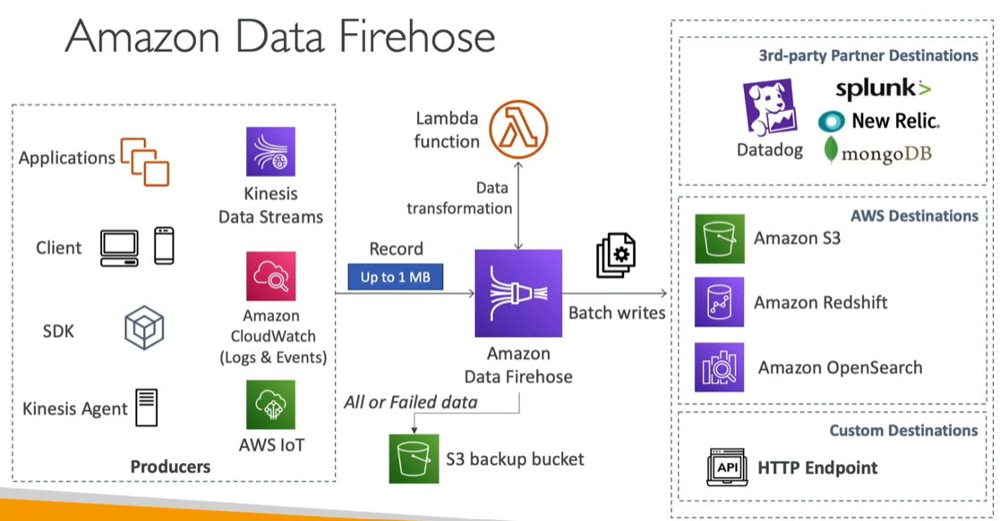
  - Demo

[adfirehose-s3-kds-demo.gif](media/messaging/adfirehose-s3-kds-demo.gif)
**SQS vs SNS vs Kinesis**

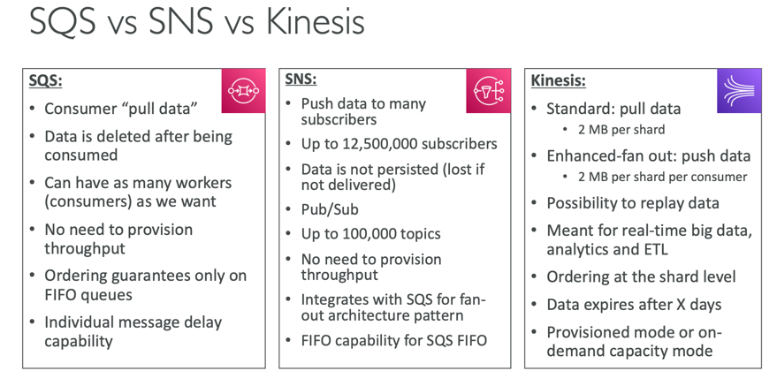

**Kinesis Data Analytics**
Refer to [Flink](#amazon-managed-service-for-apache-flink)
### Amazon MQ
- SQS & SNS are AWS proprietary protocols
- traditional apps might use open source protocols on-premise such as MQTT, AMQP, STOMP, Openwire, WSS
- when migration from on-premise to AWS, instead of re-engineering the app with SQS & SNS, we use `AWS MQ`
- It managed message broker for:
  - RabbitMQ
  - ActiveMQ
- Amazon MQ doesn't scale as much as SQS/SNS
- runs on server, we need to use multi-AZ with failover
- Amazon MQ has queue feature (similar to SQS) and topic feature (similar to SNS)

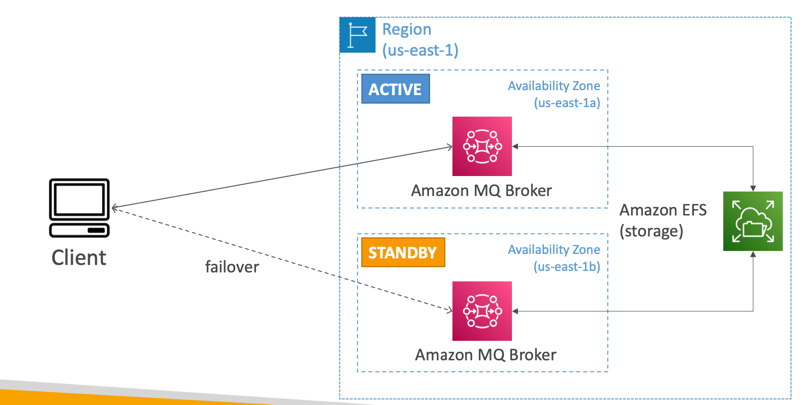

## AWS containers: ECS, Fargate, ECR
- docker: see `bank docu service`

### AWS Elastic Container Service (ECS)
- A container image is packaged code and dependencies
- launching docker container on AWS means launch `ECS tasks` on ECS clusters
- aws's own container platform
- EC2 launch type
  - in this type one must provision & maintain the infrastructure (the EC2 instances)
  - each EC2 instance will run the ECS agent to register in ECS cluster
  - finally aws takes care of starting/stopping containers

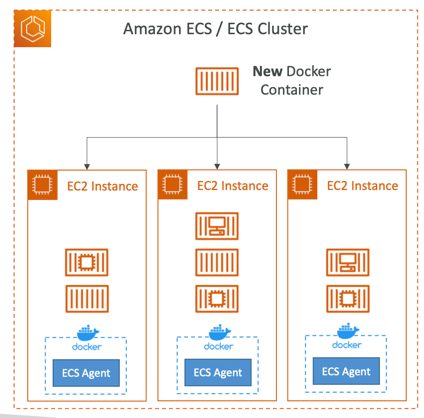
- Fargate Launch Type:
  - we don't provision the infras (EC2 instances)
  - it is all serverless
  - aws runs ECS tasks based on the CPU / RAM you need

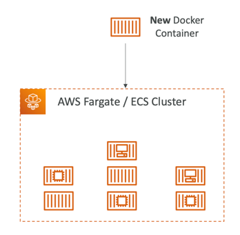

- IAM Roles for ECS:
  - EC2 instance profile (EC2 Launch Type):
    - is used by ECS agent to make calls to ECS API, ECR (poll image), CloudWatch(send logs)
  - ECS Task Role: 
    - allows tasks to have specific role
    - that role allows it to call others i.e S3, DB etc
    - defined in task definition

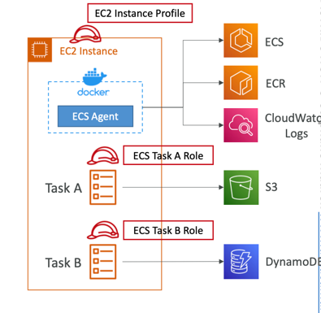

- ECS LB integration (in both launch types):
  - expose multiple ECS tasks as http or https endpoints

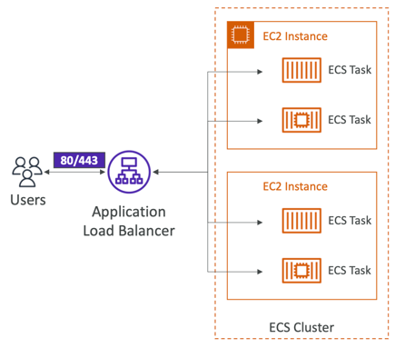
  - supported: 
    - ALB (for most use cases), 
    - NLB (recommended only for high throughput / performance use cases or to pair it with AWS private Link)

- ECS - Data volumes (EFS)
  - mount EFS file sys onto ECS tasks
  - work for both EC2 & Fargate
  - tasks running in any AZ share the same data in the EFS file system
  - Fargate + EFS = best of serverless setups
  - use case: multi-AZ shared storage for containers

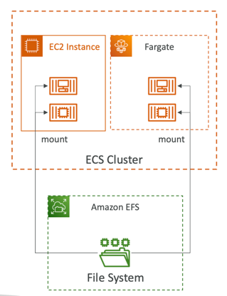

- Demos: ecs creation --> task definition --> service creation --> launched tasks --> update tasks
  - [ecs-creation-demo.gif](media/containers/ecs-creation-demo.gif)
  - [ecs-task-service-demo.gif](media/containers/ecs-task-service-demo.gif)
  - [ecs-interaction-service-update.gif](media/containers/ecs-interaction-service-update.gif)


- ECS service auto-scaling 
  - automatically increase/decrease the tasks
  - ECS uses aws application auto scaling, based on these metrics
    - CPU utilization of ECS service
    - Memory utilization of service
    - ALB request counts per target
  - auto-scaling types:
    - Target tracking: scaled based on target value of specific CloudWatch metric
    - Step scaling: based on specific CloudWatch alarm
    - Scheduled scaling scale based on specific time
  - ECS service autoscaling is different from EC2 auto-scaling
- EC2 Launch Type - Auto Scaling EC2 instances
  - scale EC2 instances?
    - auto-scaling group scaling: scale ASG based on CPU utilization
    - ECS cluster capacity provider:
      - as soon as you lack capacity to launch new task, it will automatically scale the ASG
      - capacity provider paired with ASG
      - finally add ec2 instances (CPU, RAM)
      - preferred scaling

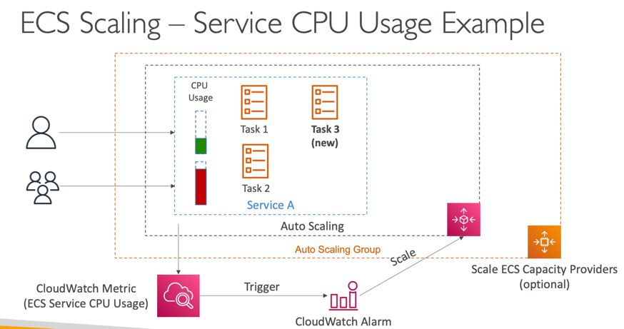

- ECS - solution architectures
  - ECS tasks invoked by Event Bridge

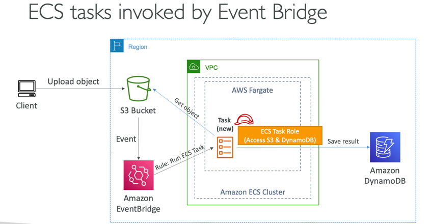
  - ECS tasks invoked by Event Bridge Schedule

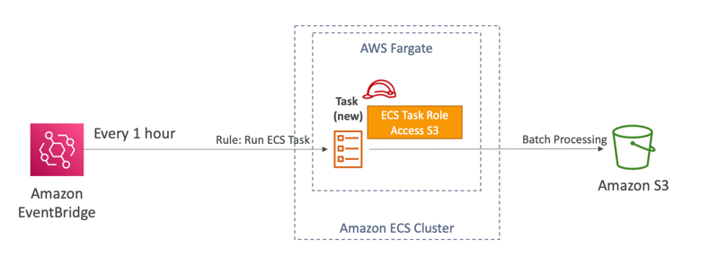
  - SQS Queue Example

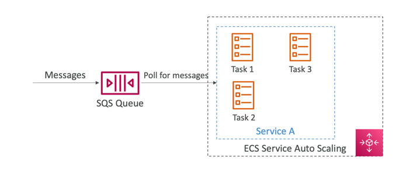
  - Intercept Stopped Tasks using EventBridge

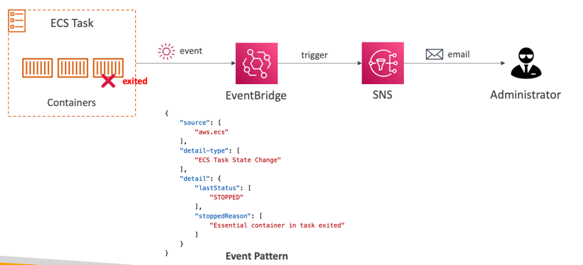

- Note: when deleting the ecs service, set desired tasks to 0, then delete the service (cloudformation will do the resources cleanup including ALB etc)
  - finally delete the cluster
### AWS Fargate
- AWS own serverless container platform
- works with ECS & with EKS

### AWS ECR (Elastic Container Registry)
- Store and manage Docker images on AWS
- Private & Public repository (Amazon ECR Public Gallery https://gallery.ecr.aws)
- Fully integrated with ECS, backed by Amazon S3
- Access is controlled through IAM (permission errors => policy)
- Supports image vulnerability scanning, versioning, image tags, image lifecycle, ...

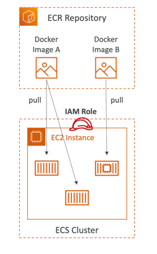

### AWS APP Runner
- fully managed service to deploy backend (API, microservices) and frontend by anyone. no knowledge of AWS
- underneath it uses AWS services and all the features like ASG, ELB, encryption etc
- it will scale if many request are coming to the app (httpd in demo)

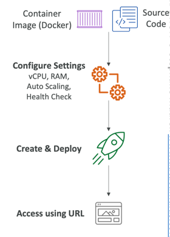

- Demo: 1. app runner service creation 2. interacting with the app runner
  1. [aws-app-runner-creation.gif](media/containers/aws-app-runner-creation.gif)
  2. [aws-app-runner-interaction.gif](media/containers/aws-app-runner-interaction.gif)

### AWS App2Container (A2C)
- CLI tool for migrating Java & .NET apps into docker container
- lift & shift migration
- migrate legacy apps without code changes
- process:
  - generate cloudformation template(compute, network etc)
  - register generated docker container to ECR
  - deploy to EKS, ECS or App Runner
  - support pre-built CI/CD pipelines

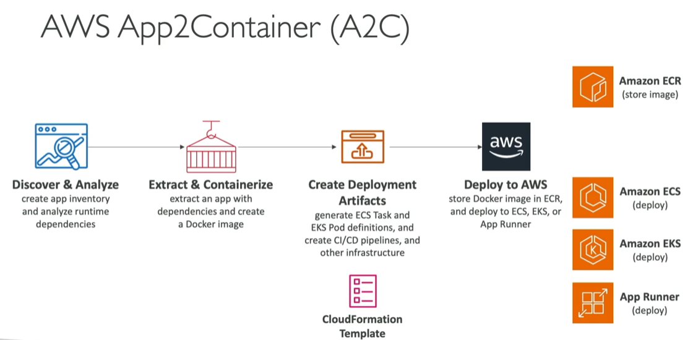
## AWS EKS (Elastic Kubernetes Service)
- A way to launch managed Kubernetes clusters on AWS
- k8s is an open-source system for automatic deployment, scaling and management of containerized (usually Docker) application
- An alternative to ECS, similar goal but different API
- EKS supports both launch modes:
  - EC2 if you want to deploy worker nodes 
  - or Fargate to deploy serverless containers
- Use case: if your company is already using Kubernetes on-premises or in another cloud, and wants to migrate to AWS using Kubernetes
- Kubernetes is cloud-agnostic (can be used in any cloud – Azure, GCP...)
- For multiple regions, deploy one EKS cluster per region
- Collect logs and metrics using CloudWatch Container Insights

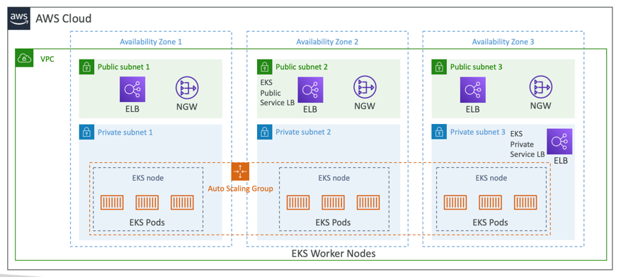
  - each worker node is an EC2 instance

---
### **AWS EKS Node Types**

When running workloads in Amazon EKS (Elastic Kubernetes Service), you need to provide the compute resources—**nodes**—on which your containers will run. AWS offers three main ways to set up nodes in your EKS cluster, depending on how much control and maintenance responsibility you want.

---

#### 1. **Managed Node Groups**

**Overview:**
- AWS manages the lifecycle of EC2 instances (nodes) on your behalf.
- You define a group (node group), and AWS handles provisioning, scaling, and updating the nodes using an Auto Scaling Group (ASG).

**Key Features:**
- **Fully integrated with EKS:** Node provisioning and management are simplified using the AWS Console, CLI, or APIs.
- **Auto-scaling supported:** AWS automatically adjusts the number of nodes based on your scaling policies.
- **EKS-optimized AMI:** Automatically uses an Amazon EKS-optimized AMI, which includes the necessary Kubernetes components.
- **Update support:** Allows rolling updates to nodes without disrupting workloads.

**Instance Types:**
- Can use **On-Demand Instances** (pay for what you use) or **Spot Instances** (cheaper but can be interrupted by AWS).

**Best For:**
- Users who want a balance of flexibility and convenience without managing the infrastructure in detail.

---

#### 2. **Self-Managed Nodes**

**Overview:**
- You manually create EC2 instances and register them to your EKS cluster.
- You are responsible for configuring and maintaining the lifecycle of the nodes, often via your own Auto Scaling Group.

**Key Features:**
- **Greater customization:** You can use any AMI (including custom ones) or the official Amazon EKS-Optimized AMI.
- **Full control:** Gives you the ability to tweak every aspect of the instance configuration, including networking, security, and software packages.
- **Manual updates & scaling:** Unlike Managed Node Groups, you handle node upgrades, patching, and autoscaling yourself.

**Instance Types:**
- Also supports both **On-Demand** and **Spot Instances**.

**Best For:**
- Advanced users who need custom node configurations or want more control over node management.
- Use cases that require special security hardening, GPU support, or custom AMIs.

---

#### 3. **AWS Fargate**

**Overview:**
- A **serverless** compute engine for containers.
- You don’t manage any EC2 instances. AWS handles the provisioning and scaling of the infrastructure.

**Key Features:**
- **No node management:** Ideal for those who want to avoid dealing with servers, patches, or scaling infrastructure.
- **Per-pod billing:** You pay for the vCPU and memory requested by individual pods, not for full EC2 instances.
- **Isolation and security:** Each pod runs in its own VM-isolated environment, improving security.

**Limitations:**
- Not all Kubernetes features are supported (e.g., daemonsets, privileged containers).
- Limited support for custom networking and storage configurations.

**Best For:**
- Small or simple workloads.
- Teams prioritizing ease of use and minimal infrastructure overhead.
- CI/CD jobs, microservices, or event-driven workloads.

---

#### Summary Table

| Feature                  | Managed Node Groups         | Self-Managed Nodes         | AWS Fargate                  |
|--------------------------|-----------------------------|-----------------------------|------------------------------|
| Management Level         | AWS-managed                 | User-managed                | Fully serverless             |
| AMI                     | EKS-optimized (auto)        | EKS-optimized or custom     | Not applicable               |
| Scaling                 | ASG (managed by AWS)        | Manual or custom ASG        | Handled by AWS               |
| Instance Types          | EC2 (On-Demand, Spot)       | EC2 (On-Demand, Spot)       | N/A                          |
| Control & Flexibility   | Medium                      | High                        | Low                          |
| Use Case Fit            | General purpose             | Custom workloads            | Lightweight, simple apps     |

---

### Amazon EKS – Data Volumes
- Support for...
  - Amazon EBS
  - Amazon EFS (works with Fargate) 
  - Amazon FSx for Lustre
  - Amazon FSx for NetApp ONTAP

- Demo:
  - [eks-cluster-creation-demo.gif](media/containers/eks-cluster-creation-demo.gif)
  - [eks-node-group-demo.gif](media/containers/eks-node-group-demo.gif)
- using `eksctl` create k8s cluster on [aws](https://docs.aws.amazon.com/eks/latest/userguide/create-cluster.html). 

### EKS and IAM Integration
- There are two types of accounts in k8s:
  - user account: for humans (i.e kubectl access)
  - service account: for pods (identity)
- Service account: in EKS, service account is an identity that the pods use to authenticate to k8s API and with IRSA to aws services
- IRSA (IAM Roles for Service Accounts) is a k8s feature
- First create IAM roles separately for each service running on EKS and then assign the roles to each k8s service account

### Zoning concepts:
- outer, middle, inner zones
- dev, test, preprod in outer zone belong to one k8s cluster
- prod in outer layer has its k8s own cluster
- however zone  outer includes dev, test, preprod, prod. So what is outer zone exactly?
- dev, test, preprod in middle zone belong to its own k8s cluster
- prod in middle zone has its own k8s cluster
- In Azure, a zone is a subnet

## Crossplane
- Crossplane is an open-source framework that enables you to manage infrastructure and services using Kubernetes APIs. 
- Key Features of Crossplane
  - Kubernetes-Native: Uses Kubernetes Custom Resource Definitions (CRDs) and Controllers to manage resources. 
  Leverages the Kubernetes API, so you can use kubectl and familiar tools to manage infrastructure. 
  - Provider Support: Supports cloud providers like AWS, Google Cloud Platform (GCP), Azure, and on-premises environments. 
  Providers translate Kubernetes resources into API calls for these platforms. 
  - Infrastructure Compositions:You can create Compositions, which are reusable templates for infrastructure. 
  For example, a PostgreSQLInstance composition might include an RDS instance, a VPC, and security group. 
  - GitOps Friendly: Works seamlessly with GitOps tools like Argo CD and Flux to manage infrastructure declaratively. 
  - Multi-Tenancy and Separation of Concerns: Crossplane enables administrators to create high-level abstractions for developers, allowing developers to consume infrastructure without direct access to sensitive provider credentials.
- Use Cases 
  - Managing cloud resources (e.g., databases, storage, compute). 
  - Abstracting and templating infrastructure for consistency across teams. 
  - Integrating with CI/CD pipelines for automated infrastructure management. 
  - It turns Kubernetes into a universal control plane for provisioning and managing cloud-native resources, such as databases, virtual machines, and networks, as well as custom resources
- Upbound is the commercial company behind Crossplane.
- [Connect](https://docs.crossplane.io/latest/getting-started/provider-aws/) Crossplane to AWS to create and manage cloud resources from Kubernetes with the [Upbound AWS Provider](https://marketplace.upbound.io/providers/upbound/provider-family-aws)
- In the context of Crossplane, the concepts of Composition, Definition, and Claim are part of its Composite Resource (XRC) framework. 
 They enable Crossplane to provide higher-level abstractions for infrastructure, making it easier for application developers to consume infrastructure without dealing with the complexity of raw cloud APIs.
### Examples:
- Create an AWS VPC as native k8s resource with 
  ```
  apiVersion: aws.composite.scc.bank.io/v1alpha1
  kind: DedicatedVPC
  ```
  
## AWS Serverless overview

- Developers don’t have to manage servers anymore.
- They just deploy code, or simply just deploy... functions. Serverless == FaaS (Function as a Service)
- Serverless was pioneered by AWS Lambda but now also includes anything that’s managed: “databases, messaging, storage, etc.”
- Serverless does not mean there are no servers... it means you just don’t manage / provision / see them

- Serverless in AWS
  - AWS Lambda
  - AWS Cognito
  - AWS API Gateway
  - Amazon S3
  - AWS SNS & SQS
  - AWS Kinesis Data Firehose
  - Aurora Serverless
  - DynamoDB
  - Step Functions 
  - Fargate
  - CloudFront
  - CloudWatch log
  - CloudWatch Events - Event Bridge

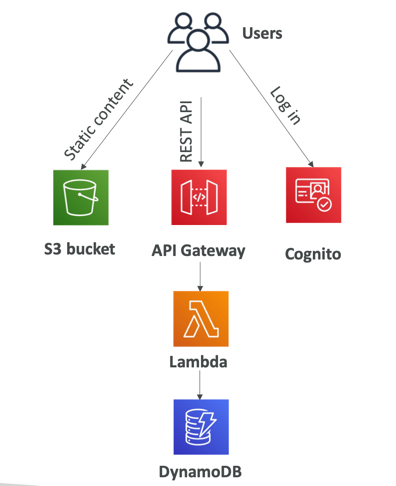

- Example integrations (use cases):
  - Serverless Thumbnail creation

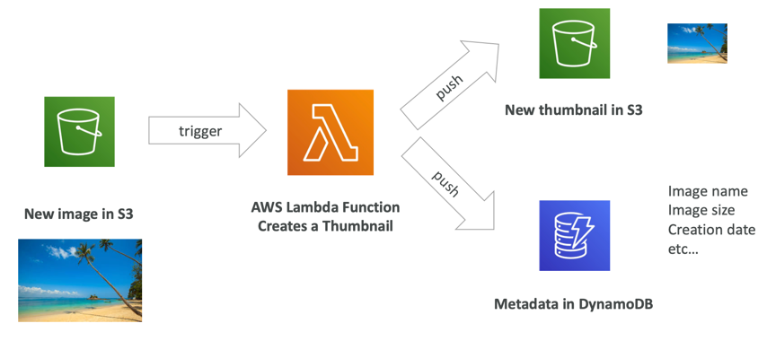
  - Serverless CRON Job

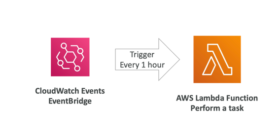

### AWS Lambda
- EC2 vs Lambda
  - EC2:
    - Virtual Servers in the Cloud
    - Limited by RAM and CPU
    - Continuously running
    - Scaling means intervention to add / remove servers
  - Lambda
    - Virtual functions – no servers to manage!
    - Limited by time - short executions
    - Run on-demand
    - Scaling is automated!
    - AWS lambda layer for reusable code
- Easy Pricing:
  - Pay per request (call)
    - First 1,000,000 requests are free
    - $0.20 per 1 million requests thereafter ($0.0000002 per request)
  - Pay per duration: (in increment of 1 ms)
    - 400,000 GB-seconds of compute time per month for FREE == 400,000 seconds if function's RAM is 1GB == 3,200,000 seconds if function is 128 MB RAM
    - After that $1.00 for 600,000 GB-seconds
    - Free tier 400,000 GBs of compute time
  - You can find overall pricing [information](https://aws.amazon.com/lambda/pricing/)
  - It is usually very cheap to run AWS Lambda --> popular

- Lambda Features:
  - Integrated with the whole AWS suite of services  
  - support for many programming languages:
    - Node.js (JavaScript), python, java, C#(.NET core), Ruby, 
    - Custom Runtime API (community supported, example Rust or Golang))
  - To reuse code in more than one aws lambda, consider using `aws lambda layer`
  - Easy monitoring through AWS CloudWatch
  - Easy to get more resources per functions (up to 10GB of RAM!). Increasing RAM will also improve CPU and network!
  - Lambda Container Image
    - The container image must implement the Lambda Runtime API
    - ECS / Fargate is preferred for running arbitrary Docker images

- AWS Lambda Limits to Know - per region
  - Execution:
    - Memory allocation: 128 MB – 10GB (1 MB increments)
    - Maximum execution time: 900 seconds (15 minutes)
    - Environment variables (4 KB)
    - Disk capacity in the “function container” (in /tmp): 512 MB to 10GB
    - Concurrency executions: 1000 (can be increased by contacting aws support)
  - Deployment:
    - Lambda function deployment size (compressed .zip): 50 MB
    - Size of uncompressed deployment (code + dependencies): 250 MB
    - Can use the /tmp directory to load other files at startup 
    - Size of environment variables: 4 KB 
- Demo: lambda creation:
  - [lambda-creation-demo.gif](media/serverless/lambda-creation-demo.gif)

- Lambda Concurrency & Throttling:
  - concurrency limit: upto 1000 concurrent executions (1000 lambdas working in parallel)
  - one can set "reserved concurrency" at func level to limit the no. of concurrency. Invocation over limit --> throttled
    - if sync invocation --> throttle error 429
    - if asynch invocation --> retry automatically and then go to DLQ
  - higher exec above 1000 possible through support ticket
  - if we don't set limit, then:
    - at high invocations ALB fulfilled all request and consumed 1000 limit (account level)
    - all others will be throttled
  - Use `ConcurrentExecutions` or `Invocation exceed the expected threshold` CloudWatch alarms to monitor
  - 
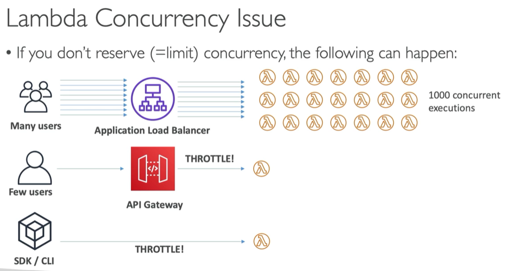
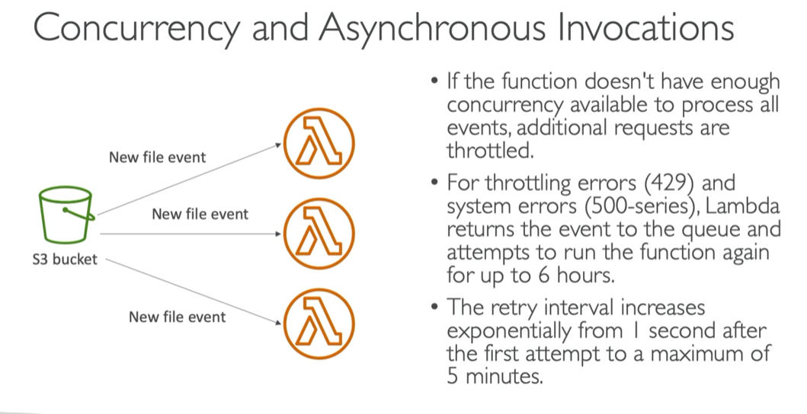

  - Demo:
    - [lambda-concurr-demo.gif](media/serverless/lambda-concurr-demo.gif)
- Cold Start & Provisioned Capacity:
  - Cold start: 
    - code loaded + code outside handler run (init). 
    - If init is large (code, dependencies, SDK) this process can take some time.
    - first request has higher latency
  - provisioned concurrency:
    - pre-warmed instances that are ready to handle requests at all time
- Lambda SnapStart (at no extra cost):
  - Improves your Lambda functions performance up to 10x at no extra cost for Java, python & .NET and above
  - if enabled: function is invoked from a pre-initialized state (no function initialization from scratch)
  - When you publish a new version:
    - Lambda initializes your function
    - Takes a snapshot of memory and disk state of the initialized function
    - Snapshot is cached for low-latency access

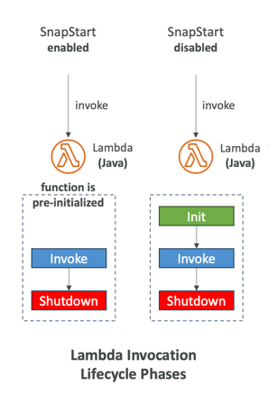

- Customization at the Edge: Lambda at Edge and CloudFront
  - some modern apps need logic execution at the edge location, these code are called `edge function`
  - Edge function:
    - write and attach to CF
    - run close to user
    - CloudFront has two kinds of functions: CF functions and Lambda@Edge
    - deployed globally
    - use case: customize the CDN content
  - CF & Lambda@Edge use case:
    - Website Security and Privacy
    - Dynamic Web Application at the Edge
    - Search Engine Optimization (SEO)
    - Intelligently Route Across Origins and Data Centers • Bot Mitigation at the Edge
    - Real-time Image Transformation
    - A/BTesting
    - User Authentication and Authorization
    - User Prioritization
    - User Tracking and Analytics
  - CF Functions:
    - Lightweight functions written in JavaScript
    - For high-scale (millions), latency-sensitive CDN customizations
    -  max memory: 2 MB
    - total package: 10 KB
    - execution time < 1ms
    - no access to n/w or file system access
    - Sub-ms startup times, millions of requests/second
    - Used to change Viewer requests and responses:
      - Viewer Request: after CloudFront receives a request from a viewer
      - Viewer Response: before CloudFront forwards the response to the viewer
    - Native feature of CloudFront (manage code entirely within CloudFront)

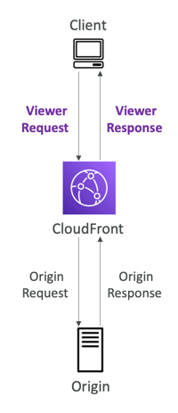

  - Lambda@Edge
    - Lambda functions written in NodeJS or Python
    - execution time: 5 - 10 seconds
    - max memory: 128 MB - 10 GB
    - total package: 1 - 50 MB
    - Scales to 1000s of requests/second
    - Used to change CloudFront requests and responses:
      - Viewer Request – after CloudFront receives a request from a viewer
      - Origin Request – before CloudFront forwards the request to the origin
      - Origin Response – after CloudFront receives the response from the origin
      - Viewer Response – before CloudFront forwards the response to the viewer
    - Author your functions in one AWS Region (us-east-1), then CloudFront replicates to its locations

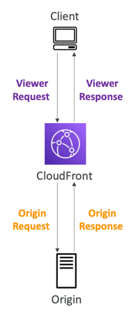

  - CloudFront Functions vs. Lambda@Edge - Use Cases
    - CF functions:
      - Cache key normalization
        - Transform request attributes (headers, cookies, query strings, URL) to create an optimal Cache Key
      - Header manipulation
        - Insert/modify/delete HTTP headers in the request or response
      - URL rewrites or redirects
      - Request authentication & authorization
        - Create and validate user-generated tokens (e.g., JWT) to allow/deny requests
    - Lambda@Edge:
      - Longer execution time (several ms)
      - Adjustable CPU or memory
      - Your code depends on a 3rd libraries (e.g., AWS SDK to access other AWS services)
      - Network access to use external ser vices for processing
      - File system access or access to the body of HTTP requests

- Lambda in VPC:
  - By default, your Lambda function is launched outside your own VPC (in an AWS-owned VPC) and have access to any public internet address or public aws API
  - Therefore, it cannot access resources in your VPC (RDS, ElastiCache, internal ELB...)

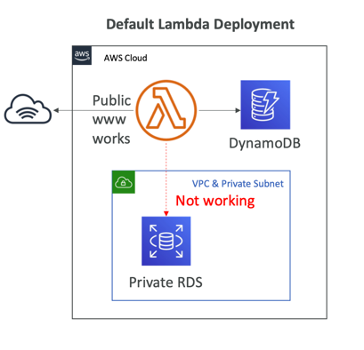
  - make it VPC-enabled when you need to access a private resource in a private subnet
    - once enabled, all traffic from your function is subject to the routing rules of your VPC/subnet and interact with public resources, it will need route through a NAT GW

  - we need to launch our lambda in our VPC (in private subnet): 
    - you need VPC ID, the subnet, and security group
    - lambda will then create an ENI in your subnet

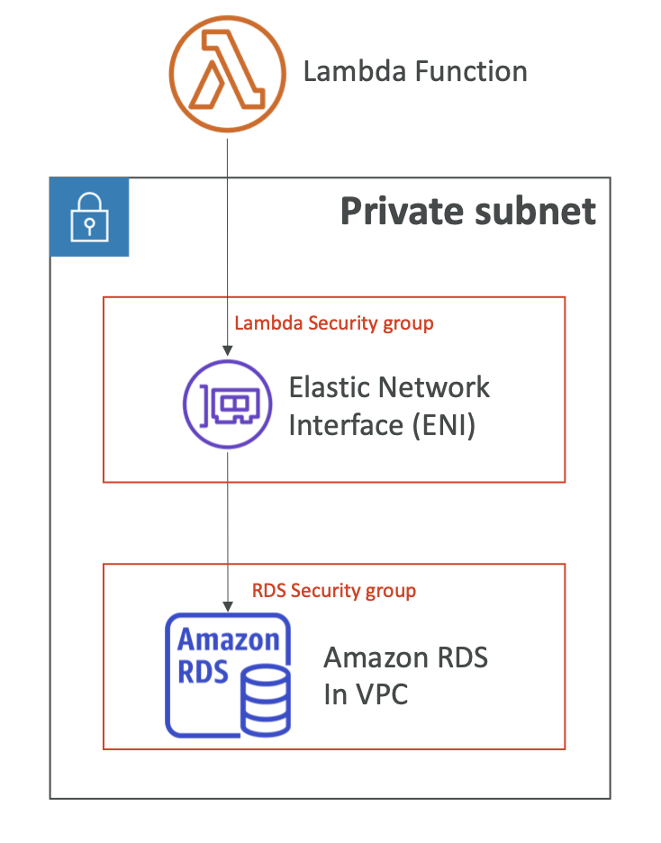
  - Use case: 
    - use lambda with RDS Proxy: if lambda directly accesses the RDS, it may open many and create high load --> use RDS proxy (it pools connections)
      - RDS Proxy
        - Improve scalability by pooling and sharing DB connections
        - Improve availability by reducing by 66% the failover time and preserving connections
        - Improve security by enforcing IAM authentication and storing credentials in Secrets Manager
      - The Lambda function must be deployed in your VPC, because RDS Proxy is never publicly accessible 

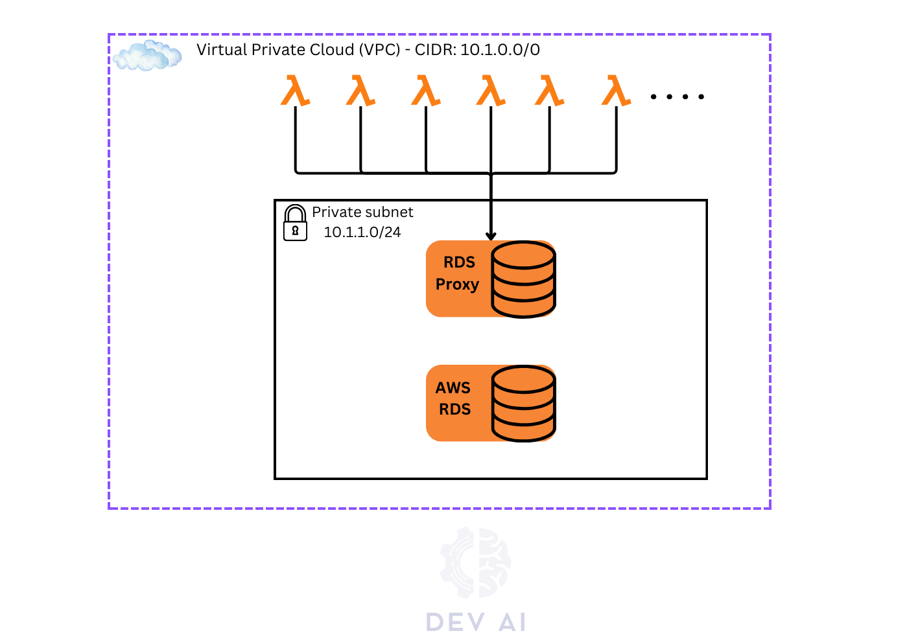

- RDS - Invoking Lambda vs Event Notification
  - Invoking Lambda:
    - Invoke Lambda functions from within your DB instance
    - Allows you to process data events (access to DB data) from within a database
    - Supported for RDS for PostgreSQL and Aurora MySQL
    - Must allow outbound traffic to your Lambda function from within your DB instance (Public, NAT GW,VPC Endpoints)
    - DB instance must have the required permissions to invoke the Lambda function (Lambda Resource-based Policy & IAM Policy)

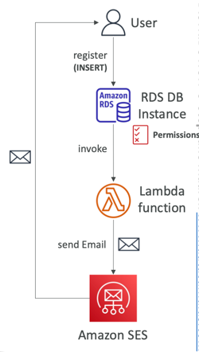
  - Event Notification:
    - Notifications that tells information about the DB instance itself (created, stopped, start, ...)
    - You don’t have any information about the data itself
    - Subscribe to the following event categories: DB instance, DB snapshot, DB Parameter Group, DB Security Group, RDS Proxy, Custom Engine Version
    - Near real-time events (up to 5 minutes)
    - Send notifications to SNS or subscribe to events using EventBridge

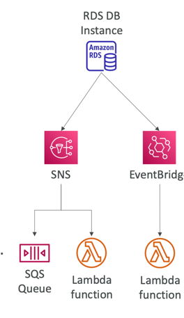

**Lambda db communication:**

**AWS Lambda to RDS using IAM authentication** allows your Lambda function to connect securely to an **Amazon RDS database** (e.g., MySQL or PostgreSQL) **without hardcoding passwords**.

- How It Works:
  1. **Enable IAM DB authentication** on your RDS instance.
  2. **Create an IAM role** with permission to connect to RDS (`rds-db:connect`).
  3. **Attach the IAM role** to your Lambda function.
  4. In Lambda, generate a **temporary auth token** using the **`generate-db-auth-token`** AWS CLI/SDK.
  5. Use that token as the database password in the connection.

---
This method improves security by using **short-lived tokens** instead of static DB credentials.

## AWS No SQL - DynamoDB
- **Fully managed & available:**
  - NoSQL database with multi-AZ replication and integrated IAM security.
- **High scalability & performance:**
  - Supports millions of requests/sec, trillions of rows, hundreds of TB storage, and single-digit millisecond latencies.
- **Flexible schema:**
  - Uses tables with primary keys, supports evolving attributes and various data types (scalar, document, set) with a 400KB item limit.
  - items has attributes (& new ones can be added anytime unlike RDS)
- **Cost-efficient & maintenance-free:**
  - Offers auto-scaling and requires no patching (DB is already there).
- **Capacity options:**
  - Provisioned (pre-planned RCUs/WCUs with auto-scaling) and On-Demand (automatic scaling for variable workloads).
- Standard & Infrequent Access (IA) Table Class
- If schema changes rapidly, then DynamoDB is the choice
- DynamoDB + lambda tech stack --> key-value pair data processing and storing 

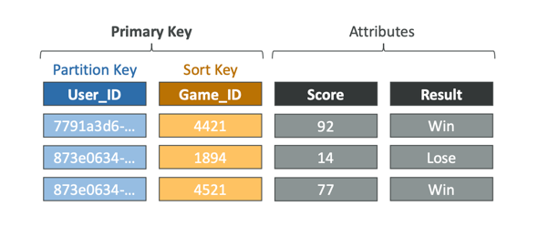

- Demos:
  - [dynamodb-create-table.gif](media/serverless/dynamodb-create-table.gif)

### DAX caching
- Provides an in-memory cache for reduced read latency (microseconds) with a default 5-minute TTL.
- helps solve read congestion
- fully compatible with DynamoDB API (no app code change/refactoring).
  - doesn't require developers to manage cache invalidation, data population or cluster management
- less read capacity is used which saves costs
- delivers upto 10x performance improvement - from milliseconds to microseconds - even at millions of requests per seconds

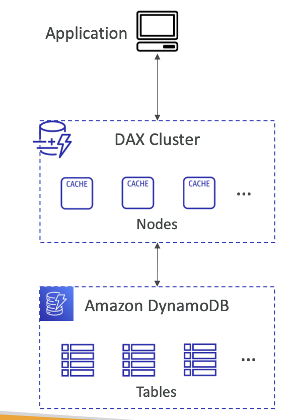
- Why not ElastiCache
  - both can be complementary
  - in ElastiCache one can store huge aggregated result

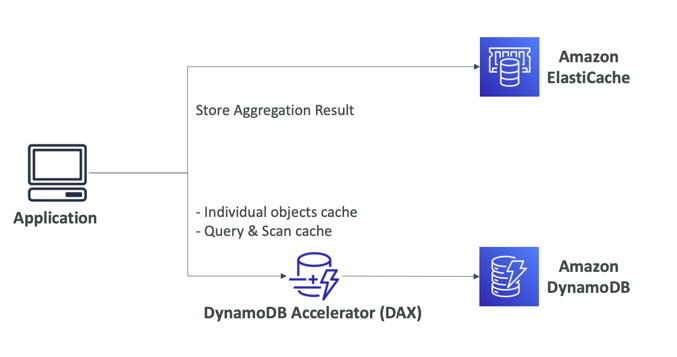

### DynamoDB Streams Processing
DynamoDB Streams is a feature of Amazon DynamoDB that captures a time-ordered sequence of item-level changes (inserts, updates, and deletes) made to a table.
- Events from **DynamoDB Streams** are stored in a **highly available, managed stream** maintained by AWS, **separate from the table itself**. You don’t access them like a traditional database table—instead, AWS stores them in an **internal stream buffer** that you can read from using:

- **AWS Lambda** (most common use via triggers)
- **Kinesis adapter** (for advanced stream processing)
- **DynamoDB Streams API** (low-level, for custom consumers)

**Storage specifics**
- **Retention**: Stream records are stored for **24 hours**.
- **Ordering**: Events are stored in **time order** per partition key.
- **Access**: You don’t see or manage the underlying storage—AWS handles that entirely.

So, the events are **not stored in DynamoDB itself**, but in a **separate, managed stream** associated with your table.


In the context of **DynamoDB**, when we talk about **creating triggers**, it **specifically refers to using a Lambda function** that automatically runs in response to changes in the table via **DynamoDB Streams**.

So yes, **"triggers" in DynamoDB are essentially Lambda functions** that are associated with a stream on a table.

**Steps to create a trigger**
1. **Enable DynamoDB Streams** on your table.
2. Go to the **AWS Lambda Console**.
3. Create a **new Lambda function** (or use an existing one).
4. Under **"Function triggers"**, choose **DynamoDB** as the source.
5. Select your table and the stream ARN, and configure the batch size and permissions.

Once set up, the Lambda function is automatically **triggered** whenever the table is modified (insert, update, delete), and from there, you can integrate with SNS or any other service.


To integrate **Amazon SNS** with **DynamoDB Streams**, you use a **Lambda function as a trigger**. In DynamoDB, a *trigger* refers to a **Lambda function** that automatically runs when changes (inserts, updates, deletes) occur in the table, captured via **DynamoDB Streams**.

**How it works**
1. **Enable DynamoDB Streams** on your table to capture data changes.
2. **Create a Lambda function** and configure it as a **trigger** for the stream.
3. In the Lambda function, process the incoming stream events and **publish messages to an SNS topic**.
4. **Subscribe other services** (e.g., email, SQS, other Lambdas) to the SNS topic to receive notifications.

**Example use case**
A new order is inserted into a DynamoDB table → DynamoDB Stream captures the event → triggers a Lambda → Lambda sends an alert via SNS to notify a support team.

---

This setup is **serverless**, real-time, and great for building reactive, event-driven architectures.

- use cases:
  - react in real time (welcome emails to users)
  - real-time usage analytics
  - insert into derivative tables
  - implement cross-region replication

- Two stream processing types on DynamoDB:
  - DynamoDB streams
    - 24 hours retention
    - limited # consumers
    - process using lambda triggers or dynamodb stream kinesis adapters
  - Kinesis Data Stream (new): send all streams to it
    - 1 year retention
    - high # consumers
    - process using lambda, kinesis data analytics, Kinesis Data Firehose, Glue, Streaming ETL

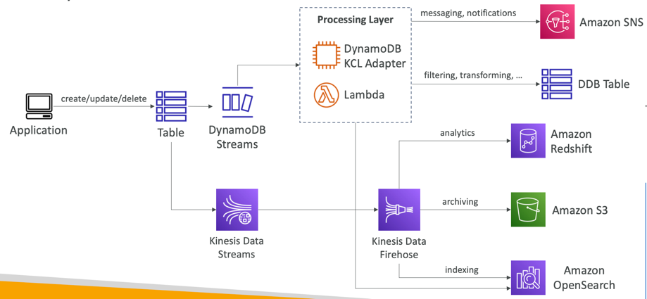

### DynamoDB Global Tables
- Make a DynamoDB table accessible with low latency in multiple-regions
- Active-Active replication (2-ways)
- Applications can READ and WRITE to the table in any region
- Must enable DynamoDB Streams as a pre-requisite: 
  - DynamoDB streams enable DB to get changelog and use that to replicate data across replica tables in other aws regions

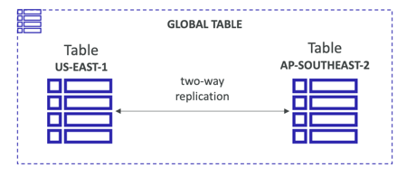
### DynamoDB TTL
- automatically delete an item after an expiry timestamp
- Use cases: reduce stored data by keeping only current items, adhere to regulatory obligations, web session handling...

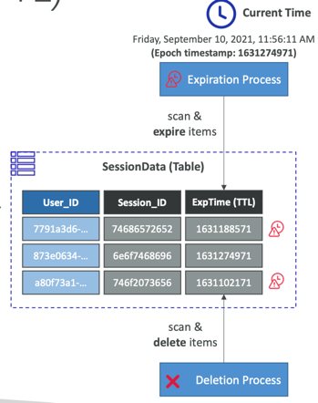

### DynamoDB - backups for DR
  - **Continuous Backups using point-in-time recovery (PITR)**
    - Can be enabled for up to 35 days
    - Allows recovery to any point within the backup window
    - Restores data by creating a new table
  - **On-Demand Backups**
    - Full backups retained until explicitly deleted
    - No impact on performance or latency
    - Can be managed in AWS Backup (supports cross-region copies & life cycle options)
    - Restores data by creating a new table

### DynamoDB - Integration with S3
- Export table to S3 (Requires PITR) & query using retina on S3
  - Supports export for any point in the last 35 days
  - No impact on table read capacity
  - Enables data analysis and auditing
  - Supports ETL before re-importing to DynamoDB
  - Exports in DynamoDB JSON or ION format
- Import from S3
  - Supports CSV, DynamoDB JSON, or ION formats
  - Doesn’t consume write capacity
  - Creates a new table
  - Logs import errors in CloudWatch Logs

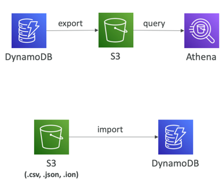

## AWS API Management
- Example: Building a Serverless API (aws api gateway + lambda + dynamoDB)
- 
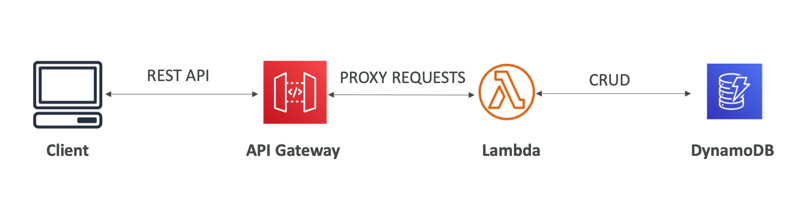
- AWS API Gateway:
  - **Serverless API Management**: Works with AWS Lambda, no infrastructure to manage (full serverless).
  - **WebSocket Support**: Enables real-time, bidirectional streaming
  - **API Versioning & Environments**: Manages multiple versions (v1, v2...) and environments (dev, test, prod).
  - **Security & Access Control**: Handles authentication, authorization, API keys, and request throttling (too many requests).
  - **API Definition & Import**: Supports Swagger/OpenAPI for quick API setup.
  - **Request & Response Handling**: Transforms and validates API requests and responses.
  - **SDK & API Specification**: Auto-generates SDKs and API documentation.
  - **Response Caching**: Improves performance by caching API responses.

- API Gateway – High-Level Integrations
  - **Lambda Function**: Directly invoke AWS Lambda to expose REST APIs.
  - **HTTP**: Connect to backend HTTP endpoints (e.g., on-premise APIs, ALB) while adding rate limiting, caching, and authentication.
  - **AWS Services**: Expose AWS APIs (e.g., Step Functions, SQS) with added authentication, public access, and rate control.

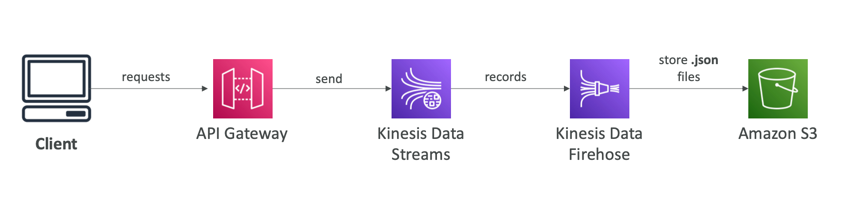

- API Gateway deployment – Endpoint Types
  - **Edge-Optimized (Default)**: Routes requests through CloudFront for global clients, reducing latency.
  - **Regional**: Designed for clients in the same AWS region; can be combined with CloudFront for custom caching and distribution.
  - **Private**: Accessible only within a VPC via an interface VPC endpoint (ENI), with resource policies for access control.

- API Gateway – Security - user identification
  - **User Authentication**: Supports IAM roles (internal apps), Cognito (external users), and custom authorizers (custom logic - lambda function).
  - **Custom Domain & HTTPS Security**: Integrates with AWS Certificate Manager (ACM).
    - **Edge-Optimized**: Certificate must be in **us-east-1**.
    - **Regional**: Certificate must be in the API Gateway's region.
    - **Domain Setup**: Requires CNAME or A-alias record in Route 53.

## AWS Step Functions
- **AWS Step Functions** is a serverless complex workflow orchestration service.
- **Features**: Supports sequencing, parallel execution, conditions, timeouts, and error handling.
- **Integrations**: Works with Lambda, EC2, ECS, on-premises servers, API Gateway, SQS, and more.
- **Human Approval**: Allows implementation of manual approval steps.
- **Use Cases**: Order fulfillment, data processing, web applications, and workflow automation.
- something similar to camunda BPMN

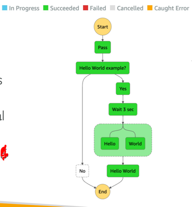

## AWS Cognito:
- **User Identity Management**: Enables users to interact with web or mobile applications.
- **Cognito User Pools**:
  - Provides sign-in functionality for app users.
  - Integrates with API Gateway & Application Load Balancer.
- **Cognito Identity Pools (Federated Identity)**:
  - Grants AWS credentials to users for direct AWS resource access.
  - Can use Cognito User Pools as an identity provider.
- **Cognito vs. IAM**:
  - Suitable for handling "hundreds of users," "mobile users," and "SAML authentication." (outside users)

- Cognito User Pools (CUP) – User Features
  - **Serverless User Database**: Manage users for web & mobile apps.
  - **Simple Login**: Supports username (or email) & password authentication.
  - **Password Reset**: Allows users to reset passwords securely.
  - **Email & Phone Verification**: Ensures user identity confirmation.
  - **Multi-Factor Authentication (MFA)**: Adds extra security layer.
  - **Federated Identities**: Supports login via Facebook, Google, SAML, etc.
  - CUP integrates with API Gateway and Application Load Balancer

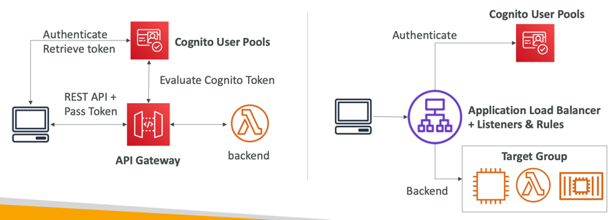
- Cognito Identity Pools (Federated Identities)
  - **Provides Identities**: Grants temporary AWS credentials to users.
  - **Flexible User Sources**: Supports Cognito User Pools, third-party logins, etc.
  - **Direct AWS Access**: Users can access AWS services or API Gateway.
  - **IAM Policy Control**: Policies are managed within Cognito.
    - **Fine-Grained Permissions**: Customizable IAM policies based on user ID.
    - **Default Roles**: Separate IAM roles for authenticated and guest users.

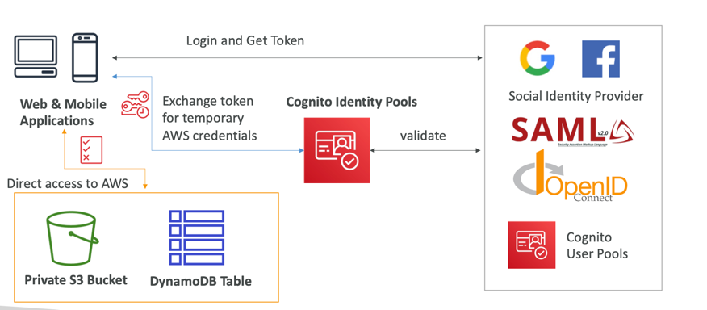
  - Cognito Identity Pools Row Level Security in DynamoDB

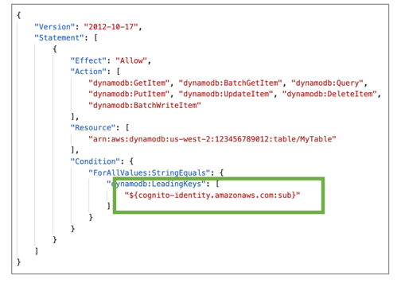

## Serverless Solution Architecture:
- Scenario One (whole setup pay-per-usage):
  - A serverless mobile app with a REST API over HTTPS, using managed serverless authentication. 
  - Users interact with their S3 folders and manage to-dos (mostly read-heavy). 
  - The database must scale with high read throughput.
  - outcome:
    - serverless REST API: HTTP

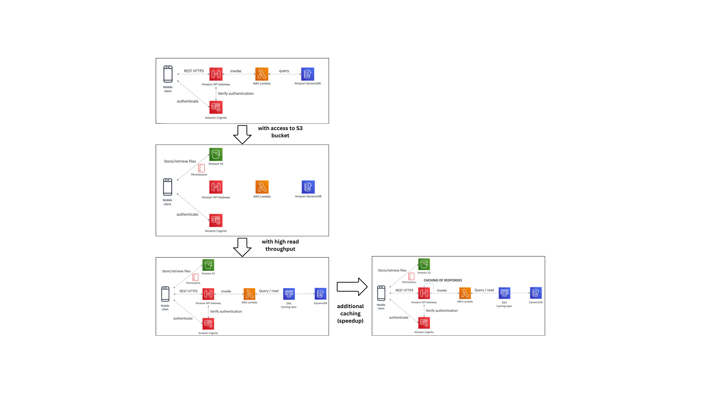
  - **Serverless REST API**: Uses API Gateway, Lambda, DynamoDB.
  - **Temporary Credentials**: Cognito grants restricted access to AWS resources (S3, DynamoDB, Lambda).
  - **Caching**: DAX for DynamoDB, API Gateway for REST requests.
  - **Security**: Authentication & authorization via Cognito.
- Scenario Two (serverless website):
  - The website must scale globally.
  - Blogs are often read but rarely written.
  - The site consists of static files and a dynamic REST API.
  - Caching should be implemented where possible.
  - New subscribers should receive a welcome email.
  - Uploaded blog photos should have automatic thumbnail generation.

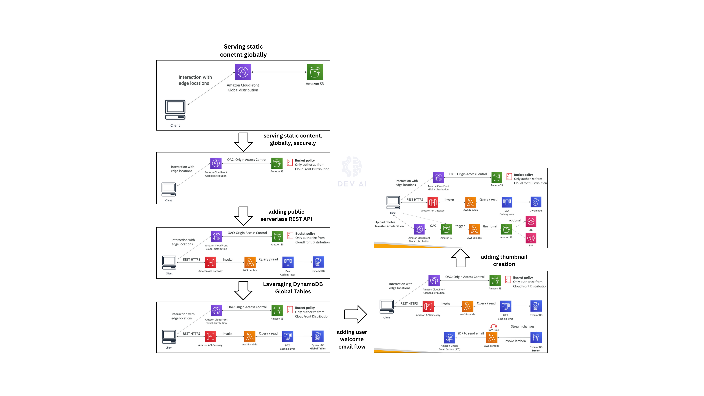
  - **CloudFront + S3**: Distributes static content.
  - **Serverless REST API**: Public, no Cognito needed.
  - **Global DynamoDB Table**: Enables global data access (Aurora alternative).
  - **DynamoDB Streams**: Triggers Lambda for event processing.
  - **Lambda + IAM Role**: Allows interaction with AWS services.
  - **SES for Emails**: Serverless email sending.
  - **S3 Event Triggers**: Can notify via SQS, SNS, or Lambda.

- Microservices architecture
  - **Microservices Adoption**: Transitioning to a microservice architecture.
  - **REST API Communication**: Services interact directly via REST APIs.
  - **Flexible Design**: Each microservice can have a unique architecture.
  - **Improved Development**: Enables a leaner and more independent lifecycle.

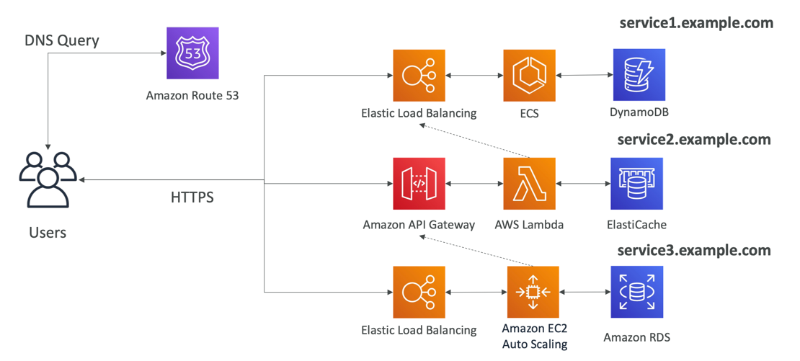
  - **Flexible Microservice Design**: Choose architecture freely.
  - **Communication Patterns**:
    - **Synchronous**: API Gateway, Load Balancers.
    - **Asynchronous**: SQS, Kinesis, SNS, Lambda triggers.
  - **Microservices Challenges**:
    - Overhead for creating new services.
    - Server density/utilization issues.
    - Managing multiple versions.
    - Increased client-side integration complexity.
  - **Serverless Solutions**:
    - some of the challenges above are solved by serverless
    - API Gateway & Lambda scale automatically, pay per use.
    - Easy environment cloning & API replication.
    - Client SDK generation via Swagger for API Gateway.

- Software Updates Offloading:
  - **Current Setup**: EC2 distributes software updates, causing high costs during spikes.
  - **Challenge**: Sudden traffic surges lead to high network and CPU costs.
  - **Solution Needed**: Optimize cost and performance without changing the application.

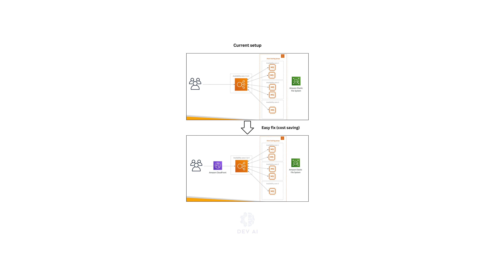

  - **CloudFront Benefits**:
    - No architecture changes needed.
    - Caches static software update files at the edge.
    - Scales automatically, unlike EC2 instances.
    - Reduces EC2 usage, network bandwidth, and availability costs.
    - Simple way to make available app more scalable and cheaper.

## Database Choices in AWS
- **Considerations**:
  - **Workload Type**: Read-heavy, write-heavy, or balanced? Scalability needs?
  - **Data Storage**: Size, growth, retention, and access patterns.
  - **Durability**: Is it the source of truth?
  - **Performance**: Latency, concurrency, and throughput.
  - **Data Model**: Structured (RDBMS) vs. Semi-structured (NoSQL).
  - **Schema & Flexibility**: Strong schema, reporting, search needs.
  - **Cost**: Licensing vs. cloud-native options like Aurora.

- Database types
  - **RDBMS (SQL/OLTP)**: RDS, Aurora (supports joins).
  - **NoSQL**: DynamoDB (JSON), ElastiCache (key/value), Neptune (graphs), DocumentDB (MongoDB), Keyspaces (Cassandra).
  - **Object Storage**: S3 (large objects), Glacier (backups/archives).
  - **Data Warehouse (OLAP/BI)**: Redshift, Athena, EMR.
  - **Search**: OpenSearch (JSON, unstructured searches).
  - **Graph Database**: Neptune (relationship-based data).
  - **Ledger Database**: Amazon QLDB.
  - **Time-Series Database**: Timestream.
  - **Considerations**: Latency, concurrency, data model, schema flexibility, reporting, search, licensing costs.

- AWS RDS
  - **Managed RDBMS**: Supports PostgreSQL, MySQL, Oracle, SQL Server, MariaDB, DB2, and Custom.
  - **Scalability**: Provisioned instance size, auto-scaling storage, EBS volume options.
  - **High Availability**: Read Replicas, Multi-AZ support.
  - **Security**: IAM, Security Groups, KMS encryption, SSL in transit.
  - **Backups & Recovery**: Automated (up to 35 days), manual snapshots.
  - **Maintenance**: Managed updates with downtime.
  - **Integration**: IAM authentication, Secrets Manager.
  - **RDS Custom**: Custom instance access for Oracle & SQL Server.
  - **Use Case**: Relational data storage, SQL queries, transactions.

- AWS Aurora:
  - **Aurora Overview**: Compatible with PostgreSQL/MySQL, separates storage & compute.
  - **Storage**: 6 replicas across 3 AZs, highly available, self-healing, auto-scaling.
  - **Compute**: Multi-AZ DB cluster with auto-scaling read replicas.
  - **Cluster Management**: Custom endpoints for writer & reader instances.
  - **Security & Maintenance**: Same as RDS, with backup & restore options.
  - **Aurora Serverless**: Handles unpredictable workloads, no capacity planning.
  - **Aurora Global**: Up to 16 read replicas per region, <1s replication.
  - **Aurora ML**: Integrates with SageMaker & Comprehend for machine learning.
  - **Database Cloning**: Faster than snapshot restoration.
  - **Use Case**: Like RDS but with better performance, flexibility, and less maintenance.

- AWS ElastiCache:
  - **Managed Cache Service**: Supports Redis & Memcached (like RDS but for caching).
  - **Performance**: In-memory store with sub-millisecond latency.
  - **Scalability**: Redis clustering, Multi-AZ, Read Replicas (sharding).
  - **Security**: IAM, Security Groups, KMS, Redis Auth.
  - **Backup & Maintenance**: Snapshots, point-in-time restore, scheduled maintenance.
  - **Application Changes**: Requires code modifications for integration.
  - **Use Cases**: Key/value store, frequent reads, caching DB queries, session storage (no SQL).

- AWS DynamoDB:
  - **DynamoDB Overview**: Managed, serverless NoSQL DB with millisecond latency.
  - **Capacity Modes**: Provisioned (auto-scaling) or on-demand.
  - **Key-Value Store**: Can replace ElastiCache (supports TTL for session data).
  - **High Availability**: Multi-AZ, decoupled reads/writes, transactions supported.
  - **Performance**: DAX for microsecond read latency.
  - **Security**: IAM-based authentication & authorization.
  - **Event Processing**: Integrates with Lambda & Kinesis via DynamoDB Streams.
  - **Global Tables**: Active-active replication across regions.
  - **Backup & Restore**: PITR (35 days), on-demand backups, S3 import/export.
  - **Flexibility**: Supports rapid schema evolution.
  - **Use Cases**: Serverless apps, small document storage, distributed caching.

- AWS S3:
  - **S3 Overview**: Key/value store for objects, ideal for large files, not many small ones.
  - **Scalability**: Serverless, infinite scaling, max object size 5TB, supports versioning.
  - **Storage Tiers**: Standard, Infrequent Access, Intelligent, Glacier (with lifecycle policies).
  - **Key Features**: Versioning, Encryption, Replication, MFA-Delete, Access Logs.
  - **Security**: IAM, Bucket Policies, ACLs, Access Points, CORS, Object Lock.
  - **Encryption**: SSE-S3, SSE-KMS, SSE-C, Client-side, TLS in transit, default encryption.
  - **Batch & Performance**: S3 Batch, Inventory, Multi-part upload, Transfer Acceleration, S3 Select.
  - **Automation**: Event notifications (SNS, SQS, Lambda, EventBridge).
  - **Use Cases**: Large file storage, website hosting, key-value store.

- AWS DocumentDB
  - **DocumentDB**: AWS’s managed MongoDB-compatible NoSQL database.
  - **Stores JSON Data**: Supports querying and indexing.
  - **Aurora-Like Deployment**: Fully managed, highly available (3 AZ replication).
  - **Auto-Scaling**: Storage grows in 10GB increments, handles high request loads.

- AWS Neptune:
  - **Amazon Neptune**: Fully managed graph database.
  - **Use Case**: Ideal for social networks, fraud detection, recommendation engines.
  - **Scalability**: Supports billions of relationships with millisecond query latency.
  - **High Availability**: Replicated across 3 AZs, up to 15 read replicas.
  - **Optimized for Complex Queries**: Efficient for highly connected datasets.

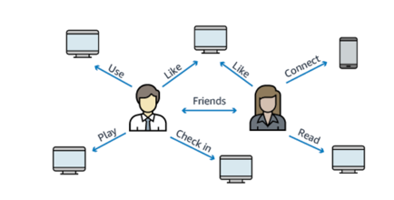
  - Neptune Streams:
    - **Amazon Neptune Streams**:
    - Real-time, ordered sequence of graph data changes.
    - Immediate availability after write, with no duplicates.
    - Accessible via HTTP REST API.
    - **Use Cases**:
      - Notifications for specific changes.
      - Synchronize graph data with other stores (e.g., S3, OpenSearch, ElastiCache).
      - Replicate data across regions.

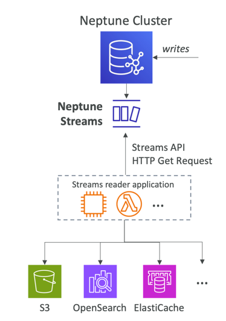

- AWS Keyspaces (for Apache Cassandra)
  - **Amazon Keyspaces**: Managed Apache Cassandra-compatible database.
  - **Features**: Serverless, scalable, highly available, fully managed by AWS.
  - **Automatic Scaling**: Scales tables based on traffic, with 3x replication across AZs.
  - **CQL Support**: Uses Cassandra Query Language.
  - **Performance**: Single-digit millisecond latency, handles 1000s of requests per second.
  - **Capacity**: On-demand or provisioned with auto-scaling.
  - **Security**: Encryption, backup, Point-In-Time Recovery (PITR) up to 35 days.
  - **Use Cases**: IoT data, time-series data, etc.

- AWS QLDB:
  - **Amazon QLDB**: Quantum Ledger Database for financial transactions.
  - **Fully Managed & Serverless**: High availability, replication across 3 AZs.
  - **Immutable**: No data modification/removal, cryptographically verifiable.
  - **Performance**: 2-3x faster than blockchain frameworks, uses SQL for data manipulation.
  - **Difference from Managed Blockchain**: No decentralization, compliant with financial regulations.

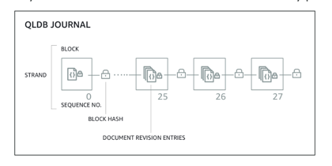

- AWS Timestream
  - **Amazon Timestream**: Fully managed, serverless time series database.
  - **Scalability**: Auto-scales capacity, handling trillions of events daily.
  - **Performance**: 1000x faster and 1/10th the cost of relational databases.
  - **Features**: Scheduled queries, multi-measure records, SQL compatibility.
  - **Storage**: Recent data in-memory, historical data in cost-optimized storage.
  - **Analytics**: Built-in time series functions for near real-time insights.
  - **Security**: Encryption in transit and at rest.
  - **Use Cases**: IoT, operational apps, real-time analytics.


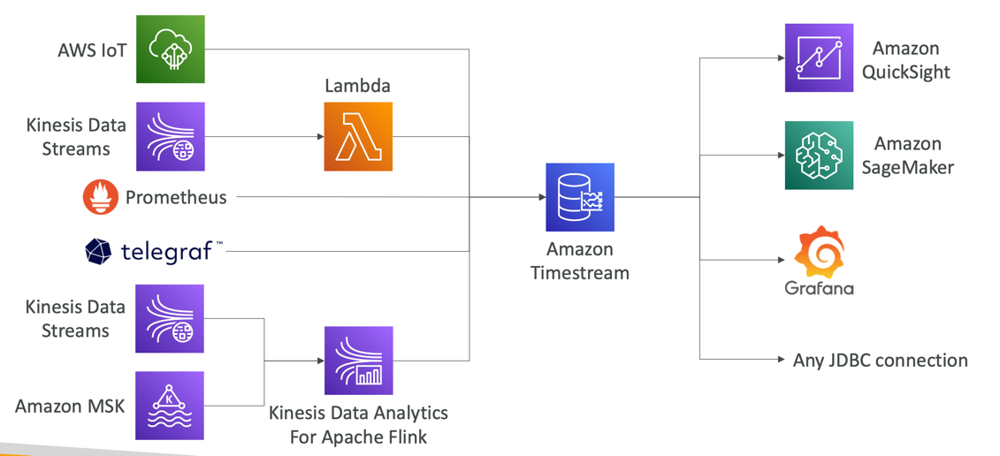

## AWS data analytics
### AWS Athena
Amazon Athena is a **serverless query service** that allows users to analyze data stored in **Amazon S3** using **standard SQL** (built on **Presto**). It supports various file formats, including **CSV, JSON, ORC, Avro, and Parquet**, and costs **$5 per TB of data scanned**. Athena is commonly used for **business intelligence, analytics, and log analysis** and integrates well with **Amazon QuickSight** for reporting.

**Performance Optimization:**
- Use **columnar storage** like **Apache Parquet or ORC** for faster queries and cost savings.
- Convert data using **AWS Glue** and **compress** files (gzip, bzip2, etc.) for better performance.
- **Partition datasets** in S3 to improve query efficiency (e.g., `s3://bucket/table/year=2023/month=1/`).
- Use **larger files (>128MB)** to minimize overhead.

**Federated Query:**
- Athena supports **federated queries**, allowing SQL queries across **multiple data sources** (relational, non-relational, and custom) using **AWS Lambda-based Data Source Connectors** (e.g., **CloudWatch Logs, DynamoDB, RDS**). Query results can be stored back in **Amazon S3**.

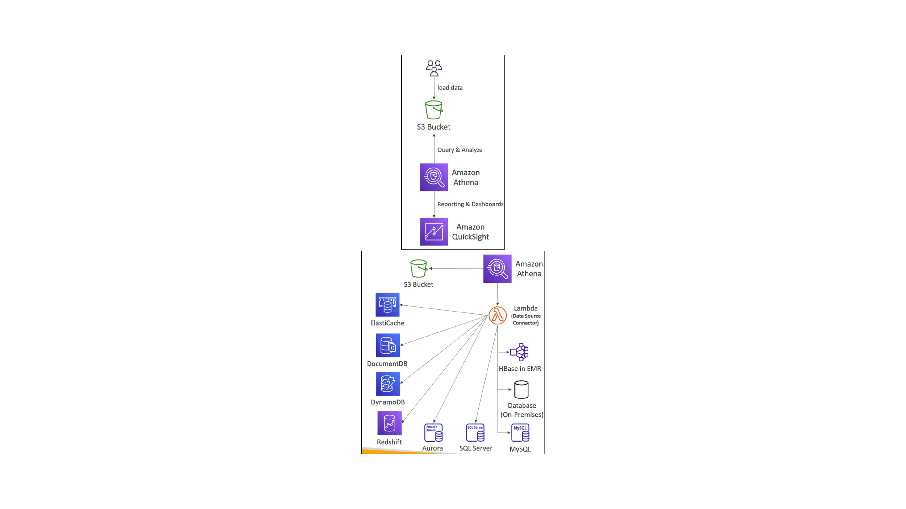

### AWS Redshift

Amazon **Redshift** is a **cloud-based data warehouse** optimized for **OLAP (Online Analytical Processing)** and analytics. It is based on **PostgreSQL** but is not used for **OLTP**. Redshift offers **10x better performance** than traditional data warehouses, scales to **petabytes of data**, and uses **columnar storage** for efficient queries. It follows a **pay-as-you-go** model based on provisioned instances and supports **SQL-based querying**.

**Redshift Cluster Architecture:**
- **Leader Node:** Manages query planning and result aggregation.
- **Compute Nodes:** Execute queries and return results to the leader.
- **Reserved Instances** help save costs.
- Integrates with **BI tools** like **Amazon QuickSight** and **Tableau**.
- Compared to **Athena**, Redshift is faster for **complex queries, joins, and aggregations** due to indexing.

**Snapshots & Disaster Recovery:**
- Supports **Multi-AZ mode** for high availability in some clusters.
- **Snapshots (backups)** are stored in **S3** and are **incremental**.
- Can restore snapshots to a new cluster.
- **Automated snapshots** occur **every 8 hours or every 5GB** (retention: 1-35 days).
- **Manual snapshots** persist until deleted.
- Supports **cross-region snapshot replication**.

**Redshift Spectrum:**
- Allows querying **data in S3 without loading it** into Redshift.
- Requires a **Redshift cluster** to start the query.
- Utilizes **thousands of Spectrum nodes** for query execution.

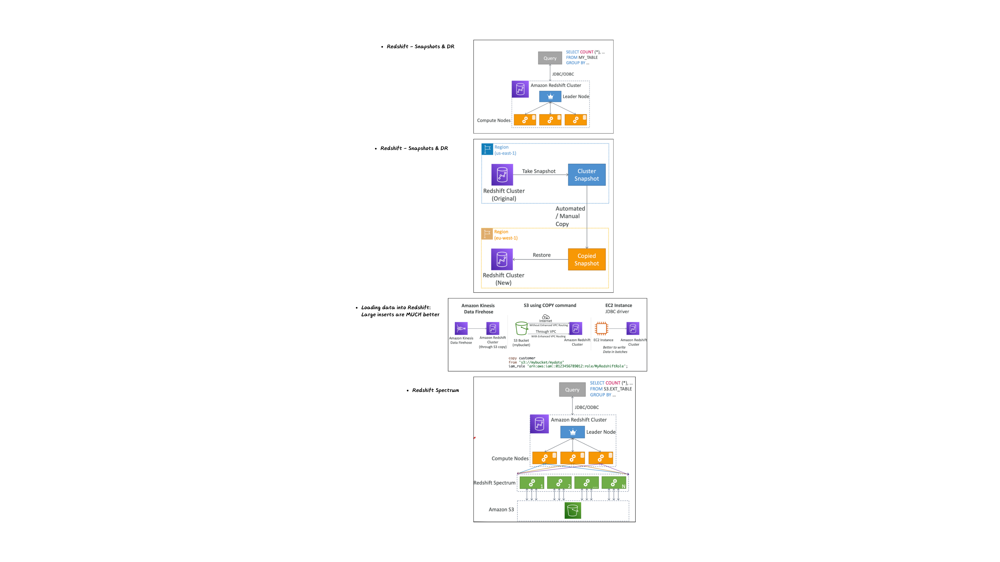

### **Amazon OpenSearch Service Summary**
Amazon OpenSearch Service is the **successor to Amazon Elasticsearch**, enabling **full-text search** across any field, including **partial matches**. It is commonly used as a **complement to other databases** for search functionality.

**Key Features:**
- Supports **managed and serverless** deployment modes.
- **Does not natively support SQL**, but a plugin can enable it.
- Can ingest data from **Kinesis Data Firehose, AWS IoT, and CloudWatch Logs**.
- **Security**: Integrated with **Cognito, IAM, KMS encryption, and TLS**.
- Includes **OpenSearch Dashboards** for visualization and analytics.

Would you like a summary for **AWS Redshift** instead?
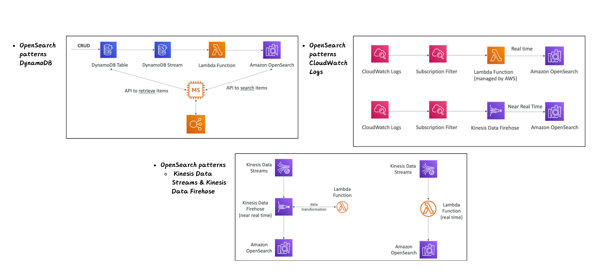

### **Amazon EMR**

Amazon **EMR (Elastic MapReduce)** is a **big data processing service** that helps create **Hadoop clusters** on **EC2 instances** for analyzing large datasets. It includes **Apache Spark, HBase, Presto, and Flink** and handles **provisioning and configuration** automatically. EMR supports **auto-scaling** and integrates with **Spot Instances** for cost efficiency.

**Use Cases:**
- **Big data processing, machine learning, web indexing, and data analytics.**

**EMR Cluster Node Types:**
- **Master Node:** Manages cluster coordination and health (long-running).
- **Core Node:** Runs tasks and stores data (long-running).
- **Task Node (optional):** Runs tasks only (often **Spot Instances**).

**Purchasing Options:**
- **On-Demand:** Reliable, non-terminable.
- **Reserved:** Cost savings (1-year+ commitment).
- **Spot Instances:** Cheaper but can be terminated anytime.

Clusters can be **long-running** or **transient (temporary)** depending on the workload.

- If a company has **many departments sharing EMR clusters**, using **EMR Runtime Roles** is the **best practice** to ensure **secure, isolated, least-privilege access** for each team.

---

#### ✅ How it helps in a multi-department setup:

| Scenario                             | Benefit of EMR Runtime Roles                                  |
|--------------------------------------|---------------------------------------------------------------|
| Dept A runs Spark, needs S3 bucket A | Assign a role **only** with access to `s3://dept-a-data/*`    |
| Dept B runs Hive, needs DynamoDB B   | Use a **different runtime role** for access to DynamoDB B     |
| Shared EMR cluster across teams      | **Same cluster**, but **different roles per job/user/team**   |
| Fine-grained data access             | Prevents accidental or unauthorized cross-team access         |

---

#### 🛠️ How it's implemented:
1. Create **separate IAM roles** per team or job type (e.g., `EMRRuntimeRole-TeamA`, `EMRRuntimeRole-TeamB`).
2. Attach policies scoped to their specific data/resources.
3. When submitting jobs (via **EMR Studio**, **CLI**, or **SDK**), **specify the runtime role**.
4. EMR automatically assumes that role **just for that job**.

---

#### 🧠 Bonus:
- This pattern supports **multi-tenancy**, **auditability**, and **cost tracking**.
- Works well with **EMR Serverless** and **EMR on EKS**, too.

Want a quick template to create such a runtime role?
### **Amazon QuickSight**

Amazon QuickSight is a **serverless, machine learning-powered business intelligence (BI) service** used to create **interactive dashboards** and gain business insights. It is **fast, automatically scalable, and embeddable**, with **per-session pricing**.

**Key Features & Use Cases:**
- Used for **business analytics, visualizations, ad-hoc analysis, and data insights**.
- Integrates with **RDS, Aurora, Athena, Redshift, and S3**.
- Uses the **SPICE engine** for in-memory computation when data is imported.
- **Enterprise edition** supports **Column-Level Security (CLS)**.

**Dashboard & Analysis:**
- Users and groups exist **within QuickSight (not IAM)**.
- A **dashboard** is a **read-only** snapshot of an analysis that can be shared.
- Dashboards retain **filters, parameters, sorting, and controls**.
- To share a dashboard, it must be **published**, and users with access can see the **underlying data**.

[quick-sight.gif](media/aws-data-analytics/quick-sight.gif)

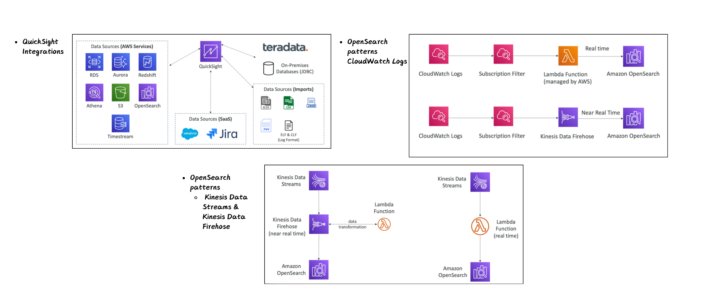

### **Amazon Glue**

Amazon Glue is a **managed, serverless ETL (Extract, Transform, Load) service** used to **prepare and transform data** for analytics.

**Key Features:**
- **Glue Job Bookmarks**: Avoids re-processing old data.
- **Glue Elastic Views**: Uses **SQL** to combine and replicate data across multiple stores, **serverless** with change tracking.
- **Glue DataBrew**: Cleans and normalizes data using **pre-built transformations**.
- **Glue Studio**: Provides a **GUI** to create, run, and monitor ETL jobs.
- **Glue Streaming ETL**: **Real-time data processing** using **Apache Spark Structured Streaming**, compatible with **Kinesis, Kafka, and MSK**.

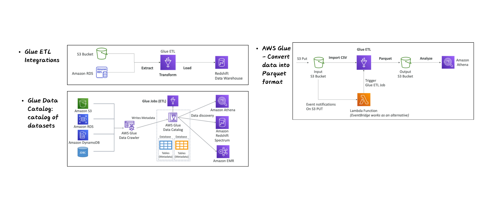

### **Amazon Lake Formation**

Amazon Lake Formation is a **fully managed service** that helps **set up and manage data lakes** efficiently. It simplifies **data discovery, cleansing, transformation, and ingestion** by automating complex tasks like **data collection, cataloging, and deduplication** using **ML Transforms**.

**Key Features:**
- **Centralized data lake** for structured & unstructured data.
- **Pre-built integrations** with S3, RDS, Relational & NoSQL databases.
- **Fine-grained access control** (row & column-level security).
- **Built on AWS Glue**, enhancing data management capabilities.

Lake Formation streamlines **data governance and analytics**, making it easier to **securely manage and analyze data at scale**.
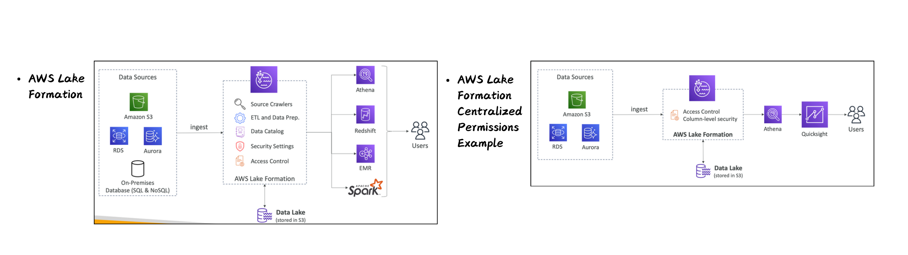

### **Amazon Managed Service for Apache Flink**
- Use Flink (Java, Scala or SQL) to process and analyze streaming data.
- Amazon Managed Service for **Apache Flink** enables running **Apache Flink applications** on a fully **managed AWS cluster** with **automatic scaling, parallel computation, and built-in backups** (checkpoints & snapshots). It supports all **Apache Flink programming features** but **does not read from Firehose** (use **Kinesis Analytics for SQL** instead).

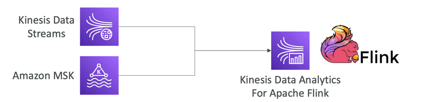

### **Amazon MSK (Managed Streaming for Apache Kafka)**

Amazon MSK is a **fully managed Apache Kafka** service on AWS, serving as an **alternative to Amazon Kinesis**. It allows users to **create, update, and delete Kafka clusters** while AWS manages **Kafka broker nodes and Zookeeper nodes**.

**Key Features:**
- **Deploys in your VPC** with **multi-AZ (up to 3)** for high availability.
- **Automatic recovery** from common Kafka failures.
- **Data stored on EBS** for as long as needed.

**MSK Serverless:**
- Runs **Apache Kafka without capacity management**.
- **Automatically provisions and scales** compute and storage.

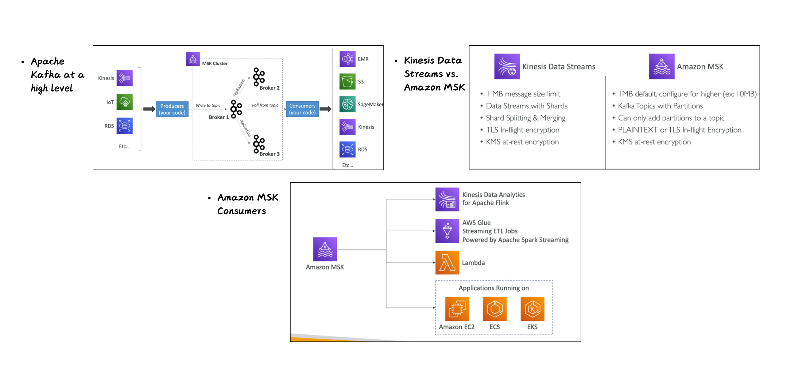

### Big Data Ingestion Pipeline

A **serverless big data ingestion pipeline** is designed for **real-time data collection, transformation, and SQL-based querying**, with reports stored in **Amazon S3** for further analysis and dashboard creation.
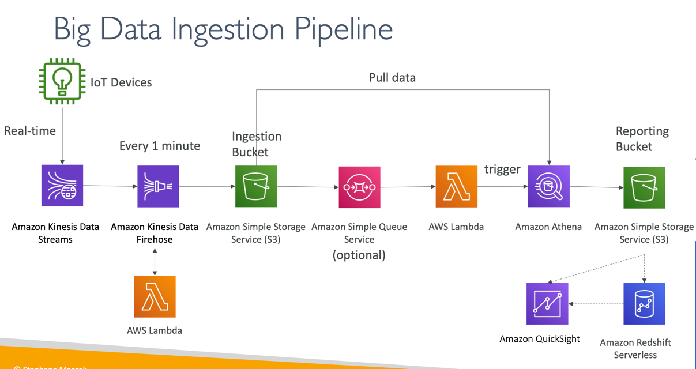

**Pipeline Components:**
- **IoT Core**: Collects data from IoT devices.
- **Kinesis**: Streams data in real time.
- **Firehose**: Delivers data to **S3** with near real-time (1 min) latency.
- **Lambda**: Transforms data before storing it in **S3**.
- **S3 & SQS**: S3 triggers notifications to **SQS**, and Lambda can process the messages.
- **Athena**: Queries transformed data using SQL and stores results in **S3**.
- **Reporting & Analytics**: Data in S3 can be used with **AWS QuickSight, Redshift**, and other tools for dashboards and reporting.

## AWS ML:
### **Amazon Rekognition**

Amazon Rekognition is a **machine learning-powered service** that detects **objects, people, text, and scenes** in images and videos. It offers **facial analysis and search** for user verification, people counting, and celebrity recognition.

**Key Use Cases:**
- **Labeling & Content Moderation** (detect inappropriate content)
- **Text Detection** (extract text from images/videos)
- **Face Detection & Analysis** (gender, age, emotions, etc.)
- **Face Search & Verification** (compare with a database of known faces)
- **Celebrity Recognition**
- **Pathing** (tracking objects in videos, e.g., sports analysis)

**Content Moderation:**
- Identifies **inappropriate or offensive** content in images and videos.
- Common in **social media, broadcast media, advertising, and e-commerce** for user safety.
- Allows setting a **Minimum Confidence Threshold** for flagging content.
- Supports **manual review** via **Amazon Augmented AI (A2I)**.
- Helps businesses **comply with regulations**.

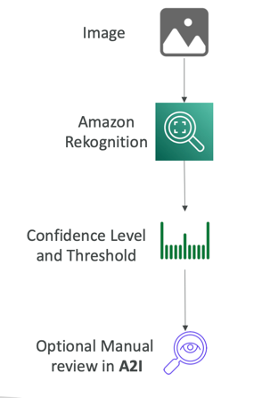

### **Amazon Transcribe**

Amazon Transcribe is an **automatic speech-to-text service** that uses **Automatic Speech Recognition (ASR)** for fast and accurate transcription. It can **automatically detect languages** and **remove Personally Identifiable Information (PII) using redaction**.

**Use Cases:**
- **Transcribing customer service calls**
- **Automating closed captioning and subtitles**
- **Generating metadata for media assets** to create a searchable archive

### **Amazon Polly**

Amazon Polly is a **text-to-speech (TTS) service** that uses **deep learning** to generate **lifelike speech**, enabling applications to talk.

**Customization Features:**
- **Lexicons:** Customize pronunciation (e.g., acronyms, stylized words).
- **SSML (Speech Synthesis Markup Language):** Enhance speech with:
  - Emphasis on words/phrases
  - Phonetic pronunciation
  - Breathing sounds, whispering
  - Newscaster speaking style

Polly allows speech synthesis from **plain text** or **SSML-enhanced documents**, making it ideal for **interactive applications** and **voice-enabled experiences**.

### **Amazon Lex & Connect**

- **Amazon Lex**: AI service that powers **Alexa**, using **Automatic Speech Recognition (ASR)** to convert speech to text and **Natural Language Understanding (NLU)** to recognize intent. It helps build **chatbots and call center bots**.
- **Amazon Connect**: A **cloud-based virtual contact center** that allows businesses to **receive calls, create contact flows, and integrate with CRM systems**. It is **80% cheaper** than traditional contact centers with **no upfront costs**.


### **Amazon Comprehend**
Amazon Comprehend is a **fully managed, serverless Natural Language Processing (NLP) service** that uses **machine learning** to analyze text and extract insights. It can:
- Detect the **language** of the text.
- Extract **key phrases, places, people, brands, and events**.
- Determine **sentiment** (positive or negative).
- Perform **tokenization** and **parts of speech** analysis.
- **Automatically categorize** text files by topic.

**Use Cases:**
- Analyzing **customer interactions (e.g., emails)** to identify factors leading to positive or negative experiences.
- **Grouping articles** by topics that Amazon Comprehend discovers.

### **Amazon Comprehend Medical**
Amazon **Comprehend Medical** is a **natural language processing (NLP) service** that extracts meaningful insights from **unstructured clinical text** such as **physician’s notes, discharge summaries, test results, and case notes**. It includes a **DetectPHI API** to identify **Protected Health Information (PHI)**.

Data can be stored in **Amazon S3**, processed in real time using **Kinesis Data Firehose**, or transcribed from speech with **Amazon Transcribe** for further analysis.

### **Amazon SageMaker**
Amazon SageMaker is a **fully managed service** for developers and data scientists to **build, train, and deploy machine learning (ML) models**. It simplifies the **end-to-end ML process**, eliminating the need to manage infrastructure. SageMaker streamlines tasks that are typically complex and scattered across multiple services, making ML development more efficient.

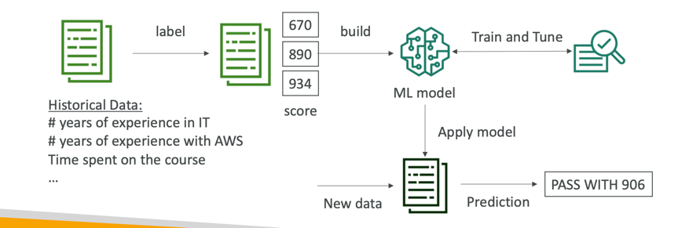


### **Amazon Kendra**

Amazon Kendra is a **fully managed document search service** powered by **Machine Learning**. It enables **natural language search** across various document types (**text, PDF, HTML, PowerPoint, MS Word, FAQs, etc.**).

Key features include:
- **Extracting answers** from within documents.
- **Incremental learning** from user interactions to improve search relevance.
- **Manual fine-tuning** of search results based on importance, freshness, and custom rules.

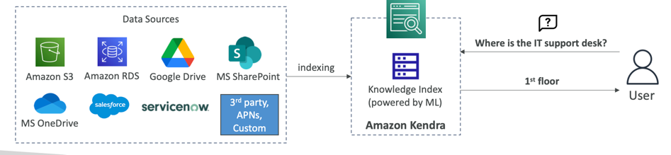

### **Amazon Personalize**

Amazon Personalize is a **fully managed machine learning (ML) service** that provides **real-time personalized recommendations** for applications. It uses the **same technology as Amazon.com** and can be integrated into **websites, apps, SMS, and email marketing systems**.

**Key Features:**
- No need to build, train, or deploy ML models—**quick implementation (days, not months)**.
- Use cases: **product recommendations, content ranking, and personalized marketing**.
- Ideal for industries like **retail, media, and entertainment**.

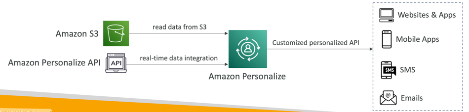

### **Amazon Textract**
Amazon Textract is an **AI/ML-powered service** that **automatically extracts text, handwriting, and data** from scanned documents, including **PDFs and images**. It can also **extract structured data** from **forms and tables**.

**Use Cases:**
- **Financial Services** – Invoices, financial reports
- **Healthcare** – Medical records, insurance claims
- **Public Sector** – Tax forms, ID documents, passports

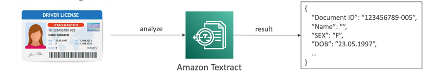

### **AWS Machine Learning**

- **Rekognition**: Face detection, labeling, celebrity recognition.
- **Transcribe**: Converts audio to text (e.g., subtitles).
- **Polly**: Converts text to audio.
- **Translate**: Provides language translations.
- **Lex**: Builds conversational chatbots.
- **Connect**: Cloud-based contact center.
- **Comprehend**: Natural language processing (NLP).
- **SageMaker**: Machine learning platform for developers and data scientists.
- **Forecast**: Creates accurate forecasts.
- **Kendra**: ML-powered search engine.
- **Personalize**: Provides real-time personalized recommendations.
- **Textract**: Detects text and data in documents.

## AWS Monitoring & Audit: CloudWatch, CloudTrail & Config
### AWS Cloud Watch
- **Amazon CloudWatch Metrics**
  - Provides **metrics** for AWS services (e.g., **CPUUtilization, NetworkIn**).
  - Metrics belong to **namespaces** and have up to **30 dimensions** (e.g., **instance ID, environment**).
  - Includes **timestamps** and supports **dashboards** for visualization.
  - Allows **custom metrics** (e.g., **RAM usage**).

- **CloudWatch Metric Streams**
  - Streams metrics **in near real-time** with **low latency**.
  - Supports **Amazon Kinesis Data Firehose** and **third-party services** (e.g., **Datadog, Splunk**).
  - Option to **filter** specific metrics for streaming.

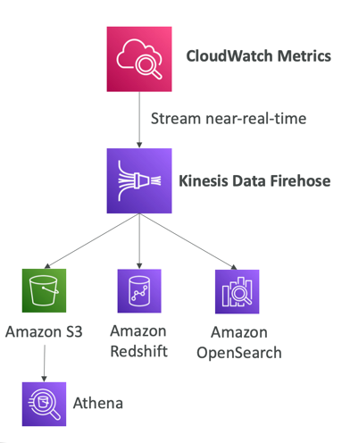

- **AWS CloudWatch Logs**
  - **CloudWatch Logs** is a **centralized logging service** in AWS that collects, monitors, and analyzes log data.
  - **Key Concepts:**
    - **Log Groups:** Organize logs by application or service.
    - **Log Streams:** Contain logs from instances, files, or containers.
    - **Retention Policies:** Logs can be stored indefinitely or expire (1 day to 10 years).
    - **Encryption:** Logs are encrypted by default and can use **KMS-based encryption** with custom keys.
  - **Log Destinations:** CloudWatch Logs can send logs to:
    - **Amazon S3** (exports)
    - **Kinesis Data Streams / Firehose**
    - **AWS Lambda**
    - **OpenSearch** for indexing & searching
  - **Log Sources:**
    - AWS services like **Elastic Beanstalk, ECS, Lambda, API Gateway, VPC Flow Logs, CloudTrail, and Route 53**.
    - **CloudWatch Agents** (Standard & Unified) for collecting logs from applications and servers.

- **CloudWatch Logs Insights:**
  - **Query and analyze logs** using a specialized **query language**.
  - Supports **filtering, aggregations, and field extractions**.
  - Can **search for patterns**, e.g., finding an **IP address** or counting **ERROR** occurrences.
  - Queries can be **saved and added to dashboards**.
  - Supports **multi-account log queries**.
  - **Not a real-time engine**, but useful for historical log analysis.

```
fields @timestamp, @message, @logStream, @log
| sort @timestamp desc
| limit 10000
```
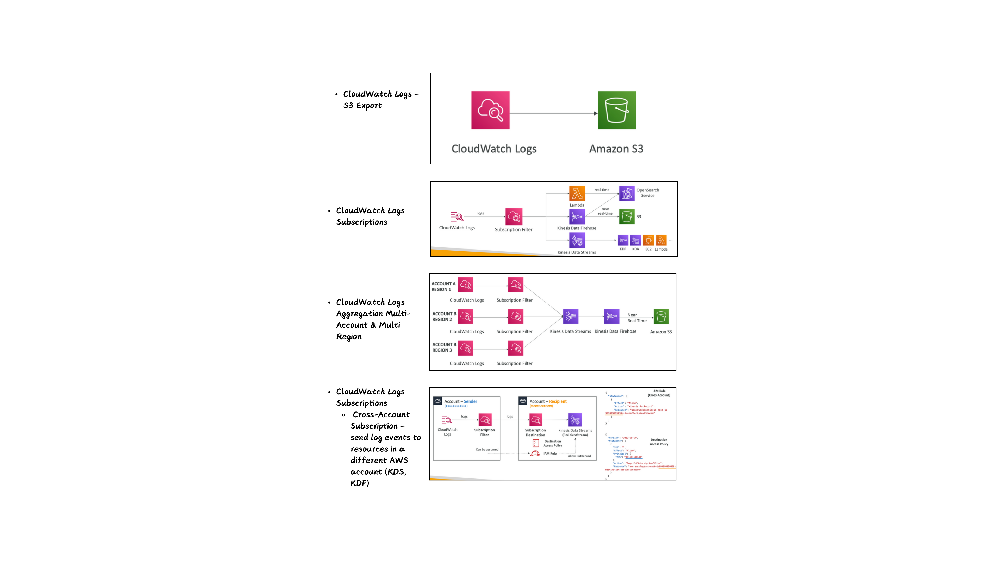
- Demos
  - [cloudwatch-log-metric-demo.gif](media/monitoring/cloudwatch-log-metric-demo.gif)
  - [cloudwatch-live-tailing.gif](media/monitoring/cloudwatch-live-tailing.gif)

- **CloudWatch Logs for EC2**
  - No default EC2 logs in CloudWatch
  - Requires CloudWatch agent to push logs
  - Ensure correct IAM permissions
  - Can be used on-premises

- **CloudWatch Logs Agent & Unified Agent**
  - Used for EC2 and on-premises servers
  - **Logs Agent:** Older version, sends only logs
  - **Unified Agent:** Sends logs + system metrics, supports SSM Parameter Store

- **CloudWatch Unified Agent – Metrics**
  - Collects system metrics on EC2/Linux servers
  - Monitors CPU, disk, RAM, network, processes, swap space
  - EC2 provides basic built-in metrics (disk, CPU, network)

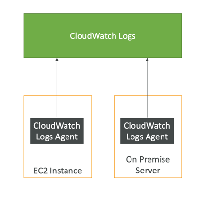
- CloudWatch Alarms
  - **CloudWatch Alarms**: Trigger notifications based on metrics with various evaluation options. States: OK, INSUFFICIENT_DATA, ALARM. Supports high-resolution periods (10s, 30s, 60s+).
  - **Alarm Targets**: Can stop, terminate, reboot, or recover EC2 instances, trigger Auto Scaling, or send notifications via SNS.
  - **Composite Alarms**: Monitor multiple alarms using AND/OR conditions to reduce alarm noise.

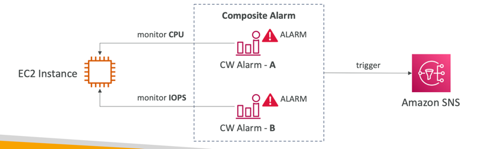
- EC2 Instance Recovery using `alarm actions`
  - Status Check:
    - Instance status = check the EC2 VM
    - System status = check the underlying hardware
    - Attached EBS status = check attached EBS volumes
  - Recovery: Same Private, Public, Elastic IP, metadata, placement group

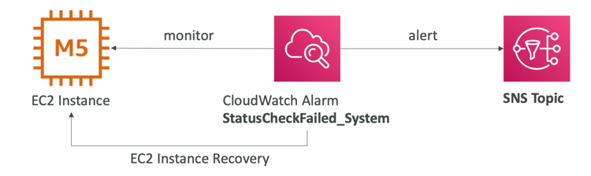


- **CloudWatch Alarm Insights**: Can be created using CloudWatch Logs Metrics Filters.
- **Testing Alarms**: Use AWS CLI to manually set alarm state for testing.


```
aws cloudwatch set-alarm-state --alarm-name "myalarm" --state-value
ALARM --state-reason "testing purposes"
```

- Demo
  - [ec2-alarm-action.gif](media/monitoring/ec2-alarm-action.gif)
#### AWS Event Bridge (formerly CloudWatch Events)
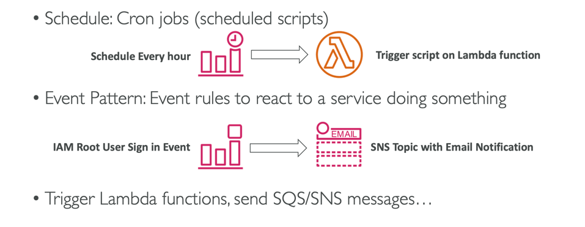
- Event Bridge Rules

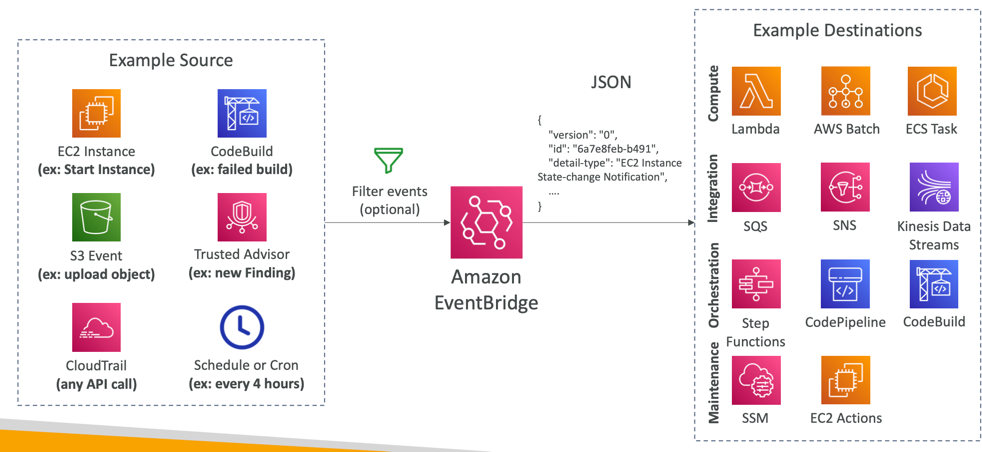

- Event buses can be shared with other AWS accounts using resource-based policies.
- Events can be archived (all or filtered) indefinitely or for a set period.
- Archived events can be replayed when needed.

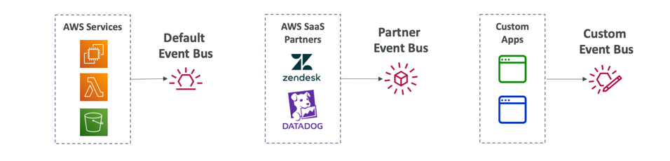

- Amazon EventBridge – Schema Registry
  - EventBridge Schema Registry can analyze events and infer schemas.
  - It generates code to help applications understand event data structure.
  - Schemas can be versioned.

- Amazon EventBridge – Resource-based Policy
  - Resource-based policies manage permissions for a specific Event Bus.
  - Control access by allowing or denying events from other AWS accounts or regions.
  - Useful for aggregating events from an AWS Organization into a single account or region.

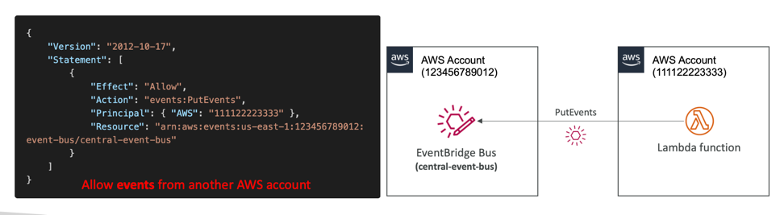


- Demo: creating custom bus, collection events (from aws and external systems such as OAuth), finally setting  up rules to take action

[aws-event-bridge-bus-rule-demo.gif](media/monitoring/aws-event-bridge-bus-rule-demo.gif)

- **AWS CloudWatch Insights**

  - **CloudWatch Container Insights**
    - Collects, aggregates, and summarizes metrics and logs from containerized applications.
    - Supports **Amazon ECS, Amazon EKS, Kubernetes on EC2, and Fargate (ECS & EKS)**.
    - Uses a **CloudWatch Agent** for Kubernetes.

  - **CloudWatch Contributor Insights**
    - Analyzes log data and generates time series for **top-N contributors** and **unique contributor usage**.
    - Helps identify **top talkers, heaviest network users, and problematic hosts/URLs**.
    - Works with **AWS-generated logs (e.g., VPC, DNS)** and allows **custom or built-in rules** to analyze CloudWatch Logs.

  - **CloudWatch Lambda Insights**
    - Provides monitoring and troubleshooting for **AWS Lambda** applications.
    - Collects system-level metrics (**CPU, memory, disk, network**) and diagnostic data (**cold starts, worker shutdowns**).
    - Available as a **Lambda Layer**.

  - **CloudWatch Application Insights**
    - Detects and visualizes potential issues in applications running on **EC2 (Java, .NET, IIS, databases, etc.)**.
    - Apps integrate with AWS services like **EBS, RDS, ELB, Lambda, S3, DynamoDB, API Gateway, etc.**
    - Uses **SageMaker** for enhanced insights and sends alerts to **Amazon EventBridge & SSM OpsCenter**.

  - **CloudWatch Insights for Operational Visibility - summary**
    - Provides **metrics, logs, and dashboards** for **containers, serverless applications, top contributors, and application health**.
    - Enhances **troubleshooting and monitoring** across AWS infrastructure and services.

### **AWS CloudTrail**

- **Purpose**: Provides governance, compliance, and audit logging for AWS accounts.
- **Functionality**:
  - Logs **all API calls** made via **Console, SDK, CLI, and AWS Services**.
  - Enabled by default and supports logging to **CloudWatch Logs or S3**.
  - Trails can be applied to **all regions (default) or a specific region**.
  - Useful for investigating **resource deletions**.

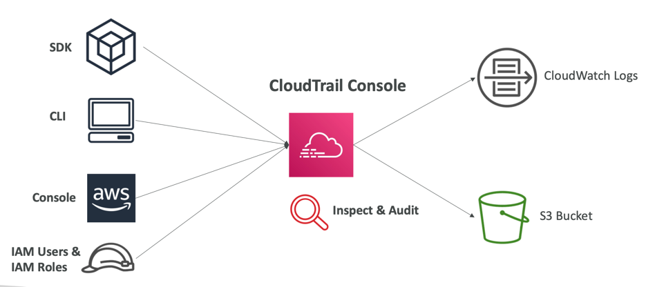
- **Types of Events**:
  - **Management Events**: Operations that are performed on resources in your AWS account
      - Examples:
        - Configuring security (IAM `AttachRolePolicy`)
        - Configuring rules for routing data (Amazon EC2 `CreateSubnet`)
        - Setting up logging (AWS CloudTrail `CreateTrail)
  - **Data Events** (disabled by default due to high volume): Tracks **S3 object-level operations (ex: GetObject, DeleteObject, PutObject) and Lambda executions (Invoke API)**.
  - **CloudTrail Insights**: Detects **anomalous activities** such as **unexpected IAM actions, service bursts, or missing maintenance events**.
    - CloudTrail Insights analyzes normal management events to create a baseline
    - And then continuously analyzes write events to detect unusual patterns 
      - Anomalies appear in the CloudTrail console
      - Event is sent to Amazon S3
      - An EventBridge event is generated (for automation needs)
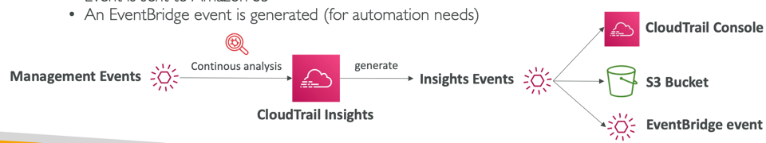
- **Event Storage & Retention**:
  - Stored for **90 days** in CloudTrail.
  - For longer retention, store logs in **S3** and analyze with **Athena**.
  - **EventBridge integration** enables automation.

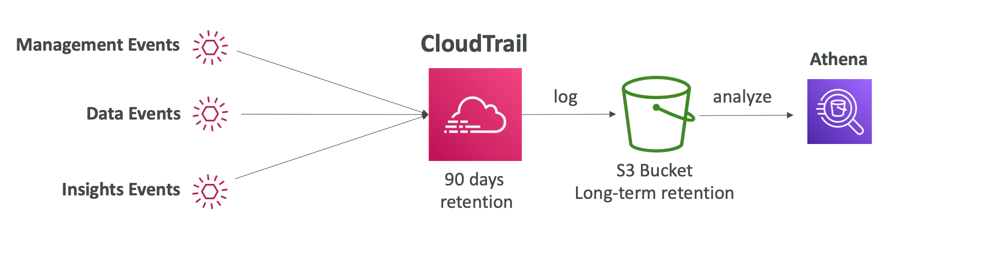

- Demos
  - [cloudtrail-demo.gif](media/monitoring/cloudtrail-demo.gif)

- CloudTrail scenarios:
  - Amazon EventBridge – Intercept API Calls

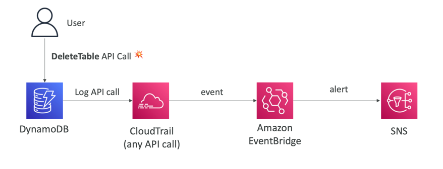
  - Amazon EventBridge + CloudTrail

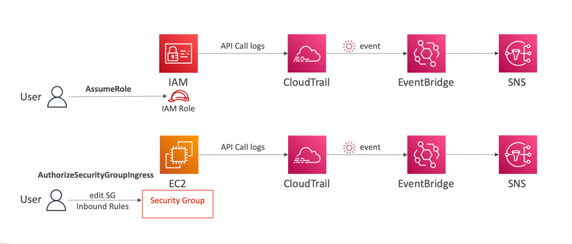

### **AWS Config**
- **Audits and records AWS resource compliance**
- **Tracks configurations and changes over time**
- **Questions AWS Config can answer:**
  - Is there unrestricted SSH access to my security groups?
  - Do my buckets have public access?
  - How has my ALB configuration changed?
- **Receive SNS alerts for changes**
- AWS Config has a managed rule named `acm-certificate-expiration-check` to check for expiring certificates (configurable number of days)
- **Per-region service** (can be aggregated across regions and accounts)
- **Store configuration data in S3** (analyzed by Athena)
- **Config Rules:**
  - Use AWS-managed (75+ rules) or create custom rules (via AWS Lambda)
    - Example: Evaluate EBS disk type (gp2)
    - Example: Evaluate EC2 instance type (t2.micro)
  - Evaluate rules on config changes or at set intervals
  - **Does not deny actions**
  - **Pricing:**
    - $0.003 per config item (per region)
    - $0.001 per rule evaluation (per region)
- **AWS Config Resource – View:**
  - Resource compliance, configuration, and CloudTrail API calls over time
- **Remediation:**
  - Automatically fix non-compliant resources with **SSM Automation Documents**
  - Use pre-built or custom Automation Documents (trigger Lambda functions)
  - Set retries for non-compliant resources

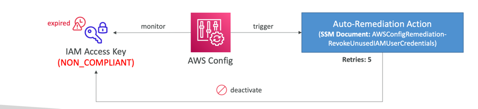
- Config Rules – Notifications
  - Use EventBridge to trigger notifications when AWS resources are non-compliant

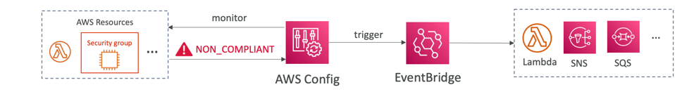
  - Ability to send configuration changes and compliance state notifications to SNS (all events – use SNS Filtering or filter at client-side)


- Demo:
  - [aws-cloudconfig-creation-demo.gif](media/monitoring/aws-cloudconfig-creation-demo.gif)
  - [aws-cloudconfig-rules-demo.gif](media/monitoring/aws-cloudconfig-rules-demo.gif)

- CloudWatch vs CloudTrail vs CloudConfig: difference in an example using ALB
  - CloudWatch:
    - Monitoring Incoming connections metric
    - Visualize error codes as % over time
    - Make a dashboard to get an idea of your load balancer performance
  - Config:
    - Track security group rules for the Load Balancer
    - Track configuration changes for the Load Balancer
    - Ensure an SSL certificate is always assigned to the Load Balancer (compliance)
  - CloudTrail:
    - Track who made any changes to the Load Balancer with API calls


## AWS Security & Encryption - KMS, SSM parameter store, Shield, WAF
**Encryption in Transit (TLS/SSL)**
- Encrypts data before transmission and decrypts it upon arrival.
- Uses TLS certificates for secure HTTPS communication.
- Prevents man-in-the-middle (MITM) attacks.
- see `TLS/SSL` sections under LB & S3 sections

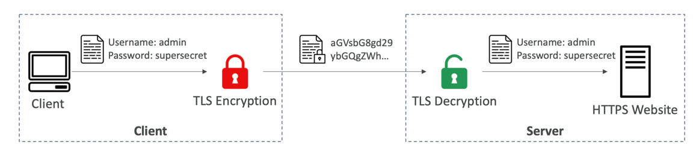

**Server-Side Encryption at Rest**
- Encrypts data upon receipt and decrypts it before transmission.
- Stores data in encrypted form using a data key.
- Requires key management, with the server needing access to the keys.

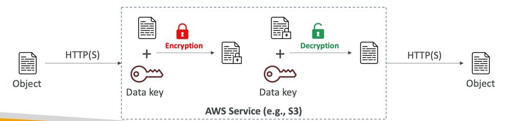

**Client-Side Encryption**
- Data is encrypted by the client and never decrypted by the server.
- Only the receiving client can decrypt the data.
- The server cannot access or decrypt the data.
- Supports Envelope Encryption.

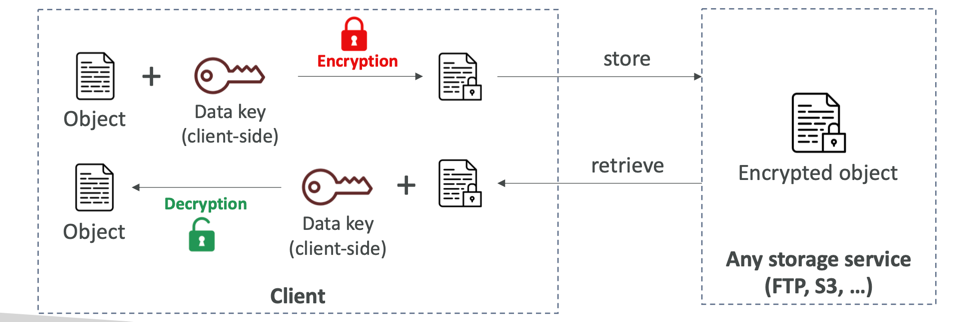

### KMS
AWS KMS (Key Management Service)
- Anytime you hear “encryption” for an AWS service, it’s most likely KMS 
- AWS manages encryption keys for us
- Fully integrated with IAM for authorization
- Easy way to control access to your data
- Able to audit KMS Key usage using CloudTrail
- Seamlessly integrated into most AWS services (EBS, S3, RDS, SSM...)
- Never ever store your secrets in plaintext, especially in your code! 
  - KMS Key Encryption also available through API calls (SDK, CLI)
  - Encrypted secrets can be stored in the code / environment variables
- Upon KMS key deletion it goes into `pending deletion` status
- KMS family & types:
  - KMS Keys is the new name of KMS Customer Master Key
  - Symmetric (AES-256 keys)
    - Single encryption key that is used to Encrypt and Decrypt
    - AWS services that are integrated with KMS use Symmetric CMKs
    - You never get access to the KMS Key unencrypted (must call KMS API to use)
  - Asymmetric (RSA & ECC key pairs)
    - Public (Encrypt) and Private Key (Decrypt) pair
    - Used for Encrypt/Decrypt, or Sign/Verify operations
    - The public key is downloadable, but you can’t access the Private Key unencrypted
    - Use case: encryption outside of AWS by users who can’t call the KMS API

  - Key types:
    - AWS Owned Keys (free): SSE-S3, SSE-SQS, SSE-DDB (default key)
    - AWS Managed Key: free (aws/service-name, example: aws/rds or aws/ebs) • 
    - Customer managed keys created in KMS: $1 / month
    - Customer managed keys imported: $1 / month

- pay for API call to KMS ($0.03 / 10000 calls)

Automatic Key rotation:
  - AWS-managed KMS Key: automatic every 1 year
  - Customer-managed KMS Key: (must be enabled) automatic & on-demand
  - Imported KMS Key: only manual rotation possible using alias

Copying Snapshots across regions

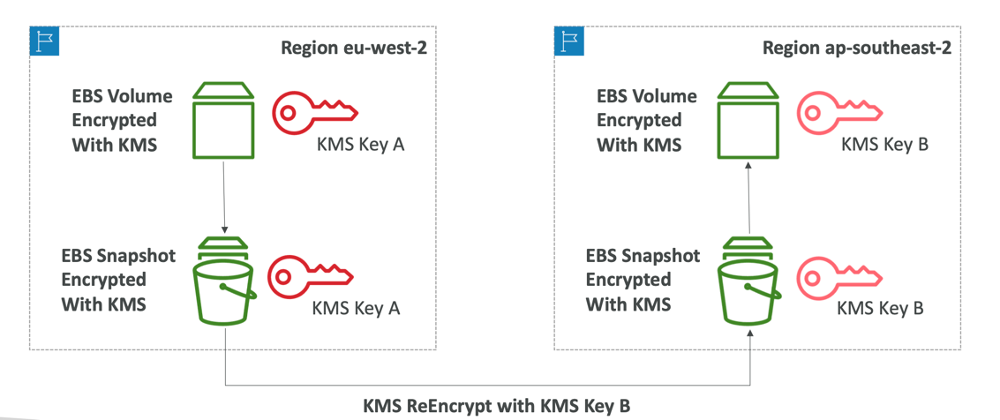

**KMS Key Policies** control access to KMS keys, “similar” to S3 bucket policies. The difference: you cannot control access without them
- Default KMS Key Policy:
  - Created if you don’t provide a specific KMS Key Policy
  - Complete access to the key to the root user = entire AWS account
- Custom KMS Key Policy:
  - Define users, roles that can access the KMS key
  - Define who can administer the key
  - Useful for cross-account access of your KMS key

**Copying snapshots across accounts**
1. Create a Snapshot, encr ypted with your own KMS Key (Customer Managed Key)
2. Attach a KMS Key Policy to authorize cross-account access
3. Share the encr ypted snapshot
4. (in target) Create a copy of the Snapshot, encrypt it with a CMK in your account
5. Create a volume from the snapshot

```
{
    "Version": "2012-10-17",
    "Id": "CrossAccountSnapshotCopy",
    "Statement": [
        {
            "Sid": "AllowCrossAccountAccess",
            "Effect": "Allow",
            "Principal": {
                "AWS": "arn:aws:iam::TARGET_ACCOUNT_ID:root"
            },
            "Action": [
                "kms:Decrypt",
                "kms:CreateGrant",
                "kms:DescribeKey",
                "kms:ReEncrypt*"
            ],
            "Resource": "*",
            "Condition": {
                "StringEquals": {
                    "kms:CallerAccount": "SOURCE_ACCOUNT_ID",
                    "kms:ViaService": "ec2.REGION.amazonaws.com"
                }
            }
        }
    ]
}
```
**Demo**

[kms-customer-managed-key-demo.gif](media/encryption-security/kms-customer-managed-key-demo.gif)

**KMS Multi-Region Keys**

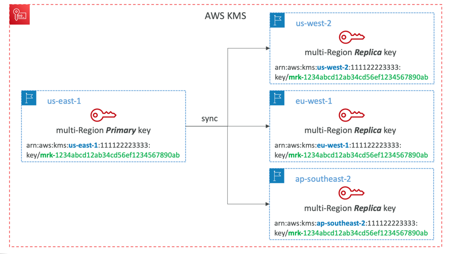

- Identical KMS keys in different AWS Regions that can be used interchangeably
- Multi-Region keys have the same key ID, key material, automatic rotation... • Encrypt in one Region and decrypt in other Regions
- No need to re-encrypt or making cross-Region API calls 
- KMS Multi-Region are NOT global (Primary + Replicas)
- Each Multi-Region key is managed independently
- Use cases: 
  - global client-side encryption, 
  - encryption on Global DynamoDB, 
  - Global Aurora
  - storing s3 bucket data in multiple regions using the same encryption key.

DynamoDB Global Tables and KMS Multi-Region Keys Client-Side encryption
- We can encrypt specific attributes client-side in our DynamoDB table using the Amazon DynamoDB Encryption Client
- Combined with Global Tables, the client-side encrypted data is replicated to other regions
- If we use a multi-region key, replicated in the same region as the DynamoDB Global table, then clients in these regions can use low- latency API calls to KMS in their region to decrypt the data client-side
- Using client-side encryption we can protect specific fields and guarantee only decryption if the client has access to an API key

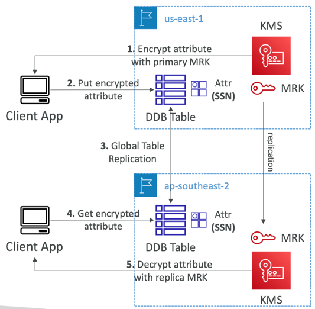

Global Aurora and KMS Multi-Region Keys Client-Side encryption
- We can encrypt specific attributes client-side in our Aurora table using the AWS Encryption SDK
- Combined with Aurora Global Tables, the client-side encrypted data is replicated to other regions
- If we use a multi-region key, replicated in the same region as the Global Aurora DB, then clients in these regions can use low-latency API calls to KMS in their region to decrypt the data client-side
- Using client-side encryption we can protect specific fields and guarantee only decryption if the client has access to an API key, we can protect specific fields even from database admins

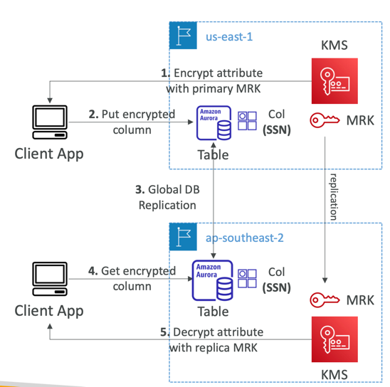

**S3 Replication – Encryption Considerations** - When replication is enabled

- **Default Replication**: Unencrypted objects and SSE-S3 encrypted objects replicate automatically.
- **SSE-C Encrypted Objects**: Can be replicated.
- **SSE-KMS Encrypted Objects**: Require additional configuration:
  - Enable replication for SSE-KMS.
  - Specify the KMS key to encrypt the objects in target bucket.
  - adapt the kms key policy for the target key.
  - Create and use an IAM role that allow the s3 replication service to `kms:Decrypt` (source key) and `kms:Encrypt` (target key).
  - Handle potential KMS throttling by requesting a Service Quotas increase.
- **Multi-Region KMS Keys**: Supported but treated as independent keys—S3 decrypts and re-encrypts objects during replication.

AMI Sharing Process (Encrypted via KMS)

1. The AMI in the **source account** is encrypted with a KMS key from the same account.
2. Grant **Launch Permission** to the **target AWS account** by modifying the image attributes.
3. Share the **KMS key** used to encrypt the AMI’s snapshot with the target account or its IAM role.
4. The **IAM role/user** in the target account must have permissions for:
  - `DescribeKey`, `ReEncrypt`, `CreateGrant`, and `Decrypt` on the shared KMS key.
5. (Optional) The **target account** can specify a new KMS key to re-encrypt the volumes when launching an EC2 instance from the AMI.
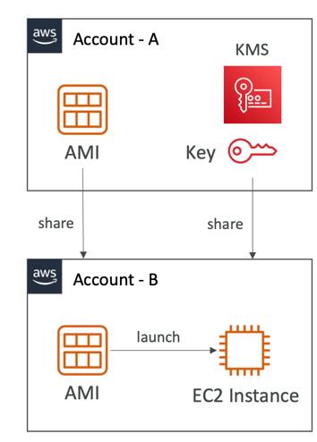

### SSM Parameter Store
- Secure storage for configuration and secrets
- Optional Seamless Encryption using KMS
- Serverless, scalable, durable, easy SDK
- Version tracking of configurations / secrets
- Security through IAM
- Notifications with Amazon EventBridge 
- Integration with CloudFormation: input parameters for the stack
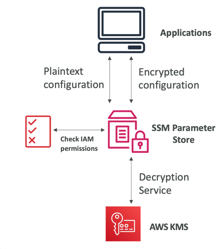


SSM Parameter Store Hierarchy
- Using IAM Role, accesses are managed
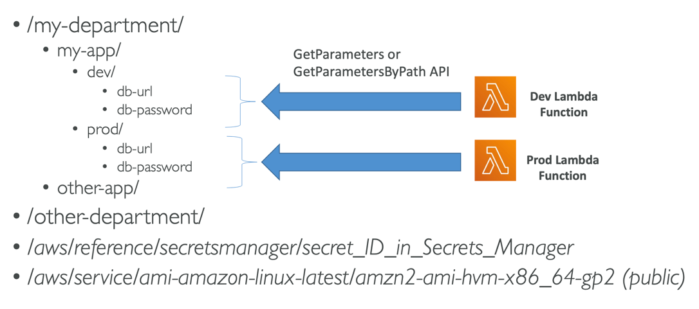

Standard and advanced parameter tiers
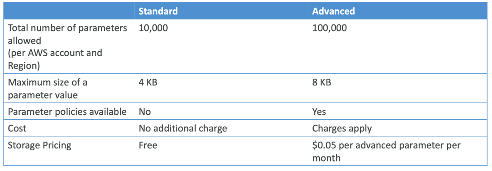


Parameters Policies (for advanced parameters)
- Allow to assign a TTL to a parameter (expiration date) to force updating or deleting sensitive data such as passwords
- Can assign multiple policies at a time

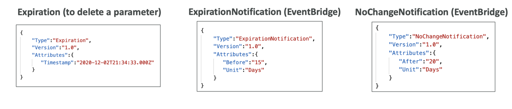

**Demo**
  - [ssm-parameters-store-demo-1.gif](media/encryption-security/ssm-parameters-store-demo-1.gif)
  - [ssm-parameters-store-demo-2.gif](media/encryption-security/ssm-parameters-store-demo-2.gif)

**Demo: Using allowing a lambda to make use of parameter store**


With decryption

[ssm-parameters-store-lambda-demo-2.gif](media/encryption-security/ssm-parameters-store-lambda-demo-2.gif)

### AWS Secrets Manager
- A **secure service** for storing and managing secrets.
- Supports **automatic secret rotation** at configurable intervals.
- Can **automate secret generation** during rotation using AWS Lambda.
- **Seamless integration** with Amazon RDS (MySQL, PostgreSQL, Aurora).
- Secrets are **encrypted using AWS KMS**.
- Primarily designed for **RDS integration** but can store other secrets as well.

AWS Secrets Manager – Multi-Region Secrets

- Allows **replication of secrets** across multiple AWS Regions.
- **Keeps read replicas in sync** with the primary secret.
- Option to **promote a read replica** to a standalone secret.
- Ideal for **multi-region applications, disaster recovery, and distributed databases**.

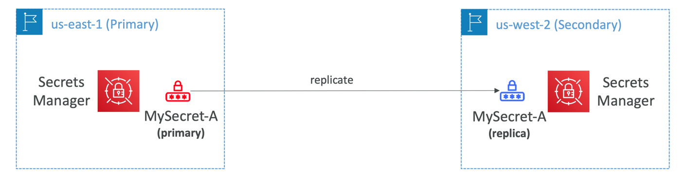
**Demo**

[aws-secret-manager-demo.gif](media/encryption-security/aws-secret-manager-demo.gif)

### AWS Certificate Manager (ACM)
- Easily provision, manage, and deploy TLS Certificates
- Provide in-flight encryption for websites (HTTPS)
- Supports both public and privateTLS certificates
- Free of charge for publicTLS certificates
- Automatic TLS certificate renewal
- Integrations with (loadTLS certificates on)
  - ElasticLoadBalancers(CLB,ALB,NLB)
  - CloudFront Distributions
  - APIs on API Gateway
- Cannot use ACM with EC2 (can’t be extracted)

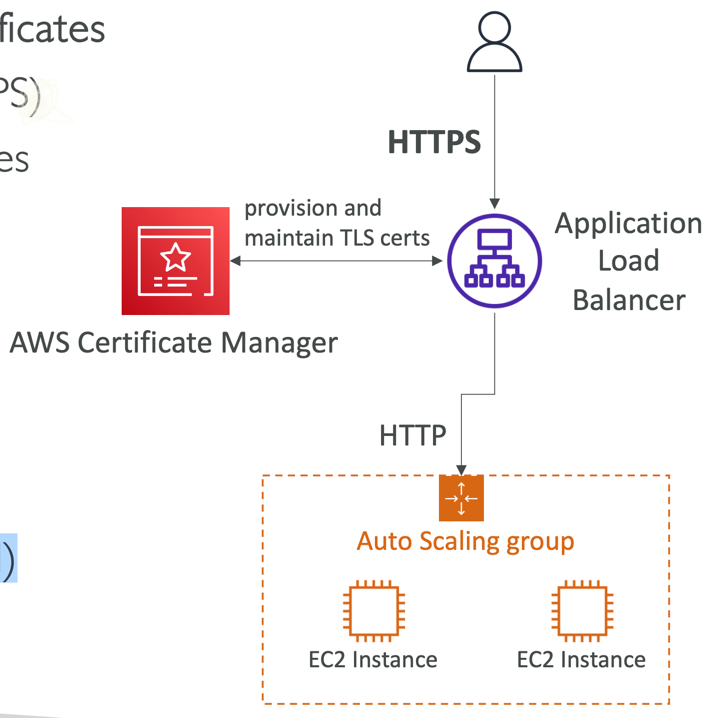

ACM – Requesting Public Certificates

1. List domain names to be included in the certificate 
  - Fully Qualified Domain Name (FQDN): corp.example.com 
  - WildcardDomain:*.example.com
2. Select Validation Method: DNS Validation or Email validation 
  - DNS Validation is preferred for automation purposes
  - Email validation will send emails to contact addresses in the WHOIS database 
  - DNS Validation will leverage a CNAME record to DNS config (ex: Route 53)
3. It will take a few hours to get verified
4. The Public Certificate will be enrolled for automatic renewal
  - ACM automatically renews ACM-generated certificates 60 days before expiry

ACM – Importing Public Certificates 
- Option to generate the certificate outside of ACM and then import it
- No automatic renewal, must import a new certificate before expiry
- ACM sends daily expiration events starting 45 days prior to expiration
  - The # of days can be configured
  - Events are appearing in EventBridge
- AWS Config has a managed rule named acm-certificate-expiration-check to check for expiring certificates (configurable number of days)

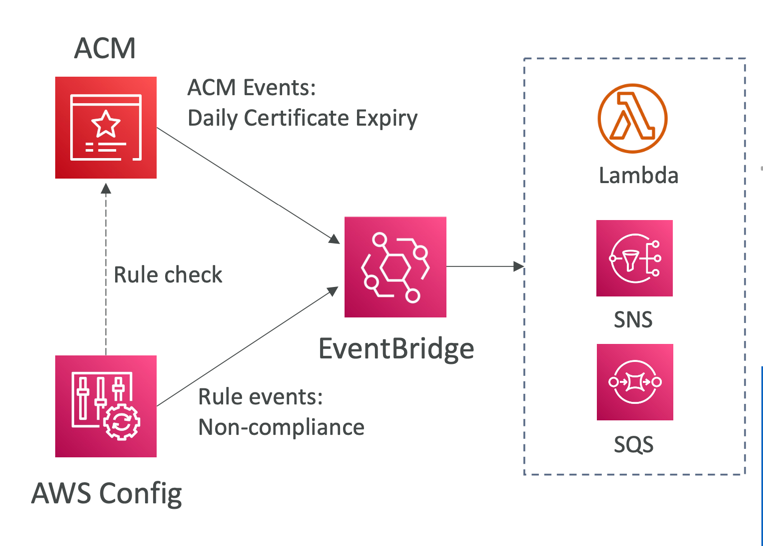

ACM – Integration with ALB
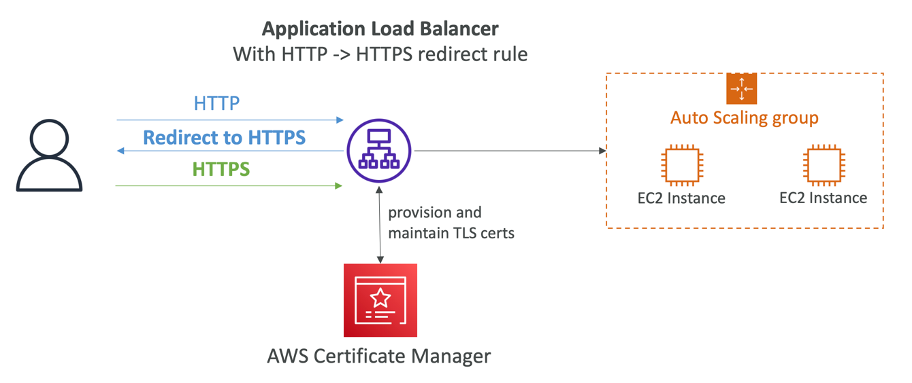

AWS ACM & API Gateway integration
- Check [API Gateway Deployment](#aws-api-management) for different deployment modes

- Create a Custom Domain Name in API Gateway
- Edge-Optimized (default): For global clients
  - Requests are routed through the CloudFront Edge locations(improves latency)
  - The API Gateway still lives in only one region
  - TheTLS Certificate must be in the same region as CloudFront, in **us-east-1**
  - Then setup CNAME or (better) A-Alias record in Route53
- Regional:
  - For clients within the same region
  - The TLS Certificate must be imported on API Gateway,in the same region as the API Stage
  - Then setup CNAME or (better) A-Alias record in Route53

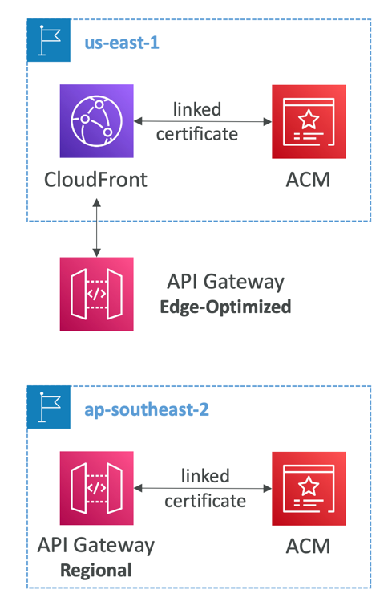


### AWS WAF – Web Application Firewall
AWS WAF helps protect your web applications from common threats like **SQL injection** and **Cross-Site Scripting (XSS)** by defining Web Access Control List (**Web ACL**) rules.

- Protects your web applications from common web exploits (Layer 7)
  - Layer 7 is HTTP (vs Layer 4 is TCP/UDP)
- Deploy on
  - Application Load Balancer
  - API Gateway
  - CloudFront
  - AppSync GraphQL API
  - Cognito User Pool

**Key Features:**
- **Web ACL Rules:** Control access to your web applications.
- **IP Sets:**
  - Supports up to **10,000 IP addresses** per set.
  - Use multiple rules for larger IP lists.
- Geo match statement:
  - list of countries you want to block
- IP Set statement:
  - list IPs that you want to allow through
- **Filtering Options:**
  - Inspect **HTTP headers, HTTP body, or URI strings**.
  - Apply **size constraints** and **geo-match rules** (e.g., block specific countries).
- **Rate-Based Rules:**
  - Count and limit the number of requests from a single IP.
  - Helps mitigate **DDoS attacks**.
- **Regional Web ACLs:**
  - Web ACLs are **regional**, except when used with **CloudFront**, where they apply globally.
- **Rule Groups:**
  - A **rule group** is a **reusable** collection of rules that can be added to a Web ACL.

- **AWS WAF – Fixed IP with a Load Balancer**
  - **AWS WAF does not support Network Load Balancer (NLB)** since it operates at **Layer 4**.
  - To use **AWS WAF with a fixed IP**, you can combine **AWS Global Accelerator** with an **Application Load Balancer (ALB)**.
    - **Global Accelerator** provides **static IP addresses**.
    - **ALB** allows integration with **AWS WAF** for web traffic protection.

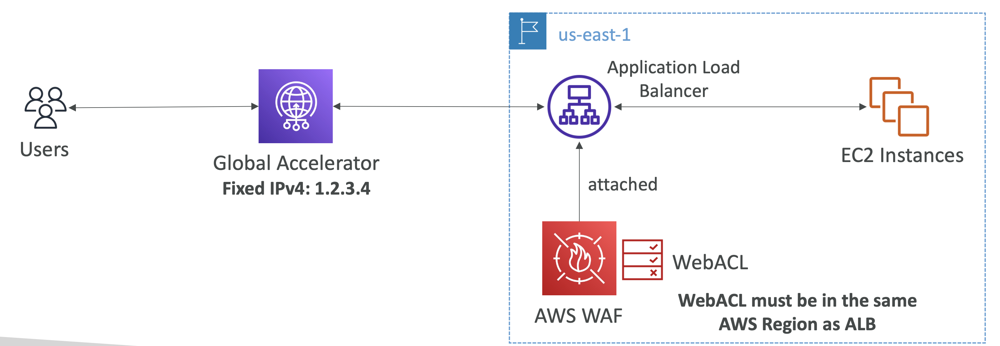

Demo

[aws-waf-demo.gif](media/encryption-security/aws-waf-demo.gif)
### **AWS Shield – DDoS Protection**

AWS Shield is a managed **Distributed Denial of Service (DDoS)** protection service that helps safeguard AWS applications from malicious traffic overload.

**What is a DDoS Attack?**:
- A **DDoS (Distributed Denial of Service) attack** floods a system with **massive amounts of requests** to disrupt availability.

**AWS Shield Offerings**

**1. AWS Shield Standard (Free & Automatic)**
- Enabled by default for all AWS customers
- Protects against common DDoS attacks, including:
  - **SYN/UDP Floods**
  - **Reflection attacks**
  - Other Layer 3 & Layer 4 network attacks

**2. AWS Shield Advanced (Premium DDoS Protection)**
- $3,000 per month per organization
- Designed for mission-critical applications running on:
  - **Amazon EC2**
  - **Elastic Load Balancing (ELB)**
  - **Amazon CloudFront**
  - **AWS Global Accelerator**
  - **Amazon Route 53**
  - **Key Benefits:**
    - 24/7 AWS DDoS Response Team (DRP) support
    - Protection from cost spikes due to DDoS-related traffic surges
    - Automatic Layer 7 attack mitigation via AWS WAF (automatically creates and applies rules)

**DDoS Protection Scope**
- **Layer 3 & 4 Attacks** (Network & Transport Layer) – mitigated by both Shield Standard & Advanced
- **Layer 7 Attacks** (Application Layer) – mitigated by Shield Advanced with AWS WAF

This ensures comprehensive protection against both basic and sophisticated DDoS attacks.

### **AWS Firewall Manager**

AWS Firewall Manager is a **centralized security management** service for managing firewall rules across all accounts in an AWS Organization.

**Key Features:**
- **Security Policies** – Define and enforce a common set of security rules.
- **WAF Rules** – Manage rules for **ALB, API Gateway, and CloudFront**.
- **AWS Shield Advanced** – Protect **ALB, CLB, NLB, Elastic IPs, and CloudFront**.
- **Security Groups** – Control access for **EC2, ALB, and ENI resources in VPC**.
- **AWS Network Firewall** – Manage **VPC-level** firewall policies.
- **Route 53 Resolver DNS Firewall** – Protect domain name resolution at the DNS level.

**How It Works:**
- Policies are created **at the regional level**.
- Rules automatically apply to **new and existing resources** across all accounts.
- Ensures **consistent security and compliance** across the organization.


### **AWS WAF vs. Firewall Manager vs. Shield**

- **AWS WAF** – Protects web applications by defining **Web ACL rules** for granular security. Best for **resource-specific** protection.
- **AWS Firewall Manager** – Manages **WAF rules across multiple AWS accounts**, automates security policies, and applies rules to new resources. Ideal for **organization-wide security enforcement**.
- **AWS Shield** – Provides **DDoS protection**, with **Shield Advanced** offering enhanced features like **dedicated support (SRT) and advanced reporting**. Recommended for businesses facing **frequent DDoS attacks**.

For comprehensive security, **use all three services together** based on your needs.

### AWS Best Practices for DDoS Resiliency
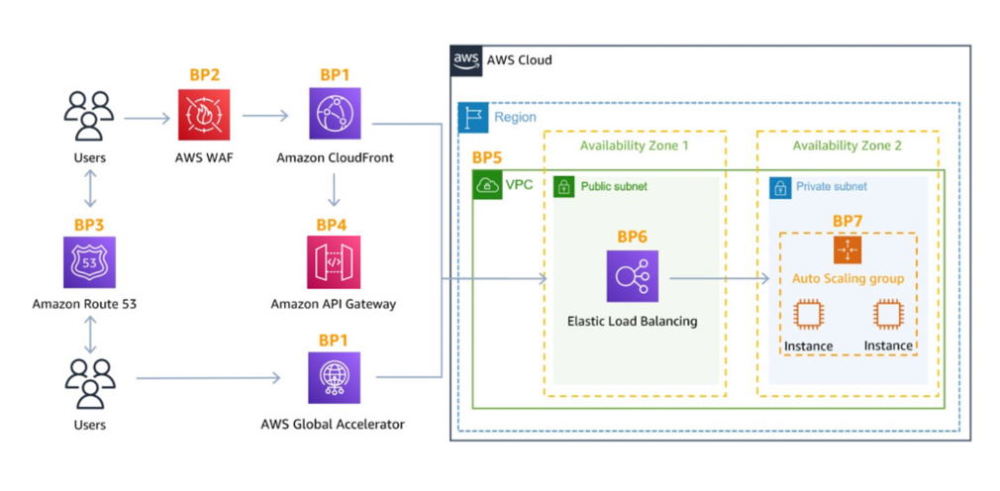

**Edge Location Mitigation (BP1, BP3)**
- BP1 – CloudFront
  - Web Application delivery at the edge
  - Protect from DDoS Common Attacks (SYN floods, UDP reflection...)
- BP1 – Global Accelerator
  - Access your application from the edge
  - Integration with Shield for DDoS protection
  - Helpful if your backend is not compatible with CloudFront
- BP3 – Route 53
  - Domain Name Resolution at the edge
  - DDoS Protection mechanism

**Best practices for DDoS mitigation**
- Infrastructure layer defense (BP1, BP3, BP6)
  - Protect Amazon EC2 against high traffic
  - That includes using Global Accelerator, Route 53, CloudFront, Elastic Load Balancing
- Amazon EC2 with Auto Scaling (BP7)
  - Helps scale in case of sudden traffic surges including a flash crowd or a DDoS attack
- Elastic Load Balancing (BP6)
  - Elastic Load Balancing scales with the traffic increases and will distribute the traffic to many EC2 instances 

**Application Layer Defense**
- Detect and filter malicious web requests (BP1, BP2)
  - CloudFront cache static content and serve it from edge locations, protecting your backend
  - AWS WAF is used on top of CloudFront and Application Load Balancer to filter and block requests based on request signatures
  - WAF rate-based rules can automatically block the IPs of bad actors
  - Use managed rules on WAF to block attacks based on IP reputation, or block anonymous Ips
  - CloudFront can block specific geographies
- ShieldAdvanced(BP1,BP2,BP6)
  - Shield Advanced automatic application layer DDoS mitigation automatically creates, evaluates and deploys AWS WAF rules to mitigate layer 7 attacks

**Attack surface reduction**
- Obfuscating AWS resources (BP1, BP4, BP6)
  - Using CloudFront, API Gateway, Elastic Load Balancing to hide your backend resources (Lambda functions, EC2 instances)
- Security groups and NetworkACLs (BP5)
  - Use security groups and NACLs to filter traffic based on specific IP at the subnet or ENI-level
  - Elastic IP are protected by AWS Shield Advanced
- Protecting API endpoints(BP4)
  - Hide EC2, Lambda, elsewhere
  - Edge-optimized mode, or CloudFront + regional mode (more control for DDoS)
  - WAF + API Gateway: burst limits, headers filtering, use API keys

### AWS Guardrail

### **Amazon GuardDuty**

Amazon GuardDuty is an **intelligent threat detection** service that helps protect your AWS account using **machine learning, anomaly detection, and third-party threat intelligence**.

**Key Features:**
- **Easy to Enable** – One-click activation with a **30-day free trial**, no software installation required.
- **Threat Detection Sources:**
  - **CloudTrail Event Logs** – Detects unusual API calls and unauthorized deployments.
  - **CloudTrail Management Events** – Tracks actions like **creating VPC subnets** or **new trails**.
  - **CloudTrail S3 Data Events** – Monitors **GetObject, ListObjects, DeleteObject** activity.
  - **VPC Flow Logs** – Identifies unusual internal traffic and suspicious IP addresses.
  - **DNS Logs** – Detects compromised EC2 instances sending encoded data via DNS queries.
  - **Optional Features** – Supports **EKS Audit Logs, RDS & Aurora, EBS, Lambda, and S3 Data Events**.
- to cleanup:
  - disabled: terminate & clean all data
  - suspend: stop the analysis but the data will be intact

**Response & Automation:**
- Set up **Amazon EventBridge rules** to trigger notifications or automated responses.
- EventBridge rules can integrate with **AWS Lambda** or **SNS**.

**Additional Security Benefits:**
- GuardDuty can detect **cryptocurrency mining attacks**, with a dedicated finding category for such threats.

This service helps **continuously monitor and secure your AWS environment** against potential threats.

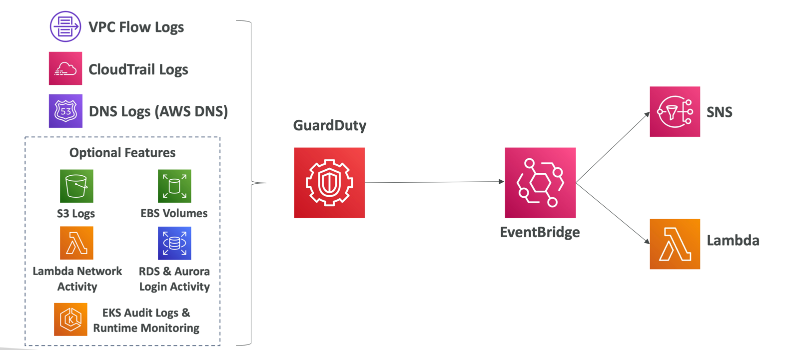

### **Amazon Inspector**

Amazon Inspector is an **automated security assessment** service for **EC2 instances, container images, and Lambda functions**, providing **continuous scanning** to detect vulnerabilities.

**What Amazon Inspector Evaluates:**
- **EC2 Instances**
  - **Network Reachability** – Identifies unintended network exposure.
  - **Package Vulnerabilities** – Checks installed software against a **CVE (Common Vulnerabilities & Exposures) database**.
- **Container Images (Amazon ECR)**
  - Scans images **at the time of push** for known vulnerabilities.
- **Lambda Functions**
  - Assesses **function code and package dependencies** during deployment.

**Key Features:**
- **Continuous scanning**, triggered **only when needed**.
- Assigns a **risk score** to prioritize vulnerabilities.
- Integrates with **AWS Security Hub** and **Amazon EventBridge** for automated notifications and responses.

Amazon Inspector helps **proactively detect and mitigate security risks** across AWS workloads.
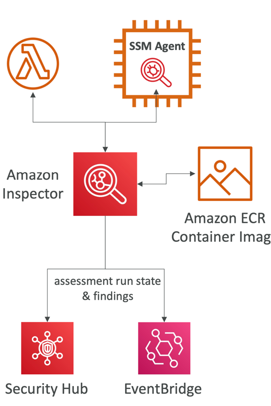


### **AWS Macie**

AWS Macie is a **fully managed data security and privacy service** that uses **machine learning** and **pattern matching** to discover and protect sensitive data in AWS.

**Key Features:**
- Automatically **identifies and alerts** on **sensitive data**, including **personally identifiable information (PII)**.

Macie helps enhance **data visibility, compliance, and security** across AWS environments.

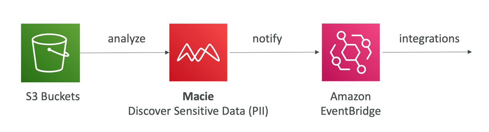

## Amazon VPC
There is a default VPC created. Without it, it would be very difficult for newcomers. For PROD, create your own.
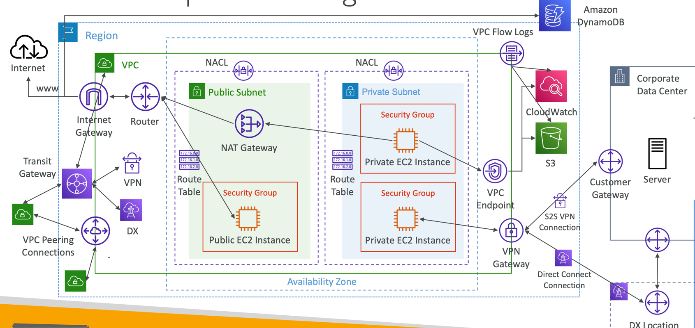

- Understanding CIDR – IPv4
  - Classless Inter-Domain Routing – a method for allocating IP addresses 
  - Used in Security Groups rules and AWS networking in general
    - We’ve seen `XX.XX.XX.XX/32` &rarr; one IP
      We’ve seen `0.0.0.0/0 &rarr; all IPs

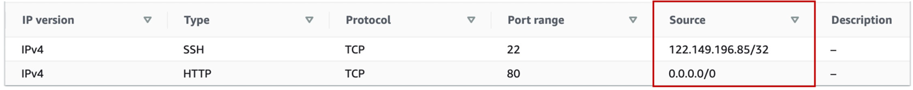

A CIDR consists of two components
- Base IP
  - Represents an IP contained in the range (XX.XX.XX.XX)
  - Example: 10.0.0.0,192.168.0.0,...
- Subnet Mask
  - Defines how many bits can change in the IP
  - Example: /0, /24, /32
  - Can take two forms: 
    - /8 &larr;&rarr; 255.0.0.0
    - /16 &larr;&rarr; 255.255.0.0

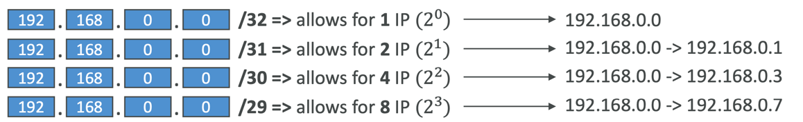

Check online [here](https://www.ipaddressguide.com/cidr).

### Public vs. Private IP (IPv4)
- The Internet Assigned Numbers Authority (IANA) established certain blocks of IPv4 addresses for the use of private (LAN) and public (Internet) addresses
- **Private IP** can only allow certain values:
  - 10.0.0.0 – 10.255.255.255 (10.0.0.0/8) &larr; big networks
  - 172.16.0.0 – 172.31.255.255 (172.16.0.0/12) &larr; AWS default VPC in that range
  - 192.168.0.0 – 192.168.255.255 (192.168.0.0/16) &larr; e.g., home networks
- All the rest of the IP addresses on the Internet are Public

VPC components:
- Network ACL
- Subnets
- Internet Gateway
- Route table

### **VPC in AWS – IPv4 Overview**

- **VPC** (Virtual Private Cloud) allows you to create isolated networks within AWS.
- You can have up to **5 VPCs per region** (soft limit).
- Each **VPC** can have a **CIDR block** with a range from **/28 (16 IPs)** to **/16 (65,536 IPs)**.
- Only **private IPv4 ranges** are allowed within VPCs:
- Ensure your **VPC CIDR** does not overlap with other networks (e.g., corporate).

This allows for flexible, isolated network configurations within AWS.

VPC – Subnet (IPv4)
- AWS reserves 5 IP addresses (first 4 & last 1) in each subnet
- These 5 IP addresses are not available for use and can’t be assigned to an EC2 instance
- Example: if CIDR block 10.0.0.0/24, then reserved IP addresses are: 
  - `10.0.0.0` – Network Address
  - `10.0.0.1` – reserved by AWS for the VPC router
  - `10.0.0.2` – reserved by AWS for mapping to Amazon-provided DNS
  - `10.0.0.3` – reserved by AWS for future use
  - `10.0.0.255 – Network Broadcast Address. AWS does not support broadcast in aVPC, therefore the address is reserved
- Exam Tip, if you need 29 IP addresses for EC2 instances:
  - You can’t choose a subnet of size /27 (32 IP addresses, 32 – 5 = 27 < 29)
  - You need to choose a subnet of size /26 (64 IP addresses, 64 – 5 = 59 > 29)

**Demos**

VPC creation

[vpc-creation-demo.gif](media/vpc/vpc-creation-demo.gif)

VPC Subnets Creation

[vpc-subnet-creation-demo.gif](media/vpc/vpc-subnet-creation-demo.gif)

### **Internet Gateway (IGW)**

An **Internet Gateway (IGW)** enables **VPC resources** (e.g., EC2 instances) to connect to the internet.

- **Horizontally scalable, highly available, and redundant**.
- **Created separately** and **attached to only one VPC** at a time.
- **Does not provide internet access by itself**—**route tables must be configured**.

Demo

[vpc-internet-gw-creation-demo.gif](media/vpc/vpc-internet-gw-creation-demo.gif)
### **Bastion Hosts**

A **Bastion Host** provides **secure SSH access** to private EC2 instances.

- **Placed in a public subnet**, connecting to private subnets.
- **Security Group Rules:**
  - **Bastion Host**: Allows **inbound SSH (port 22)** only from **trusted CIDRs** (e.g., corporate IPs).
  - **Private EC2 Instances**: Allow SSH access from the **Bastion Host's security group** or its **private IP**.

This setup ensures **controlled access** while keeping private instances secure.

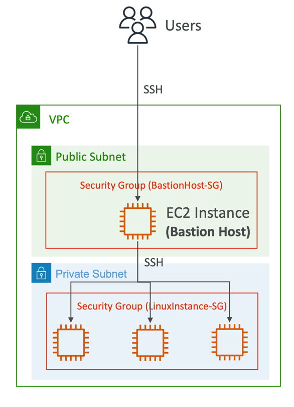

Demo
Bastion Creation

[vpc-bastion-connect-demo-1.gif](media/vpc/vpc-bastion-connect-demo-1.gif)

Bastion Interaction

[vpc-bastion-interact-demo-2.gif](media/vpc/vpc-bastion-interact-demo-2.gif)

### **NAT Instance (Legacy but Exam-Relevant)**

A **NAT (Network Address Translation) Instance** enables **EC2 instances in private subnets** to access the internet while keeping them private.

**Key Requirements:**
- Must be in a **public subnet** with an **Elastic IP**.
- **Source/Destination Check** must be **disabled**.
- **Route tables** must direct private subnet traffic to the NAT instance.
- Uses a **pre-configured Amazon Linux AMI** (support ended on **Dec 31, 2020**).
- Port forwardingÖ Directs traffic from one port/IP to another

**Limitations & Considerations:**
- **Not highly available** – Requires **Auto Scaling Group (ASG) across multiple AZs** for resilience.
- **Bandwidth limited** by the EC2 instance type.
- **Security Group Rules:**
  - **Inbound:** Allow **HTTP/HTTPS** from private subnets, **SSH** from your home network.
  - **Outbound:** Allow **HTTP/HTTPS** to the internet.

**Note:** NAT Instances are outdated; **NAT Gateways** are the preferred alternative.
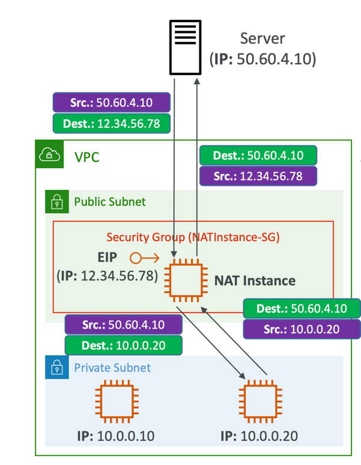

Demo:

[vpc-nat-instance-demo.gif](media/vpc/vpc-nat-instance-demo.gif)

### **NAT Gateway**

A **fully managed, high-availability NAT service** that enables private subnet EC2 instances to access the internet.

**Key Features:**
- **AWS-managed** – No administration, automatic scaling (5 Gbps → 100 Gbps).
- **Elastic IP & IGW required** (Private Subnet → NATGW → IGW).
- **Per-hour + bandwidth costs** apply.
- **Created in a specific AZ** and **cannot be used by EC2 in the same subnet**.
- **No Security Groups required**.

**Preferred over NAT Instances** due to better performance and reliability.

**NAT Gateway & High Availability**

- **Resilient within a single AZ** but not across AZs.
- **For fault tolerance**, deploy **multiple NAT Gateways** in different AZs.
- **No cross-AZ failover needed**—if an AZ goes down, affected resources don’t need NAT.

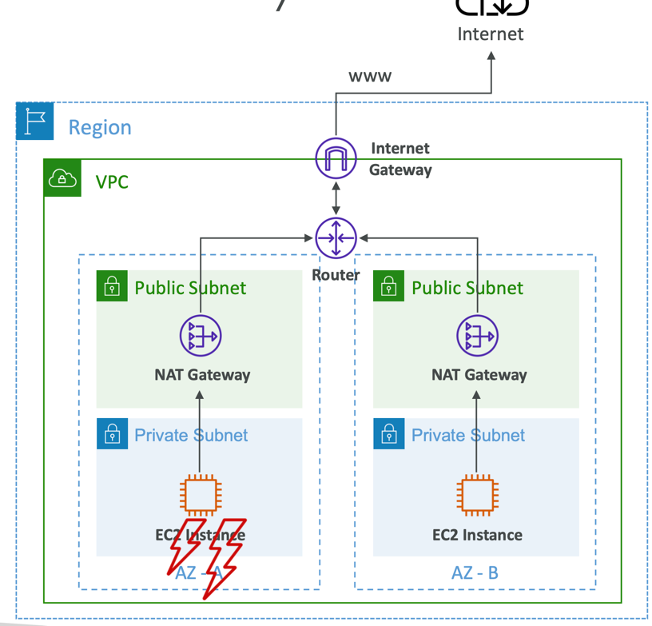


**NAT Gateway vs NAT Instance**
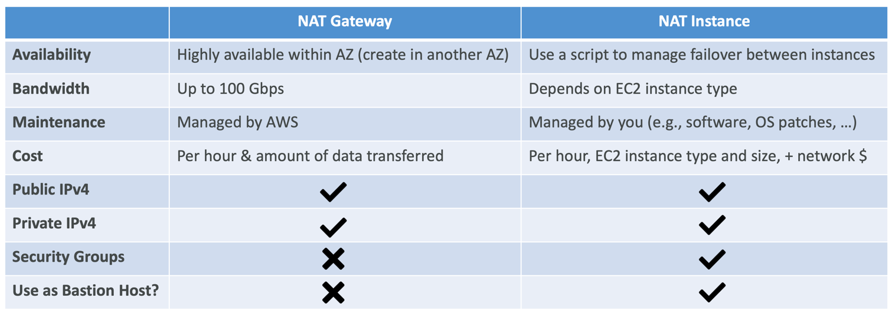

Demo
  - [vpc-nat-gw-creation-demo-1.gif](media/vpc/vpc-nat-gw-creation-demo-1.gif)
  - [vpc-nat-gw-interaction-demo-1.gif](media/vpc/vpc-nat-gw-interaction-demo-1.gif)

### Security Groups & NACLs

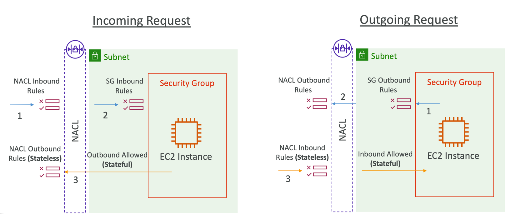

**Network ACL (NACL)**

- **Subnet-level firewall** controlling **inbound & outbound traffic**.
- Each **subnet has one NACL** (default assigned to new subnets).
- **Rules are numbered (1–32766)**; lower numbers have **higher precedence**.
- **First matching rule applies** (e.g., **#100 ALLOW > #200 DENY**).
- **Last rule (*) denies all traffic** if no match is found.
- **New NACLs deny all traffic by default**.
- **Recommended rule increments: 100**.
- **Useful for blocking specific IPs at the subnet level**.

**Default NACL:**
- **Allows all inbound & outbound traffic** for associated subnets.
- **Do not modify** the Default NACL—create a **custom NACL instead**.

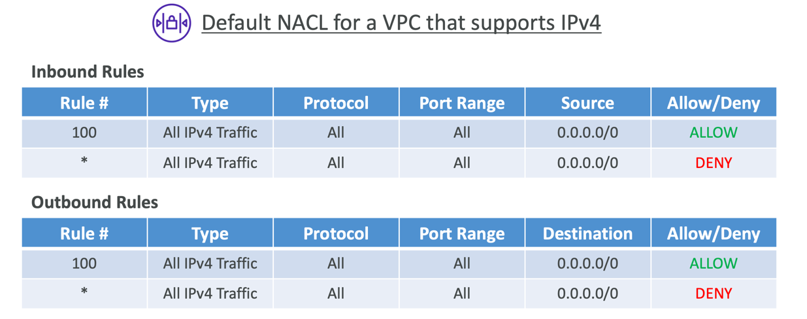

**Ephemeral Ports**

- Used for **temporary responses** in client-server connections.
- Clients connect to a **defined port** and receive responses on an **ephemeral port**.
- **Port ranges vary by OS:**
  - **Windows 10 & IANA:** 49152–65535
  - **Linux Kernels:** 32768–60999
- see [here](https://docs.aws.amazon.com/vpc/latest/userguide/vpc-network-acls.html) for more

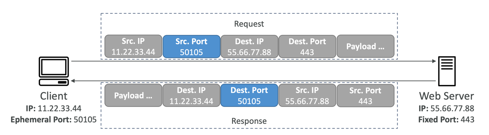
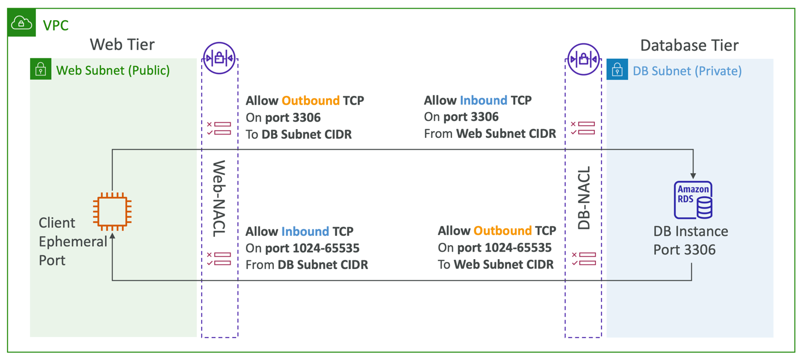

Create NACL rules for each target subnets CIDR

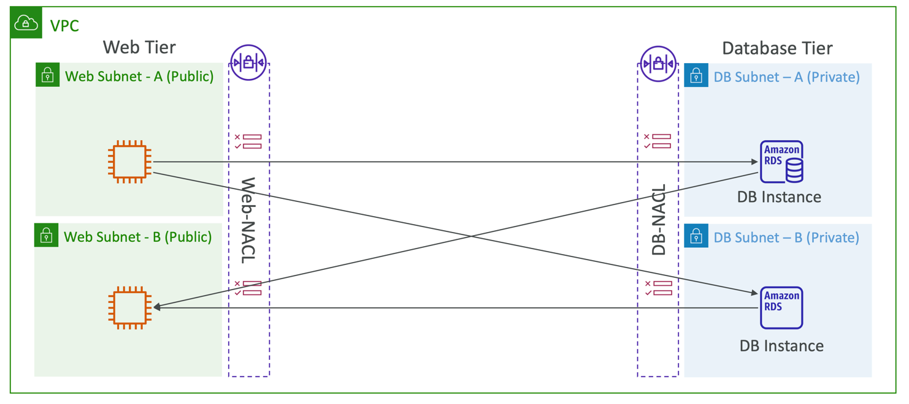

NACL vs SG
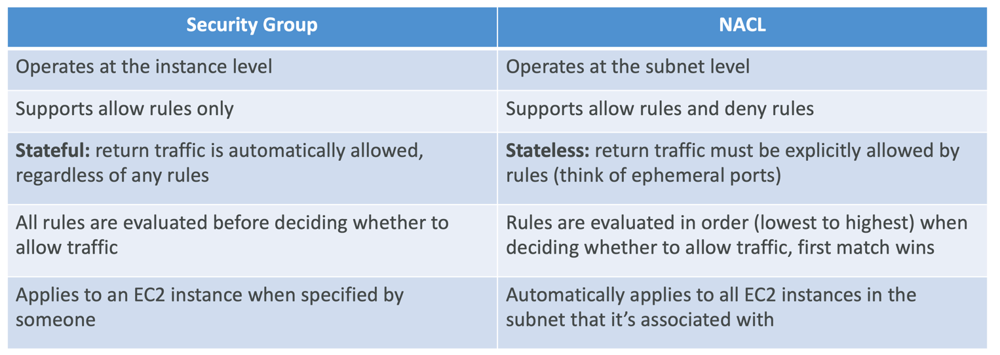

NACL & SG Demo:

[nacl-sg-inbound-outbound-demo.gif](media/vpc/nacl-sg-inbound-outbound-demo.gif)

### **VPC Peering**
- **Privately connects two VPCs** over AWS’ network using private IPv4 or IPv6
- **Acts as a single network**, but **CIDRs must not overlap**.
- **Not transitive**—each VPC needs a **direct peering connection**.
- **Route tables must be updated** in both VPCs for communication.
- Supports **cross-account and cross-region peering**.
- **Security groups** can reference instances in a **peered VPC (same region, cross-account supported)**. i.e reference like `accountId/security-group`

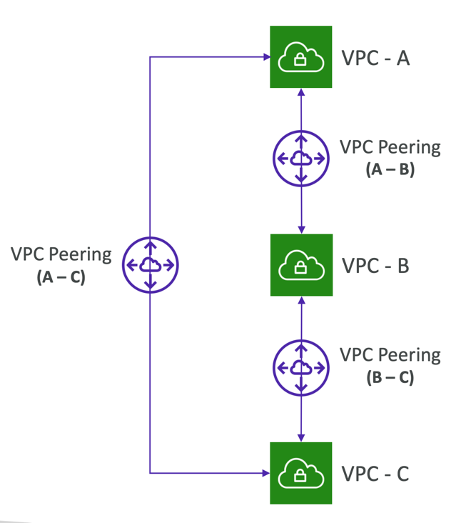

Demo
Creating VPC peering

[vpc-peering-demo-1.gif](media/vpc/vpc-peering-demo-1.gif)

Updating Routing Table:

[vpc-peering-demo-2.gif](media/vpc/vpc-peering-demo-2.gif)
### VPC sharing 
See [here](https://docs.aws.amazon.com/vpc/latest/userguide/vpc-sharing.html)
### VPC Endpoints
- AWS services have public URLs.
- VPC Endpoints enable private network access to AWS services, bypassing the public Internet.
- Highly available, redundant, and scalable.
- Eliminates the need for IGW, NATGW, etc.
- Troubleshooting:
  - Verify **DNS Resolution** in your VPC.
  - Check **Route Tables**.

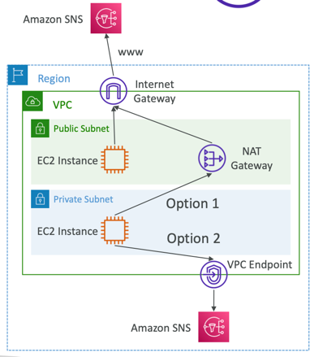

**Types of VPC Endpoints**

- **Interface Endpoints** (PrivateLink)
  - Creates an **ENI** (private IP) as an entry point (**requires Security Group**)
  - Supports most AWS services
  - **Costs:** $/hour + $/GB

- **Gateway Endpoints**
  - Creates a **gateway**, used as target in route tables (**no Security Group needed**)
  - Supports only **S3 & DynamoDB**
  - **Free**

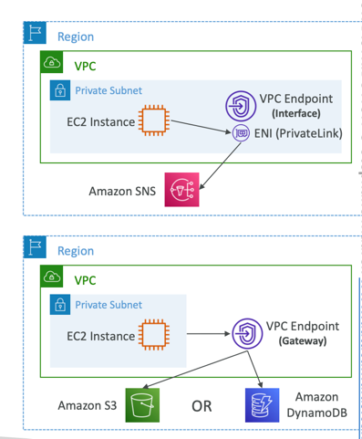
- Gateway or Interface Endpoint for S3
  - in the exam gateway type is always preferred because it is free
  - Interface is preferred only for access from on-premises (VPN/Direct Connect), another VPC, or a different region 

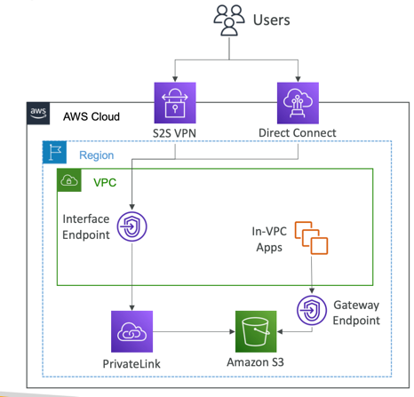

Demos
- [vpc-endpoint-demo-original.gif](media/vpc/vpc-endpoint-demo-original.gif)

### VPC Flow Logs

- Capture **IP traffic** at **VPC, Subnet, or ENI** level.
- Useful for **monitoring & troubleshooting** connectivity.
- Logs can be sent to **S3, CloudWatch Logs, or Kinesis Data Firehose**.
- Supports AWS-managed interfaces (**ELB, RDS, ElastiCache, Redshift, WorkSpaces, NATGW, Transit Gateway**).

**VPC Flow Logs Syntax**
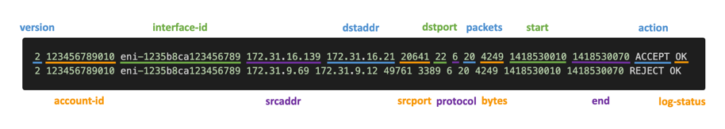

- **srcaddr & dstaddr** – Identify problematic IPs.
- **srcport & dstport** – Identify problematic ports.
- **Action** – Shows success/failure due to **Security Group/NACL**.
- Useful for **analytics** (usage patterns, malicious behavior).
- Query logs with **Athena (S3) or CloudWatch Logs Insights**.
- [Flow Logs Examples](https://docs.aws.amazon.com/vpc/latest/userguide/flow-logs-records-examples.html).

**VPC Flow Logs – Troubleshoot SG & NACL issues**
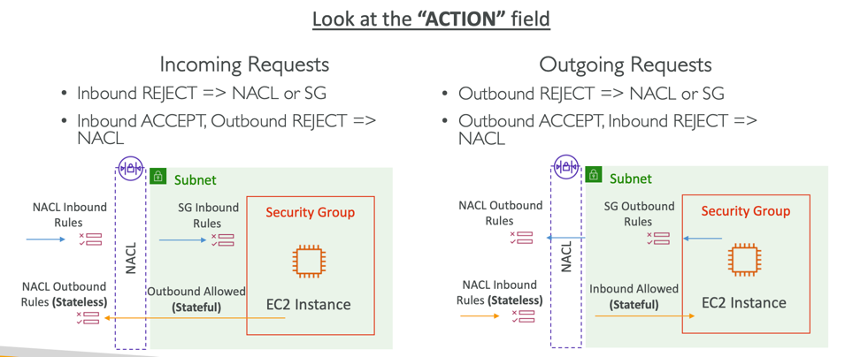

**VPC Flow Logs – Architectures**

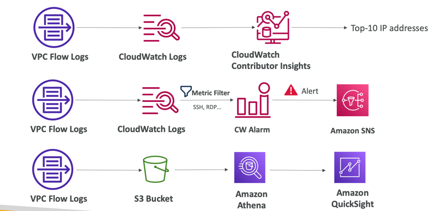

Demos

Part One: creating the flow logs

[vpc-flow-logs-demo-1.gif](media/vpc/vpc-flow-logs-demo-1.gif)

Part Two: querying the s3 logs using Athena

[vpc-flow-logs-demo-2-athena.gif](media/vpc/vpc-flow-logs-demo-2-athena.gif)

### Summary - VPC Setup Journey
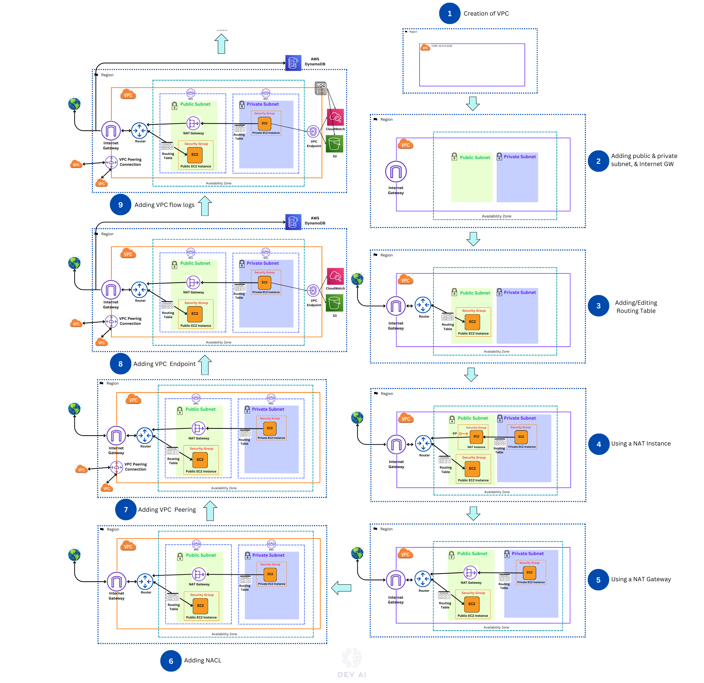

---
### AWS Site-to-Site VPN
AWS Site-to-Site VPN connects your on-premises network to your AWS VPC using a secure and encrypted connection over the public internet.

Components Involved:
- Virtual Private Gateway (VGW)
  - VPN concentrator on the AWS side of the VPN connection
  - VGW is created and attached to the VPC from which you want to create the Site-to-Site VPN connection
  - Possibility to customize the ASN (Autonomous System Number)
- Customer Gateway (CGW)
  - This is your on-premises **VPN device** (physical or software).
  - Must provide a **public IP address**:
    - If CGW is **behind NAT**, use the **public IP of the NAT device** (NAT-T must be enabled).
  - Refer to AWS-tested [Customer Gateway Devices](https://docs.aws.amazon.com/vpn/latest/s2svpn/your-cgw.html#DevicesTested)
- Site-to-Site VPN Connection
---
- **🔌 Setting Up the Site-to-Site VPN Connection**
  - **1. Create and Attach the VGW**
    - Attach the VGW to your target VPC.
  - **2. Configure the CGW**
    - Set up your VPN device (use tested devices when possible).
    - Ensure public IP address is reachable.
  - **3. Create the VPN Connection**
    - Link the VGW and CGW.
    - Configure tunnel options (static or dynamic routing using BGP).
  - **4. Route Propagation**
    - Enable **Route Propagation** for the VGW in your **route table**.
    - This allows traffic between on-premises and VPC.
  - **5. Security Groups**
    - To allow **ping/ICMP** from on-premises to EC2:
      - Add **ICMP** protocol to **inbound rules** of your EC2’s security groups.

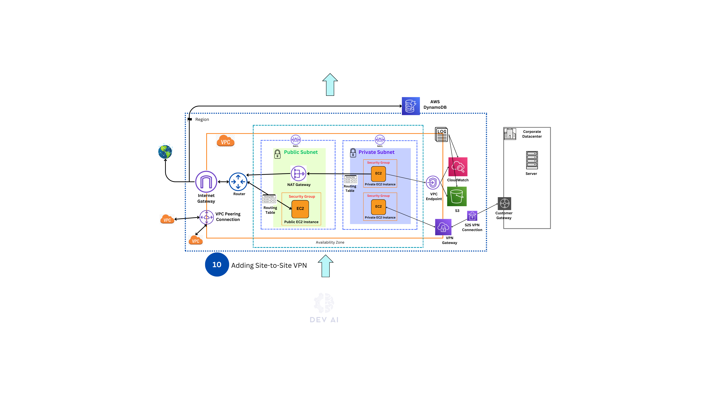

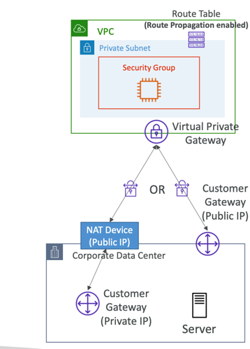

**AWS VPN CloudHub**
- Provide secure communication between multiple sites, if you have multiple VPN connections
- Ideal for **hub-and-spoke topology** using VPN over the internet.
- It’s a VPN connection so it goes over the public Internet
- To set it up,connect multiple VPN connections on the same VGW, setup dynamic routing (BGP) and configure route tables

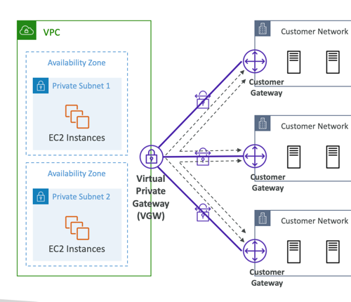

**Demo**

[aws-s2s-vpn-connection-demo.gif](media/vpc/aws-s2s-vpn-connection-demo.gif)

**Question**: want to speed s2s VPN connect, check [Transit Gateway](#transit-gateway-site-to-site-vpn-ecmp) with ECMP

---

### AWS Direct Connect (DX)

AWS Direct Connect provides a **dedicated, private network connection** between your on-premises infrastructure and AWS. 
It does **not traverse the public internet**, offering **more consistent network performance**, **lower latency**, and **higher bandwidth**.

---

**Features**

- **Private connectivity** from your data center, office, or colocation to AWS.
- Access both **public AWS services** (like S3) and **private resources** (like EC2 in a VPC) over the same connection.
- Requires:
  - A **Direct Connect location**
    - A Direct Connect location is a physical data center facility where AWS has a presence with networking equipment that allows you to establish a dedicated network connection between your infrastructure and AWS
    - i.e Interxion FRA6 in Frankfurt
  - A **Virtual Private Gateway** (VGW) or **Transit Gateway** attached to your VPC.
- Supports both **IPv4 and IPv6 traffic**.

---
- Direct Connect Architecture  
  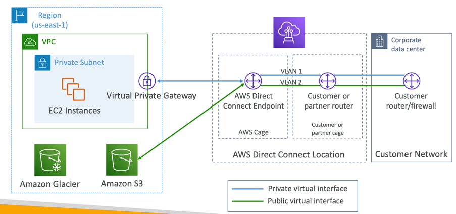

**Use Cases:**

- **Large-scale data transfers** (cost-effective at higher bandwidths).
- **Real-time data** workloads needing **consistent performance**.
- **Hybrid cloud architectures** integrating on-premises and cloud resources.
- **Compliance** scenarios requiring private connections (no internet exposure).

---

**Direct Connect Gateway (DXGW):**

- Allows you to **connect to multiple VPCs across different regions** using a **single Direct Connect connection**.
- VPCs must be in the **same AWS account** (or use AWS Resource Access Manager for cross-account).
- Simplifies multi-region architecture without needing multiple physical connections.

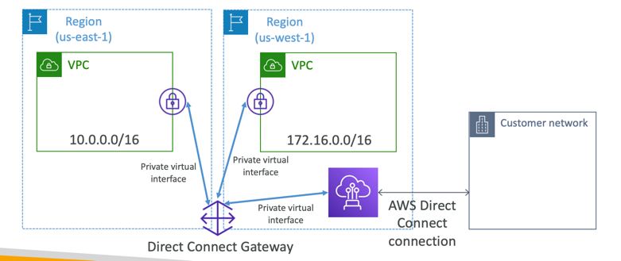

---

**Connection Types:**

**1. Dedicated Connections**
  - Speeds: **1 Gbps, 10 Gbps, 100 Gbps**
  - Provisioned by requesting through **AWS** directly.
  - AWS allocates a **dedicated Ethernet port** at a DX location.

**2. Hosted Connections**
  - Speeds: **50 Mbps to 10 Gbps**
  - Provisioned via approved **Direct Connect Partners**.
  - **Scalable bandwidth** (can adjust capacity as needed).
  - Availability may vary by partner and region.
  - **Lead time**: Typically **over 1 month** to complete setup.

---

**Encryption Considerations**
- **Direct Connect is not encrypted** by default.
- However, it is inherently **private** and does not use the public internet.
- For **encryption over DX**, combine it with a **VPN connection (IPsec)**:
  - Adds security
  - Increases configuration complexity

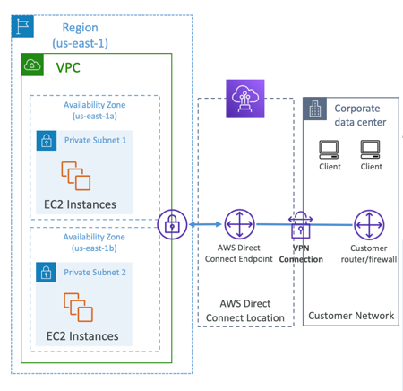

---

**Resiliency & Backup Options:**

To ensure availability in case of a Direct Connect failure:

- Option 1: **Backup Direct Connect**
  - Secondary physical connection
  - High cost, but best performance and availability

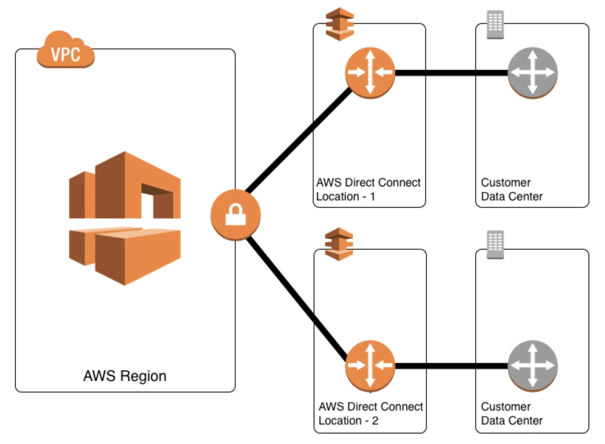
- Option 2: **Site-to-Site VPN**
  - Cost-effective backup over the public internet
  - Automatically used if DX goes down (via BGP failover)

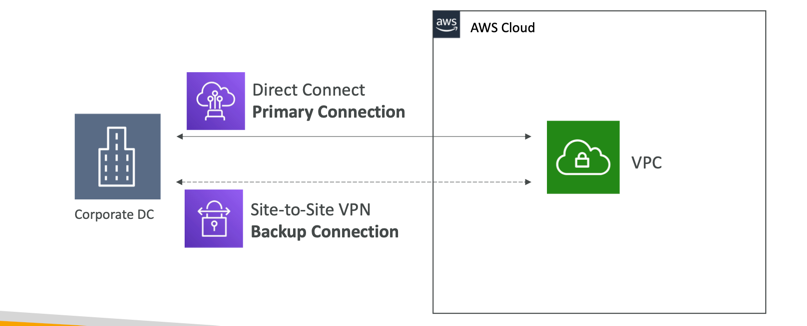

---
### AWS Transit Gateway

AWS Transit Gateway enables you to **connect multiple VPCs and on-premises networks** using a **hub-and-spoke (star) architecture**.

**Key Features:**
- **Regional service**, but supports **cross-region peering**.
- Allows **cross-account sharing** via **AWS Resource Access Manager (RAM)**.
- **Custom route tables** control how VPCs and networks communicate.
- Integrates with **Direct Connect Gateway** and **VPN** for hybrid connectivity.
- Supports **IP Multicast** – the **only AWS service** that does.
---

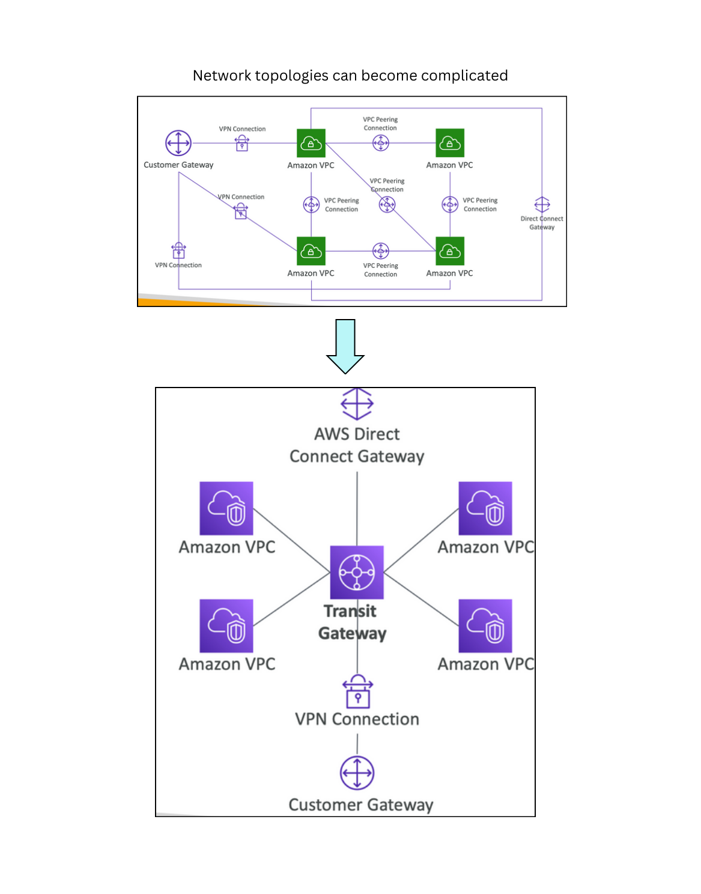
- basically: VPC peering + direct connect + VPN connection --> Transit Gateway

### Transit Gateway: Site-to-Site VPN ECMP
- ECMP = Equal-cost multi-path routing
- Routing strategy to allow to forward a packet over multiple best path
- Use case: 
  - create multiple Site-to-Site VPN connections to **increase** the bandwidth of your connection to AWS

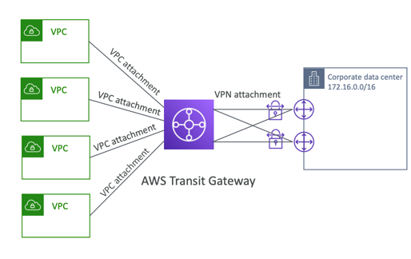

**Transit Gateway: throughput with ECMP**
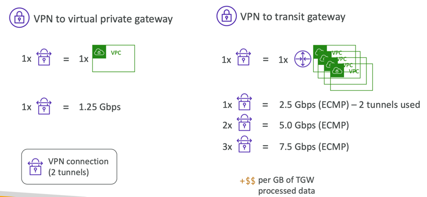

**Transit Gateway – Share Direct Connect between multiple accounts**
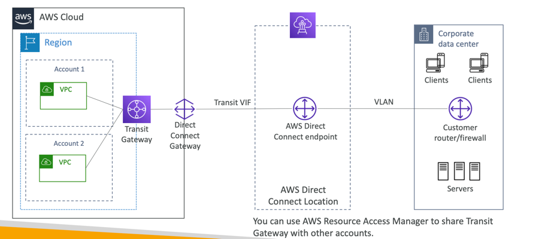

### Resource Access Manager (RAM)
**AWS Resource Access Manager (RAM)** lets you **share AWS resources** with other **AWS accounts** or **within your organization (via AWS Organizations)**.

🔹 **Key Points**
- Enables **secure resource sharing** without needing to copy resources (substantially reducing operational overhead).
- Commonly shared resources:
  - VPC subnets
  - Transit Gateways
  - License Manager configurations
  - Route 53 Resolver rules
- You control **who can access** and **what they can do**.

---

🔹 **Use Case Example**
- Share a **VPC subnet** across multiple accounts so that EC2 instances in different accounts can launch into the same network (VPC).

---

In short: **AWS RAM** simplifies **cross-account resource sharing** while keeping it **secure and managed**.

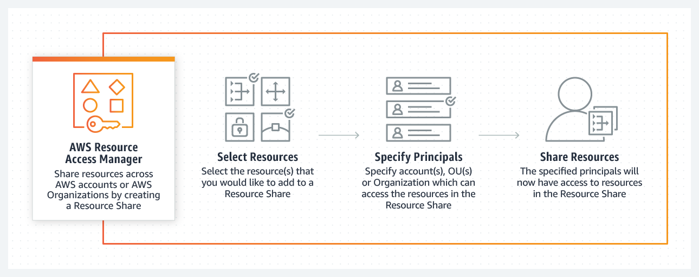
### Shared Services VPC
- Instead of having the shared services in each, put it centrally and save administrative overhead and costs
- VPC endpoints are h-scaled, highly available VPC components.
- The endpoits allow comm. between instances in your VPC and services without imposing availability risks or bandwidth constraints on your n/w traffic.
- it reduces data transfer charges resulitng from n/w comm. b/w private vpc and the aws services


### Transit VPC
A **Transit VPC** is a **Virtual Private Cloud (VPC)** used as a **central hub** to route traffic between multiple **spoke VPCs** or **remote networks** (like on-premises data centers) in a hub-and-spoke architecture. 
It simplifies network management by centralizing connectivity, often using **VPNs or AWS Transit Gateway** to route traffic securely and efficiently.
- It generates additional data transfer charges for traffic traversing the transit VPC.

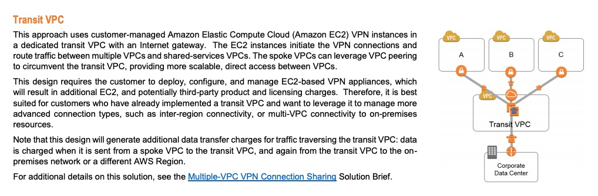

### VPC - Traffic Mirroring
✔ **Captures & inspects** network traffic in your VPC in a non-intrusive manner
✔ Done by routing the traffic to **your security appliances**.

**Traffic Flow:**
- **Source (From):** ENIs (Elastic Network Interfaces).
- **Target (To):** Another ENI or a **Network Load Balancer**.

**Key Features:**
- Capture **all packets** or **specific packets** (optional truncation).
- Source and target are in the same VPC or across VPCs if  **VPC Peering** is enabled.

**Use Cases:**
🔹 **Content inspection**  
🔹 **Threat monitoring**  
🔹 **Troubleshooting**

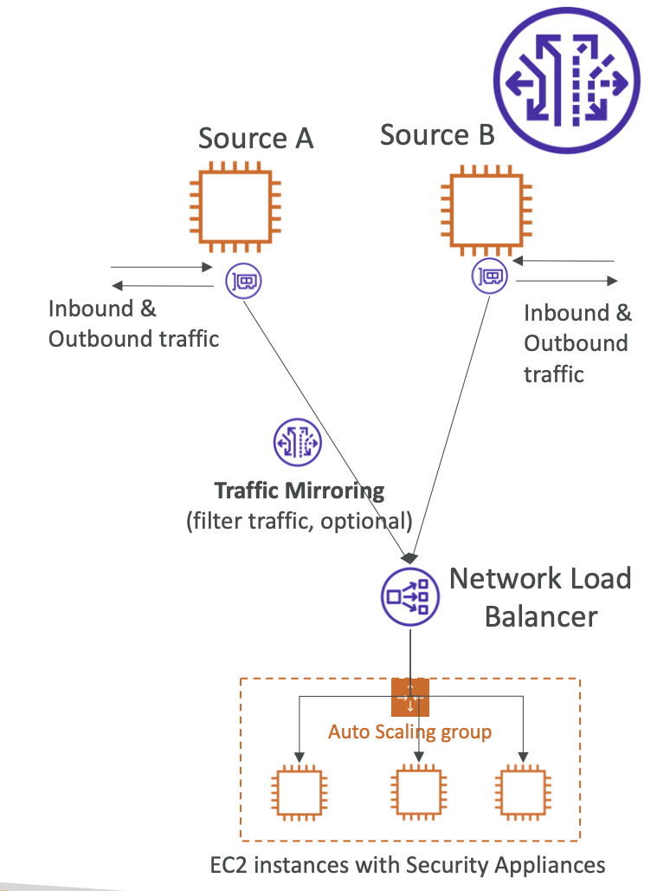

### **IPv6 in AWS**

- **IPv4** has **4.3B addresses**, nearing exhaustion.
- **IPv6** is the successor, offering **3.4 × 10³⁸ addresses**.
- **All AWS IPv6 addresses are public & internet-routable** (no private range).
- **Format:** `x:x:x:x:x:x:x:x` (hexadecimal, `0000` to `ffff`).
- **Examples:**
  - `2001:db8::` (zero compression)
  - `::1234:5678` (leading zeros omitted)

### **IPv6 in VPC**

✔ **IPv4 is always enabled**; IPv6 can be added for **dual-stack mode**.  
✔ **EC2 instances get:**
- A **private IPv4** & a **public IPv6**.
- Can access the internet via an **Internet Gateway** using **either protocol**.

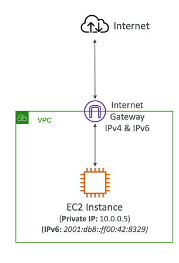
### **IPv6 Troubleshooting**

⚠ **IPv4 cannot be disabled** for VPCs/subnets.  
⚠ If an **EC2 instance won’t launch**, it’s **not due to IPv6 exhaustion**.  
✅ **Cause:** No available **IPv4 addresses** in the subnet.  
✅ **Fix:** Assign a **new IPv4 CIDR** to the subnet.

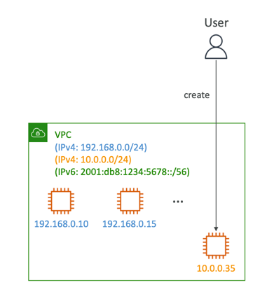

Demo

[aws-ipv6-demo.gif](media/vpc/aws-ipv6-demo.gif)

### Egress-only Internet Gateway
- Used for IPv6 only
- (similar to a NAT Gateway but for IPv6)
- Allows instances in your VPC outbound connections over IPv6 while preventing the internet to initiate an IPv6 connection to your instances
- You must update the Route Tables

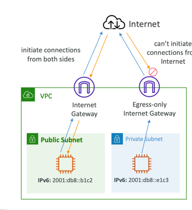

**IPv6 Routing**
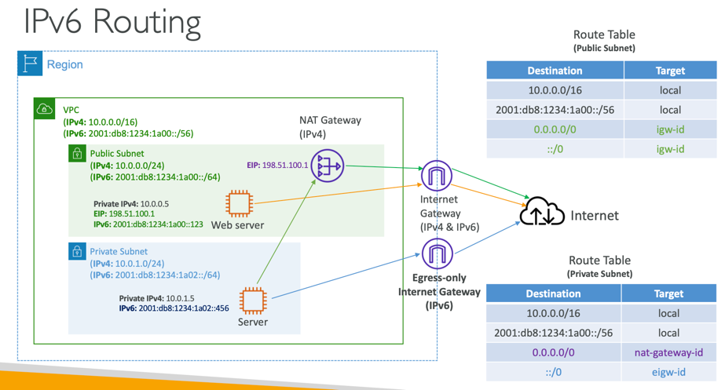


### VPC demo cleanup
[vpc-cleanup-demo.gif](media/vpc/vpc-cleanup-demo.gif)

### **AWS VPC Summary**

- **CIDR** – Defines IP range.
- **VPC** – Virtual network with IPv4 & IPv6 CIDRs.
- **Subnets** – AZ-specific, assigned a CIDR.
- **Internet Gateway (IGW)** – Enables IPv4 & IPv6 internet access.
- **Route Tables** – Direct traffic to IGW, VPC Peering, Endpoints, etc.
- **Bastion Host** – Public EC2 for SSH access to private instances.
- **NAT Instance** – Legacy method for internet access in private subnets; requires public subnet and Source/Destination check disabled.
- **NAT Gateway** – AWS-managed, scalable IPv4 internet access for private EC2.

**Security & Connectivity**

- **NACL** – Stateless, subnet-level inbound/outbound rules, requires ephemeral ports.
- **Security Groups** – Stateful, instance-level firewall.
- **VPC Peering** – Private, non-transitive connection between VPCs with non-overlapping CIDRs.
- **VPC Endpoints** – Private access to AWS services (S3, DynamoDB, etc.) without IGW.
- **VPC Flow Logs** – Logs traffic at VPC/Subnet/ENI level, used for security analysis.
- **Site-to-Site VPN** – Secure tunnel between on-prem and VPC using Customer & Virtual Private Gateways.
- **AWS VPN CloudHub** – Hub-and-spoke VPN for multi-site connections.

**Direct Connect & PrivateLink**

- **Direct Connect** – Private link from on-prem to VPC via Direct Connect location.
- **Direct Connect Gateway** – Connects multiple VPCs across regions.
- **PrivateLink / VPC Endpoint Services** – Private service connections without VPC Peering or IGW, requires NLB & ENI.

**Advanced Networking**

- **ClassicLink** – Connects EC2-Classic to a VPC.
- **Transit Gateway** – Centralized transitive routing for VPC, VPN & Direct Connect.
- **Traffic Mirroring** – Captures ENI traffic for analysis.
- **Egress-Only IGW** – Like NAT Gateway, but for **IPv6-only** outbound traffic.


## Amazon Cost Optimization
### Networking Costs in AWS per GB - Simplified
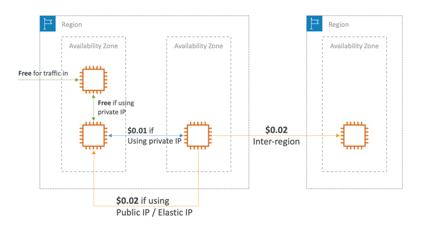
- **Use Private IPs** for cost savings and better performance.
- **Same AZ** reduces costs but limits high availability. i.e Read Replica in the same AZ instead of another AZ

### Minimizing egress traffic network cost
- **Egress**: Outbound traffic (AWS → external).
- **Ingress**: Inbound traffic (external → AWS, usually free).
- **Keep traffic within AWS** to reduce costs.
- **Direct Connect in the same AWS Region** lowers egress costs.

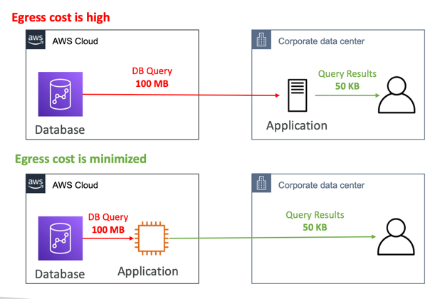
### S3 Data Transfer Pricing – Analysis for USA
- **S3 Ingress**: Free
- **S3 → Internet**: $0.09/GB
- **S3 Transfer Acceleration**: 50-500% faster, additional cost on top of DataTransfer Pricing: +$0.04-$0.08/GB
- **S3 → CloudFront**: Free
- **CloudFront → Internet**: $0.085/GB (cheaper than S3)
- **CloudFront Benefits**: Caching reduces latency & S3 request costs (7x cheaper)
- **S3 Cross-Region Replication**: $0.02/GB

### NAT Gateway costlier than Gateway VPC Endpoint
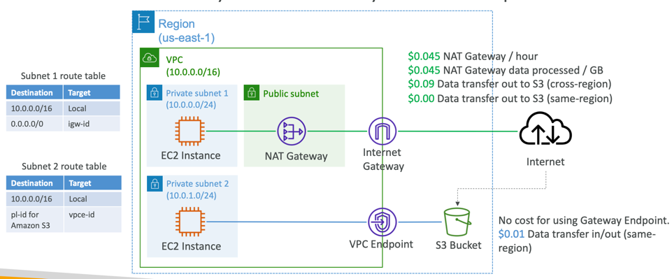

## Network Protection

### **Network Protection on AWS**

- **Key Security Tools:**
  - **NACLs & Security Groups** – Control traffic at subnet/instance level.
  - **AWS WAF** – Protects against malicious requests.
  - **AWS Shield (Standard & Advanced)** – DDoS protection.
  - **AWS Firewall Manager** – Centralized security management (cross-account).

### **AWS Network Firewall**

- **Protects entire VPC** (Layer 3 to Layer 7).
- **Inspects traffic** in any direction (VPC-to-VPC, internet(in & out), Direct Connect, VPN).
- **Managed via AWS Firewall Manager** across multiple VPCs and cross-account

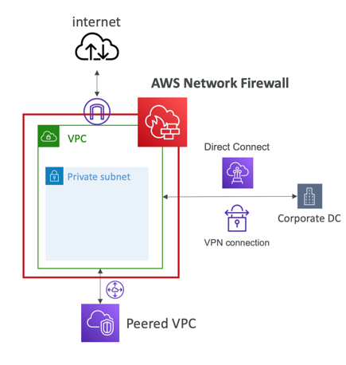

### **Fine-Grained Controls**

- Supports **thousands of rules** (IP, port, protocol filtering).
- **Stateful domain rules** (e.g., allow outbound only to `*.mycorp.com`).
- **Regex-based pattern matching** for advanced filtering.
- **Traffic actions**: Allow, drop, alert.
- **Intrusion prevention** with active flow inspection.
- **Logs sent to S3, CloudWatch, or Kinesis.**


## Disaster Recovery & Migration
- **Disaster**: Any event impacting business continuity or finances.
- **Disaster Recovery (DR)**: Preparing for and recovering from a disaster.
- **Types of DR**:
  - **On-premise to On-premise**: Traditional, costly.
  - **On-premise to AWS Cloud**: Hybrid recovery.
  - **AWS Region A to AWS Region B**: Cloud-based recovery.
- **Key Terms**:
  - **RPO (Recovery Point Objective)**: Maximum data loss allowed.
  - **RTO (Recovery Time Objective)**: Maximum downtime allowed.

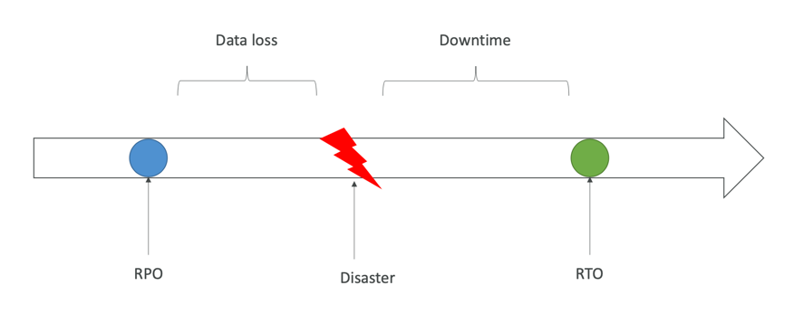

### Disaster Recovery Strategies
- Backup and Restore
- Pilot Light
- Warm Standby
- Hot Site / Multi Site Approach

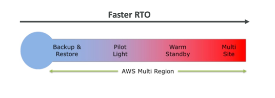

**DR - Backup and Restore (High RPO)**
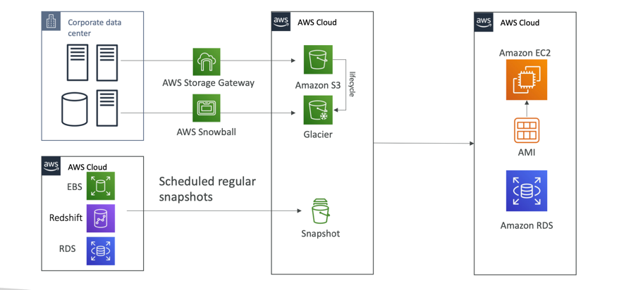

**Disaster Recovery – Pilot Light**
- A **small version** of the app runs in the cloud.
- Keeps **critical core** (pilot light) always active.
- Similar to **Backup & Restore**, but **faster** since key systems are already running.

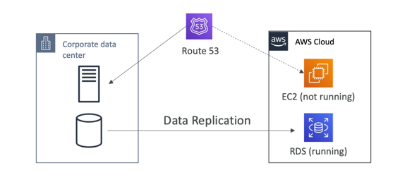

**Warm Standby**
- **Full system** runs at **minimal capacity** in the cloud.
- It is a scaled-down fully functional environment running in parallel
- **Scales up** to full production during a disaster.

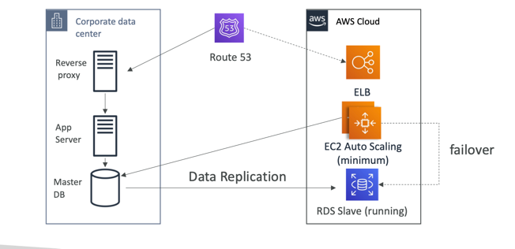

**Multi-Site / Hot Site**
- **Lowest RTO** (minutes or seconds) but **high cost**.
- **Full production** runs in **both AWS and on-premise**.

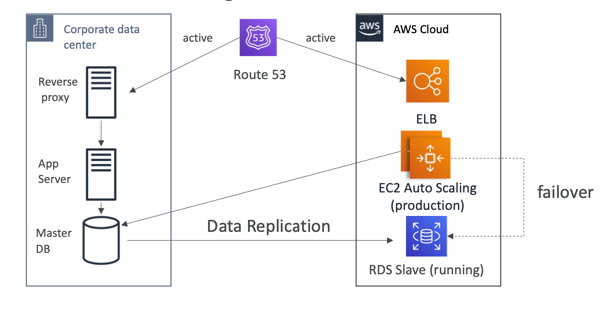

**All AWS Multi Region**

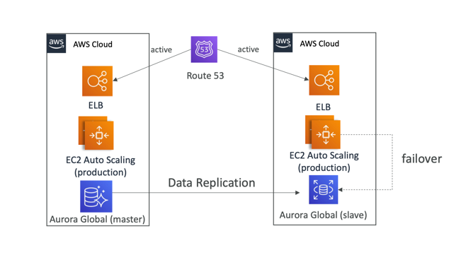

**Disaster RecoveryTips**
- Backup
  - EBS Snapshots, RDS automated backups / Snapshots, etc...
  - Regular pushes to S3 / S3 IA / Glacier, Lifecycle Policy, Cross Region Replication
  - From On-Premise: Snowball or Storage Gateway
- High Availability
  - Use Route53 to migrate DNS over from Region to Region
  - RDS Multi-AZ, ElastiCache Multi-AZ, EFS, S3
  - Site to Site VPN as a recover y from Direct Connect
- Replication
  - RDS Replication (Cross Region), AWS Aurora + Global Databases
  - Database replication from on-premises to RDS
  - Storage Gateway
- Automation
  - CloudFormation / Elastic Beanstalk to re-create a whole new environment
  - Recover / Reboot EC2 instances with CloudWatch if alarms fail
  - AWS Lambda functions for customized automations
- Chaos
  - Netflix has a “simian-army” randomly terminating EC2

### **AWS DMS – Database Migration Service**
- **Fast, secure, self-healing** database migration to AWS.
- **Minimal downtime** – source remains available (fully operational).
- We can continuously replicate data with ha (multi-AZ)
- Supports:
  - **Homogeneous** (e.g., Oracle → Oracle).
  - **Heterogeneous** (e.g., SQL Server → Aurora).
- **Continuous Data Replication** via CDC (Change Data Capture).
- Requires an **EC2 instance** for replication tasks.

**DMS Sources and Targets**
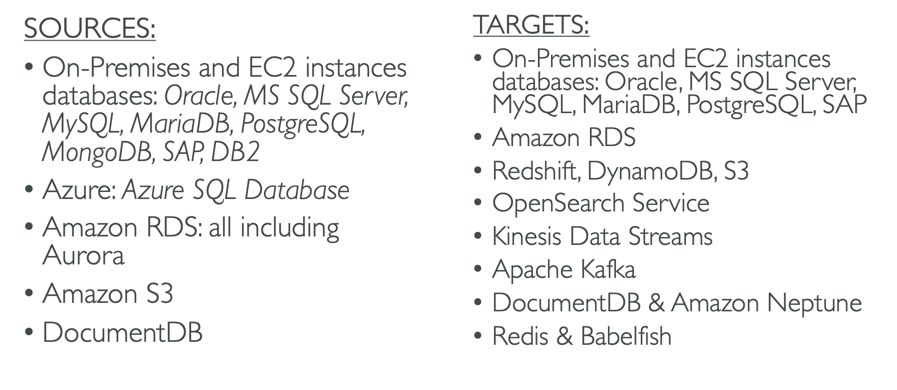

**AWS Schema Conversion Tool (SCT)**
- Converts **database schema** between different engines.
- **OLTP**: SQL Server/Oracle → MySQL, PostgreSQL, Aurora.
- **OLAP**: Teradata/Oracle → Redshift.
- Use **compute-intensive instances** for better performance.
- **Not needed** for same DB engine (e.g., PostgreSQL → RDS PostgreSQL).

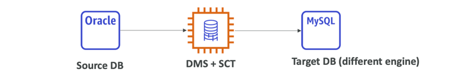

**DMS - Continuous Replication**
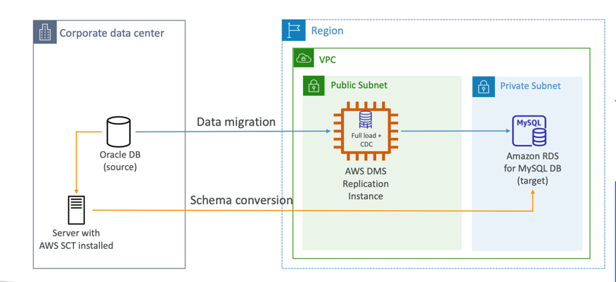

**AWS DMS – Multi-AZ Deployment**
- Creates a **synchronous standby replica** in another AZ.
- **Benefits**:
  - **Data redundancy**
  - **No I/O freezes**
  - **Reduced latency spikes**

**Demo**

[dms-demo.gif](media/dr-and-migration/dms-demo.gif)

**RDS & Aurora MySQL Migrations**
- **RDS MySQL → Aurora MySQL**
  - Option 1: **Snapshot Restore**: Get & restore RDS MySQL snapshot to Aurora.
  - Option 2: **Read Replica**: Create Aurora Read Replica, wait for **0 lag**, then promote (time & cost involved).

- **External MySQL → Aurora MySQL**
  - Option 1: **S3 Backup**: 
    - Use **Percona XtraBackup** to create a file backup in Amazon **S3**.
    - Create an Aurora MySQL DB from Amazon S3 (faster).
  - Option 2: **mysqldump**: 
    - Create an Aurora MySQL DB
    - Use the mysqldump utility to migrate MySQL into Aurora (slower).
- Use **DMS** if both databases are up and running.

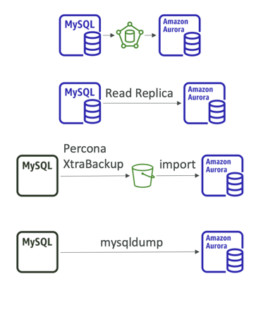

**RDS & Aurora PostgreSQL Migrations**

- RDS PostgreSQL to Aurora PostgreSQL
  - Option 1: DB Snapshots from RDS PostgreSQL restored as PostgreSQL Aurora DB
  - Option 2: Create an Aurora Read Replica from your RDS PostgreSQL, and when the replication lag is 0, promote it as its own DB cluster (can take time and cost $)
- External PostgreSQL to Aurora PostgreSQL 
  - Create a backup and put it in Amazon S3
  - Import it using the aws_s3 Aurora extension
- Use **DMS** if both databases are up and running

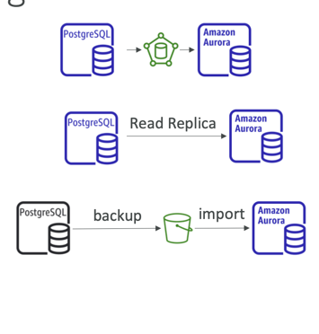

---

**On-Premises Strategy with AWS**

- **Download Amazon Linux 2 AMI as a VM (.iso format)**
  - Supported platforms for loading: VMware, KVM, VirtualBox (Oracle VM), Microsoft Hyper-V

- **VM Import/Export**
  - Migrate existing applications to EC2
  - Develop a disaster recovery (DR) repository strategy for your on-premises VMs
  - Export VMs from EC2 back to on-premises environments

- **AWS Application Discovery Service**
  - Collect data on your on-premises servers to plan migrations
  - Analyze server utilization and dependency mappings
  - Track migration progress with AWS Migration Hub

- **AWS Database Migration Service (DMS)**
  - Supports replication in multiple directions:
    - On-premises → AWS
    - AWS → AWS
    - AWS → On-premises
  - Compatible with various database technologies, including Oracle, MySQL, and DynamoDB

- **AWS Server Migration Service (SMS)**
  - Enables incremental replication of live on-premises servers to AWS

---

### **AWS Backup**

AWS Backup is a **fully managed service** that helps you centrally manage and automate backups across various AWS services. It eliminates the need for custom scripts and manual backup processes.

**Key Features**

- **Centralized Backup Management**
  - Automates backups across multiple AWS services
  - No need for manual backup scripts

- **Supported AWS Services**
  - **Compute & Storage**: Amazon EC2, Amazon EBS, Amazon S3
  - **Databases**: Amazon RDS (all engines), Amazon Aurora, Amazon DynamoDB, Amazon DocumentDB, Amazon Neptune
  - **File Storage**: Amazon EFS, Amazon FSx (Lustre & Windows File Server)
  - **Hybrid Storage**: AWS Storage Gateway (Volume Gateway)

- **Advanced Backup Capabilities**
  - **Cross-Region Backups**: Store backups in a different AWS region for disaster recovery
  - **Cross-Account Backups**: Share backups across AWS accounts for security and compliance
  - **Point-in-Time Recovery (PITR)**: Restore data from specific points in time for supported services
  - **On-Demand & Scheduled Backups**: Run backups instantly or automate them on a schedule
  - **Tag-Based Backup Policies**: Automatically back up resources based on assigned tags

- **Backup Plans**
  - Define how often backups should run (every 12 hours, daily, weekly, monthly, or using a custom cron expression)
  - Set a backup window to specify when backups should start
  - Choose data lifecycle rules:
    - **Cold Storage Transition**: Move backups to cost-effective cold storage after a set time (days, weeks, months, or years)
    - **Retention Period**: Define how long backups should be kept (always, days, weeks, months, or years)


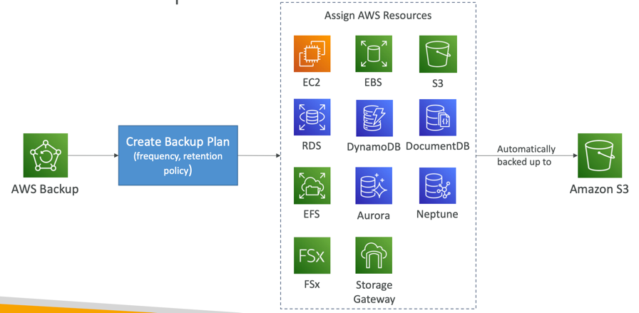

---
**AWS Backup Vault Lock**

Enforces a **WORM (Write Once, Read Many) state**, preventing backups from being deleted or modified.

- Protects against accidental or malicious deletion
- Blocks changes to retention periods
- Even the **root user** cannot delete backups when enabled

Provides an extra layer of security for critical backups.

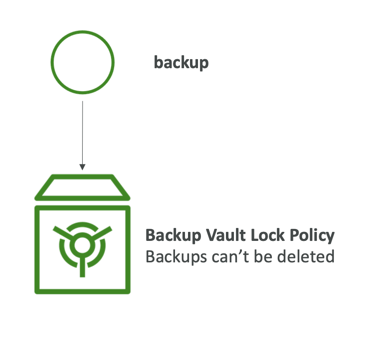

Here’s a more readable and concise version while keeping all key details:

---

### **AWS Application Discovery Service**
- Helps plan migration by collecting data from on-premises data centers.
- Provides **server utilization** and **dependency mapping** for better migration planning.
- **Agentless Discovery** (via AWS Agentless Discovery Connector):
  - Collects VM inventory, configurations, and performance history (CPU, memory, disk usage).
- **Agent-based Discovery** (via AWS Application Discovery Agent):
  - Captures system configuration, performance, running processes, and network connections.
- View collected data in **AWS Migration Hub** for better tracking.

---

### **AWS Application Migration Service (MGN)**
- The **successor to CloudEndure Migration**, replacing **AWS Server Migration Service (SMS)**.
- Provides a **lift-and-shift (rehost) migration** approach to move applications to AWS.
- Converts physical, virtual, and cloud-based servers to run **natively on AWS**. i.e convert on-premise VMs to AWS natives by installing replication agents in VMs
- Supports **multiple platforms, operating systems, and databases**.
- Ensures **minimal downtime** and **lower costs** during migration.

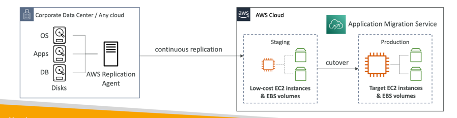

---

### **Transferring Large Amounts of Data to AWS**

**Example:**
Transferring **200 TB** of data to AWS with a **100 Mbps** internet connection.

**1. Over the Internet / Site-to-Site VPN**
- **Easy to set up** immediately.
- **Very slow**:
  - **Time required:** ~185 days (**200 TB at 100 Mbps**).

**2. Over AWS Direct Connect (1 Gbps)**
- **Takes time to set up** (over a month).
- **Faster than VPN**:
  - **Time required:** ~18.5 days (**200 TB at 1 Gbps**).

**3. Using AWS Snowball**
- **Requires 2-3 Snowball devices in parallel.**
- **Faster than network-based transfers**:
  - **Time required:** ~1 week (end-to-end).
- **Can be used with AWS Database Migration Service (DMS) for databases.**

**For Ongoing Transfers / Replication:**
- Use **Site-to-Site VPN or Direct Connect** with **DMS or AWS DataSync**.

### **VMware Cloud on AWS**

**Why Use It?**
- Many businesses use **VMware Cloud** to manage their on-premises data centers.
- They want to **extend capacity to AWS** while still using **VMware Cloud software**.
- **Solution:** **VMware Cloud on AWS**

**Use Cases:**
- **Migrate** VMware vSphere-based workloads to AWS.
- **Run** production workloads across private, public, and hybrid VMware environments.
- **Disaster recovery** solution for business continuity.

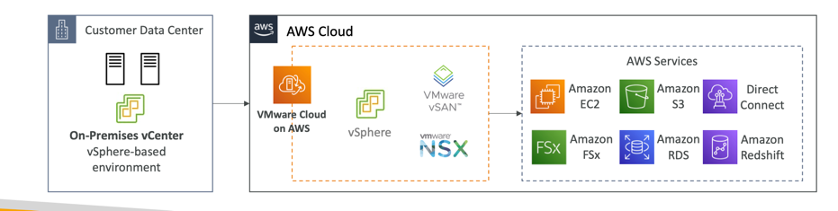

## CloudFormation
AWS CloudFormation is a declarative tool for defining and provisioning AWS infrastructure. Instead of manually creating resources, you describe them in a template, and CloudFormation builds them in the correct order.

**Example:**
- Define a security group
- Launch two EC2 instances using that security group
- Create an S3 bucket
- Set up a load balancer (ELB) in front of the EC2 instances  
  CloudFormation then provisions these resources as specified.

---

### Benefits of CloudFormation

**1. Infrastructure as Code**
- No manual resource creation—ensures consistency and control
- Infrastructure changes are reviewed through code

**2. Cost Management**
- Resources in a stack are tagged for cost tracking
- Estimate costs directly from the template
- Cost-saving strategy: Automate resource deletion after work hours (e.g., 5 PM) and recreation in the morning (e.g., 8 AM)

**3. Productivity & Automation**
- Quickly create and destroy infrastructure as needed
- Auto-generate architecture diagrams
- Declarative approach—no need to manage dependencies manually

**4. Reusability & Extensive Support**
- Use existing templates from the AWS community
- Comprehensive AWS resource support (with custom resources for unsupported ones)

CloudFormation simplifies infrastructure management, making deployments efficient, repeatable, and cost-effective.

- CloudFormation Stackset
AWS **CloudFormation StackSet** is a feature that allows you to **deploy CloudFormation stacks across multiple AWS accounts and regions** from a single template.
  - Key Points:
    - **Centralized management**: Create, update, or delete stacks in multiple accounts/regions in one go.
    - **Multi-account support**: Ideal for organizations using AWS Organizations.
    - **Automation**: Useful for enforcing consistent infrastructure (e.g., IAM roles, VPCs) across environments.
    - **Delegated administration**: You can allow other accounts to create StackSets using a shared admin account.

In short, StackSets make it easy to **scale infrastructure as code** across a distributed AWS environment.


### CloudFormation + Application Composer
Visualizes all resources and their relationships

[cloudformation-demo.gif](media/cloud-formation/cloudformation-demo.gif)

### CloudFormation Service Role

A **CloudFormation Service Role** is an IAM role that allows CloudFormation to manage stack resources on your behalf.

**Key Benefits:**
- Enables users to create, update, or delete stack resources **without needing direct permissions**.
- Supports **least privilege principle** by restricting user access while still allowing stack operations.
- Users must have the **`iam:PassRole`** permission to assign the role to CloudFormation.

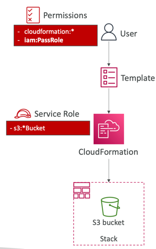

### Demo
[cloudformation-service-role-demo.gif](media/cloud-formation/cloudformation-service-role-demo.gif)
## Amazon Simple Email Service (SES)

A fully managed service for secure, scalable email sending and receiving.

### **Key Features:**
- Supports **inbound & outbound** emails
- **Reputation dashboard** with insights and anti-spam feedback
- Tracks **deliveries, bounces, feedback loops, and email opens**
- Supports **DKIM & SPF** for email authentication
- Flexible IP options: **shared, dedicated, or customer-owned**
- Send emails via **AWS Console, APIs, or SMTP**

**Use Cases:** Transactional, marketing, and bulk emails.
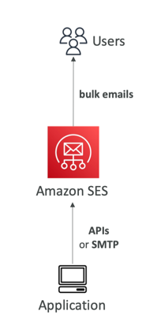

## Amazon Pinpoint

A scalable, two-way marketing service for personalized customer engagement.

### **Key Features:**
- Supports **email, SMS, push, voice, and in-app messaging**
- Enables **message segmentation & personalization**
- Allows **receiving replies**
- Scales to **billions of messages per day**

**Use Cases:** Run marketing campaigns, bulk messaging, and transactional SMS.

**Pinpoint vs. SNS/SES:**
- **SNS & SES**: You manage each message’s audience manually.
- **Pinpoint**: Supports message templates, delivery schedules, targeted segments, and full campaign management.

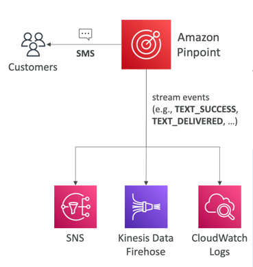


## Systems Manager
### SSM Session Manager
SSM Session Manager provides secure shell access to EC2 and on-premises servers **without** SSH, bastion hosts, or keys. It enhances security by eliminating the need for port 22.

**Features:**
- Works on **Linux, macOS, and Windows**
- Logs sessions to **S3 or CloudWatch Logs** for auditing

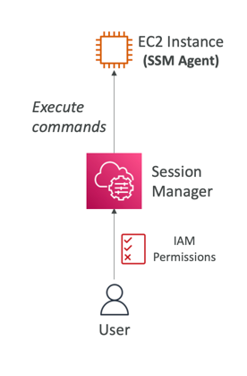
### Run Command
Run commands or scripts across multiple instances **without SSH**.

**Key Features:**
- Execute commands on multiple instances via **resource groups**
- View output in the **AWS Console**, **S3**, or **CloudWatch Logs**
- Send **SNS notifications** on command status (In Progress, Success, Failed, etc.)
- Integrated with **IAM**, **CloudTrail**, and can be triggered via **EventBridge**
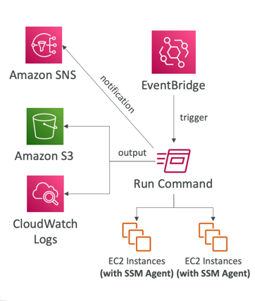

### AWS Systems Manager - Patch Manager
Automates patching for managed instances, including OS, applications, and security updates.

**Key Features:**
- Supports **EC2 and on-premises** servers (Linux, macOS, Windows).
- Patch **on-demand** or schedule via **Maintenance Windows**.
- Scan instances and generate **compliance reports** for missing patches.
- Integrates with **EventBridge** for automated execution.

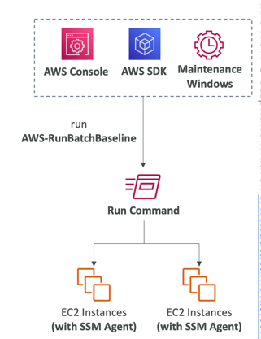

**Maintenance Windows**

Defines scheduled times for automated tasks on instances.

**Components:**
- **Schedule & Duration** – When and how long tasks run.
- **Registered Instances** – Targets for maintenance.
- **Registered Tasks** – Actions like OS patching, driver updates, and software installation.

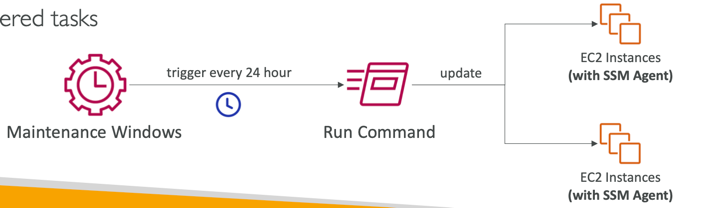

### AWS Systems Manager – Automation

**AWS Systems Manager Automation** simplifies maintenance and deployment tasks for EC2 instances and other AWS resources.

**Use Cases:**
- Restart instances, create AMIs, take EBS snapshots, and more.

**Automation Runbooks (SSM Documents):**
- Define actions for EC2 or AWS resources (predefined or custom).

**Trigger Methods:**
- **Manual:** AWS Console, CLI, or SDK
- **Event-driven:** Amazon EventBridge
- **Scheduled:** Maintenance Windows
- **Compliance-based:** AWS Config rule remediation

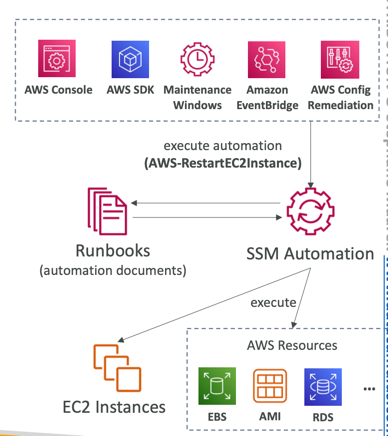

### AWS Cost Explorer

**Cost Explorer** helps you visualize, analyze, and manage AWS costs over time.

- Create custom reports for cost and usage analysis.
- View data from a high level (total costs) to detailed granularity (monthly, hourly, resource level).
- Identify the best **Savings Plan** to reduce costs.
- Forecast usage up to **12 months** based on past trends.

- Cost Explorer – Monthly Cost by AWS Service
- Cost Explorer– Hourly & Resource Level
- Cost Explorer – Savings Plan Alternative to Reserved Instances
- Cost Explorer – Forecast Usage

### AWS Compute Optimizer
**AWS Compute Optimizer** is a service that uses **machine learning** to analyze your AWS resource usage and recommends **optimal compute resources** to improve **performance and reduce cost**.

**Key features:**
- Supports **EC2 instances**, **Auto Scaling groups**, **EBS volumes**, and **Lambda functions**
- Provides **right-sizing recommendations**
- Helps identify **underutilized or overprovisioned resources**
- Easy integration with **Cost Explorer**

It helps you make data-driven decisions to optimize your cloud environment.

Here's a quick example:

Let's say you're running an **EC2 instance** of type **m5.4xlarge**, but AWS Compute Optimizer analyzes the CPU, memory, and network usage over time and finds it's only using about **15%** of its capacity.

It might recommend switching to a **m5.2xlarge** or even **m5.xlarge**, which would **cut your costs by 50–75%** while still meeting your performance needs.

These recommendations often come with **estimated savings** and **confidence scores**, so you can make informed decisions.

### AWS Cost Anomaly Detection
Uses ML to monitor cost and usage, detecting unusual spikes or trends **without manual thresholds**.

**Key Features:**
- Learns historic spending patterns for accurate anomaly detection
- Monitors AWS services, accounts, tags, and cost categories
- Provides root-cause analysis in anomaly reports
- Sends alerts via SNS (individual or daily/weekly summaries)

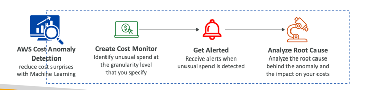

### AWS Outpost
Hybrid Cloud (AWS + On-premise)
- challenges in managing both. 
- AWS provides Outposts (server racks) that offers save AWS infras, services and APIs to build your own applications on-premise just as in the cloud
  - AWS will come and install these pre-loaded racks within your on-premise infras and you can leverage it
- basically you extend aws services directly to the on-premise datacenter
- On the outpost, we can run these
  - EC2, EBS, S3, EKS, ECS, RDS, EMR
- Benefits:
  - low latency
  - local processing and data residency
  - easier migration from on-premise to the cloud
  - fully managed

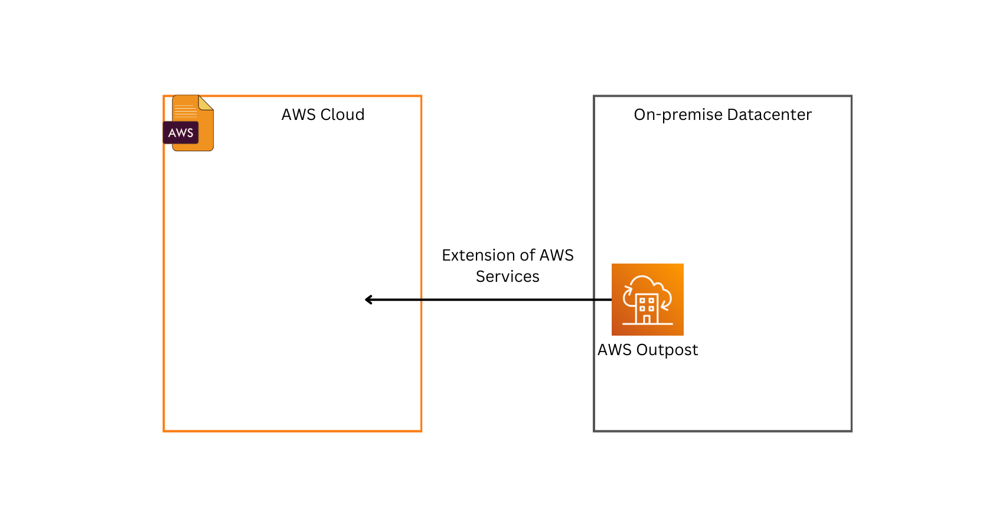

### AWS Batch

AWS Batch is a **fully managed service** for running batch jobs at any scale.

**Key Features:**
- Runs **100,000s of batch jobs** (tasks with a defined start and end).
- Dynamically provisions **EC2 or Spot Instances** for cost efficiency.
- Automatically allocates **compute and memory** as needed.
- Jobs are **Docker-based** and run on ECS.
- Simplifies infrastructure management—just submit or schedule jobs, and AWS Batch handles the rest!

**Batch vs. Lambda**

| Feature       | AWS Lambda  | AWS Batch  |
|--------------|------------|------------|
| **Execution Time** | Limited | No time limit |
| **Runtime Support** | Predefined runtimes | Any Docker-based runtime |
| **Storage** | Limited temporary disk | Uses EBS / instance store |
| **Infrastructure** | Serverless | Runs on EC2 (managed by AWS) |

AWS Batch is ideal for **long-running, flexible compute jobs**, while Lambda is better for **short, event-driven tasks**. 🚀

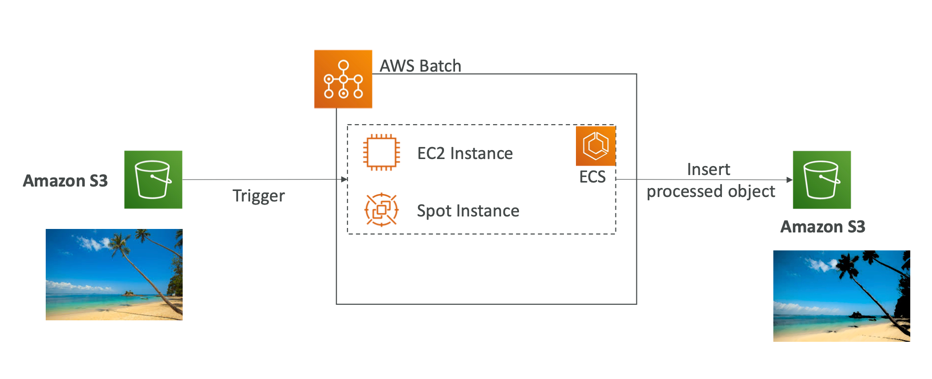

### Amazon AppFlow

Amazon AppFlow is a **fully managed service** for securely transferring data between **SaaS applications and AWS**.

**Key Features:**
- **Sources:** Salesforce, SAP, Zendesk, Slack, ServiceNow.
- **Destinations:** AWS services (S3, Redshift) and external platforms (Snowflake, Salesforce).
- **Flexible scheduling:** On-demand, event-driven, or scheduled transfers.
- **Built-in data transformation:** Filtering, validation, and enrichment.
- **Secure transfer:** Encrypted via the public internet or AWS PrivateLink.
- **No manual integration required**—connect and leverage APIs instantly! 🚀

### AWS Amplify – Web & Mobile Apps

AWS Amplify is a **set of tools and services** for building and deploying **scalable full-stack** web and mobile applications.

**Key Features:**
- **Built-in services:** Authentication, Storage, APIs (REST/GraphQL), CI/CD, PubSub, Analytics, AI/ML, and Monitoring.
- **Flexible deployment:** Connect to GitHub, CodeCommit, Bitbucket, GitLab, or upload code directly.

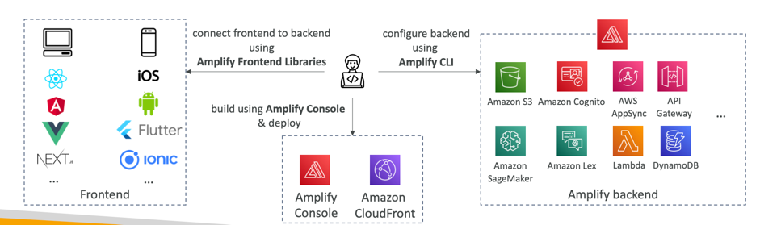


### AWS Instance Scheduler

AWS Instance Scheduler is a **solution** deployed using CloudFront that **automates start and stop schedules** for EC2, EC2 ASG and RDS instances, helping reduce costs.

**Key Features:**
- **Automated scheduling:** Start/stop instances based on predefined schedules.
  - start, stop EC2 instances outside business hours
  - schedules are managed in DynamoDB table
- **Cost optimization:** Avoid paying for unused compute resources (reduces costs by 70%).
- **Flexible configuration:** Supports custom schedules and tagging for grouping instances.
- **Multi-account support:** Works across AWS accounts using AWS Organizations and regions.
- **Integration:** Uses Lambda (starts stops instances), DynamoDB, and CloudWatch for scheduling and monitoring.

Ideal for **non-production environments**, such as development and testing, to save costs. 🚀

https://aws.amazon.com/solutions/implementations/instance-scheduler-on-aws/

Demo

[instance-scheduler-demo.gif](media/instance-scheduler-demo.gif)

## GitOps
GitOps is a modern operational framework that uses Git as the single source of truth for managing infrastructure and applications. 
It leverages Git repositories to store and version all declarative configurations and relies on automated processes to ensure the actual state of the system matches the desired state defined in Git.
GitOps bridges the gap between development and operations by applying DevOps principles to infrastructure and application delivery, emphasizing automation, collaboration, and traceability.
- Core Principles of GitOps
  - Declarative:
  All infrastructure and application configurations are described declaratively, often in YAML or JSON files. These files define the desired state of the system.

  - Versioned and Immutable:
  Configurations are stored in Git repositories, providing a version-controlled, auditable history. This makes rollbacks easy by reverting to a previous commit.

  - Automatically Applied:
  Changes to the Git repository trigger automated processes (e.g., CI/CD pipelines or tools like Argo CD) to reconcile the actual system state with the desired state.

  - Continuous Reconciliation:
  The system is continuously monitored and reconciled to match the state defined in Git. If there’s drift (unexpected changes), the system reverts to the desired state or alerts the user.
- GitOps Tools
  Several tools help implement GitOps practices, especially for Kubernetes-based environments:

  - Argo CD: A Kubernetes-native GitOps tool for deploying and managing applications.
  - Flux: Another Kubernetes-native GitOps tool focused on continuous delivery.
  - Jenkins X: Integrates GitOps workflows with Jenkins pipelines.
  - Crossplane: Works with GitOps tools to provision and manage infrastructure.
  - Terraform Cloud: Extends GitOps for infrastructure provisioning.

## IaC and Infrastructure
1. Order you cloud profile
2. Order VPC
2. Order K8s cluster
3. Order and configure global registry (images etc) (Harbor on aws)
4. Order and config jenkins

## Documentation
- MkDocs:
  is an excellent choice for creating and managing toolchain documentation due to its simplicity, extensibility, and developer-friendly nature. 
- It is a static site generator specifically designed for creating documentation projects from Markdown files.


## Authentication/Authorization
```
env:
  oauth2: 
    resourceserver:
      jwkSetUri: "https://..../itmp-oidc/v1/.well-known/jwks.json"
      
  virtualService:
    app:
      host: "xxx"
    gateways:
      - adp-istio-system/enabling-gw
```
- Jenkinsfile
```
pipeline {
  post {}
  agent {}
  environment{ }
  options {}
  stages {
    stage("x"){
      steps {
        script {}
      }
    }
    stage("y"){
      steps {
        script {}
      }
    }
  }
}
```
- Disaster Recovery Models:
  - Pilot Light
  - Warm Standby
  - Multi-site

## API management
- Setup Apigee with complex use cases
  - Secure integration of applications with domain services within organization adn across organization
  - It enables API consumers and app developers to build innovative engaging apps by providing frictionless self-service
    onboarding, easy access to AP keys, and API secrets and rich interactive API documentation

## Insurance Domain
- Property
- Life
- Health
- AI integration for SME, Retail and portfolio (investment management)
### Sales channel
- Insurance companies typically utilize a diverse array of sales channels to reach their customers and distribute their products effectively. These channels can be categorized into the following groups:

1. Direct Sales Channels
   Company Website: Customers can purchase insurance policies directly online.
   Mobile Apps: Users can explore and buy policies through mobile applications.
   Call Centers: Dedicated helplines for policy purchase and support.
   Walk-in Branches: Customers visit physical offices for consultations and purchases.
2. Agency Sales Channels
   Individual Agents: Licensed individuals who sell insurance policies on behalf of the company.
   Corporate Agencies: Firms dedicated to selling insurance policies.
3. Broker Sales Channels
   Independent Brokers: Third-party intermediaries who compare and sell policies from multiple insurers.
   Online Brokers: Platforms or websites offering comparisons and sales of various insurance products.
4. Partnership and Bancassurance Channels
   Banks and Financial Institutions: Partnerships where insurance products are sold through banking networks.
   Retail Partnerships: Collaborations with retail outlets or businesses for policy sales.
   Affinity Groups: Sales through associations or groups, such as professional organizations or unions.
5. Digital and Online Platforms
   Aggregators and Comparison Websites: Platforms like Policybazaar or ComparetheMarket.
   E-Commerce Platforms: Selling insurance as an add-on service on platforms like Amazon.
   Social Media and Digital Advertising: Targeted campaigns on platforms like Facebook, Instagram, or LinkedIn.
6. Corporate and Institutional Sales
   Group Insurance Plans: Policies tailored for businesses to offer their employees.
   Custom Institutional Plans: Insurance for government entities, non-profits, or large corporations.
7. Embedded Insurance Channels
   Through Products or Services: Offering insurance bundled with other products, such as travel insurance included with a flight booking or device insurance with an electronics purchase.
8. Reinsurance Partnerships
   Partnering with smaller or regional insurers to underwrite or co-sell insurance products.
9. Telecommunication Channels
   Collaborating with telecom providers to sell microinsurance or coverage via SMS or subscription plans.
10. Peer-to-Peer and Community-Based Channels
    Platforms enabling groups or communities to pool resources and insure each other.
    This multi-channel strategy allows insurers like Berkshire Hathaway (USA), UnitedHealth Group, Allianz SE to maximize their market reach and provide diverse touchpoints to meet customer preferences and needs.

In the context of sales channels for an insurance company, **cross-channel** refers to the integration and seamless interaction of multiple sales and communication channels to enhance the customer experience. It ensures that customers can interact with the company through various channels while maintaining consistent service, data, and messaging.

### Characteristics of Cross-Channel Strategies:
1. **Customer-Centric Integration**:
  - Information and interactions flow smoothly across all channels.
  - For example, a customer might start a policy quote online, receive advice from a call center, and finalize the purchase at a physical branch.

2. **Channel Flexibility**:
  - Customers can switch between channels without having to repeat information.
  - For instance, policy details discussed with an agent are immediately accessible when the customer transitions to a mobile app.

3. **Unified Data Systems**:
  - Cross-channel strategies depend on centralized data systems, such as CRM tools, to track customer interactions and history across all channels.

4. **Consistent Branding and Messaging**:
  - The company ensures that the tone, offers, and communication remain consistent, whether the interaction happens in-person, online, or via phone.

**Examples in Insurance:**
- A customer could begin researching insurance plans on the company's website, receive tailored recommendations through an AI chatbot, and complete the purchase through a financial advisor.
- Integrated campaigns where advertisements on social media direct customers to personalized landing pages on the website, followed by follow-up calls from agents.

**Benefits:**
- **Improved Customer Experience**: Seamless transitions between channels enhance satisfaction and reduce frustration.
- **Increased Sales Opportunities**: Consistent cross-channel engagement can help convert leads into policyholders.
- **Data-Driven Insights**: Unified data systems allow companies to analyze customer behavior and preferences across channels to optimize offerings.

Insurance companies often use cross-channel strategies to offer tailored customer experiences and maintain strong engagement across digital, physical, and partner platforms.

Here’s a detailed explanation of the terms in the context of insurance sales channels, particularly for an insurance company:

### 1. **Motor Commercial Fleet**
- **Definition**: Refers to insurance solutions specifically designed for companies that operate fleets of vehicles for business purposes. This includes coverage for risks like accidents, liability, and vehicle damage for multiple vehicles under one policy.
- **Context in Sales Channels**:
  - Offered through specialized brokers, direct sales teams, or digital platforms.
  - Tailored pricing and policy options may be discussed via cross-channel approaches, such as an online quote system followed by consultations with underwriting specialists.

### 2. **Underwriting Platform**
- **Definition**: A digital or integrated system used by insurers to evaluate risks and determine the terms, pricing, and approval of insurance policies. These platforms often leverage advanced analytics, AI, and data integration to streamline the underwriting process.
- **Context in Sales Channels**:
  - Ensures real-time decisions on policy issuance across channels like online portals, call centers, or agent-assisted sales.
  - Offers customers quick and accurate policy quotations, improving efficiency and customer satisfaction.

### 3. **Motor Services Including BiPRO**
- **Definition**: Refers to a range of vehicle-related insurance services often aligned with industry standards like **BiPRO (Brancheninitiative Prozessoptimierung)**, a German initiative for process optimization in the insurance industry. BiPRO ensures standardized data exchange between insurers, brokers, and service providers.
- **Context in Sales Channels**:
  - Facilitates smooth communication between various channels, such as brokers and direct sales.
  - Allows brokers to efficiently access and process claims or insurance adjustments using standardized APIs or digital tools.
    **Motor Services** in the context of insurance typically include a range of value-added services provided by insurers to support vehicle owners, enhance their customer experience, and manage vehicle-related risks. Here are some examples:

### Examples of Motor Services:
1. **Roadside Assistance**:
  - 24/7 support for breakdowns, flat tires, battery jump-starts, towing, and fuel delivery.

2. **Claims Management Services**:
  - Streamlined processes for accident reporting and claims filing via online portals or mobile apps.
  - Access to repair shops and vehicle inspection services to facilitate quick settlements.

3. **Fleet Management Services**:
  - For commercial fleet insurance, insurers may offer GPS tracking, fuel efficiency monitoring, and driver behavior analytics to improve fleet performance and safety.

4. **Repair and Replacement Services**:
  - Network of approved garages or repair shops offering discounted rates or cashless services.
  - Replacement vehicle provision during repair periods.

5. **Theft Recovery Assistance**:
  - GPS-enabled theft tracking and coordination with law enforcement for vehicle recovery.

6. **Legal and Third-Party Liability Support**:
  - Assistance with legal matters and compensation claims in the event of an accident involving third parties.

7. **Integration with Industry Standards (e.g., BiPRO)**:
  - Automated and standardized data exchange for brokers and agents to efficiently manage policies and claims.

8. **Driver Training and Risk Management**:
  - Workshops or online training modules for safer driving practices, especially for commercial clients.

9. **Vehicle Health Monitoring**:
  - IoT-based diagnostic tools that monitor the condition of a vehicle and provide alerts for maintenance needs.

10. **Insurance Bundling with Dealer Services**:
- Policies offered in collaboration with car manufacturers or dealers at the point of purchase, covering extended warranties or service plans.

These services not only add convenience but also serve as a competitive differentiator for insurance providers aiming to deliver comprehensive motor insurance solutions.
### 4. **Motor Retail**
- **Definition**: Insurance offerings tailored to individual vehicle owners (as opposed to commercial fleets). This includes personal auto insurance policies covering private vehicles.
- **Context in Sales Channels**:
  - Sold through digital channels, agents, and partnerships with car dealerships.
  - Cross-channel strategies may include dealership tie-ups where insurance is bundled with vehicle purchases, allowing customers to transition smoothly from purchase to coverage.

### Integrated Role in Cross-Channel Strategy:
- These terms represent distinct product and service lines in the motor insurance space.
- Cross-channel capabilities (e.g., underwriting platforms accessible to both agents and online users) ensure seamless interactions and maintain consistency for the customer regardless of the sales point.

### 5. Property Insurance
Property insurance is a type of insurance policy that provides financial protection against damages or losses to physical 
property, such as buildings, homes, businesses, and personal belongings. It covers risks like fire, theft, natural disasters, 
vandalism, and other unexpected events, depending on the policy terms.

**Personas in Insurance**
1. Broker (Makler): Independent broker who works with multiple insurance companies
2. Agent (Vertreter): Employee of an insurance company that sale the product directly to the clients
3. Specialist: Expert in a particular areas of insurance or financial services with focus on specific product line

### User Journeys
- Awareness --> Search --> Quoting --> Bind and pay --> management --> make claims --> Renewal/Retention
- Services
  - Sales Document Services
  - Customer Advisory
  - Sales Integration
  - Campaign management
  - Sales Portal
  - Sales Task mgmt
## General cloud adoption principles
- Dual/Multi cloud vendor strategy: i.e Azure + AWS + SaaS
- Public cloud first
- Simplify cloud management, ensure compliance, accelerate innovation
- The cloud platform should be:
  - innovative
  - secure
  - globally accessible
  - adopting cloud-native solutions
- Community based
- Customer centric
- DevOps driven
- Profile based
- Cloud first: public cloud the default choice
- Radical simplification: cloud-native, open source
- Renew not rehost: re-architect instead of lift-and-shift
- Sustainable impact: concrete and measurable business impacts instead of intangible benefits
- 6R (rehost, retain, retire ...) principle in software architecture modernization


### Enterprise cloud adoption principles
- global roll out of the Global Cloud Platform (GCF)
- global platform with local flexibility
- cross-channel
- Country specific applications
- Intuitive UI
- CI/CD
- smooth transitions and clean data domain

# Disaster Recovery
- Application domain driven
- Infrastructure domain driven
- Disaster recovery models:
  - pilot light
  - warm standby
  - multi-site

# Software Solution Architect - General Approach
- from 500 to 5000 users and slow system? increase the instance type to something like t2.large or M5 (but with downtime)
  - better scale horizontally
- evolve: downtime --> h-scaling --> many IPs? route 53 --> one IP down due to TTL user's bad experience --> ELB + health checks
- Stateless Application:

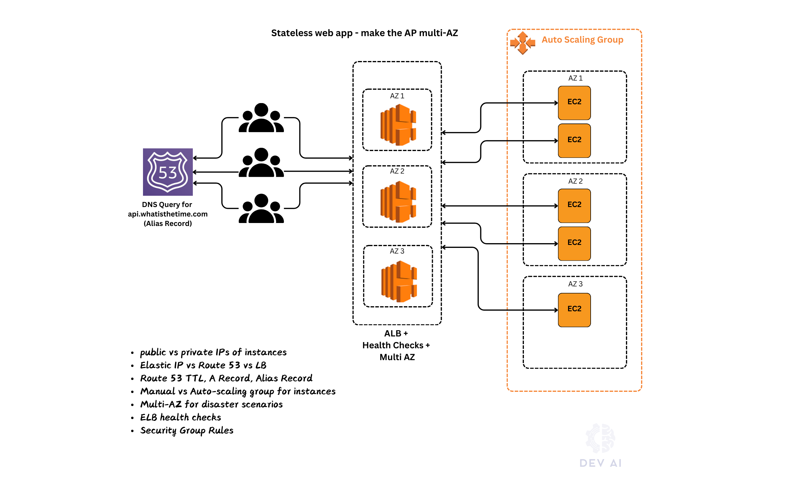

- Stateful Application:
  - points which were considered throughout the optimization above:
    - ELB sticky session activation
    - web client storing app cookies and making our app stateless
    - ElastiCache:
      - for storing session (alternative DynamoDB)
      - for caching data from RDS
      - Multi-AZ considerations
    - RDS:
      - storing user data like name, birthday
      - scaling read with replicas
      - Multi-AZ for DR
    - tight security with security groups referencing each other

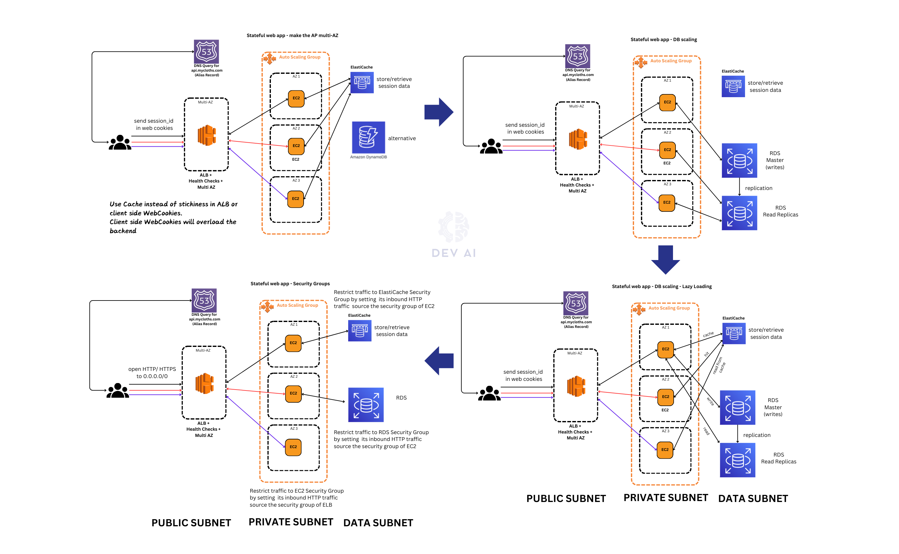
  - Another App for storing Images:
    - EBS okay only in single instance setup
    - EFS is preferred in distributed application
  
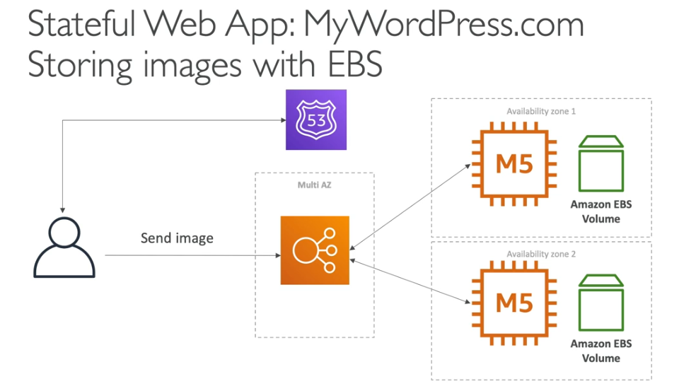
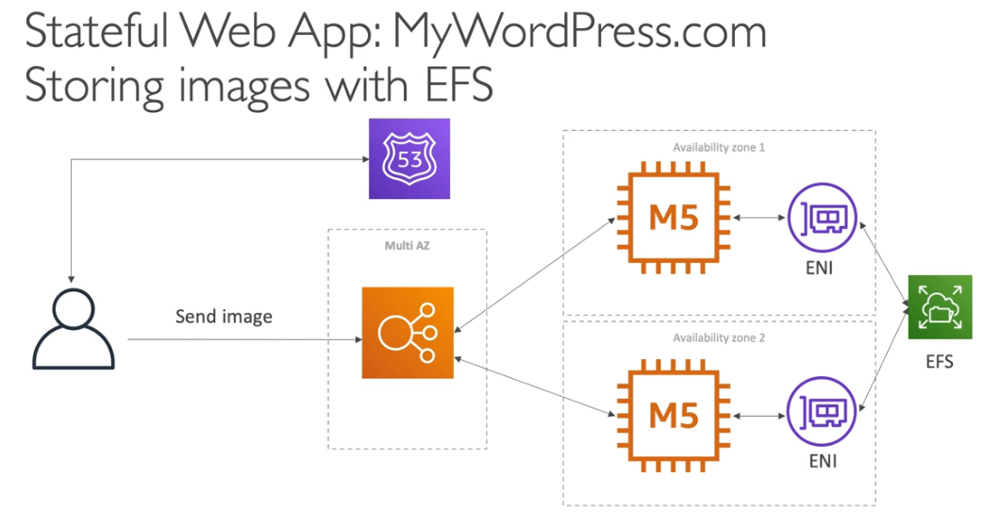

- Application instantiation speed up
  - EC2 instances:
    - Golden AMI:
      - install you applications, OS dependencies etc beforehand and launch your EC2 instances from golden AMI
    - User Data: for dynamic config, use User Data Scripts
    - Hybrid: mix Golden AMI & User data (Elastic Beanstalk)
  - RDS Databases:
    - Restore from a snapshot: the db will have schemas and data ready. This would be much more efficient than running a huge insert query
  - EBS volumes:
    - restore from a snapshot: the disk will already be formatted and have data
- BeanStalk:
  - It is a developer centric view of deploying applications on AWS to save time for doing all manual setups of EC2, ASG, ELB, RDS etc
  - It is managed service
  - It is free but we pay for the underlying resources
  - It consists of these components:
    - application
    - application version
    - environment
      - collection of AWS resources running an application
      - tiers: web server env tier and worker env tier
      - dev, test, prod envs

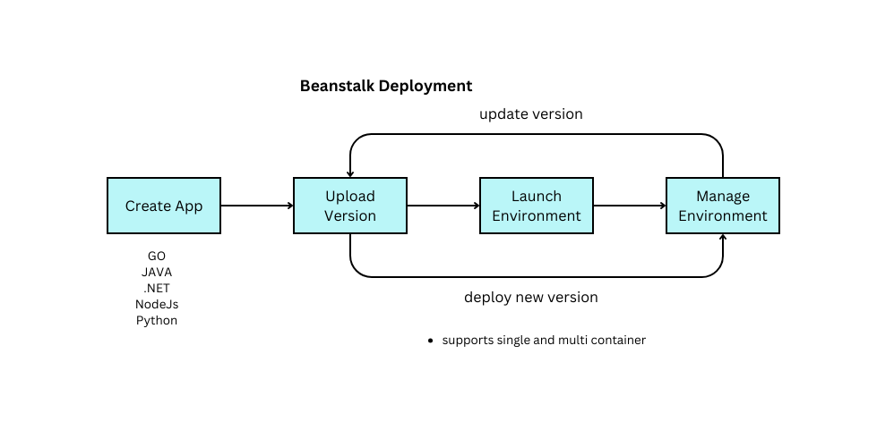

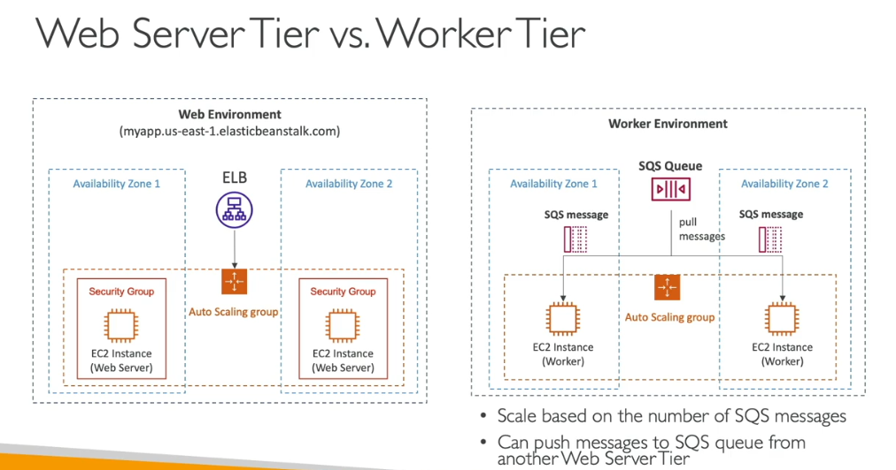

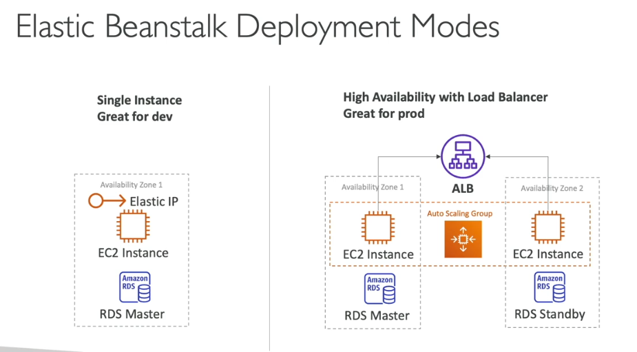
  - Demos:

[beanstalk-creation-demo.gif](media/beanstalk-creation-demo.gif)

[cloudformation-beanstalk-demo.gif](media/cloudformation-beanstalk-demo.gif)

[beanstalk-cleanup.gif](media/beanstalk-cleanup.gif)


# Solution Architect 2
## Lambda, SNS & SQS
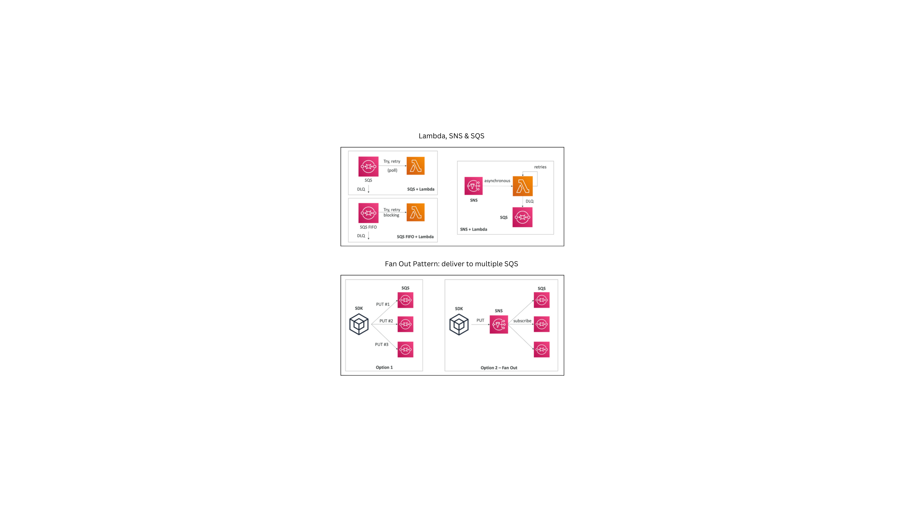

## **S3 Event Notifications**

- Trigger events like **S3:ObjectCreated, S3:ObjectRemoved, S3:ObjectRestore, S3:Replication**, etc.
- **Filter by object name** (e.g., only trigger for `*.jpg` files).
- **Common use case:** Automatically generate thumbnails when images are uploaded to S3.
- **No limit** on the number of S3 events you can create.
- **Delivery time:** Usually **within seconds**, but may take **a minute or longer** in some cases.

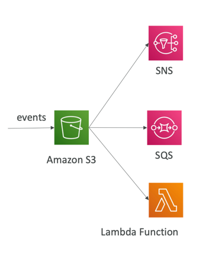

### **S3 Event Notifications with Amazon EventBridge**

- **Advanced filtering** using JSON rules (filter by metadata, object size, name, etc.).
- **Multiple destinations**: Send events to **Step Functions, Kinesis Streams, Firehose**, and more.
- **EventBridge features**:
  - **Archive** events for future reference.
  - **Replay** past events when needed.
  - **Reliable delivery** ensures events are processed successfully.

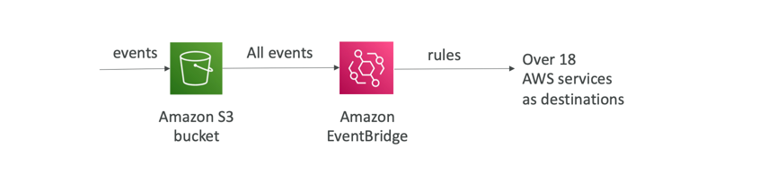

## Amazon EventBridge – Intercept API Calls
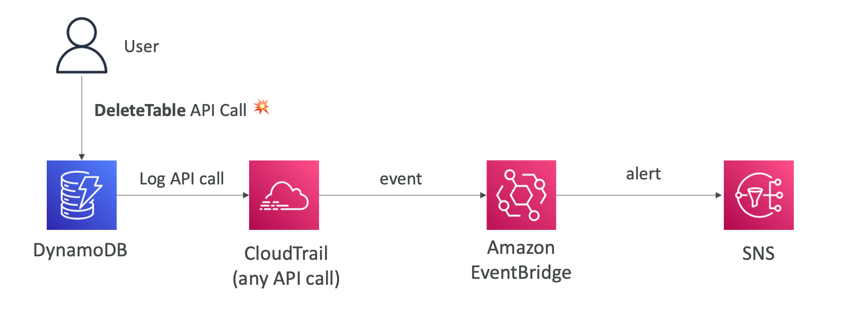

## Client Events through API Gateway – AWS Service Integration Kinesis Data Streams example
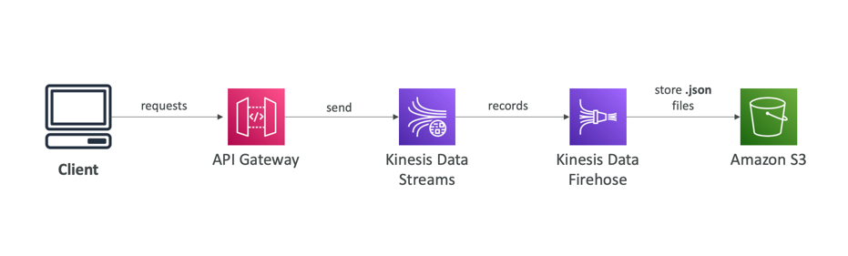

## Caching Strategies:
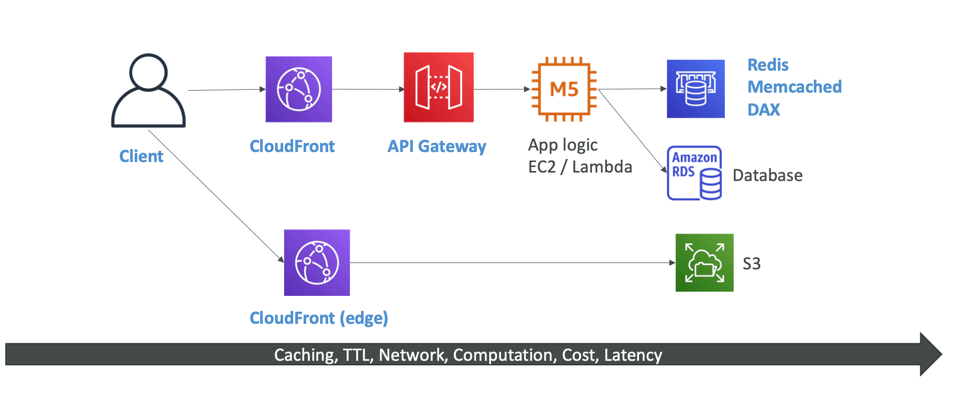
- DB and S3 doesn't have caching capabilities

## Blocking an IP address - Methods
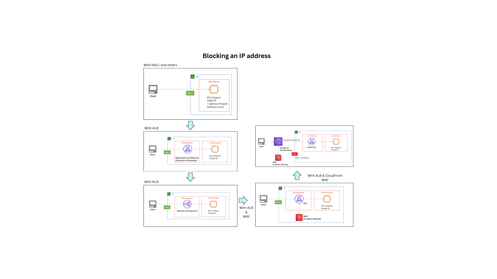


## High Performance Computing (HPC)
AWS provides a powerful and scalable environment for **High Performance Computing (HPC)**, enabling users to:
- **Scale resources instantly** to meet computational demands.
- **Speed up processing time** by leveraging more computing power.
- **Optimize costs** by paying only for what is used.
- **Run complex workloads** such as **genomics, computational chemistry, financial risk modeling, weather prediction, machine learning, deep learning, and autonomous driving**.

AWS offers a range of services to support **HPC workloads**, categorized as follows:

---

### **1. Data Management & Transfer**
Efficiently move large datasets to and from AWS for HPC processing.

- **AWS Direct Connect** – Secure, high-speed private network for transferring data at **GB/s speeds**.
- **AWS Snowball & Snowmobile** – Physical devices for securely transferring **PBs of data** to AWS.
- **AWS DataSync** – Automates bulk data transfer between **on-premises storage and AWS services** like S3, EFS, and FSx for Windows.

---

### **2. Compute & Networking**
AWS provides specialized **compute and networking** options for high-speed, scalable HPC processing.

**Compute Options:**
- **EC2 Instances** – Choose from **CPU-optimized (C5, C6i)** or **GPU-optimized (P4, G5)** instances for different workloads.
- **Spot Instances & Spot Fleets** – Cost-efficient computing with Auto Scaling to match demand.

**Networking Enhancements:**
- **EC2 Placement Groups** – Cluster instances for **low-latency, high-throughput communication**.
- **EC2 Enhanced Networking (SR-IOV)** – Reduces latency and increases packet throughput.
  - **Elastic Network Adapter (ENA):** Up to **100 Gbps** bandwidth.
  - **Intel 82599 VF:** Up to **10 Gbps** (legacy option).
- **Elastic Fabric Adapter (EFA)** – Optimized networking for tightly coupled HPC workloads.
  - A network device attached to EC2 instances that enhances performance of inter-instance communication
  - Works only on **Linux** and supports the **Message Passing Interface (MPI)**.
  - Bypasses Linux OS for **low-latency, high-speed communication** between instances.

---

### **3. Storage**
AWS provides both **instance-attached** and **network-based** storage optimized for HPC.

**Instance-Attached Storage:**
- **Amazon EBS:** Up to **256,000 IOPS** with **io2 Block Express**.
- **Instance Store:** Directly attached to EC2, **low latency**, capable of **millions of IOPS**.

**Network Storage:**
- **Amazon S3:** Cost-effective storage for large datasets (object storage, not a file system).
- **Amazon EFS:** Scalable file storage with **automatic IOPS scaling**.
- **Amazon FSx for Lustre:** HPC-optimized distributed file system.
  - Delivers **millions of IOPS**.
  - **Backed by Amazon S3** for long-term data storage.

---

### **4. Automation & Orchestration**
Automate the deployment and management of HPC workloads on AWS.

- **AWS Batch**
  - Supports **multi-node parallel jobs** spanning multiple EC2 instances.
  - **Automatically schedules and provisions** EC2 instances as needed.
- **AWS ParallelCluster**
  - Open-source tool for **managing HPC clusters on AWS**.
  - Configurable using simple text files.
  - Automates **VPC, subnets, instance types, and cluster setup**.
  - Supports **EFA integration** for **improved network performance**.

---

### **Conclusion**
AWS provides a **scalable, cost-effective, and high-performance** environment for running HPC workloads. By leveraging **specialized compute, networking, storage, and automation tools**, organizations can efficiently run complex simulations, scientific computations, and AI workloads. 🚀

## Creating a highly available EC2 instance
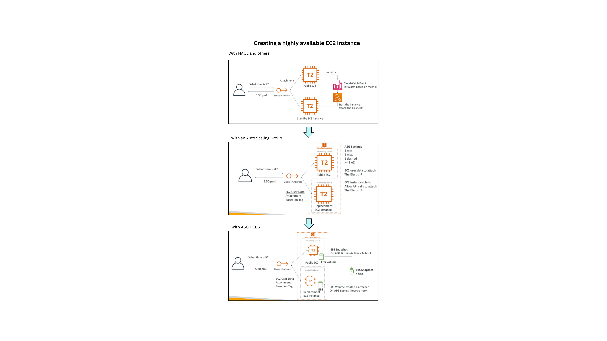

# AWS White papers
- Well Architected Framework General Guiding Principles
  - https://aws.amazon.com/architecture/well-architected
  - Stop guessing your capacity needs. Use ASG instead
  - Test systems at production scale. AWS makes it easy
  - Automate to make architectural experimentation easier i.e using CloudFormation
  - Allow for evolutionary architectures. 
    - Evolve overtime and more to serverless
    - Design based on changing requirements
  - Drive architectures using data
  - Improve through game days. go prod and see how it goes
    - Simulate applications for flash sale days

- Well Architected Framework 6 Pillars
  1. Operational Excellence 
  2. Security
  3. Reliability
  4. Performance Efficiency
  5. Cost Optimization
  6. Sustainability

They are not something to balance, or trade-offs, they’re a synergy

## AWS Well-Architected Tool
- Free tool to review your architectures against the 6 pillars Well-Architected
Framework and adopt architectural best practices
- How does it work?
  - Select your workload and answer questions
  - Review your answers against the 6 pillars
  - Obtain advice: get videos and documentations, generate a report, see the results in a dashboard
- Let’s have a look: https://console.aws.amazon.com/wellarchitected

Demo:

[well-architected-tool-demo.gif](media/well-architected-tool-demo.gif)

## AWS Trusted Advisor

AWS Trusted Advisor provides **automated recommendations** to optimize your AWS account—**no installation required**.

### **Key Categories:**
- Cost Optimization
- Performance
- Security
- Fault Tolerance
- Service Limits
- Operational Excellence

**Additional Features:**
- Full checks available with **Business & Enterprise Support plans**
- **Programmatic access** via AWS Support API

Demo

[trusted-advisor-demo.gif](media/trusted-advisor-demo.gif)

## More AWS Architecture Examples

Covered key patterns:
- **Classic:** EC2, ELB, RDS, ElastiCache
- **Serverless:** S3, Lambda, DynamoDB, CloudFront, API Gateway

Explore more at: Use it along the journey in the role of an architect  
🔗 [AWS Architecture](https://aws.amazon.com/architecture/)  
🔗 [AWS Solutions](https://aws.amazon.com/solutions/)

[aws-architect-reference-spaces-demo.gif](media/aws-architect-reference-spaces-demo.gif)

## Exams materials
- Solution architect associate [exam](https://aws.amazon.com/certification/certified-solutions-architect-associate/): 
  - 65 questions in 130 minutes
  - passing score of 720/1000
- AWS disaster [recovery](https://aws.amazon.com/disaster-recovery/):
- AWS youtube [channel](https://www.youtube.com/@AWSEventsChannel):
- AWS Well-architected [framework](https://docs.aws.amazon.com/wellarchitected/latest/framework/welcome.html): 

## AWS Pricing model

### **S3 (Simple Storage Service)**
- Standard: **$0.023/GB**
- Intelligent-Tiering: **$0.023 (frequent)** / **$0.0125 (infrequent)**
- Standard-IA: **$0.0125/GB**
- One Zone-IA: **$0.01/GB**
- Glacier: **$0.004/GB**
- Glacier Deep Archive: **$0.00099/GB**

### **EFS (Elastic File System)**
- Standard: **$0.30/GB**
- One Zone: **$0.16/GB**
- Infrequent Access (IA): **$0.025/GB**

### **EBS (Elastic Block Store)**
- General Purpose SSD (gp3): **$0.08/GB**
- General Purpose SSD (gp2): **$0.1/GB**
- Provisioned IOPS SSD (io2): **$0.125/GB**
- Throughput Optimized HDD (st1): **$0.045/GB**
- Cold HDD (sc1): **$0.015/GB**
- Snapshots: **$0.05/GB**

### **Other Storage Services**
- AWS Backup (EBS/EFS/RDS): **~$0.05/GB**
- FSx for Windows File Server: **~$0.13/GB**
- FSx for Lustre (scratch): **$0.14/GB**
- RDS General Purpose SSD: **~$0.115/GB**
- Aurora Storage: **$0.10/GB**

### **Data Transfer**
- S3 to Internet: **$0.09/GB (first 10TB/month)**
- Inbound to AWS: **Free**

---

## Mind Teasers (AWS)
- running AWS RDS found to be unencrypted? How to fix?

## Prompt Engineering Certifications

# AWS AI/ML Path

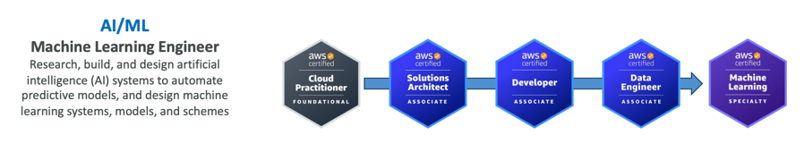

