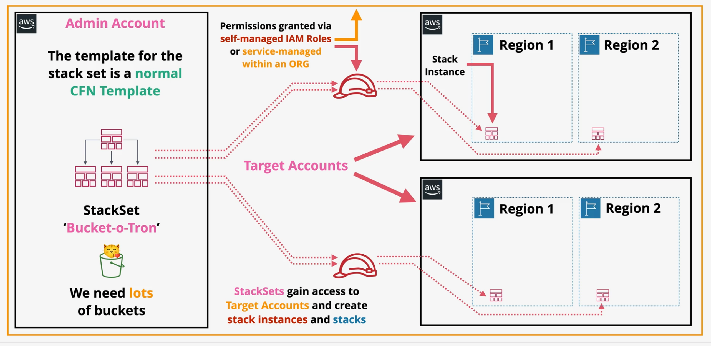
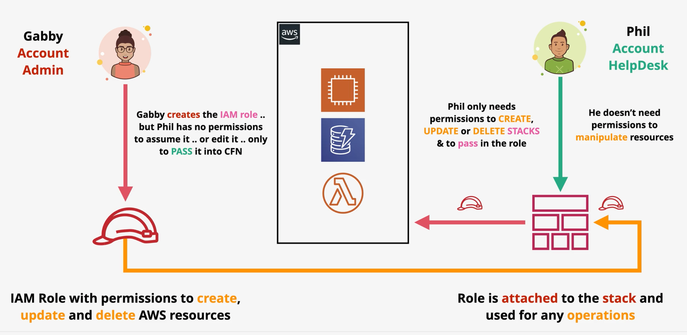
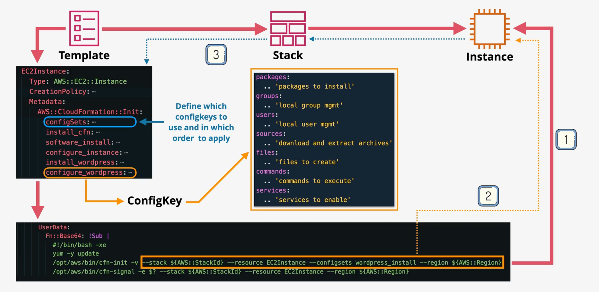
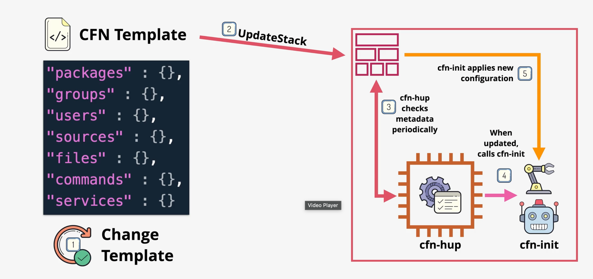
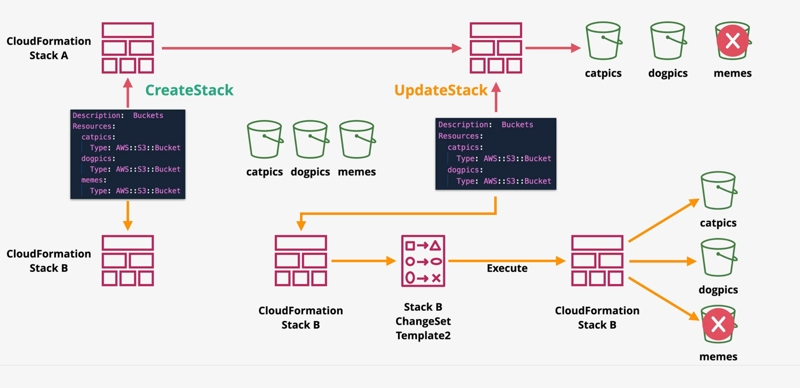
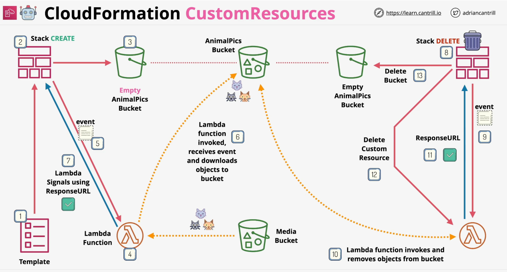

## Nonportable vs portable CloudFormation template for deploying a demo application
- A nonportable CloudFormation template is tightly coupled to specific AWS resources, configurations, and regions, making it difficult to reuse or adapt for different environments. It may include hardcoded values, specific resource names, and dependencies that limit its flexibility.
  - i.e an image ID or instance type that is only available in one region
- A portable CloudFormation template, on the other hand, is designed to be reusable across different environments and regions. It uses parameters, mappings, and conditions to allow customization without modifying the template itself. This makes it easier to deploy the same infrastructure in multiple contexts with minimal changes.

## Parameters and Pseudo-parameters
- Parameters are user-defined inputs that allow you to customize the behavior of your CloudFormation template at deployment time. 
- Pseudo-parameters are predefined variables that CloudFormation provides, which you can use to reference information about the stack, such as the AWS region or account ID.
- Example of Parameters:
```yaml 
Parameters:
  InstanceType:
    Description: EC2 instance type
    Type: String
    Default: t2.micro
    AllowedValues:
      - t2.micro
      - t2.small
      - t2.medium
```
- Example of Pseudo-parameters:
```yaml
Resources:
  MyInstance:
    Type: AWS::EC2::Instance
    Properties:
      InstanceType: !Ref InstanceType
      ImageId: !Ref 'AWS::Region' # Pseudo-parameter to get the current region
```

## Intrinsic Functions
- Intrinsic functions are built-in functions provided by CloudFormation that allow you to perform operations such as referencing other resources, joining strings, or performing conditional logic within your templates.
- Common intrinsic functions include `!Ref`, `!GetAtt`, `!Join`, `!Sub`, and `!If`.
- Example of using intrinsic functions:
```yaml
Resources: 
  MyBucket:
    Type: AWS::S3::Bucket
    Properties:
      BucketName: !Sub 'my-bucket-${AWS::AccountId}-${AWS::Region}'
```
- In this example, the `!Sub` function is used to create a bucket name that includes the AWS account ID and region, making it unique across different deployments.

## Mappings
- Mappings are fixed variables within a CloudFormation template that allow you to create simple "lookup" tables. They are useful for defining values that depend on specific conditions, such as region-specific AMI IDs or instance types.
- Example of Mappings:
```yaml
Mappings:
  RegionMap:
    us-east-1:
      AMI: ami-0ff8a91507f77f867
    us-west-2:
      AMI: ami-0bdb828fd58c52235
Resources:
  MyInstance:
    Type: AWS::EC2::Instance
    Properties:
      ImageId: !FindInMap [RegionMap, !Ref 'AWS::Region', AMI]
      InstanceType: t2.micro
```

## Outputs
- Outputs are used to declare values that you want to be able to access from outside the CloudFormation stack. They can be useful for returning resource IDs, URLs, or other information that you may need after the stack is created.
- Example of Outputs:
```yaml
Outputs:
  InstanceId:
    Description: The Instance ID of the newly created EC2 instance
    Value: !Ref MyInstance
  BucketName:
    Description: The name of the S3 bucket
    Value: !Ref MyBucket
```
## Clean example of a pure portable CloudFormation template
```yaml
AWSTemplateFormatVersion: '2010-09-09'
Description: A portable CloudFormation template for deploying a demo application
Parameters:
  InstanceType:
    Description: EC2 instance type
    Type: String
    Default: t2.micro
    AllowedValues:
      - t2.micro
      - t2.small
      - t2.medium
Mappings:
  RegionMap:
    us-east-1:
      AMI: ami-0ff8a91507f77f867
    us-west-2:
      AMI: ami-0bdb828fd58c52235
Resources:
  MyInstance:
    Type: AWS::EC2::Instance
    Properties:
      ImageId: !FindInMap [RegionMap, !Ref 'AWS::Region', AMI]
      InstanceType: !Ref InstanceType
Outputs:
  InstanceId:
    Description: The Instance ID of the newly created EC2 instance
    Value: !Ref MyInstance
``` 
## Conditions
- Conditions in CloudFormation templates allow you to define rules that determine whether certain resources or properties are created or assigned values during stack creation or update. This is useful for creating templates that can adapt to different environments or configurations based on user input or other factors.
- Example of Conditions:
```yaml
Conditions:
  CreateProdResources: !Equals [!Ref EnvironmentType, 'prod']
Resources:
  MyProdInstance:
    Type: AWS::EC2::Instance
    Condition: CreateProdResources
    Properties:
      InstanceType: t2.large
      ImageId: ami-0ff8a91507f77f867
```
- In this example, the `MyProdInstance` resource will only be created if the `EnvironmentType` parameter is set to 'prod'.
- By using conditions, you can create more flexible and reusable CloudFormation templates that can cater to different deployment scenarios without duplicating code.
## Dependency Management
- CloudFormation automatically manages dependencies between resources based on their references. However, you can explicitly define dependencies using the `DependsOn` attribute to ensure that certain resources are created in a specific order.
- Example of Dependency Management:
```yaml
Resources:
  MyBucket:
    Type: AWS::S3::Bucket
  MyInstance:
    Type: AWS::EC2::Instance
    Properties:
      InstanceType: t2.micro
      ImageId: ami-0ff8a91507f77f867
    DependsOn: MyBucket
```
- In this example, the `MyInstance` resource will only be created after the `MyBucket` resource has been successfully created. This ensures that any dependencies between resources are respected during stack creation.
- Using `DependsOn` can be particularly useful when you have resources that must be initialized in a specific order, such as when an EC2 instance needs to access an S3 bucket that must exist beforehand.

## WaitCondition, CreationPolicy, UpdatePolicy, cfn-signal
- `WaitCondition`: A resource that allows you to pause the stack creation process until a specified number of success signals are received or a timeout occurs. This is useful for coordinating the creation of resources that require additional setup or configuration.
- `CreationPolicy`: A policy that you can attach to a resource to specify how CloudFormation should handle the creation of that resource. It can be used to ensure that a resource is fully created and operational before proceeding with the stack creation.
- `UpdatePolicy`: A policy that you can attach to a resource to specify how CloudFormation should handle updates to that resource. It can be used to control how resources are updated during stack updates.
- `cfn-signal`: A command-line tool that you can use within your EC2 instances to send success or failure signals to CloudFormation. This is typically used in conjunction with `WaitCondition` and `CreationPolicy` to indicate whether the instance has been successfully configured.
  - Usually physical resource will communicate back the logical resources stack about its status without using cfn-signal, in a very superficial way. Using cfn-signal is a more robust way to ensure that the stack creation waits for the instance to be fully configured before proceeding.
  - cf-signal is run from within the instance, usually in the UserData section of the instance launch configuration.
  - It can send success or failure signals based on the exit status of the setup script.
- Example of using these features:
```yaml
Resources:
  MyInstance:
    Type: AWS::EC2::Instance
    Properties:
      InstanceType: t2.micro
      ImageId: ami-0ff8a91507f77f867
      UserData:
        Fn::Base64: !Sub |
          #!/bin/bash
          # Perform setup tasks here such as installing software, configuring services, etc.
            # After setup is complete, send a signal to the WaitCondition. Below cf-signal is used to send the signal to CloudFormation to wait for the instance setup to complete.
          /opt/aws/bin/cfn-signal -e $? --stack ${AWS::StackName} --resource MyWaitCondition --region ${AWS::Region}
  MyWaitCondition:
    Type: AWS::CloudFormation::WaitCondition
    Properties:
      Handle: !Ref MyWaitConditionHandle
      Timeout: 300
  MyWaitConditionHandle: # This resource works as a communication channel for the WaitCondition
    Type: AWS::CloudFormation::WaitConditionHandle
```
- In this example, the `MyInstance` resource uses `cfn-signal` to send a signal to the `MyWaitCondition` resource after performing setup tasks. The stack creation will wait for the signal before proceeding, ensuring that the instance is fully configured before moving on.
- An example of CreationPolicy for ASG creating 3 EC2 instances and waiting for all 3 to be created successfully before proceeding:
```yaml
Resources:
  MyAutoScalingGroup:
    Type: AWS::AutoScaling::AutoScalingGroup
    Properties:
      LaunchConfigurationName: !Ref MyLaunchConfiguration
      MinSize: 3
      MaxSize: 3
    CreationPolicy:
      ResourceSignal:
        Count: 3
        Timeout: PT15M
```
  - and for Launch Configuration:
  - ```yaml
  MyLaunchConfiguration:
    Type: AWS::AutoScaling::LaunchConfiguration
    Properties:
      ImageId: ami-0ff8a91507f77f867
      InstanceType: t2.micro
      UserData:
        Fn::Base64: !Sub |
          #!/bin/bash
          # Perform setup tasks here
          /opt/aws/bin/cfn-signal -e $? --stack ${AWS::StackName} --resource MyAutoScalingGroup --region ${AWS::Region} 
    ```
- In this example, the `MyAutoScalingGroup` resource has a `CreationPolicy` that specifies it should wait for 3 success signals before considering the resource creation complete. Each instance launched by the Auto Scaling group will use `cfn-signal` to send a signal back to CloudFormation once it has completed its setup tasks.
- This ensures that the Auto Scaling group is fully operational with all instances ready before the stack creation process continues.

- An example of WaitCondition with CreationPolicy for an EC2 instance:
```yaml:
Resources:
  MyInstance:
    Type: AWS::EC2::Instance
    Properties:
      InstanceType: t2.micro
      ImageId: ami-0ff8a91507f77f867
      UserData:
        Fn::Base64: !Sub |
          #!/bin/bash
          # Perform setup tasks here such as installing software, configuring services, etc.
          /opt/aws/bin/cfn-signal -e $? --stack ${AWS::StackName} --resource MyWaitCondition --region ${AWS::Region}
    CreationPolicy:
      ResourceSignal:
        Timeout: PT15M
  MyWaitCondition:
    Type: AWS::CloudFormation::WaitCondition
    Properties:
      Handle: !Ref MyWaitConditionHandle
      Timeout: 900
  MyWaitConditionHandle:
    Type: AWS::CloudFormation::WaitConditionHandle # This creates a communication channel for the WaitCondition by generating a presigned URL to which the instance can send signals.
```
- In this example, the `MyInstance` resource has a `CreationPolicy` that specifies it should wait for a success signal before considering the resource creation complete. The `MyWaitCondition` resource is used to pause the stack creation process until the signal is received or a timeout occurs. The instance uses `cfn-signal` to send a signal back to CloudFormation once it has completed its setup tasks.
- This ensures that the EC2 instance is fully configured and operational before the stack creation process continues.
- One could access data passed to the presigned URL in the WaitConditionHandle using AWS Lambda or other services to process the signals sent by the instances.
  - example use case for this data access is to log the status of instance setups or trigger additional workflows based on the success or failure signals received.
  - Use `!GetAtt MyWaitConditionHandle.Data` to get the data sent to the presigned URL.

## Nested Stacks
- A stack could be independent or could be part of another stack. This can be achieved using multi-stack project - Nested Stacks and cross-stack references.
- There is root stack and one or more nested stacks.
- There a limit on number of resources per stack (500 resources), so nested stacks help to break down large templates into smaller, manageable pieces.
- Nested stacks allow you to create reusable CloudFormation templates by including one stack as a resource within another stack. This is useful for modularizing your infrastructure and reusing common components across multiple stacks.
- Example of Nested Stacks:
```yaml
Resources:
  MyNestedStack:
    Type: AWS::CloudFormation::Stack
    Properties:
      TemplateURL: https://s3.amazonaws.com/my-bucket/nested-template.yaml
      Parameters:
        InstanceType: !Ref InstanceType
```
- In this example, the `MyNestedStack` resource includes another CloudFormation template located at the specified S3 URL. The `InstanceType` parameter is passed to the nested stack, allowing it to be customized based on the parent stack's parameters.
- When the nested stack is created, the outputs from the nested stack will be returned to the parent stack in the form of NestedStack.Outputs.OutputKey. You can only access the outputs of the nested stack after it has been created and not the logical resources inside the nested stack.
- If the parent stack has another nested stack that depends on the first nested stack, you can use the `DependsOn` attribute to ensure that the first nested stack is created before the second one.
- The parent stack can also pass the outputs of one nested stack as parameters to another nested stack, allowing for more complex dependencies and interactions between the stacks.
- Nested in comparison to cross-stack references:
  - Nested stacks reuses templates within a single stack hierarchy (not the stack itself), while cross-stack references share resources between separate stacks.
  - Each nested stack creates its own physical resources, while cross-stack references allow multiple stacks to reference the same physical resource.
- An Example of Nested Stacks with DependsOn:
```yaml
Resources:
  FirstNestedStack:
    Type: AWS::CloudFormation::Stack
    Properties:
      TemplateURL: https://s3.amazonaws.com/my-bucket/first-nested-template.yaml
  SecondNestedStack:
    Type: AWS::CloudFormation::Stack
    Properties:
      TemplateURL: https://s3.amazonaws.com/my-bucket/second-nested-template.yaml
    DependsOn: FirstNestedStack
```
- In this example, the `SecondNestedStack` resource will only be created after the `FirstNestedStack` resource has been successfully created. This ensures that any dependencies between the nested stacks are respected during stack creation.


## Cross-stack references
- Cross-stack references allow you to share resources between different CloudFormation stacks. This is useful for modularizing your infrastructure and reusing resources across multiple stacks.
- Sometimes we want to have a shared component like a VPC or an S3 bucket that multiple stacks can use. Cross-stack references enable this by allowing one stack to export values that other stacks can import.
- You can use the `Export` and `ImportValue` functions, instead of `!Ref` or `!GetAtt`, to share resources between stacks.
- The export name must be unique within the AWS account and region.
- Example of Cross-stack references:
```yaml
# Stack A: Exporting a resource
Resources:
  MyBucket:
    Type: AWS::S3::Bucket
Outputs:
  BucketName:
    Description: The name of the S3 bucket
    Value: !Ref MyBucket
    Export:
      Name: BucketName
# Stack B: Importing the resource
Resources:
  MyInstance:
    Type: AWS::EC2::Instance
    Properties:
      InstanceType: t2.micro
      ImageId: ami-0ff8a91507f77f867
      UserData:
        Fn::Base64: !Sub |
          #!/bin/bash
          BUCKET_NAME=$(aws cloudformation describe-stacks --stack-name StackA --query "Stacks[0].Outputs[?OutputKey=='BucketName'].OutputValue" --output text) 
          echo "Using bucket: $BUCKET_NAME"
```
- In this example, Stack A exports the name of an S3 bucket using the `Export` property in the Outputs section. Stack B then imports the bucket name using the `ImportValue` function. This allows Stack B to reference the S3 bucket created in Stack A without directly depending on it.
- Cross-stack references are useful for creating modular and reusable CloudFormation templates, allowing you to manage your infrastructure more effectively.

## Stack Sets
- Stack Sets allow you to create, update, or delete stacks across multiple AWS accounts and regions with a single operation. This is useful for managing infrastructure at scale, especially in multi-account or multi-region environments.
- Stack Sets use a CloudFormation template to define the resources you want to create, and then you can specify the target accounts and regions where you want to deploy the stacks.
- Example of Stack Sets:
```yaml
Resources:
  MyStackSet:
    Type: AWS::CloudFormation::StackSet
    Properties:
      StackSetName: MyStackSet
      TemplateURL: https://s3.amazonaws.com/my-bucket/stack-set-template.yaml
      Parameters:
        - ParameterKey: InstanceType
          ParameterValue: t2.micro
      Accounts:
        - 123456789012
        - 210987654321
      Regions:
        - us-east-1
        - us-west-2
```
- In this example, the `MyStackSet` resource defines a Stack Set that uses a CloudFormation template located at the specified S3 URL. The Stack Set will create stacks in the specified accounts and regions, using the provided parameters.
- Stack Sets are useful for deploying consistent infrastructure across multiple environments, ensuring that your resources are standardized and managed effectively at scale without having access to each individual account.
- Stack Sets also support automatic drift detection, allowing you to monitor and manage changes to your stacks across accounts and regions.
- Stack Sets can be managed through the AWS Management Console, AWS CLI, or AWS SDKs, providing flexibility in how you deploy and manage your infrastructure.
- Stack sets are containers and contains stack instances (refer to individual stacks created in target accounts and regions). If a stack fails, its reference in the stack set remains, and you can retry or delete the failed stack instance without affecting other instances.
- In the context of stack set, there is admin account and the target accounts. The admin account is where the stack set is created and managed, while the target accounts are where the stack instances are deployed.



  - Concurrent Accounts
  - Failure Tolerance: 
  - Retain Stacks
    
- Stack sets usecases:
  - Enable AWS Configuration across multiple accounts 

## CloudFormation Deletion Policies:
- If you delete a logical resource in a CloudFormation template, the default behavior is to delete the corresponding physical resource. 
- However, you can specify a deletion policy to control what happens to the physical resource when the logical resource is deleted.
- Options:
  - Delete: The default behavior, which deletes the physical resource when the logical resource is deleted.
  - Retain: The physical resource is retained and not deleted when the logical resource is deleted
  - Snapshot: For certain resources (like RDS databases), this option creates a snapshot of the resource before deleting it, allowing you to restore it later if needed.
  - Example of Deletion Policies:
```yamlResources:
  MyBucket:
    Type: AWS::S3::Bucket
    DeletionPolicy: Retain
  MyDatabase:
    Type: AWS::RDS::DBInstance
    DeletionPolicy: Snapshot
```
- In this example, the `MyBucket` resource will be retained if it is deleted from the CloudFormation stack, while the `MyDatabase` resource will have a snapshot created before it is deleted. This allows you to preserve important data or resources even if the logical resource is removed from the stack. Deletion policies are important for managing the lifecycle of your resources and ensuring that critical data is not lost unintentionally when making changes to your CloudFormation templates.
- Using deletion policies can help you avoid accidental data loss and ensure that you have a backup of important resources before they are deleted. It is important to carefully consider the implications of each deletion policy and choose the one that best fits your use case and requirements.

## Stack Roles
- CFN used the permissions of the logged in identity
- CFN can assume an IAM role to perform stack operations.
- This allows the identity creating the stack limited permissions with PassRole permission to the stack role, and the stack role can have more permissions to create resources.



## CFN Init
- cfn-init is a helper script that runs on EC2 instances to help with the bootstrapping and configuration of the instance as part of a CloudFormation stack.
- It reads metadata defined in the CloudFormation template and performs actions such as installing packages, writing files, and starting services.
- Example of using cfn-init:
```yaml
Resources:
  MyInstance:
    Type: AWS::EC2::Instance
    Metadata:
      AWS::CloudFormation::Init:
        config:
          packages:
            yum:
              httpd: []
          files:
            /var/www/html/index.html:
              content: |
                <html>
                <body>
                <h1>Hello, World!</h1>
                </body>
                </html>
              mode: '000644'
              owner: root
              group: root
          services:
            sysvinit:
              httpd:
                enabled: true
                ensureRunning: true
    Properties:
      InstanceType: t2.micro
      ImageId: ami-0ff8a91507f77f867
      UserData:
        Fn::Base64: !Sub |
          #!/bin/bash
          /opt/aws/bin/cfn-init -v --stack ${AWS::StackName} --resource MyInstance --region ${AWS::Region}
```
- In this example, the `MyInstance` resource uses `cfn-init` to install the Apache HTTP server, create a simple HTML file, and start the HTTP service. The `cfn-init` command is run in the UserData section of the instance launch configuration, which triggers the configuration process when the instance is launched.
- User Data vs cfn-init:
  - User data is procedural 
  - cfn-init is declarative and idempotent, meaning it will only perform the specified actions if they have not already been completed, ensuring that the instance is configured correctly even if it is restarted or if the stack is updated.
  - cfn-init also provides better error handling and reporting, allowing you to troubleshoot issues with the instance configuration more effectively. It can be used in conjunction with `cfn-signal` to signal the status of the configuration process back to CloudFormation, ensuring that the stack creation process waits for the instance to be fully configured before proceeding.



## CFN cfn-hup
- cfn-hup is a daemon that runs on EC2 instances to monitor changes in the CloudFormation stack and trigger actions based on those changes. It is typically used to automatically update the configuration of an instance when the stack is updated.
- cfn-hup works by monitoring the metadata of the instance for changes. When a change is detected, it can trigger a specified action, such as running a script or sending a signal to CloudFormation.
- If changes detected in the metadata, cfn-hup can trigger a cfn-init command to reconfigure the instance based on the updated metadata. This allows you to automatically apply changes to your instances without needing to manually log in and update them.



## Demos
1. Deploy the `1_userdata.yaml` first
   - Open the public IP of the created instance in a browser. It's not accessible yet because the HTTP server is not installed and running yet even though the instance in running state.
   - It displays only after 5 minutes (artificial delay added in the UserData script) 
2. Update the stack under the CloudFormation using the current template and change the message 
    - Open the public IP of the created instance in a browser. The message hasn't changed yet because cfn-hup is not running yet to detect the changes in the metadata and trigger cfn-init to reconfigure the instance based on the updated metadata.
    - Delete the stack
3. Deploy `2_cfn-init.yaml` with cfn-signal
   - The instance will not be running until the cfn-init process completes and sends a success signal back to CloudFormation. Once the instance is running, open the public IP in a browser to see the message.
   - Monitor the signal under status reason in the CloudFormation console to see when the instance has completed its setup and is running.
   - Pay attention to the `ResourceSignal` which creates an endpoint for the instance to send signals to, and the `WaitCondition` which waits for the signal before proceeding with stack creation.
   - Update the userdata will still not change the message because cfn-hup is not running yet to detect the changes in the metadata and trigger cfn-init to reconfigure the instance based on the updated metadata.
   - Delete the stack
4. Deploy `3_cfninit_with_signal.yaml`
   - Check the behavior by opening the public IP in a browser and monitoring the signals in the CloudFormation console.
   - Check logs for troubleshooting:
     - Connect to the instance using EC2-Instance Connect
     - Go to `cd /var/log`
     - `sudo cat cloud-init-output.log`
     - `sudo cat cfn-init-cmd.log` if you used cfn-init in your template
   - Delete the stack
5. Deploy the `4_cfninit_with_signal_and_cfnhup.yaml` with cfn-hup
   - See the section on `/etc/cfn/cfn-hup.conf` to configure the cfn-hup daemon to monitor changes in the metadata and trigger actions based on those changes.
   - Check the section on `/etc/cfn/hooks.d/cfn-auto-reloader.conf` to configure what should be triggered when changes are detected in the metadata.
   - Now connect to the instance using EC2-Instance Connect
     - Go to `cd /var/log`
     - `sudo cat cfn-hub.log`
     - `sudo tail -f cfn-hub.log` to monitor the log in real time and see when changes are detected and actions are triggered.
     - Update the stack under the CloudFormation using the current template and change the message. Check the logs to see when the changes are detected and when cfn-init is triggered to reconfigure the instance based on the updated metadata.
     

## CFN Changesets
- A Change Set is a summary of proposed changes to a CloudFormation stack that allows you to review and approve changes before they are applied. 
- We basically visualize the changes that will be made to the stack before executing them, which helps to prevent unintended consequences and allows for better change management.
- Upon execution of a change set, CloudFormation will apply the proposed changes to the stack, and you can monitor the progress and status of the stack update in the CloudFormation console.



## Custom Resources
- Custom resources allow you to create resources that are not natively supported by CloudFormation.
- For example, if you want to create a resource that requires custom logic or integration with external services, you can use a custom resource to achieve this.
- Or for example if you want to add certain objects to a bucket after it is created, you can use a custom resource to trigger a Lambda function that performs this action.
- It can be used to provision non-aws resources, perform custom actions during stack creation or updates, or integrate with third-party services.


### Demo of Custom Resource
- The setup architecture:



- We create a custom resource that adds objects to an S3 after it is created.
- When we delete the bucket to which objects are added, it will fail. The custom resource will clean the bucket before its deletion.

- Deploy the `customreousrce.yaml` template and see the order of creation as per the dependencies.
- After deployment, access the bucket and see the objects added by the custom resource.
- Now go to Cloudwatch and find the log group for the lambda function created for the custom resource. Check the logs for the event printed (with ResourcesProperties in json) and other logs to see the actions performed by the custom resource during stack creation and deletion.