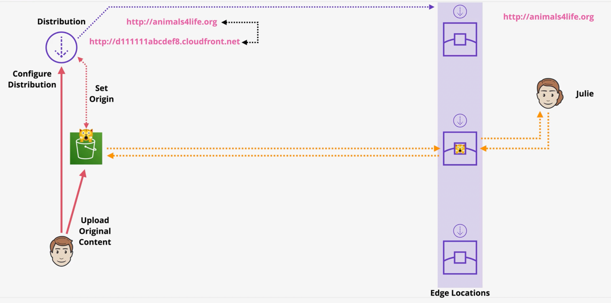

## CDN
In this demo we deploy this architecture:

### Part One: Deploy the CloudFormation Stac
- Deploy the CloudFormation Stack `cnd-stack.yaml` to create the necessary resources.
- Open the cloudformation output url and see the website
- It is a static website hosted on S3
- Two issues with static website hosting on S3:
  - No SSL/TLS support
  - No CDN support i.e slow for use in different geographic locations (aws regions)
  - To solve these issues we will use CloudFront as a CDN and to provide SSL/TLS support
### Part Two: Create the CloudFront Distribution
- Go to the CloudFront console and create a new distribution
- Set the origin domain to the S3 bucket website endpoint created in the CloudFormation stack
  - It accepts both custom origin and S3 origin. If you select the static website endpoint DNS name, it will be a custom origin
  - If you select the S3 bucket name, it will be an S3 origin
- Optionally, set the origin path which is a directory in the S3 bucket to serve content from
- Set origin access control to public read access. It should be addressed by the bucket policy created in the CloudFormation stack to fortify security
- Set the viewer protocol policy to HTTP and HTTPS (preferred over redirect to HTTPS for testing purposes)
- Set the cache policy and optionally origin request policy to the managed policies `CachingOptimized` and AllViewer respectively
- Set the `Restrict Viewer Access (Use Signed URLs or Signed Cookies)` to No
- In the Settings section, set the price class to the desired option (e.g., Use all edge locations or Use Only U.S., Canada and Europe)
- Optionally set the AWS WAF web ACL if you have one (what get filtered by WAF will not reach CloudFront)
- By default CF is cabable of being accessed over HTTPS using the default CloudFront domain name with default SSL certificate (wild card for *.cloudfront.net)
- If we want to use a custom domain with SSL/TLS support, we need to:
  - Set the Alternate Domain Names (CNAMEs) if you have a custom domain to use and point it to the CloudFront distribution using a CNAME record in your DNS provider
- Under the default root object, set `index.html` to serve the index page by default
- Create the distribution and wait for it to deploy (it may take some time)

### Part Three: Access the Website via CloudFront
- Once the distribution is deployed, note the domain name (e.g., d123456abcdef.cloudfront.net)
- Access the website using the CloudFront domain name
- If we override an image (upload a new image with the same name as the one in the bucket) in the S3 bucket, we would still see the old image via CloudFront due to caching
- We can see the changes reflected via CloudFront after invalidating the cache or waiting for the TTL to expire
  - Create an invalidation in the CloudFront console under the invalidation tab for the desired paths (e.g., /* or /img/* to invalidate all objects)
- If we have frequent update, the we better off using versioning for the objects (e.g., img1_v1.png, img1_v2.png) and update the html to avoid cache issues
- We can see the certificate used by CloudFront by clicking on the padlock icon in the browser address bar and see the wild card certificate for *.cloudfront.net

### Part Four: Adding own custom domain with SSL/TLS support (Optional)
- Pay attention that if we want to use our own custom domain with SSL/TLS support with CloudFront, we need to have a registered domain and a certificate in AWS Certificate Manager (ACM) in the us-east-1 region
- We need to have our own domain name registered via Route53 or any other domain registrar
- In CloudFront distribution settings, in add item set the Alternate Domain Names (CNAMEs) to our custom domain (e.g., nameofdomain.eiferai.com)
- Under the custom SSL certificate, click on "Request for Certificate" to open ACM in a new tab
- In ACM, request a public certificate for our custom domain (e.g., nameofdomain.eiferai.com) and any other subdomains if needed (e.g., *.nameofdomain.eiferai.com)
- Choose the validation:
  - DNS validation for easier validation. You will be given a DNS record to add to your DNS provider to validate the domain ownership. Once added, the Route 53 will query that record and validate the domain automatically. Click on create the record in the route 53
  - Email validation if no access to DNS
- How the whole setup will provide the user with shield: this name should match the name on the certificate and that needs to match the dns name and that needs to match the certficate that is on the cloudfront distribution
- Come back to the CloudFront distribution settings and refresh the custom SSL certificate dropdown. Select the certificate created in ACM
- Save the changes and wait for the distribution to deploy
- In your DNS provider (Route 53), create a CNAME record to point your custom domain to the CloudFront distribution domain name (e.g., d123456abcdef.cloudfront.net)
  - Using the option of Simple Route, name the record (e.g., nameofdomain.eiferai.com), set the record type to A-IPv4 and aws resources, select Alias to CloudFront distribution and select the distribution created earlier
- In the browser, access the website using your custom domain (e.g., https://nameofdomain.eiferai.com)
- You should see the website being served via CloudFront with SSL/TLS support using your custom domain
- Click on the padlock icon in the browser address bar to see the certificate being used
- You should see your custom domain name on the certificate

### Part Five: Using Origin Access Control (OAC)
- Origin Access Control (OAC) is the new version of Origin Access Identity (OAI) to restrict access to S3 buckets from CloudFront
- To enhance the security of our S3 bucket when using CloudFront, we can use Origin Access Identity (OAI) or Origin Access Control to restrict access to the S3 bucket only to CloudFront
- Create an Origin Access Control (OAC) in CloudFront to restrict access to the S3 bucket
  - In the CloudFront distribution settings, under the origin settings, edit the origin and set the Origin Access Control to "Origin Access Control Settings" then click on "Create control setting"
    - Set the name and description for the OAC
    - Set the signing behavior to "Sign requests"
- Back in the settings, select the created OAC
- Copy the generated bucket policy to allow CloudFront to access the S3 bucket
- Go to the S3 bucket permissions tab and paste the bucket policy to allow access from CloudFront only
- Remove any public read access bucket policy to restrict public access
- Save the changes and test accessing the website via CloudFront to ensure it is working correctly
- Test accessing the S3 bucket website endpoint directly to ensure it is restricted (should get access denied)
- This setup ensures that only CloudFront can access the S3 bucket, enhancing the security of the content being served.

### Clean Up
- To avoid incurring ongoing charges, remember to delete the CloudFront distribution, S3 bucket, and any other resources created during this demo when they are no longer needed.