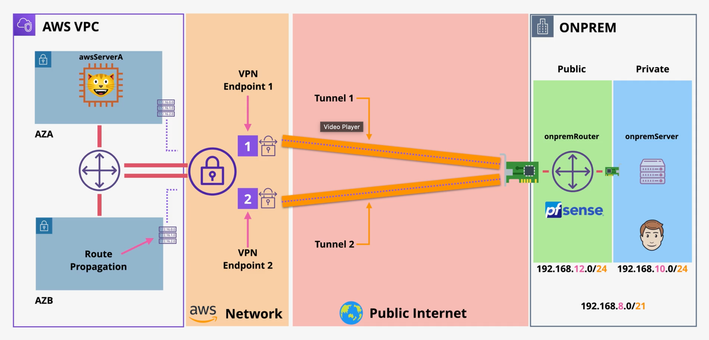
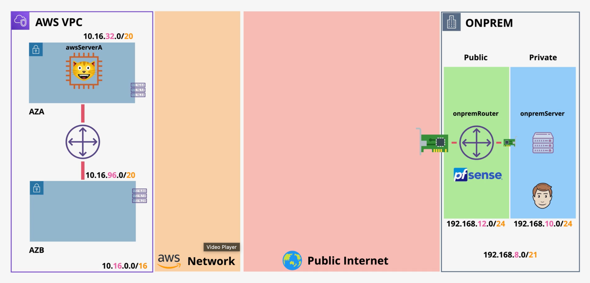
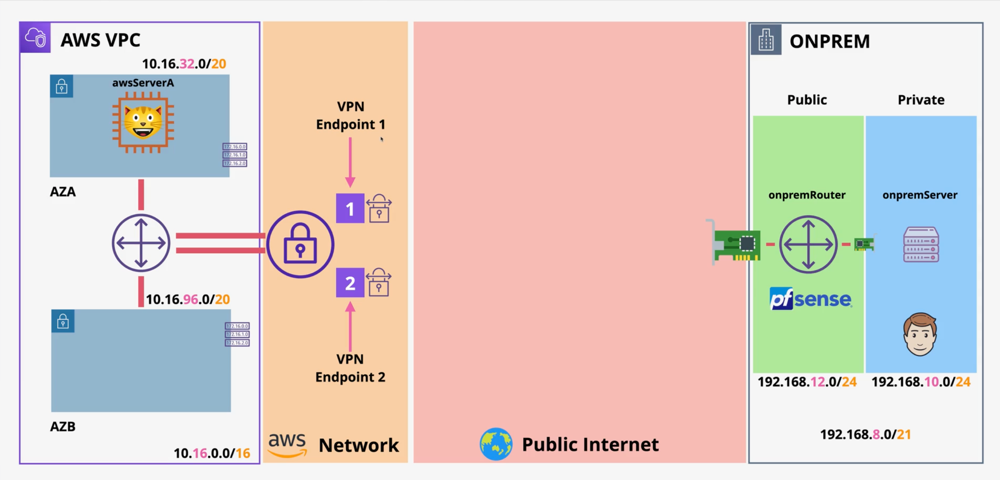

## AWS Hybride Environment Setup Guide

### Simple Site-to-Site VPN Demo Guide

We use PfSense as the virtual router/firewall (virtual VPN capable hardware) appliance to demonstrate site-to-site VPN between two VPCs in different AWS regions.
On the left we have an AWS environment in us-east-1 and on the right we have another aws environment that will be considered as on-premise data center.

1. You will need to approve this [subscription](https://aws.amazon.com/marketplace/pp?sku=cphb99lr7icr3n9x6kc3102s5) it's a trial, so you won't be billed anything extra
2. Create the key-pair under EC2 dashboard in us-east-1 region with name `pfsense-keypair` in .pem format.
3. Download the private key file `pfsense-keypair.pem` and set the permissions
4. In us-east-1 region, deploy the cloudformation stack `cf-1-vpc-setup.yaml` and set the key pair name to `pfsense-keypair`. It will create below setup:

Continue with stage 1 ( Making the aws side of the VPN connection ). It means creating a customer gateway which represent the on-premise router (to the right), which is done by creating a virtual private gateway on the aws side and attaching it to the VPCs.
Virtual private gateway is the termination endpoint for the VPN connection on the AWS side. We then proceed to create the VPN connection between the virtual private gateway and the on-premise router. It will create two VPN endpoints for redundancy each in different AZ.

5. Get the external IP of the pfsense firewall instance (customer router) created in step 4 from the stack outputs.
6. Go to the VPC dashboard and create a customer gateway with the IP of the customer router. Just name it and leave other options as it is.
7. Go back and create a virtual private gateway under private virtual network and attach it to the VPC created in step 4.
8. Now go to Site-to-Site VPN connections, create a VPN connection:
   - Name it
   - For target gateway select the virtual private gateway created in step 7 (This is the AWS side of the network endpoint)
   - For customer gateway select the customer gateway created (on-premise router) in step 6 (This is the on-premise side of the network endpoint)
   - On the routing options select static and add the on-premise network CIDR `192.168.8.0/21`
   - create the VPN connection
9. After the VPN connection is created, select it and download the configuration file for `pfsense`.
10. Now we need to setup on-premise router (the pfsense firewall instance) to establish the VPN connection (on the diagram, the public internet part)
     - Go to EC2 dashboard and select the `onpremRouter` EC2 instance created in step 4
     - We need the authentication details to login. Right click on the instance and go to monitoring and troubleshooting -> get system log. get the ec2-user password at the top.
     - Now go back to the `onpremRouter` EC2 instance, click on it and then under the public ipv4 (open address) click on the link to open the pfsense web console, accept the security warning.
     - Login with username `admin` and password the one copied above (it is not the default one `pfsense`)
     - The `onpremRouter` has two network interfaces, one is connected to the public subnet (WAN) and the other to the private subnet (LAN).
     - Go to interfaces -> assignments -> add the another available network port and will be added as LAN interface and save it.
     - Now we need to configure the networking. Go to interfaces -> LAN and check the enable box
     - Under IPv4 configuration type select DHCP and save it. It will get an IP from the private subnet. In prod, you would use a static IP.
     - Save and apply changes.
     - Next we create the VPN tunnels and IPSec configuration. Go to VPN -> IPSec
     - Check the instructor's IPSec fundamental video and the IPSec documentation for pfsense [here](https://docs.netgate.com/pfsense/en/latest/vpn/ipsec/index.html)
     - IPSec has two or more tunnels for redundancy splitted between phase 1 and phase 2.
     - We need to do configuration for phase and phase 2 for both tunnels (in total 4 configurations)
     - Go to the downloaded configuration file from step 9. Under the `IPSec Tunnel #1` section:
     - Click on `Add P1` green button to add phase 1 configuration for tunnel 1
       - Set the key exchange version to `IKEv1`
       - Set the interface to `WAN` (the tunnel will connect to the WAN interface)
       - Set the remote gateway to the AWS VPN endpoint IP for tunnel 1 (Under `IPSec Tunnel #1` --> General information --> Remote Gateway): This IP is the aws side IP address of the endpoint.
       - Set the authentication method to `Mutual PSK`
       - Set the negotiation mode to `Main` and leave My identifier to `My IP address` and Peer identifier to `Peer IP address`
       - Set the pre-shared key to the one given in the config file (Under `IPSec Tunnel #1` --> Phase 1 proposal (auth) --> Pre-Shared Key)
       - Set the encryption algorithm: AES 128 bits Hash: SHA1 DH Group: 2
       - Set lifetime to 28800 seconds
       - Make sure the NAT traversal to Auto
       - Make sure the dead peer detection is enabled and delay set to 10 seconds and max failures 3
       - Save it
     - We set up the matching phase 2 configuration for tunnel 1
       - Click on `Show Phase 2 Entries` under the created phase 1 entry and click on `Add P2` button
       - Name it appropriately
       - Set the mode to `Tunnel IPv4`
       - Set the local network to `Network` and put on-premise network CIDR `192.168.10.0/24` (The private subnet on the on-premise side from which we want to access the AWS VPC through the VPN)
       - Set the remote network to `Network` and put the VPC CIDR `10.16.0.0/16`. This is the network that the on-premise side will access through the VPN
       - Set the protocol to `ESP`
       - Set the encryption algorithm check AES and set to 128 bits, and AES128-GCM to 128 bits. Set the hash to SHA1 and SHA256
       - Under PFS key group select 2 
       - Set lifetime to 3600 seconds
       - Go to EC2 and get the privte IP of the awsServerA
       - Under keep alive set the peer IP to the private IP of awsServerA
       - Check the box for Keep alive
       - Save it
     - Now repeat the above two steps for tunnel 2 by clicking on `Add P1`and then using the parameters under `IPSec Tunnel #2` section in the downloaded config file from step 9.
     - After configuring both tunnels, apply the changes and then go to Status -> IPSec and start the IPSec services: Connect P1 and P2 for both the tunnels and you should see the Established status. If so, that means the VPN connection is established successfully.
11. Now we need to add routing rules and security groups to allow traffic to flow between the two networks through the VPN connection. In real prod setup, one would configure firewalls rules on the on-premise side to allow traffic from the AWS VPC CIDR to the on-premise network CIDR and vice versa.
   - First on aws side of the VPN connection:
     - Go to the VPC dashboard and select the route tables created in step 4 `rt-aws` (this is connected to the two subnets within the aws)
     - We can either add a new route to add the on-premise network CIDR statically that will point to the virtual private gateway created in step 7.
     - Or use route propagation to automatically add the route when the VPN connection is established. It is a feature virtual private gateway that propagates the routes to the route table when the VPN connection is up. To setup this:
     - Go to the route propagation tab and enable propagation for the virtual private gateway created in step 7.
     - Once save, you should see the on-premise network CIDR in routes tab pointing to the virtual private gateway. Now aws side resources know how to route to the on-premise network through vpn.
   - Next we do the configuration on the on-premise side (pfsense):
     - Select the `rt-onprem-private` route table created in step 4. This is the private route table which is associated with the private subnet on the on-premise side that we want to reach from aws side of VPN.
     - Now click on routes tab, edit routes and add a new route by putting the VPC CIDR `10.16.0.0/15` under the destination and set the target the pfsense network interface by clicking the network interface and selecting the `onpremRouter` private eni. Save it.
     - Now set the security groups of the both side of the architecture. In real case, instead of sg, we would set up firewall rules on the on-premise firewall.
       - Click on the Security Group of the VPC and now click on `Default Online Shop AWS SG`
       - Edit inbound rules and add a new rule to allow `all traffic` from the on-premise network CIDR `192.168.8.0/21` which will allow on-premise side to access all resources within the VPC through the VPN connection. Save it.
       - Next click on the security group of the `Default Online Shop onPrem SG` and edit inbound rules to allow `all traffic` from the VPC CIDR `10.16.0.0/16`
       - Next click on the security group of the `onprem Router SG` and edit inbound rules to allow `all traffic` from the security group `Default Online Shop onprem SG`
       - This will allow the on-premise resources to access the pfsense router through the VPN connection.
12. Now we can test the connectivity between the two networks through the VPN connection.
   - Go to the onprem side of the setup, select to the `onpremServer` and click on connect and choose RDP client tab and select Fleet Manager (feature of ssm)
   - Get the password of this windows instance by clicking on get password, then click on the browser and choose the ssh key pair created in step 2 to decrypt the password.
   - Now click on `Fleet Manager Remote Desktop`, put the password to connect to the windows instance.
   - From the windows on the second tab, ping the awsServerA private IP and you should get response.
   - On the internet explorer open http://private-ip-of-awsServerA and you should see the page.