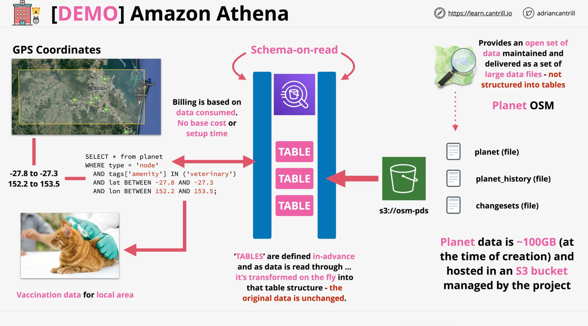

## Amazon Athena
Amazon Athena is an interactive query service that makes it easy to analyze data in Amazon S3 using standard SQL. Athena is serverless. 
Athena is schema on read, so there is no need to load data into Athena. You can start analyzing data immediately. You can use Athena to run ad-hoc queries and get results in seconds. You can also use Athena to run complex analysis against large datasets stored in Amazon S3.
- Architecture for the setup:



- Steps to create the demo:
  - Go to S3 to create a bucket and uncheck block all public access, for query results.
  - Go to Athena --> Query Editor --> Settings --> Manage --> Add the s3 bucket created above for query results and put your account ID and give ful control permissions to the bucket.
  - Go to Athena --> Query Editor:
    - Create a database by running this (creating the schema):
        ```sql
        CREATE DATABASE geodata;
        ```
    - Create a table by running this (creating the table). In this command we reference the location of the data which is an external s3. Remember anthena doesn't store any data. It loads the from and through the schema:
        ```sql
        CREATE EXTERNAL TABLE planet (
        id BIGINT,
        type STRING,
        tags MAP<STRING,STRING>,
        lat DECIMAL(9,7),
        lon DECIMAL(10,7),
        nds ARRAY<STRUCT<ref: BIGINT>>,
        members ARRAY<STRUCT<type: STRING, ref: BIGINT, role: STRING>>,
        changeset BIGINT,
        timestamp TIMESTAMP,
        uid BIGINT,
        user STRING,
        version BIGINT
        )
        STORED AS ORCFILE
        LOCATION 's3://osm-pds/planet/';
        ```
    - Run a query and see the table on the left. Till now no cost of data storage or infras etc
    - Now test the query
      - `select * form planet limit 10;` --> this will cost you.
    - Now do a more complex query - incurs costs for the amount of data scanned.:
      - ```sql
        SELECT * from planet
        WHERE type = 'node'
        AND tags['amenity'] IN ('veterinary')
        AND lat BETWEEN -27.8 AND -27.3
        AND lon BETWEEN 152.2 AND 153.5;
        ```
      - Use google earth to get latitude and longitude for the area.
    - Now clear everything
      - `drop table planet;`
      - `drop database geodata;`
      - 
    
    

