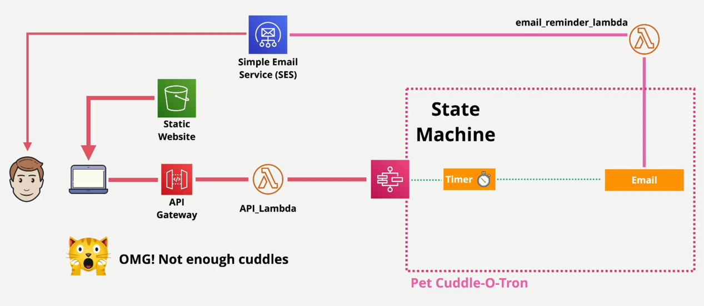

## Setup


### Part One: Create the SES:
- Create two identities in SES: one for sending emails and one for receiving emails.
### Part Two: Create the Lambda function
- Deploy the lambda execution role with the following policy:

- Add a email lambda function to use SES to send emails for the serverless application
  - Set the execution role to the lambda function
  - Use the following code for the lambda function with the FROM_EMAIL_ADDRESS replaced with the email identity created in SES for sending emails.:
```
import boto3, os, json

FROM_EMAIL_ADDRESS = 'REPLACE_ME'

ses = boto3.client('ses')

def lambda_handler(event, context):
    # Print event data to logs .. 
    print("Received event: " + json.dumps(event))
    # Publish message directly to email, provided by EmailOnly or EmailPar TASK
    ses.send_email( Source=FROM_EMAIL_ADDRESS,
        Destination={ 'ToAddresses': [ event['Input']['email'] ] }, 
        Message={ 'Subject': {'Data': 'Whiskers Commands You to attend!'},
            'Body': {'Text': {'Data': event['Input']['message']}}
        }
    )
    return 'Success!'
```
- Explaination of the code:
  - The code uses the boto3 library to interact with AWS SES.
  - State machine will trigger this lambda function to send an email.
  - The event parameter contains the input data passed to the lambda function.
  - It retrieves the email address and message from the event input and sends an email using SES.

### Part Three: Create the Step Function (State Machine)
- Deploy the state machine role stack `state-machine-role.yaml` to create the execution role for the state machine.
- This role can be assumed only by the Step Functions service (state machine)
- A state machine timeout will trigger after a certain period to invoke the email lambda function to send a reminder email.
- Create a state machine in AWS Step Functions using the following definition under the code tab:
  - waitSeconds will be provided as input when starting the execution of the state machine.
```
{
  "Comment": "Pet Cuddle-o-Tron - using Lambda for email.",
  "StartAt": "Timer",
  "States": {
    "Timer": {
      "Type": "Wait",
      "SecondsPath": "$.waitSeconds",
      "Next": "Email"
    },
    "Email": {
      "Type" : "Task",
      "Resource": "arn:aws:states:::lambda:invoke",
      "Parameters": {
        "FunctionName": "EMAIL_LAMBDA_ARN",
        "Payload": {
          "Input.$": "$"
        }
      },
      "Next": "NextState"
    },
    "NextState": {
      "Type": "Pass",
      "End": true
    }
  }
}
```
- Under config tab, adjust the settings
- Replace EMAIL_LAMBDA_ARN with the ARN of the email lambda function created in Part Two.
- Types:
  - Standard: It is intended for long-running, durable, and auditable workflows. It can run for up to one year and is suitable for complex business processes that require human interaction or external system integration.
  - Express: It can run for up to five minutes and is designed for high-volume, short-duration workflows. It is ideal for event-driven applications, data processing tasks, and real-time stream processing where low latency is crucial.
    - example use cases: streaming data, real-time stream processing, event-driven microservices, iot applications and mobile backends.
- Set the execution role to the role created in the previous step.
- Set log-level to ALL and create a new log group for the state machine logs.
- Note the ARN of the state machine for use in the next part.

### Part Four: Create the API Gateway and the Supporting Lambda function
- Create the supporting compute resource(lambda function) to start the execution of the state machine:
  - Set the execution role to the lambda execution role created in Part Two.
  - Use the following code for the lambda function with the STATE_MACHINE_ARN replaced with the ARN of the state machine created in Part Three.
```python
# This code is a bit ...messy and includes some workarounds
# It functions fine, but needs some cleanup
# Checked the DecimalEncoder and Checks workarounds 20200402 and no progression towards fix

import boto3, json, os, decimal

SM_ARN = 'YOUR_STATEMACHINE_ARN'

sm = boto3.client('stepfunctions')

def lambda_handler(event, context):
    # Print event data to logs .. 
    print("Received event: " + json.dumps(event))

    # Load data coming from APIGateway
    data = json.loads(event['body'])
    data['waitSeconds'] = int(data['waitSeconds'])
    
    # Sanity check that all of the parameters we need have come through from API gateway
    # Mixture of optional and mandatory ones
    checks = []
    checks.append('waitSeconds' in data)
    checks.append(type(data['waitSeconds']) == int)
    checks.append('message' in data)

    # if any checks fail, return error to API Gateway to return to client
    if False in checks:
        response = {
            "statusCode": 400,
            "headers": {"Access-Control-Allow-Origin":"*"},
            "body": json.dumps( { "Status": "Success", "Reason": "Input failed validation" }, cls=DecimalEncoder )
        }
    # If none, start the state machine execution and inform client of 2XX success :)
    else: 
        sm.start_execution( stateMachineArn=SM_ARN, input=json.dumps(data, cls=DecimalEncoder) )
        response = {
            "statusCode": 200,
            "headers": {"Access-Control-Allow-Origin":"*"},
            "body": json.dumps( {"Status": "Success"}, cls=DecimalEncoder )
        }
    return response

# This is a workaround for: http://bugs.python.org/issue16535
# Solution discussed on this thread https://stackoverflow.com/questions/11942364/typeerror-integer-is-not-json-serializable-when-serializing-json-in-python
# https://stackoverflow.com/questions/1960516/python-json-serialize-a-decimal-object
# Credit goes to the group :)
class DecimalEncoder(json.JSONEncoder):
    def default(self, obj):
        if isinstance(obj, decimal.Decimal):
            return int(obj)
        return super(DecimalEncoder, self).default(obj)
```
- Create a new REST API in API Gateway
- For API endpoint type, choose Regional.
- Deploy the API to a new stage (e.g., prod) and note the invoke URL
- Under the created API, create a new resource (e.g., /start)
- Enable CORS on the created resource
- Under the created resource, create a new POST method and the integration type as Lambda Function
- Set the Lambda Region and the Lambda function created above
- Enable Lambda Proxy Integration
- Enable default timeout settings for the method
- Deploy the API to the previously created stage i.e prod
- Note the invoke URL for use in the next part.

### Part Five: The Client Application using static hosting (S3)
- Create an S3 bucket to host the static website
- Untick "Block all public access" to allow public access to the bucket
- Set the bucket policy to allow public read access to the bucket objects
```
{
  "Version": "2012-10-17",
  "Statement": [
    {
      "Sid": "PublicReadGetObject",
      "Effect": "Allow",
      "Principal": "*",
      "Action": "s3:GetObject",
      "Resource": "arn:aws:s3:::YOUR_BUCKET_NAME/*"
    }
  ]
}
```
- Enable static website hosting on the bucket under the properties tab
- Set the index document to index.html and error document to error.html
- Upload the client application files (HTML, CSS, JS) to the S3 bucket
- Update the JavaScript code (`serverless.js`) in the client application to use the API Gateway invoke URL created in Part Four for making requests to start the state machine execution.
- Access the client application using the S3 bucket static website endpoint URL.
- Test the application by entering an email address, message, and wait
- time in seconds, then submitting the form.
- Verify that an email is received after the specified wait time. 
- In state machine, check the logs and execution history for debugging and monitoring purposes.
  - Check execution status, input/output data, and any errors that may have occurred during the execution.