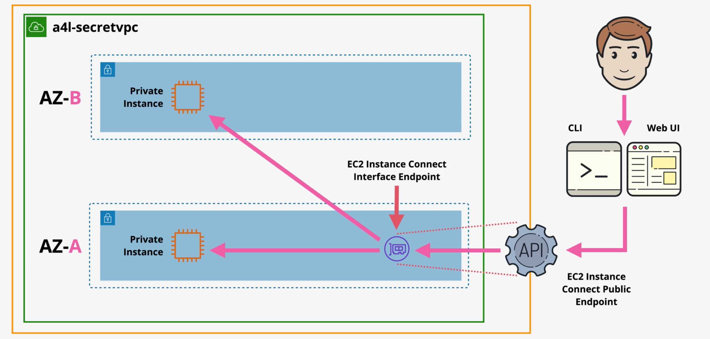
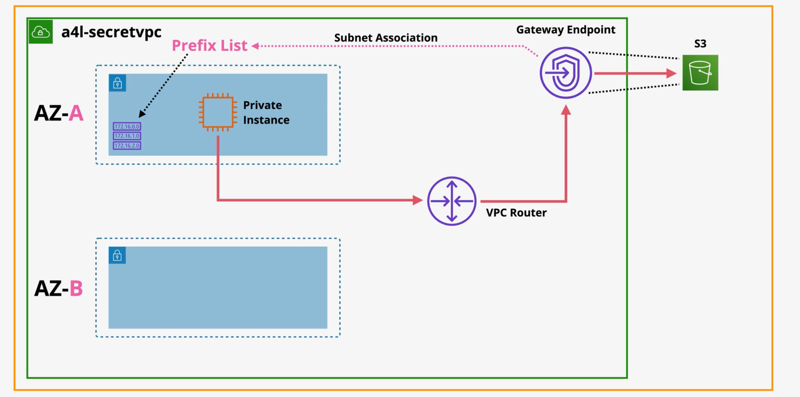
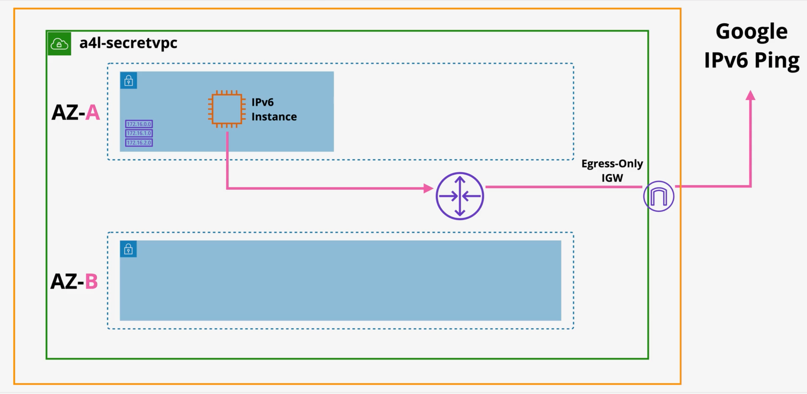

## Practice with Advanced VPC Endpoints and Egress-Only Internet Gateway

### Explanation
The diagram shows how we use interface endpoint to connect to a private EC2 instance using EC2 instance connect. 
Usually for EC2 instance connect, the instance would need a public IP. However, with the interface endpoint for EC2, we can connect to the instance in the private subnet without a public IP.
The EC2 instance connect public endpoint will connect to the private EC2 instance using the interface endpoint.
### Commands to Set Up Advanced VPC and Endpoints
```
# PART 1

No commands needed

# PART 2

ping 1.1.1.1
aws s3 ls
aws s3 cp s3://bucketname/supersecret.txt supersecret.txt

# Part 3

ping -6 ipv6.google.com
```
### Demo: VPC Interface Endpoint for EC2 Instance Connect



The diagram shows how we use interface endpoint to connect to a private EC2 instance using EC2 instance connect.
Usually for EC2 instance connect, the instance would need a public IP. However, with the interface endpoint for EC2, we can connect to the instance in the private subnet without a public IP.
The EC2 instance connect public endpoint will connect to the private EC2 instance using the interface endpoint.

1. Deploy the CloudFormation stack using the provided template.
2. Once the stack is deployed, go to the EC2 instance in the private subnet and tryp to connect using EC2 Instance Connect.
3. As the EC2 instance is in a private subnet, it does not have a public IP address.
4. Select `connect using EC2 instance connect endpoint`.
5. Under EC2 Instance Connect Endpoint, select `create an endpoint` for EC2 Instance Connect.
6. Under VPC --> Endpoints --> Create Endpoint, create the following endpoint:
   - Service category: EC2 Instance Connect Endpoint
   - VPC: Select the VPC created by the CloudFormation stack
   - Don't check the preserve client IP checkbox
   - Because the interface endpoints use elastic network interfaces (ENI) within the VPC, we a security group. Select the security group created by the CloudFormation stack
   - Subnets: Select the private subnet (sn-app-A), which is private subnet in availability zone A.
7. After creating the endpoint, go back to the EC2 instance and try to connect again using EC2 Instance Connect.
8. You should be able to connect to the private EC2 instance without a public IP address. The used private IP address is from the interface endpoint private IP.

### Demo: VPC Gateway Endpoint


The diagram shows how we use gateway endpoint to connect to S3 from a private EC2 instance without using a NAT gateway.
1. Deploy the CloudFormation stack using the provided template.
2. Go to the bucket resource created by the CF stack.
3. Upload a file named i.e a txt file
4. Now connect to the EC2 instance in the private subnet using EC2 Instance Connect Endpoint.
5. Run `ping 1.1.1.1` it will time out as there is no internet access.
6. Run `aws s3 ls` to list the contents of the S3 bucket. It will time out too as there is no internet access (S3 is in public aws zone).
7. Go to VPC  --> Endpoints --> Create Endpoint
   - Service category: AWS services
   - Under services, type S3 and select "Service Name = com.amazonaws.us-east-1.s3""
   - Check the Gateway type listed along with the interface type
   - VPC: Select the VPC created by the CloudFormation stack
   - Select the route tables associated with the 9 subnets created by the CloudFormation stack (main route table): Make sure the route table is associated with the private subnets
   - We can optionally define a policy for the endpoint. For this demo, we will use the default policy that allows full access to S3.
   - Create the endpoint
8. Now go to the route tables under VPC and select the main route table associated with the private subnets.
9. You should see a new route with destination `pl-68a54001` (prefix list for S3) and target as the gateway endpoint created earlier.
10. Now go back to the EC2 instance in the private subnet and run `aws s3 ls` again.
11. You should be able to list the contents of the S3 bucket without internet access.
12. Now run `aws s3 cp s3://vpc-base-setup-bucket-nmxnjus2yobw/file.txt file.txt` to copy the file from the S3 bucket to the EC2 instance.
13. You should be able to copy the file without internet access.

### Demo: VPC Egress-Only Internet Gateway



The diagram shows how we use egress-only internet gateway which allow the private EC2 instance to access the internet over its IPv6 without allowing inbound connections.

1. Using the setup from previous demo, go to the EC2 instance in the private subnet.
2. Run `ping -6 ipv6.google.com` it will time out as there is no internet access (private instance).
3. Go to VPC --> Egress-Only Internet Gateways --> Create Egress-Only Internet Gateway
    - Select the VPC created by the CloudFormation stack and
    - Create the egress-only internet gateway.
4. Now go to the route tables under VPC and select the main route table associated with the private subnets.
5. Add a new route with destination `::/0` and target as the egress-only internet gateway created earlier.
    - It means when the VPC encounters any IPv6 traffic (::/0), it will route the traffic to the egress-only internet gateway.
6. Now go back to the EC2 instance in the private subnet and run `ping -6 ipv6.google.com` again.
7. You should be able to ping the ipv6 address now as the private EC2 instance can access the internet
8. Note that the egress-only internet gateway only allows outbound traffic. Any inbound traffic from the internet to the private EC2 instance will be blocked.