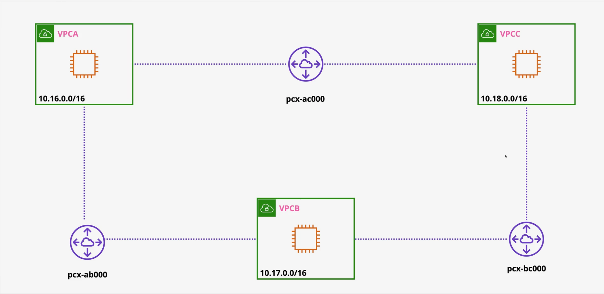

## VPC Peering Demo Guide

1. Deploy the cloudformation stack `cf-3-vpc-setup.yaml`
    - All the three EC2 instances are private instances.
2. Deploy the cloudformation stack `cf-4-vpc-peering.yaml`
3. Connect to the EC2 instance A in VPC A using Session Manager.
4. From EC2 instance A, ping the private IP address of EC2 instance B in VPC B.
    - You should see timeout response.
5. Go to the VPC console, and click on peering connections (It is an invite-accept connection).
6. Click on create peering connection.
    - Name it VPCA-VPCB peering
    - Select VPC A as the requester VPC.
    - Select VPC B as the accepter VPC (Same account same region)
    - Click on create peering connection.
7. The second step for above is creating the routing.
    - Click on route tables in the VPC console.
    - Select the route table associated with VPC A.
    - Click on routes tab, and then click on edit routes.
    - Click on add route.
        - In destination, enter the CIDR block of VPC B (10.17.0.0/16).
        - In target, select peering connection, and then select the peering connection created in step 6.
        - Click on save routes.
    - Now repeat the same for VPC B route table.
        - In destination, enter the CIDR block of VPC A (10.16.0.0/16).
        - In target, select peering connection, and then select the peering connection created in step 6.
        - Click on save routes.
8. Now go back to EC2 instance A, and ping the private IP address of EC2 instance B in VPC B.
    - You still won't get any response.
9. The final step is updating the security groups of both EC2 instances to allow ICMP traffic.
    - Go to the EC2 console, and click on security groups.
    - Select the security group associated with EC2 instance B.
    - Click on inbound rules tab, and then click on edit inbound rules.
    - Click on add rule.
        - In type, select All ICMP - IPv4.
          - In source, select Custom, and then enter the security group of EC2 instance A (as they are in the same region).
          - Click on save rules.
10. Now the ping from EC2 instance A to EC2 instance B should be successful.
11. On the topic of VPC peering not being transitive, we set up similar peering between B (requester) and C (acceptor) to ping from B to C
12. Setup routing tables as done in previous steps, B to C and C to B.
13. Setup security group (ICMP - IPv4) as done in previous steps, B to C and C to B.
14. Setup security group (ICMP - IPv4) for A to C with VPC A CIDR range
15. Now try to ping from B to C, it should be successful.
16. Now ping from A to C should fail as VPC peering is not transitive.
17. We need to set up a peering connection between A and C and C to A (inverse) to enable communication.
18. Setup routing tables as done in previous steps, A to C and C to A.
19. Setup security group (ICMP - IPv4) as done in previous steps, A to C and C to A.
20. Now try to ping from A to C, it should be successful.
21. Clean up all the resources by deleting the CloudFormation stacks in reverse order.